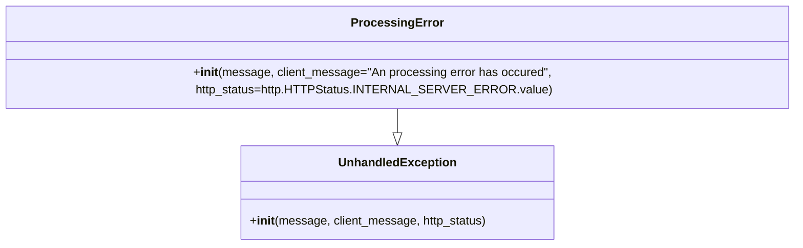

# Diagram: fv_core/fv_framework/python/fv_framework/exception/ProcessingError.py

> Auto-generated by Obscura crawlers

## Mermaid

### SVG

<svg id="container" width="1022.8203125" xmlns="http://www.w3.org/2000/svg" class="classDiagram" height="318" viewBox="0 0 1022.8203125 318" role="graphics-document document" aria-roledescription="class"><g><defs><marker id="container_class-aggregationStart" class="marker aggregation class" refX="18" refY="7" markerWidth="190" markerHeight="240" orient="auto"><path d="M 18,7 L9,13 L1,7 L9,1 Z"></path></marker></defs><defs><marker id="container_class-aggregationEnd" class="marker aggregation class" refX="1" refY="7" markerWidth="20" markerHeight="28" orient="auto"><path d="M 18,7 L9,13 L1,7 L9,1 Z"></path></marker></defs><defs><marker id="container_class-extensionStart" class="marker extension class" refX="18" refY="7" markerWidth="190" markerHeight="240" orient="auto"><path d="M 1,7 L18,13 V 1 Z"></path></marker></defs><defs><marker id="container_class-extensionEnd" class="marker extension class" refX="1" refY="7" markerWidth="20" markerHeight="28" orient="auto"><path d="M 1,1 V 13 L18,7 Z"></path></marker></defs><defs><marker id="container_class-compositionStart" class="marker composition class" refX="18" refY="7" markerWidth="190" markerHeight="240" orient="auto"><path d="M 18,7 L9,13 L1,7 L9,1 Z"></path></marker></defs><defs><marker id="container_class-compositionEnd" class="marker composition class" refX="1" refY="7" markerWidth="20" markerHeight="28" orient="auto"><path d="M 18,7 L9,13 L1,7 L9,1 Z"></path></marker></defs><defs><marker id="container_class-dependencyStart" class="marker dependency class" refX="6" refY="7" markerWidth="190" markerHeight="240" orient="auto"><path d="M 5,7 L9,13 L1,7 L9,1 Z"></path></marker></defs><defs><marker id="container_class-dependencyEnd" class="marker dependency class" refX="13" refY="7" markerWidth="20" markerHeight="28" orient="auto"><path d="M 18,7 L9,13 L14,7 L9,1 Z"></path></marker></defs><defs><marker id="container_class-lollipopStart" class="marker lollipop class" refX="13" refY="7" markerWidth="190" markerHeight="240" orient="auto"><circle stroke="black" fill="transparent" cx="7" cy="7" r="6"></circle></marker></defs><defs><marker id="container_class-lollipopEnd" class="marker lollipop class" refX="1" refY="7" markerWidth="190" markerHeight="240" orient="auto"><circle stroke="black" fill="transparent" cx="7" cy="7" r="6"></circle></marker></defs><g class="root"><g class="clusters"></g><g class="edgePaths"><path d="M511.41,134L511.41,138.167C511.41,142.333,511.41,150.667,511.41,156.125C511.41,161.583,511.41,164.167,511.41,165.458L511.41,166.75" id="id_ProcessingError_UnhandledException_1" class="edge-thickness-normal edge-pattern-solid relation" style=";;;" data-edge="true" data-et="edge" data-id="id_ProcessingError_UnhandledException_1" data-points="W3sieCI6NTExLjQxMDE1NjI1LCJ5IjoxMzR9LHsieCI6NTExLjQxMDE1NjI1LCJ5IjoxNTl9LHsieCI6NTExLjQxMDE1NjI1LCJ5IjoxODR9XQ==" marker-end="url(#container_class-extensionEnd)"></path></g><g class="edgeLabels"><g class="edgeLabel"><g class="label" data-id="id_ProcessingError_UnhandledException_1" transform="translate(0, 0)"><foreignObject width="0" height="0">

</foreignObject></g></g></g><g class="nodes"><g class="node default" id="classId-UnhandledException-0" transform="translate(511.41015625, 247)"><g class="basic label-container"><path d="M-207.38671875 -63 L207.38671875 -63 L207.38671875 63 L-207.38671875 63" stroke="none" stroke-width="0" fill="#ECECFF" style=""></path><path d="M-207.38671875 -63 C-120.1485973164269 -63, -32.9104758828538 -63, 207.38671875 -63 M-207.38671875 -63 C-72.59393487784467 -63, 62.19884899431065 -63, 207.38671875 -63 M207.38671875 -63 C207.38671875 -21.32942354850025, 207.38671875 20.341152902999497, 207.38671875 63 M207.38671875 -63 C207.38671875 -33.139104775604565, 207.38671875 -3.278209551209123, 207.38671875 63 M207.38671875 63 C97.36446299163588 63, -12.65779276672825 63, -207.38671875 63 M207.38671875 63 C57.93643692320302 63, -91.51384490359396 63, -207.38671875 63 M-207.38671875 63 C-207.38671875 21.537095996869297, -207.38671875 -19.925808006261406, -207.38671875 -63 M-207.38671875 63 C-207.38671875 36.94213844484196, -207.38671875 10.884276889683917, -207.38671875 -63" stroke="#9370DB" stroke-width="1.3" fill="none" stroke-dasharray="0 0" style=""></path></g><g class="annotation-group text" transform="translate(0, -39)"></g><g class="label-group text" transform="translate(-75.4921875, -39)"><g class="label" style="font-weight: bolder" transform="translate(0,-12)"><foreignObject width="150.984375" height="24">

UnhandledException

</foreignObject></g></g><g class="members-group text" transform="translate(-195.38671875, 9)"></g><g class="methods-group text" transform="translate(-195.38671875, 39)"><g class="label" style="" transform="translate(0,-12)"><foreignObject width="315.28125" height="24">

+<strong>init</strong>(message, client_message, http_status)

</foreignObject></g></g><g class="divider" style=""><path d="M-207.38671875 -15 C-117.50035507748107 -15, -27.61399140496215 -15, 207.38671875 -15 M-207.38671875 -15 C-66.30559021533233 -15, 74.77553831933534 -15, 207.38671875 -15" stroke="#9370DB" stroke-width="1.3" fill="none" stroke-dasharray="0 0" style=""></path></g><g class="divider" style=""><path d="M-207.38671875 9 C-42.980985972719225 9, 121.42474680456155 9, 207.38671875 9 M-207.38671875 9 C-100.62097036693599 9, 6.144778016128015 9, 207.38671875 9" stroke="#9370DB" stroke-width="1.3" fill="none" stroke-dasharray="0 0" style=""></path></g></g><g class="node default" id="classId-ProcessingError-1" transform="translate(511.41015625, 71)"><g class="basic label-container"><path d="M-503.41015625 -63 L503.41015625 -63 L503.41015625 63 L-503.41015625 63" stroke="none" stroke-width="0" fill="#ECECFF" style=""></path><path d="M-503.41015625 -63 C-294.63728208317104 -63, -85.86440791634203 -63, 503.41015625 -63 M-503.41015625 -63 C-225.809197668203 -63, 51.791760913593976 -63, 503.41015625 -63 M503.41015625 -63 C503.41015625 -29.627304062345367, 503.41015625 3.7453918753092665, 503.41015625 63 M503.41015625 -63 C503.41015625 -14.913188750425448, 503.41015625 33.173622499149104, 503.41015625 63 M503.41015625 63 C129.97314843727543 63, -243.46385937544915 63, -503.41015625 63 M503.41015625 63 C188.19130803971268 63, -127.02754017057464 63, -503.41015625 63 M-503.41015625 63 C-503.41015625 16.96646581796214, -503.41015625 -29.067068364075723, -503.41015625 -63 M-503.41015625 63 C-503.41015625 36.03612204810766, -503.41015625 9.072244096215314, -503.41015625 -63" stroke="#9370DB" stroke-width="1.3" fill="none" stroke-dasharray="0 0" style=""></path></g><g class="annotation-group text" transform="translate(0, -39)"></g><g class="label-group text" transform="translate(-57.5078125, -39)"><g class="label" style="font-weight: bolder" transform="translate(0,-12)"><foreignObject width="115.015625" height="24">

ProcessingError

</foreignObject></g></g><g class="members-group text" transform="translate(-491.41015625, 9)"></g><g class="methods-group text" transform="translate(-491.41015625, 39)"><g class="label" style="" transform="translate(0,-12)"><foreignObject width="925.3125" height="24">

+<strong>init</strong>(message, client_message="An processing error has occured", http_status=http.HTTPStatus.INTERNAL_SERVER_ERROR.value)

</foreignObject></g></g><g class="divider" style=""><path d="M-503.41015625 -15 C-237.50588162324567 -15, 28.39839300350866 -15, 503.41015625 -15 M-503.41015625 -15 C-289.0552807916732 -15, -74.70040533334651 -15, 503.41015625 -15" stroke="#9370DB" stroke-width="1.3" fill="none" stroke-dasharray="0 0" style=""></path></g><g class="divider" style=""><path d="M-503.41015625 9 C-185.45985020992043 9, 132.49045583015914 9, 503.41015625 9 M-503.41015625 9 C-297.2619257319933 9, -91.11369521398655 9, 503.41015625 9" stroke="#9370DB" stroke-width="1.3" fill="none" stroke-dasharray="0 0" style=""></path></g></g></g></g></g></svg>
