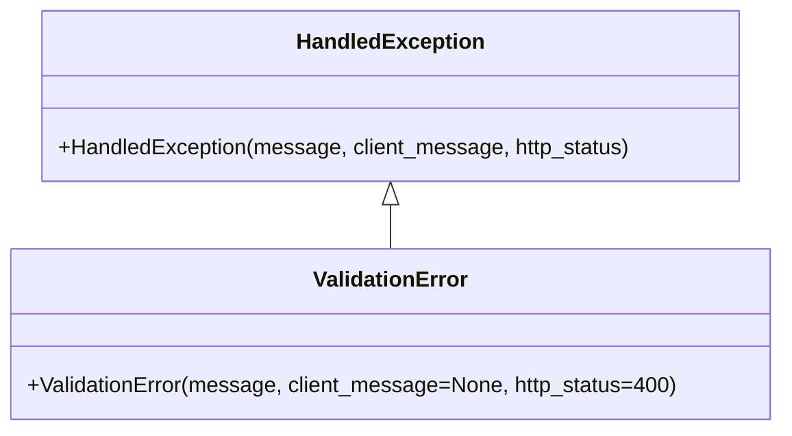

# Diagram: fv_core/fv_framework/python/fv_framework/exception/ValidationError.py

> Auto-generated by Obscura crawlers

## Mermaid

### SVG

<svg id="container" width="575.4296875" xmlns="http://www.w3.org/2000/svg" class="classDiagram" height="318" viewBox="0 0 575.4296875 318" role="graphics-document document" aria-roledescription="class"><g><defs><marker id="container_class-aggregationStart" class="marker aggregation class" refX="18" refY="7" markerWidth="190" markerHeight="240" orient="auto"><path d="M 18,7 L9,13 L1,7 L9,1 Z"></path></marker></defs><defs><marker id="container_class-aggregationEnd" class="marker aggregation class" refX="1" refY="7" markerWidth="20" markerHeight="28" orient="auto"><path d="M 18,7 L9,13 L1,7 L9,1 Z"></path></marker></defs><defs><marker id="container_class-extensionStart" class="marker extension class" refX="18" refY="7" markerWidth="190" markerHeight="240" orient="auto"><path d="M 1,7 L18,13 V 1 Z"></path></marker></defs><defs><marker id="container_class-extensionEnd" class="marker extension class" refX="1" refY="7" markerWidth="20" markerHeight="28" orient="auto"><path d="M 1,1 V 13 L18,7 Z"></path></marker></defs><defs><marker id="container_class-compositionStart" class="marker composition class" refX="18" refY="7" markerWidth="190" markerHeight="240" orient="auto"><path d="M 18,7 L9,13 L1,7 L9,1 Z"></path></marker></defs><defs><marker id="container_class-compositionEnd" class="marker composition class" refX="1" refY="7" markerWidth="20" markerHeight="28" orient="auto"><path d="M 18,7 L9,13 L1,7 L9,1 Z"></path></marker></defs><defs><marker id="container_class-dependencyStart" class="marker dependency class" refX="6" refY="7" markerWidth="190" markerHeight="240" orient="auto"><path d="M 5,7 L9,13 L1,7 L9,1 Z"></path></marker></defs><defs><marker id="container_class-dependencyEnd" class="marker dependency class" refX="13" refY="7" markerWidth="20" markerHeight="28" orient="auto"><path d="M 18,7 L9,13 L14,7 L9,1 Z"></path></marker></defs><defs><marker id="container_class-lollipopStart" class="marker lollipop class" refX="13" refY="7" markerWidth="190" markerHeight="240" orient="auto"><circle stroke="black" fill="transparent" cx="7" cy="7" r="6"></circle></marker></defs><defs><marker id="container_class-lollipopEnd" class="marker lollipop class" refX="1" refY="7" markerWidth="190" markerHeight="240" orient="auto"><circle stroke="black" fill="transparent" cx="7" cy="7" r="6"></circle></marker></defs><g class="root"><g class="clusters"></g><g class="edgePaths"><path d="M287.715,151.25L287.715,152.542C287.715,153.833,287.715,156.417,287.715,161.875C287.715,167.333,287.715,175.667,287.715,179.833L287.715,184" id="id_HandledException_ValidationError_1" class="edge-thickness-normal edge-pattern-solid relation" style=";;;" data-edge="true" data-et="edge" data-id="id_HandledException_ValidationError_1" data-points="W3sieCI6Mjg3LjcxNDg0Mzc1LCJ5IjoxMzR9LHsieCI6Mjg3LjcxNDg0Mzc1LCJ5IjoxNTl9LHsieCI6Mjg3LjcxNDg0Mzc1LCJ5IjoxODR9XQ==" marker-start="url(#container_class-extensionStart)"></path></g><g class="edgeLabels"><g class="edgeLabel"><g class="label" data-id="id_HandledException_ValidationError_1" transform="translate(0, 0)"><foreignObject width="0" height="0">

</foreignObject></g></g></g><g class="nodes"><g class="node default" id="classId-HandledException-0" transform="translate(287.71484375, 71)"><g class="basic label-container"><path d="M-256.69140625 -63 L256.69140625 -63 L256.69140625 63 L-256.69140625 63" stroke="none" stroke-width="0" fill="#ECECFF" style=""></path><path d="M-256.69140625 -63 C-79.44986229112209 -63, 97.79168166775582 -63, 256.69140625 -63 M-256.69140625 -63 C-77.17264636909798 -63, 102.34611351180405 -63, 256.69140625 -63 M256.69140625 -63 C256.69140625 -12.926561416041196, 256.69140625 37.14687716791761, 256.69140625 63 M256.69140625 -63 C256.69140625 -33.75002344868122, 256.69140625 -4.500046897362431, 256.69140625 63 M256.69140625 63 C52.94335572701672 63, -150.80469479596655 63, -256.69140625 63 M256.69140625 63 C77.77967887297831 63, -101.13204850404338 63, -256.69140625 63 M-256.69140625 63 C-256.69140625 21.999738139980856, -256.69140625 -19.000523720038288, -256.69140625 -63 M-256.69140625 63 C-256.69140625 25.9934613412574, -256.69140625 -11.013077317485198, -256.69140625 -63" stroke="#9370DB" stroke-width="1.3" fill="none" stroke-dasharray="0 0" style=""></path></g><g class="annotation-group text" transform="translate(0, -39)"></g><g class="label-group text" transform="translate(-66.3828125, -39)"><g class="label" style="font-weight: bolder" transform="translate(0,-12)"><foreignObject width="132.765625" height="24">

HandledException

</foreignObject></g></g><g class="members-group text" transform="translate(-244.69140625, 9)"></g><g class="methods-group text" transform="translate(-244.69140625, 39)"><g class="label" style="" transform="translate(0,-12)"><foreignObject width="423" height="24">

+HandledException(message, client_message, http_status)

</foreignObject></g></g><g class="divider" style=""><path d="M-256.69140625 -15 C-75.58748557335215 -15, 105.51643510329569 -15, 256.69140625 -15 M-256.69140625 -15 C-54.039540608992496 -15, 148.612325032015 -15, 256.69140625 -15" stroke="#9370DB" stroke-width="1.3" fill="none" stroke-dasharray="0 0" style=""></path></g><g class="divider" style=""><path d="M-256.69140625 9 C-137.01329551555534 9, -17.335184781110712 9, 256.69140625 9 M-256.69140625 9 C-58.87289300250214 9, 138.94562024499572 9, 256.69140625 9" stroke="#9370DB" stroke-width="1.3" fill="none" stroke-dasharray="0 0" style=""></path></g></g><g class="node default" id="classId-ValidationError-1" transform="translate(287.71484375, 247)"><g class="basic label-container"><path d="M-279.71484375 -63 L279.71484375 -63 L279.71484375 63 L-279.71484375 63" stroke="none" stroke-width="0" fill="#ECECFF" style=""></path><path d="M-279.71484375 -63 C-63.57380361957695 -63, 152.5672365108461 -63, 279.71484375 -63 M-279.71484375 -63 C-86.73868754384259 -63, 106.23746866231482 -63, 279.71484375 -63 M279.71484375 -63 C279.71484375 -19.050503968924055, 279.71484375 24.89899206215189, 279.71484375 63 M279.71484375 -63 C279.71484375 -19.06060181884947, 279.71484375 24.87879636230106, 279.71484375 63 M279.71484375 63 C131.50629860811338 63, -16.702246533773234 63, -279.71484375 63 M279.71484375 63 C112.61279659348628 63, -54.48925056302744 63, -279.71484375 63 M-279.71484375 63 C-279.71484375 14.401127235594672, -279.71484375 -34.19774552881066, -279.71484375 -63 M-279.71484375 63 C-279.71484375 18.347758667938393, -279.71484375 -26.304482664123213, -279.71484375 -63" stroke="#9370DB" stroke-width="1.3" fill="none" stroke-dasharray="0 0" style=""></path></g><g class="annotation-group text" transform="translate(0, -39)"></g><g class="label-group text" transform="translate(-55.1796875, -39)"><g class="label" style="font-weight: bolder" transform="translate(0,-12)"><foreignObject width="110.359375" height="24">

ValidationError

</foreignObject></g></g><g class="members-group text" transform="translate(-267.71484375, 9)"></g><g class="methods-group text" transform="translate(-267.71484375, 39)"><g class="label" style="" transform="translate(0,-12)"><foreignObject width="480.25" height="24">

+ValidationError(message, client_message=None, http_status=400)

</foreignObject></g></g><g class="divider" style=""><path d="M-279.71484375 -15 C-63.78963350074122 -15, 152.13557674851756 -15, 279.71484375 -15 M-279.71484375 -15 C-151.89522848694168 -15, -24.07561322388338 -15, 279.71484375 -15" stroke="#9370DB" stroke-width="1.3" fill="none" stroke-dasharray="0 0" style=""></path></g><g class="divider" style=""><path d="M-279.71484375 9 C-76.25127789189924 9, 127.21228796620153 9, 279.71484375 9 M-279.71484375 9 C-61.21421689177427 9, 157.28640996645146 9, 279.71484375 9" stroke="#9370DB" stroke-width="1.3" fill="none" stroke-dasharray="0 0" style=""></path></g></g></g></g></g></svg>
