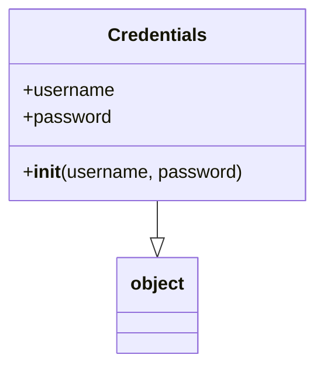

# Diagram: fv_core/fv_framework/python/fv_framework/persistence/Credentials.py

> Auto-generated by Obscura crawlers

## Mermaid

### SVG

<svg id="container" width="273.15625" xmlns="http://www.w3.org/2000/svg" class="classDiagram" height="318" viewBox="0 0 273.15625 318" role="graphics-document document" aria-roledescription="class"><g><defs><marker id="container_class-aggregationStart" class="marker aggregation class" refX="18" refY="7" markerWidth="190" markerHeight="240" orient="auto"><path d="M 18,7 L9,13 L1,7 L9,1 Z"></path></marker></defs><defs><marker id="container_class-aggregationEnd" class="marker aggregation class" refX="1" refY="7" markerWidth="20" markerHeight="28" orient="auto"><path d="M 18,7 L9,13 L1,7 L9,1 Z"></path></marker></defs><defs><marker id="container_class-extensionStart" class="marker extension class" refX="18" refY="7" markerWidth="190" markerHeight="240" orient="auto"><path d="M 1,7 L18,13 V 1 Z"></path></marker></defs><defs><marker id="container_class-extensionEnd" class="marker extension class" refX="1" refY="7" markerWidth="20" markerHeight="28" orient="auto"><path d="M 1,1 V 13 L18,7 Z"></path></marker></defs><defs><marker id="container_class-compositionStart" class="marker composition class" refX="18" refY="7" markerWidth="190" markerHeight="240" orient="auto"><path d="M 18,7 L9,13 L1,7 L9,1 Z"></path></marker></defs><defs><marker id="container_class-compositionEnd" class="marker composition class" refX="1" refY="7" markerWidth="20" markerHeight="28" orient="auto"><path d="M 18,7 L9,13 L1,7 L9,1 Z"></path></marker></defs><defs><marker id="container_class-dependencyStart" class="marker dependency class" refX="6" refY="7" markerWidth="190" markerHeight="240" orient="auto"><path d="M 5,7 L9,13 L1,7 L9,1 Z"></path></marker></defs><defs><marker id="container_class-dependencyEnd" class="marker dependency class" refX="13" refY="7" markerWidth="20" markerHeight="28" orient="auto"><path d="M 18,7 L9,13 L14,7 L9,1 Z"></path></marker></defs><defs><marker id="container_class-lollipopStart" class="marker lollipop class" refX="13" refY="7" markerWidth="190" markerHeight="240" orient="auto"><circle stroke="black" fill="transparent" cx="7" cy="7" r="6"></circle></marker></defs><defs><marker id="container_class-lollipopEnd" class="marker lollipop class" refX="1" refY="7" markerWidth="190" markerHeight="240" orient="auto"><circle stroke="black" fill="transparent" cx="7" cy="7" r="6"></circle></marker></defs><g class="root"><g class="clusters"></g><g class="edgePaths"><path d="M136.578,176L136.578,180.167C136.578,184.333,136.578,192.667,136.578,198.125C136.578,203.583,136.578,206.167,136.578,207.458L136.578,208.75" id="id_Credentials_object_1" class="edge-thickness-normal edge-pattern-solid relation" style=";;;" data-edge="true" data-et="edge" data-id="id_Credentials_object_1" data-points="W3sieCI6MTM2LjU3ODEyNSwieSI6MTc2fSx7IngiOjEzNi41NzgxMjUsInkiOjIwMX0seyJ4IjoxMzYuNTc4MTI1LCJ5IjoyMjZ9XQ==" marker-end="url(#container_class-extensionEnd)"></path></g><g class="edgeLabels"><g class="edgeLabel"><g class="label" data-id="id_Credentials_object_1" transform="translate(0, 0)"><foreignObject width="0" height="0">

</foreignObject></g></g></g><g class="nodes"><g class="node default" id="classId-Credentials-0" transform="translate(136.578125, 92)"><g class="basic label-container"><path d="M-128.578125 -84 L128.578125 -84 L128.578125 84 L-128.578125 84" stroke="none" stroke-width="0" fill="#ECECFF" style=""></path><path d="M-128.578125 -84 C-41.94364314284863 -84, 44.69083871430274 -84, 128.578125 -84 M-128.578125 -84 C-42.88808312955082 -84, 42.80195874089836 -84, 128.578125 -84 M128.578125 -84 C128.578125 -29.114716790447027, 128.578125 25.770566419105947, 128.578125 84 M128.578125 -84 C128.578125 -21.683376178643044, 128.578125 40.63324764271391, 128.578125 84 M128.578125 84 C45.36671959491002 84, -37.84468581017995 84, -128.578125 84 M128.578125 84 C53.020010437686565 84, -22.53810412462687 84, -128.578125 84 M-128.578125 84 C-128.578125 39.67965319279286, -128.578125 -4.640693614414275, -128.578125 -84 M-128.578125 84 C-128.578125 30.907546106538938, -128.578125 -22.184907786922125, -128.578125 -84" stroke="#9370DB" stroke-width="1.3" fill="none" stroke-dasharray="0 0" style=""></path></g><g class="annotation-group text" transform="translate(0, -60)"></g><g class="label-group text" transform="translate(-41.609375, -60)"><g class="label" style="font-weight: bolder" transform="translate(0,-12)"><foreignObject width="83.21875" height="24">

Credentials

</foreignObject></g></g><g class="members-group text" transform="translate(-116.578125, -12)"><g class="label" style="" transform="translate(0,-12)"><foreignObject width="80.1875" height="24">

+username

</foreignObject></g><g class="label" style="" transform="translate(0,12)"><foreignObject width="76.625" height="24">

+password

</foreignObject></g></g><g class="methods-group text" transform="translate(-116.578125, 60)"><g class="label" style="" transform="translate(0,-12)"><foreignObject width="191.546875" height="24">

+<strong>init</strong>(username, password)

</foreignObject></g></g><g class="divider" style=""><path d="M-128.578125 -36 C-41.93569651989425 -36, 44.7067319602115 -36, 128.578125 -36 M-128.578125 -36 C-32.904067685636065 -36, 62.76998962872787 -36, 128.578125 -36" stroke="#9370DB" stroke-width="1.3" fill="none" stroke-dasharray="0 0" style=""></path></g><g class="divider" style=""><path d="M-128.578125 36 C-27.785100740007763 36, 73.00792351998447 36, 128.578125 36 M-128.578125 36 C-53.28007693642006 36, 22.017971127159882 36, 128.578125 36" stroke="#9370DB" stroke-width="1.3" fill="none" stroke-dasharray="0 0" style=""></path></g></g><g class="node default" id="classId-object-1" transform="translate(136.578125, 268)"><g class="basic label-container"><path d="M-35.0390625 -42 L35.0390625 -42 L35.0390625 42 L-35.0390625 42" stroke="none" stroke-width="0" fill="#ECECFF" style=""></path><path d="M-35.0390625 -42 C-13.512201762154515 -42, 8.01465897569097 -42, 35.0390625 -42 M-35.0390625 -42 C-12.510012590828762 -42, 10.019037318342477 -42, 35.0390625 -42 M35.0390625 -42 C35.0390625 -14.23152533266061, 35.0390625 13.53694933467878, 35.0390625 42 M35.0390625 -42 C35.0390625 -13.896589440654921, 35.0390625 14.206821118690158, 35.0390625 42 M35.0390625 42 C20.71785715550168 42, 6.396651811003359 42, -35.0390625 42 M35.0390625 42 C19.246028976404332 42, 3.452995452808665 42, -35.0390625 42 M-35.0390625 42 C-35.0390625 10.516288336583973, -35.0390625 -20.967423326832055, -35.0390625 -42 M-35.0390625 42 C-35.0390625 24.318080312740438, -35.0390625 6.636160625480876, -35.0390625 -42" stroke="#9370DB" stroke-width="1.3" fill="none" stroke-dasharray="0 0" style=""></path></g><g class="annotation-group text" transform="translate(0, -18)"></g><g class="label-group text" transform="translate(-23.0390625, -18)"><g class="label" style="font-weight: bolder" transform="translate(0,-12)"><foreignObject width="46.078125" height="24">

object

</foreignObject></g></g><g class="members-group text" transform="translate(-23.0390625, 30)"></g><g class="methods-group text" transform="translate(-23.0390625, 60)"></g><g class="divider" style=""><path d="M-35.0390625 6 C-12.710308835498143 6, 9.618444829003714 6, 35.0390625 6 M-35.0390625 6 C-19.127936134505767 6, -3.2168097690115296 6, 35.0390625 6" stroke="#9370DB" stroke-width="1.3" fill="none" stroke-dasharray="0 0" style=""></path></g><g class="divider" style=""><path d="M-35.0390625 24 C-19.103127369881385 24, -3.1671922397627696 24, 35.0390625 24 M-35.0390625 24 C-8.620309956843695 24, 17.79844258631261 24, 35.0390625 24" stroke="#9370DB" stroke-width="1.3" fill="none" stroke-dasharray="0 0" style=""></path></g></g></g></g></g></svg>
