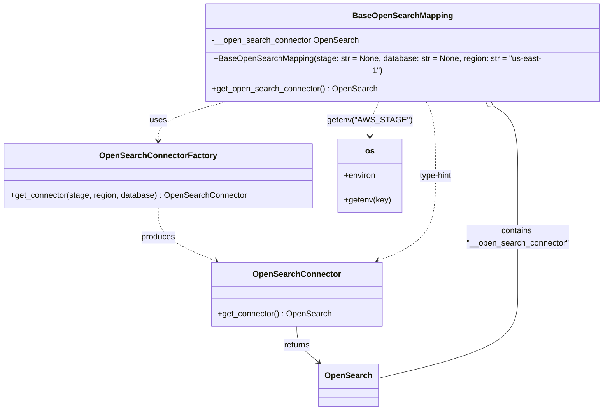

# Diagram: fv_core/fv_framework/python/fv_framework/persistence/open_search/BaseOpenSearchMapping.py

> Auto-generated by Obscura crawlers

## Mermaid

### SVG

<svg id="container" width="1174.478515625" xmlns="http://www.w3.org/2000/svg" class="classDiagram" height="784" viewBox="0 0 1174.478515625 784" role="graphics-document document" aria-roledescription="class"><g><defs><marker id="container_class-aggregationStart" class="marker aggregation class" refX="18" refY="7" markerWidth="190" markerHeight="240" orient="auto"><path d="M 18,7 L9,13 L1,7 L9,1 Z"></path></marker></defs><defs><marker id="container_class-aggregationEnd" class="marker aggregation class" refX="1" refY="7" markerWidth="20" markerHeight="28" orient="auto"><path d="M 18,7 L9,13 L1,7 L9,1 Z"></path></marker></defs><defs><marker id="container_class-extensionStart" class="marker extension class" refX="18" refY="7" markerWidth="190" markerHeight="240" orient="auto"><path d="M 1,7 L18,13 V 1 Z"></path></marker></defs><defs><marker id="container_class-extensionEnd" class="marker extension class" refX="1" refY="7" markerWidth="20" markerHeight="28" orient="auto"><path d="M 1,1 V 13 L18,7 Z"></path></marker></defs><defs><marker id="container_class-compositionStart" class="marker composition class" refX="18" refY="7" markerWidth="190" markerHeight="240" orient="auto"><path d="M 18,7 L9,13 L1,7 L9,1 Z"></path></marker></defs><defs><marker id="container_class-compositionEnd" class="marker composition class" refX="1" refY="7" markerWidth="20" markerHeight="28" orient="auto"><path d="M 18,7 L9,13 L1,7 L9,1 Z"></path></marker></defs><defs><marker id="container_class-dependencyStart" class="marker dependency class" refX="6" refY="7" markerWidth="190" markerHeight="240" orient="auto"><path d="M 5,7 L9,13 L1,7 L9,1 Z"></path></marker></defs><defs><marker id="container_class-dependencyEnd" class="marker dependency class" refX="13" refY="7" markerWidth="20" markerHeight="28" orient="auto"><path d="M 18,7 L9,13 L14,7 L9,1 Z"></path></marker></defs><defs><marker id="container_class-lollipopStart" class="marker lollipop class" refX="13" refY="7" markerWidth="190" markerHeight="240" orient="auto"><circle stroke="black" fill="transparent" cx="7" cy="7" r="6"></circle></marker></defs><defs><marker id="container_class-lollipopEnd" class="marker lollipop class" refX="1" refY="7" markerWidth="190" markerHeight="240" orient="auto"><circle stroke="black" fill="transparent" cx="7" cy="7" r="6"></circle></marker></defs><g class="root"><g class="clusters"></g><g class="edgePaths"><path d="M450.515,176L426.334,182.167C402.152,188.333,353.789,200.667,329.607,213.5C305.426,226.333,305.426,239.667,305.426,246.333L305.426,253" id="id_BaseOpenSearchMapping_OpenSearchConnectorFactory_1" class="edge-thickness-normal edge-pattern-dashed relation" style=";;;" data-edge="true" data-et="edge" data-id="id_BaseOpenSearchMapping_OpenSearchConnectorFactory_1" data-points="W3sieCI6NDUwLjUxNTQ0NzQ0MzE4MTgsInkiOjE3Nn0seyJ4IjozMDUuNDI1NzgxMjUsInkiOjIxM30seyJ4IjozMDUuNDI1NzgxMjUsInkiOjI1OX1d" marker-end="url(#container_class-dependencyEnd)"></path><path d="M305.426,385L305.426,394.667C305.426,404.333,305.426,423.667,324.179,441.117C342.933,458.567,380.44,474.133,399.193,481.917L417.947,489.7" id="id_OpenSearchConnectorFactory_OpenSearchConnector_2" class="edge-thickness-normal edge-pattern-dashed relation" style=";;;" data-edge="true" data-et="edge" data-id="id_OpenSearchConnectorFactory_OpenSearchConnector_2" data-points="W3sieCI6MzA1LjQyNTc4MTI1LCJ5IjozODV9LHsieCI6MzA1LjQyNTc4MTI1LCJ5Ijo0NDN9LHsieCI6NDIzLjQ4ODQwMzMyMDMxMjUsInkiOjQ5Mn1d" marker-end="url(#container_class-dependencyEnd)"></path><path d="M825.194,176L828.518,182.167C831.843,188.333,838.492,200.667,841.816,225C845.141,249.333,845.141,285.667,845.141,324C845.141,362.333,845.141,402.667,826.387,430.617C807.634,458.567,770.127,474.133,751.373,481.917L732.62,489.7" id="id_BaseOpenSearchMapping_OpenSearchConnector_3" class="edge-thickness-normal edge-pattern-dashed relation" style=";;;" data-edge="true" data-et="edge" data-id="id_BaseOpenSearchMapping_OpenSearchConnector_3" data-points="W3sieCI6ODI1LjE5MzUyMDc5MDI4OTMsInkiOjE3Nn0seyJ4Ijo4NDUuMTQwNjI1LCJ5IjoyMTN9LHsieCI6ODQ1LjE0MDYyNSwieSI6MzIyfSx7IngiOjg0NS4xNDA2MjUsInkiOjQ0M30seyJ4Ijo3MjcuMDc4MDAyOTI5Njg3NSwieSI6NDkyfV0=" marker-end="url(#container_class-dependencyEnd)"></path><path d="M575.283,618L575.283,624.167C575.283,630.333,575.283,642.667,582.247,654.377C589.211,666.088,603.138,677.175,610.102,682.719L617.066,688.263" id="id_OpenSearchConnector_OpenSearch_4" class="edge-thickness-normal edge-pattern-solid relation" style=";;;" data-edge="true" data-et="edge" data-id="id_OpenSearchConnector_OpenSearch_4" data-points="W3sieCI6NTc1LjI4MzIwMzEyNSwieSI6NjE4fSx7IngiOjU3NS4yODMyMDMxMjUsInkiOjY1NX0seyJ4Ijo2MjEuNzYwMDYyMzAyMjE1MSwieSI6NjkyfV0=" marker-end="url(#container_class-dependencyEnd)"></path><path d="M951.09,184.178L960.01,188.982C968.931,193.786,986.772,203.393,995.693,226.363C1004.613,249.333,1004.613,285.667,1004.613,324C1004.613,362.333,1004.613,402.667,1004.613,441.5C1004.613,480.333,1004.613,517.667,1004.613,553C1004.613,588.333,1004.613,621.667,958.94,649.264C913.266,676.862,821.919,698.723,776.246,709.654L730.572,720.585" id="id_BaseOpenSearchMapping_OpenSearch_5" class="edge-thickness-normal edge-pattern-solid relation" style=";;;" data-edge="true" data-et="edge" data-id="id_BaseOpenSearchMapping_OpenSearch_5" data-points="W3sieCI6OTM1LjkwMTgxMTA3OTU0NTUsInkiOjE3Nn0seyJ4IjoxMDA0LjYxMzI4MTI1LCJ5IjoyMTN9LHsieCI6MTAwNC42MTMyODEyNSwieSI6MzIyfSx7IngiOjEwMDQuNjEzMjgxMjUsInkiOjQ0M30seyJ4IjoxMDA0LjYxMzI4MTI1LCJ5Ijo1NTV9LHsieCI6MTAwNC42MTMyODEyNSwieSI6NjU1fSx7IngiOjczMC41NzIyNjU2MjUsInkiOjcyMC41ODQ3MzgwOTA4NzA5fV0=" marker-start="url(#container_class-aggregationStart)"></path><path d="M734.623,176L731.298,182.167C727.974,188.333,721.325,200.667,718,212C714.676,223.333,714.676,233.667,714.676,238.833L714.676,244" id="id_BaseOpenSearchMapping_os_6" class="edge-thickness-normal edge-pattern-dashed relation" style=";;;" data-edge="true" data-et="edge" data-id="id_BaseOpenSearchMapping_os_6" data-points="W3sieCI6NzM0LjYyMjg4NTQ1OTcxMDcsInkiOjE3Nn0seyJ4Ijo3MTQuNjc1NzgxMjUsInkiOjIxM30seyJ4Ijo3MTQuNjc1NzgxMjUsInkiOjI1MH1d" marker-end="url(#container_class-dependencyEnd)"></path></g><g class="edgeLabels"><g class="edgeLabel" transform="translate(305.42578125, 213)"><g class="label" data-id="id_BaseOpenSearchMapping_OpenSearchConnectorFactory_1" transform="translate(-16.4921875, -12)"><foreignObject width="32.984375" height="24">

uses

</foreignObject></g></g><g class="edgeLabel" transform="translate(305.42578125, 443)"><g class="label" data-id="id_OpenSearchConnectorFactory_OpenSearchConnector_2" transform="translate(-33.4765625, -12)"><foreignObject width="66.953125" height="24">

produces

</foreignObject></g></g><g class="edgeLabel" transform="translate(845.140625, 322)"><g class="label" data-id="id_BaseOpenSearchMapping_OpenSearchConnector_3" transform="translate(-33.640625, -12)"><foreignObject width="67.28125" height="24">

type-hint

</foreignObject></g></g><g class="edgeLabel" transform="translate(575.283203125, 655)"><g class="label" data-id="id_OpenSearchConnector_OpenSearch_4" transform="translate(-26.265625, -12)"><foreignObject width="52.53125" height="24">

returns

</foreignObject></g></g><g class="edgeLabel" transform="translate(1004.61328125, 443)"><g class="label" data-id="id_BaseOpenSearchMapping_OpenSearch_5" transform="translate(-100.4765625, -24)"><foreignObject width="200.953125" height="48">

contains "__open_search_connector"

</foreignObject></g></g><g class="edgeLabel" transform="translate(714.67578125, 213)"><g class="label" data-id="id_BaseOpenSearchMapping_os_6" transform="translate(-76.40625, -12)"><foreignObject width="152.8125" height="24">

getenv("AWS_STAGE")

</foreignObject></g></g></g><g class="nodes"><g class="node default" id="classId-BaseOpenSearchMapping-0" transform="translate(779.908203125, 92)"><g class="basic label-container"><path d="M-386.5703125 -84 L386.5703125 -84 L386.5703125 84 L-386.5703125 84" stroke="none" stroke-width="0" fill="#ECECFF" style=""></path><path d="M-386.5703125 -84 C-169.17308239795483 -84, 48.22414770409034 -84, 386.5703125 -84 M-386.5703125 -84 C-231.88297871372882 -84, -77.19564492745764 -84, 386.5703125 -84 M386.5703125 -84 C386.5703125 -44.955373992922844, 386.5703125 -5.910747985845688, 386.5703125 84 M386.5703125 -84 C386.5703125 -18.129708970175216, 386.5703125 47.74058205964957, 386.5703125 84 M386.5703125 84 C120.06637565593576 84, -146.43756118812848 84, -386.5703125 84 M386.5703125 84 C115.40888843706801 84, -155.75253562586397 84, -386.5703125 84 M-386.5703125 84 C-386.5703125 36.551467410811284, -386.5703125 -10.897065178377431, -386.5703125 -84 M-386.5703125 84 C-386.5703125 22.485345593639686, -386.5703125 -39.02930881272063, -386.5703125 -84" stroke="#9370DB" stroke-width="1.3" fill="none" stroke-dasharray="0 0" style=""></path></g><g class="annotation-group text" transform="translate(0, -60)"></g><g class="label-group text" transform="translate(-93.078125, -60)"><g class="label" style="font-weight: bolder" transform="translate(0,-12)"><foreignObject width="186.15625" height="24">

BaseOpenSearchMapping

</foreignObject></g></g><g class="members-group text" transform="translate(-374.5703125, -12)"><g class="label" style="" transform="translate(0,-12)"><foreignObject width="286.515625" height="24">

-__open_search_connector OpenSearch

</foreignObject></g></g><g class="methods-group text" transform="translate(-374.5703125, 36)"><g class="label" style="" transform="translate(0,-12)"><foreignObject width="656.0625" height="24">

+BaseOpenSearchMapping(stage: str = None, database: str = None, region: str = "us-east-1")

</foreignObject></g><g class="label" style="" transform="translate(0,12)"><foreignObject width="322.1875" height="24">

+get_open_search_connector() : OpenSearch

</foreignObject></g></g><g class="divider" style=""><path d="M-386.5703125 -36 C-215.89060417601593 -36, -45.210895852031854 -36, 386.5703125 -36 M-386.5703125 -36 C-180.04273271280329 -36, 26.48484707439343 -36, 386.5703125 -36" stroke="#9370DB" stroke-width="1.3" fill="none" stroke-dasharray="0 0" style=""></path></g><g class="divider" style=""><path d="M-386.5703125 12 C-93.27869143736973 12, 200.01292962526054 12, 386.5703125 12 M-386.5703125 12 C-105.200144300217 12, 176.170023899566 12, 386.5703125 12" stroke="#9370DB" stroke-width="1.3" fill="none" stroke-dasharray="0 0" style=""></path></g></g><g class="node default" id="classId-OpenSearchConnectorFactory-1" transform="translate(305.42578125, 322)"><g class="basic label-container"><path d="M-297.42578125 -63 L297.42578125 -63 L297.42578125 63 L-297.42578125 63" stroke="none" stroke-width="0" fill="#ECECFF" style=""></path><path d="M-297.42578125 -63 C-158.97571595564946 -63, -20.525650661298926 -63, 297.42578125 -63 M-297.42578125 -63 C-136.84787746956036 -63, 23.730026310879282 -63, 297.42578125 -63 M297.42578125 -63 C297.42578125 -35.34314823271106, 297.42578125 -7.68629646542211, 297.42578125 63 M297.42578125 -63 C297.42578125 -35.77187937658828, 297.42578125 -8.543758753176562, 297.42578125 63 M297.42578125 63 C71.49595896923677 63, -154.43386331152647 63, -297.42578125 63 M297.42578125 63 C107.2027866162141 63, -83.0202080175718 63, -297.42578125 63 M-297.42578125 63 C-297.42578125 20.87335582211056, -297.42578125 -21.253288355778878, -297.42578125 -63 M-297.42578125 63 C-297.42578125 16.63546769485579, -297.42578125 -29.729064610288418, -297.42578125 -63" stroke="#9370DB" stroke-width="1.3" fill="none" stroke-dasharray="0 0" style=""></path></g><g class="annotation-group text" transform="translate(0, -39)"></g><g class="label-group text" transform="translate(-108.0703125, -39)"><g class="label" style="font-weight: bolder" transform="translate(0,-12)"><foreignObject width="216.140625" height="24">

OpenSearchConnectorFactory

</foreignObject></g></g><g class="members-group text" transform="translate(-285.42578125, 9)"></g><g class="methods-group text" transform="translate(-285.42578125, 39)"><g class="label" style="" transform="translate(0,-12)"><foreignObject width="462.78125" height="24">

+get_connector(stage, region, database) : OpenSearchConnector

</foreignObject></g></g><g class="divider" style=""><path d="M-297.42578125 -15 C-89.04512644605282 -15, 119.33552835789436 -15, 297.42578125 -15 M-297.42578125 -15 C-159.9992721218572 -15, -22.572762993714377 -15, 297.42578125 -15" stroke="#9370DB" stroke-width="1.3" fill="none" stroke-dasharray="0 0" style=""></path></g><g class="divider" style=""><path d="M-297.42578125 9 C-166.97601145672616 9, -36.52624166345231 9, 297.42578125 9 M-297.42578125 9 C-93.09536689448916 9, 111.23504746102168 9, 297.42578125 9" stroke="#9370DB" stroke-width="1.3" fill="none" stroke-dasharray="0 0" style=""></path></g></g><g class="node default" id="classId-OpenSearchConnector-2" transform="translate(575.283203125, 555)"><g class="basic label-container"><path d="M-163.46875 -63 L163.46875 -63 L163.46875 63 L-163.46875 63" stroke="none" stroke-width="0" fill="#ECECFF" style=""></path><path d="M-163.46875 -63 C-89.83569764472001 -63, -16.202645289440028 -63, 163.46875 -63 M-163.46875 -63 C-78.84844437588909 -63, 5.771861248221825 -63, 163.46875 -63 M163.46875 -63 C163.46875 -24.47331848540614, 163.46875 14.053363029187722, 163.46875 63 M163.46875 -63 C163.46875 -22.275015763845673, 163.46875 18.449968472308655, 163.46875 63 M163.46875 63 C77.59469919181234 63, -8.279351616375322 63, -163.46875 63 M163.46875 63 C74.70439786125664 63, -14.059954277486725 63, -163.46875 63 M-163.46875 63 C-163.46875 29.137473979153313, -163.46875 -4.725052041693374, -163.46875 -63 M-163.46875 63 C-163.46875 24.73824794163078, -163.46875 -13.523504116738437, -163.46875 -63" stroke="#9370DB" stroke-width="1.3" fill="none" stroke-dasharray="0 0" style=""></path></g><g class="annotation-group text" transform="translate(0, -39)"></g><g class="label-group text" transform="translate(-81.46875, -39)"><g class="label" style="font-weight: bolder" transform="translate(0,-12)"><foreignObject width="162.9375" height="24">

OpenSearchConnector

</foreignObject></g></g><g class="members-group text" transform="translate(-151.46875, 9)"></g><g class="methods-group text" transform="translate(-151.46875, 39)"><g class="label" style="" transform="translate(0,-12)"><foreignObject width="221.46875" height="24">

+get_connector() : OpenSearch

</foreignObject></g></g><g class="divider" style=""><path d="M-163.46875 -15 C-92.66962220055447 -15, -21.870494401108942 -15, 163.46875 -15 M-163.46875 -15 C-41.079735460031046 -15, 81.30927907993791 -15, 163.46875 -15" stroke="#9370DB" stroke-width="1.3" fill="none" stroke-dasharray="0 0" style=""></path></g><g class="divider" style=""><path d="M-163.46875 9 C-53.486169203608625 9, 56.49641159278275 9, 163.46875 9 M-163.46875 9 C-35.44956829237543 9, 92.56961341524914 9, 163.46875 9" stroke="#9370DB" stroke-width="1.3" fill="none" stroke-dasharray="0 0" style=""></path></g></g><g class="node default" id="classId-OpenSearch-3" transform="translate(674.517578125, 734)"><g class="basic label-container"><path d="M-56.0546875 -42 L56.0546875 -42 L56.0546875 42 L-56.0546875 42" stroke="none" stroke-width="0" fill="#ECECFF" style=""></path><path d="M-56.0546875 -42 C-16.55232196431917 -42, 22.95004357136166 -42, 56.0546875 -42 M-56.0546875 -42 C-18.148261705585263 -42, 19.758164088829474 -42, 56.0546875 -42 M56.0546875 -42 C56.0546875 -14.077299987257714, 56.0546875 13.845400025484572, 56.0546875 42 M56.0546875 -42 C56.0546875 -23.466490774732822, 56.0546875 -4.932981549465644, 56.0546875 42 M56.0546875 42 C33.277417434833495 42, 10.500147369666998 42, -56.0546875 42 M56.0546875 42 C19.99787026412757 42, -16.05894697174486 42, -56.0546875 42 M-56.0546875 42 C-56.0546875 23.830830399665672, -56.0546875 5.661660799331344, -56.0546875 -42 M-56.0546875 42 C-56.0546875 24.728797871253523, -56.0546875 7.457595742507046, -56.0546875 -42" stroke="#9370DB" stroke-width="1.3" fill="none" stroke-dasharray="0 0" style=""></path></g><g class="annotation-group text" transform="translate(0, -18)"></g><g class="label-group text" transform="translate(-44.0546875, -18)"><g class="label" style="font-weight: bolder" transform="translate(0,-12)"><foreignObject width="88.109375" height="24">

OpenSearch

</foreignObject></g></g><g class="members-group text" transform="translate(-44.0546875, 30)"></g><g class="methods-group text" transform="translate(-44.0546875, 60)"></g><g class="divider" style=""><path d="M-56.0546875 6 C-32.17064040388021 6, -8.286593307760434 6, 56.0546875 6 M-56.0546875 6 C-25.996954433043598 6, 4.060778633912804 6, 56.0546875 6" stroke="#9370DB" stroke-width="1.3" fill="none" stroke-dasharray="0 0" style=""></path></g><g class="divider" style=""><path d="M-56.0546875 24 C-18.027391111671008 24, 19.999905276657984 24, 56.0546875 24 M-56.0546875 24 C-24.73348406272441 24, 6.5877193745511775 24, 56.0546875 24" stroke="#9370DB" stroke-width="1.3" fill="none" stroke-dasharray="0 0" style=""></path></g></g><g class="node default" id="classId-os-4" transform="translate(714.67578125, 322)"><g class="basic label-container"><path d="M-61.82421875 -72 L61.82421875 -72 L61.82421875 72 L-61.82421875 72" stroke="none" stroke-width="0" fill="#ECECFF" style=""></path><path d="M-61.82421875 -72 C-21.89639094006003 -72, 18.03143686987994 -72, 61.82421875 -72 M-61.82421875 -72 C-21.376465338935745 -72, 19.07128807212851 -72, 61.82421875 -72 M61.82421875 -72 C61.82421875 -15.98924252524614, 61.82421875 40.02151494950772, 61.82421875 72 M61.82421875 -72 C61.82421875 -18.045933476204794, 61.82421875 35.90813304759041, 61.82421875 72 M61.82421875 72 C26.52964057875449 72, -8.764937592491023 72, -61.82421875 72 M61.82421875 72 C29.636645525766163 72, -2.5509276984676745 72, -61.82421875 72 M-61.82421875 72 C-61.82421875 24.555912025355077, -61.82421875 -22.888175949289845, -61.82421875 -72 M-61.82421875 72 C-61.82421875 40.184580743174536, -61.82421875 8.369161486349071, -61.82421875 -72" stroke="#9370DB" stroke-width="1.3" fill="none" stroke-dasharray="0 0" style=""></path></g><g class="annotation-group text" transform="translate(0, -48)"></g><g class="label-group text" transform="translate(-8.5390625, -48)"><g class="label" style="font-weight: bolder" transform="translate(0,-12)"><foreignObject width="17.078125" height="24">

os

</foreignObject></g></g><g class="members-group text" transform="translate(-49.82421875, 0)"><g class="label" style="" transform="translate(0,-12)"><foreignObject width="62.78125" height="24">

+environ

</foreignObject></g></g><g class="methods-group text" transform="translate(-49.82421875, 48)"><g class="label" style="" transform="translate(0,-12)"><foreignObject width="91.109375" height="24">

+getenv(key)

</foreignObject></g></g><g class="divider" style=""><path d="M-61.82421875 -24 C-36.99682890957075 -24, -12.169439069141497 -24, 61.82421875 -24 M-61.82421875 -24 C-25.071197240213714 -24, 11.681824269572573 -24, 61.82421875 -24" stroke="#9370DB" stroke-width="1.3" fill="none" stroke-dasharray="0 0" style=""></path></g><g class="divider" style=""><path d="M-61.82421875 24 C-16.844532145931794 24, 28.135154458136412 24, 61.82421875 24 M-61.82421875 24 C-18.41189932939529 24, 25.00042009120942 24, 61.82421875 24" stroke="#9370DB" stroke-width="1.3" fill="none" stroke-dasharray="0 0" style=""></path></g></g></g></g></g></svg>
