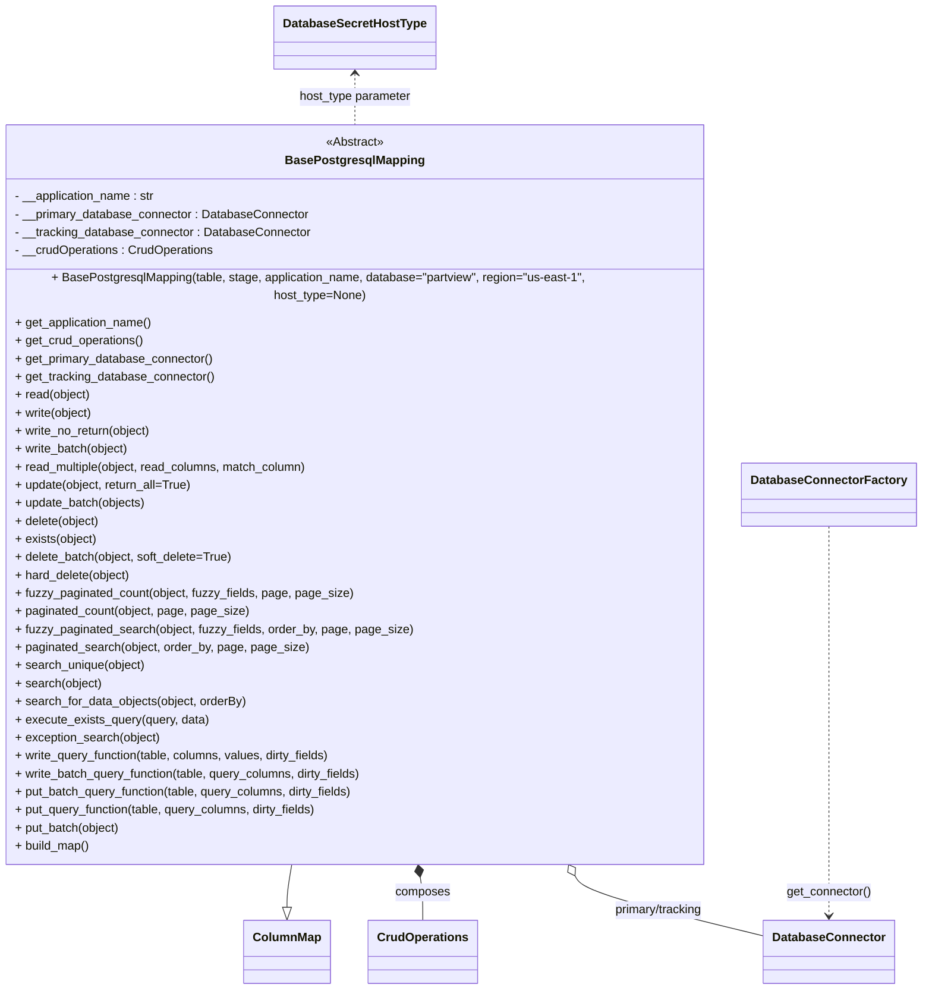
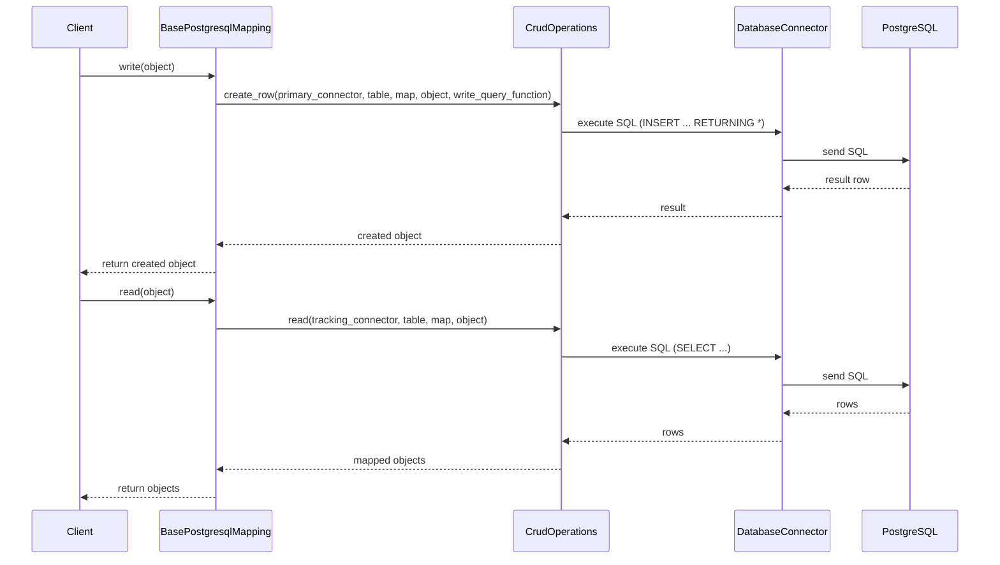

# Diagram: fv_core/fv_framework/python/fv_framework/persistence/sql/postgresql/BasePostgresqlMapping.py

> Auto-generated by Obscura crawlers

## Diagram 1

### SVG

<svg id="container" width="1236.578125" xmlns="http://www.w3.org/2000/svg" class="classDiagram" height="1292" viewBox="0 0 1236.578125 1292" role="graphics-document document" aria-roledescription="class"><g><defs><marker id="container_class-aggregationStart" class="marker aggregation class" refX="18" refY="7" markerWidth="190" markerHeight="240" orient="auto"><path d="M 18,7 L9,13 L1,7 L9,1 Z"></path></marker></defs><defs><marker id="container_class-aggregationEnd" class="marker aggregation class" refX="1" refY="7" markerWidth="20" markerHeight="28" orient="auto"><path d="M 18,7 L9,13 L1,7 L9,1 Z"></path></marker></defs><defs><marker id="container_class-extensionStart" class="marker extension class" refX="18" refY="7" markerWidth="190" markerHeight="240" orient="auto"><path d="M 1,7 L18,13 V 1 Z"></path></marker></defs><defs><marker id="container_class-extensionEnd" class="marker extension class" refX="1" refY="7" markerWidth="20" markerHeight="28" orient="auto"><path d="M 1,1 V 13 L18,7 Z"></path></marker></defs><defs><marker id="container_class-compositionStart" class="marker composition class" refX="18" refY="7" markerWidth="190" markerHeight="240" orient="auto"><path d="M 18,7 L9,13 L1,7 L9,1 Z"></path></marker></defs><defs><marker id="container_class-compositionEnd" class="marker composition class" refX="1" refY="7" markerWidth="20" markerHeight="28" orient="auto"><path d="M 18,7 L9,13 L1,7 L9,1 Z"></path></marker></defs><defs><marker id="container_class-dependencyStart" class="marker dependency class" refX="6" refY="7" markerWidth="190" markerHeight="240" orient="auto"><path d="M 5,7 L9,13 L1,7 L9,1 Z"></path></marker></defs><defs><marker id="container_class-dependencyEnd" class="marker dependency class" refX="13" refY="7" markerWidth="20" markerHeight="28" orient="auto"><path d="M 18,7 L9,13 L14,7 L9,1 Z"></path></marker></defs><defs><marker id="container_class-lollipopStart" class="marker lollipop class" refX="13" refY="7" markerWidth="190" markerHeight="240" orient="auto"><circle stroke="black" fill="transparent" cx="7" cy="7" r="6"></circle></marker></defs><defs><marker id="container_class-lollipopEnd" class="marker lollipop class" refX="1" refY="7" markerWidth="190" markerHeight="240" orient="auto"><circle stroke="black" fill="transparent" cx="7" cy="7" r="6"></circle></marker></defs><g class="root"><g class="clusters"></g><g class="edgePaths"><path d="M402.092,1126L401.051,1132.167C400.011,1138.333,397.929,1150.667,396.888,1160.125C395.848,1169.583,395.848,1176.167,395.848,1179.458L395.848,1182.75" id="id_BasePostgresqlMapping_ColumnMap_1" class="edge-thickness-normal edge-pattern-solid relation" style=";;;" data-edge="true" data-et="edge" data-id="id_BasePostgresqlMapping_ColumnMap_1" data-points="W3sieCI6NDAyLjA5MjEzMzA5OTYxMzE0LCJ5IjoxMTI2fSx7IngiOjM5NS44NDc2NTYyNSwieSI6MTE2M30seyJ4IjozOTUuODQ3NjU2MjUsInkiOjEyMDB9XQ==" marker-end="url(#container_class-extensionEnd)"></path><path d="M566.982,1143.009L567.544,1146.341C568.106,1149.673,569.231,1156.336,569.793,1165.835C570.355,1175.333,570.355,1187.667,570.355,1193.833L570.355,1200" id="id_BasePostgresqlMapping_CrudOperations_2" class="edge-thickness-normal edge-pattern-solid relation" style=";;;" data-edge="true" data-et="edge" data-id="id_BasePostgresqlMapping_CrudOperations_2" data-points="W3sieCI6NTY0LjExMDk5MTkwMDM4NjgsInkiOjExMjZ9LHsieCI6NTcwLjM1NTQ2ODc1LCJ5IjoxMTYzfSx7IngiOjU3MC4zNTU0Njg3NSwieSI6MTIwMH1d" marker-start="url(#container_class-compositionStart)"></path><path d="M777.342,1140.827L779.54,1144.522C781.737,1148.218,786.132,1155.609,829.043,1169.114C871.953,1182.62,953.379,1202.24,994.092,1212.05L1034.805,1221.86" id="id_BasePostgresqlMapping_DatabaseConnector_3" class="edge-thickness-normal edge-pattern-solid relation" style=";;;" data-edge="true" data-et="edge" data-id="id_BasePostgresqlMapping_DatabaseConnector_3" data-points="W3sieCI6NzY4LjUyNTg4NTUxNzQwODEsInkiOjExMjZ9LHsieCI6NzkwLjUyNzM0Mzc1LCJ5IjoxMTYzfSx7IngiOjEwMzQuODA0Njg3NSwieSI6MTIyMS44NTk2MjYxMzAzNjZ9XQ==" marker-start="url(#container_class-aggregationStart)"></path><path d="M1118.391,688L1118.391,767.167C1118.391,846.333,1118.391,1004.667,1118.391,1089C1118.391,1173.333,1118.391,1183.667,1118.391,1188.833L1118.391,1194" id="id_DatabaseConnectorFactory_DatabaseConnector_4" class="edge-thickness-normal edge-pattern-dashed relation" style=";;;" data-edge="true" data-et="edge" data-id="id_DatabaseConnectorFactory_DatabaseConnector_4" data-points="W3sieCI6MTExOC4zOTA2MjUsInkiOjY4OH0seyJ4IjoxMTE4LjM5MDYyNSwieSI6MTE2M30seyJ4IjoxMTE4LjM5MDYyNSwieSI6MTIwMH1d" marker-end="url(#container_class-dependencyEnd)"></path><path d="M483.102,98L483.102,103.167C483.102,108.333,483.102,118.667,483.102,130C483.102,141.333,483.102,153.667,483.102,159.833L483.102,166" id="id_DatabaseSecretHostType_BasePostgresqlMapping_5" class="edge-thickness-normal edge-pattern-dashed relation" style=";;;" data-edge="true" data-et="edge" data-id="id_DatabaseSecretHostType_BasePostgresqlMapping_5" data-points="W3sieCI6NDgzLjEwMTU2MjUsInkiOjkyfSx7IngiOjQ4My4xMDE1NjI1LCJ5IjoxMjl9LHsieCI6NDgzLjEwMTU2MjUsInkiOjE2Nn1d" marker-start="url(#container_class-dependencyStart)"></path></g><g class="edgeLabels"><g class="edgeLabel"><g class="label" data-id="id_BasePostgresqlMapping_ColumnMap_1" transform="translate(0, 0)"><foreignObject width="0" height="0">

</foreignObject></g></g><g class="edgeLabel" transform="translate(570.35546875, 1163)"><g class="label" data-id="id_BasePostgresqlMapping_CrudOperations_2" transform="translate(-36.453125, -12)"><foreignObject width="72.90625" height="24">

composes

</foreignObject></g></g><g class="edgeLabel" transform="translate(891.74126, 1187.38791)"><g class="label" data-id="id_BasePostgresqlMapping_DatabaseConnector_3" transform="translate(-61.3203125, -12)"><foreignObject width="122.640625" height="24">

primary/tracking

</foreignObject></g></g><g class="edgeLabel" transform="translate(1118.390625, 1163)"><g class="label" data-id="id_DatabaseConnectorFactory_DatabaseConnector_4" transform="translate(-56.890625, -12)"><foreignObject width="113.78125" height="24">

get_connector()

</foreignObject></g></g><g class="edgeLabel" transform="translate(483.1015625, 129)"><g class="label" data-id="id_DatabaseSecretHostType_BasePostgresqlMapping_5" transform="translate(-75.6171875, -12)"><foreignObject width="151.234375" height="24">

host_type parameter

</foreignObject></g></g></g><g class="nodes"><g class="node default" id="classId-BasePostgresqlMapping-0" transform="translate(483.1015625, 646)"><g class="basic label-container"><path d="M-475.1015625 -480 L475.1015625 -480 L475.1015625 480 L-475.1015625 480" stroke="none" stroke-width="0" fill="#ECECFF" style=""></path><path d="M-475.1015625 -480 C-279.83494418009 -480, -84.56832586017998 -480, 475.1015625 -480 M-475.1015625 -480 C-277.6625959141147 -480, -80.22362932822938 -480, 475.1015625 -480 M475.1015625 -480 C475.1015625 -142.023859239434, 475.1015625 195.95228152113202, 475.1015625 480 M475.1015625 -480 C475.1015625 -261.720871160966, 475.1015625 -43.441742321932054, 475.1015625 480 M475.1015625 480 C112.8172716272515 480, -249.467019245497 480, -475.1015625 480 M475.1015625 480 C112.19244137881361 480, -250.71667974237278 480, -475.1015625 480 M-475.1015625 480 C-475.1015625 139.66247558616027, -475.1015625 -200.67504882767946, -475.1015625 -480 M-475.1015625 480 C-475.1015625 204.61880603366217, -475.1015625 -70.76238793267567, -475.1015625 -480" stroke="#9370DB" stroke-width="1.3" fill="none" stroke-dasharray="0 0" style=""></path></g><g class="annotation-group text" transform="translate(-38.9609375, -456)"><g class="label" style="" transform="translate(0,-12)"><foreignObject width="77.921875" height="24">

«Abstract»

</foreignObject></g></g><g class="label-group text" transform="translate(-87.921875, -432)"><g class="label" style="font-weight: bolder" transform="translate(0,-12)"><foreignObject width="175.84375" height="24">

BasePostgresqlMapping

</foreignObject></g></g><g class="members-group text" transform="translate(-463.1015625, -384)"><g class="label" style="" transform="translate(0,-12)"><foreignObject width="189.546875" height="24">

- __application_name : str

</foreignObject></g><g class="label" style="" transform="translate(0,12)"><foreignObject width="392.375" height="24">

- __primary_database_connector : DatabaseConnector

</foreignObject></g><g class="label" style="" transform="translate(0,36)"><foreignObject width="394.09375" height="24">

- __tracking_database_connector : DatabaseConnector

</foreignObject></g><g class="label" style="" transform="translate(0,60)"><foreignObject width="265.84375" height="24">

- __crudOperations : CrudOperations

</foreignObject></g></g><g class="methods-group text" transform="translate(-463.1015625, -264)"><g class="label" style="" transform="translate(0,-12)"><foreignObject width="838.28125" height="24">

+ BasePostgresqlMapping(table, stage, application_name, database="partview", region="us-east-1", host_type=None)

</foreignObject></g><g class="label" style="" transform="translate(0,12)"><foreignObject width="184.109375" height="24">

+ get_application_name()

</foreignObject></g><g class="label" style="" transform="translate(0,36)"><foreignObject width="172.234375" height="24">

+ get_crud_operations()

</foreignObject></g><g class="label" style="" transform="translate(0,60)"><foreignObject width="264.90625" height="24">

+ get_primary_database_connector()

</foreignObject></g><g class="label" style="" transform="translate(0,84)"><foreignObject width="266.609375" height="24">

+ get_tracking_database_connector()

</foreignObject></g><g class="label" style="" transform="translate(0,108)"><foreignObject width="100.59375" height="24">

+ read(object)

</foreignObject></g><g class="label" style="" transform="translate(0,132)"><foreignObject width="104.484375" height="24">

+ write(object)

</foreignObject></g><g class="label" style="" transform="translate(0,156)"><foreignObject width="184.265625" height="24">

+ write_no_return(object)

</foreignObject></g><g class="label" style="" transform="translate(0,180)"><foreignObject width="153.09375" height="24">

+ write_batch(object)

</foreignObject></g><g class="label" style="" transform="translate(0,204)"><foreignObject width="394.46875" height="24">

+ read_multiple(object, read_columns, match_column)

</foreignObject></g><g class="label" style="" transform="translate(0,228)"><foreignObject width="238.53125" height="24">

+ update(object, return_all=True)

</foreignObject></g><g class="label" style="" transform="translate(0,252)"><foreignObject width="175.5" height="24">

+ update_batch(objects)

</foreignObject></g><g class="label" style="" transform="translate(0,276)"><foreignObject width="113.9375" height="24">

+ delete(object)

</foreignObject></g><g class="label" style="" transform="translate(0,300)"><foreignObject width="109.640625" height="24">

+ exists(object)

</foreignObject></g><g class="label" style="" transform="translate(0,324)"><foreignObject width="292.515625" height="24">

+ delete_batch(object, soft_delete=True)

</foreignObject></g><g class="label" style="" transform="translate(0,348)"><foreignObject width="155.28125" height="24">

+ hard_delete(object)

</foreignObject></g><g class="label" style="" transform="translate(0,372)"><foreignObject width="446.890625" height="24">

+ fuzzy_paginated_count(object, fuzzy_fields, page, page_size)

</foreignObject></g><g class="label" style="" transform="translate(0,396)"><foreignObject width="310.828125" height="24">

+ paginated_count(object, page, page_size)

</foreignObject></g><g class="label" style="" transform="translate(0,420)"><foreignObject width="524.828125" height="24">

+ fuzzy_paginated_search(object, fuzzy_fields, order_by, page, page_size)

</foreignObject></g><g class="label" style="" transform="translate(0,444)"><foreignObject width="388.765625" height="24">

+ paginated_search(object, order_by, page, page_size)

</foreignObject></g><g class="label" style="" transform="translate(0,468)"><foreignObject width="174.328125" height="24">

+ search_unique(object)

</foreignObject></g><g class="label" style="" transform="translate(0,492)"><foreignObject width="115.53125" height="24">

+ search(object)

</foreignObject></g><g class="label" style="" transform="translate(0,516)"><foreignObject width="309.796875" height="24">

+ search_for_data_objects(object, orderBy)

</foreignObject></g><g class="label" style="" transform="translate(0,540)"><foreignObject width="258.875" height="24">

+ execute_exists_query(query, data)

</foreignObject></g><g class="label" style="" transform="translate(0,564)"><foreignObject width="194.59375" height="24">

+ exception_search(object)

</foreignObject></g><g class="label" style="" transform="translate(0,588)"><foreignObject width="426.34375" height="24">

+ write_query_function(table, columns, values, dirty_fields)

</foreignObject></g><g class="label" style="" transform="translate(0,612)"><foreignObject width="470.015625" height="24">

+ write_batch_query_function(table, query_columns, dirty_fields)

</foreignObject></g><g class="label" style="" transform="translate(0,636)"><foreignObject width="458.5" height="24">

+ put_batch_query_function(table, query_columns, dirty_fields)

</foreignObject></g><g class="label" style="" transform="translate(0,660)"><foreignObject width="409.578125" height="24">

+ put_query_function(table, query_columns, dirty_fields)

</foreignObject></g><g class="label" style="" transform="translate(0,684)"><foreignObject width="141.59375" height="24">

+ put_batch(object)

</foreignObject></g><g class="label" style="" transform="translate(0,708)"><foreignObject width="100.34375" height="24">

+ build_map()

</foreignObject></g></g><g class="divider" style=""><path d="M-475.1015625 -408 C-172.1965569482157 -408, 130.70844860356863 -408, 475.1015625 -408 M-475.1015625 -408 C-129.9699458909825 -408, 215.161670718035 -408, 475.1015625 -408" stroke="#9370DB" stroke-width="1.3" fill="none" stroke-dasharray="0 0" style=""></path></g><g class="divider" style=""><path d="M-475.1015625 -288 C-178.8025024662026 -288, 117.49655756759478 -288, 475.1015625 -288 M-475.1015625 -288 C-103.49251891431857 -288, 268.11652467136287 -288, 475.1015625 -288" stroke="#9370DB" stroke-width="1.3" fill="none" stroke-dasharray="0 0" style=""></path></g></g><g class="node default" id="classId-ColumnMap-1" transform="translate(395.84765625, 1242)"><g class="basic label-container"><path d="M-54.890625 -42 L54.890625 -42 L54.890625 42 L-54.890625 42" stroke="none" stroke-width="0" fill="#ECECFF" style=""></path><path d="M-54.890625 -42 C-19.07508480242359 -42, 16.74045539515282 -42, 54.890625 -42 M-54.890625 -42 C-21.3692180357381 -42, 12.152188928523799 -42, 54.890625 -42 M54.890625 -42 C54.890625 -15.701812602911275, 54.890625 10.59637479417745, 54.890625 42 M54.890625 -42 C54.890625 -20.781650026138564, 54.890625 0.4366999477228717, 54.890625 42 M54.890625 42 C22.75761914209535 42, -9.375386715809299 42, -54.890625 42 M54.890625 42 C26.85209415414198 42, -1.1864366917160396 42, -54.890625 42 M-54.890625 42 C-54.890625 12.207172356573036, -54.890625 -17.585655286853928, -54.890625 -42 M-54.890625 42 C-54.890625 17.694599500782314, -54.890625 -6.610800998435373, -54.890625 -42" stroke="#9370DB" stroke-width="1.3" fill="none" stroke-dasharray="0 0" style=""></path></g><g class="annotation-group text" transform="translate(0, -18)"></g><g class="label-group text" transform="translate(-42.890625, -18)"><g class="label" style="font-weight: bolder" transform="translate(0,-12)"><foreignObject width="85.78125" height="24">

ColumnMap

</foreignObject></g></g><g class="members-group text" transform="translate(-42.890625, 30)"></g><g class="methods-group text" transform="translate(-42.890625, 60)"></g><g class="divider" style=""><path d="M-54.890625 6 C-25.978306514965226 6, 2.934011970069548 6, 54.890625 6 M-54.890625 6 C-18.61710466834753 6, 17.65641566330494 6, 54.890625 6" stroke="#9370DB" stroke-width="1.3" fill="none" stroke-dasharray="0 0" style=""></path></g><g class="divider" style=""><path d="M-54.890625 24 C-21.794244203806457 24, 11.302136592387086 24, 54.890625 24 M-54.890625 24 C-13.88815085014378 24, 27.11432329971244 24, 54.890625 24" stroke="#9370DB" stroke-width="1.3" fill="none" stroke-dasharray="0 0" style=""></path></g></g><g class="node default" id="classId-CrudOperations-2" transform="translate(570.35546875, 1242)"><g class="basic label-container"><path d="M-69.6171875 -42 L69.6171875 -42 L69.6171875 42 L-69.6171875 42" stroke="none" stroke-width="0" fill="#ECECFF" style=""></path><path d="M-69.6171875 -42 C-40.87151583190384 -42, -12.125844163807685 -42, 69.6171875 -42 M-69.6171875 -42 C-32.598915887143534 -42, 4.419355725712933 -42, 69.6171875 -42 M69.6171875 -42 C69.6171875 -22.809128794220772, 69.6171875 -3.618257588441544, 69.6171875 42 M69.6171875 -42 C69.6171875 -23.81050657727373, 69.6171875 -5.621013154547462, 69.6171875 42 M69.6171875 42 C28.679206054995916 42, -12.258775390008168 42, -69.6171875 42 M69.6171875 42 C27.670852401224735 42, -14.27548269755053 42, -69.6171875 42 M-69.6171875 42 C-69.6171875 18.774926159919612, -69.6171875 -4.450147680160775, -69.6171875 -42 M-69.6171875 42 C-69.6171875 22.535592661966437, -69.6171875 3.0711853239328732, -69.6171875 -42" stroke="#9370DB" stroke-width="1.3" fill="none" stroke-dasharray="0 0" style=""></path></g><g class="annotation-group text" transform="translate(0, -18)"></g><g class="label-group text" transform="translate(-57.6171875, -18)"><g class="label" style="font-weight: bolder" transform="translate(0,-12)"><foreignObject width="115.234375" height="24">

CrudOperations

</foreignObject></g></g><g class="members-group text" transform="translate(-57.6171875, 30)"></g><g class="methods-group text" transform="translate(-57.6171875, 60)"></g><g class="divider" style=""><path d="M-69.6171875 6 C-21.940128556617708 6, 25.736930386764584 6, 69.6171875 6 M-69.6171875 6 C-35.50659088967333 6, -1.3959942793466666 6, 69.6171875 6" stroke="#9370DB" stroke-width="1.3" fill="none" stroke-dasharray="0 0" style=""></path></g><g class="divider" style=""><path d="M-69.6171875 24 C-20.40444912515286 24, 28.808289249694283 24, 69.6171875 24 M-69.6171875 24 C-14.813877225807005 24, 39.98943304838599 24, 69.6171875 24" stroke="#9370DB" stroke-width="1.3" fill="none" stroke-dasharray="0 0" style=""></path></g></g><g class="node default" id="classId-DatabaseConnectorFactory-3" transform="translate(1118.390625, 646)"><g class="basic label-container"><path d="M-110.1875 -42 L110.1875 -42 L110.1875 42 L-110.1875 42" stroke="none" stroke-width="0" fill="#ECECFF" style=""></path><path d="M-110.1875 -42 C-36.174629685620815 -42, 37.83824062875837 -42, 110.1875 -42 M-110.1875 -42 C-62.99335621415951 -42, -15.799212428319024 -42, 110.1875 -42 M110.1875 -42 C110.1875 -20.173996465498387, 110.1875 1.6520070690032256, 110.1875 42 M110.1875 -42 C110.1875 -13.974489453288843, 110.1875 14.051021093422314, 110.1875 42 M110.1875 42 C60.41895906834648 42, 10.650418136692963 42, -110.1875 42 M110.1875 42 C51.73483053164926 42, -6.717838936701483 42, -110.1875 42 M-110.1875 42 C-110.1875 20.882655382087265, -110.1875 -0.23468923582547063, -110.1875 -42 M-110.1875 42 C-110.1875 17.104630059985436, -110.1875 -7.790739880029129, -110.1875 -42" stroke="#9370DB" stroke-width="1.3" fill="none" stroke-dasharray="0 0" style=""></path></g><g class="annotation-group text" transform="translate(0, -18)"></g><g class="label-group text" transform="translate(-98.1875, -18)"><g class="label" style="font-weight: bolder" transform="translate(0,-12)"><foreignObject width="196.375" height="24">

DatabaseConnectorFactory

</foreignObject></g></g><g class="members-group text" transform="translate(-98.1875, 30)"></g><g class="methods-group text" transform="translate(-98.1875, 60)"></g><g class="divider" style=""><path d="M-110.1875 6 C-24.12099945925381 6, 61.94550108149238 6, 110.1875 6 M-110.1875 6 C-35.03969042461674 6, 40.10811915076653 6, 110.1875 6" stroke="#9370DB" stroke-width="1.3" fill="none" stroke-dasharray="0 0" style=""></path></g><g class="divider" style=""><path d="M-110.1875 24 C-58.66022560268268 24, -7.132951205365359 24, 110.1875 24 M-110.1875 24 C-23.83961196870814 24, 62.50827606258372 24, 110.1875 24" stroke="#9370DB" stroke-width="1.3" fill="none" stroke-dasharray="0 0" style=""></path></g></g><g class="node default" id="classId-DatabaseConnector-4" transform="translate(1118.390625, 1242)"><g class="basic label-container"><path d="M-83.5859375 -42 L83.5859375 -42 L83.5859375 42 L-83.5859375 42" stroke="none" stroke-width="0" fill="#ECECFF" style=""></path><path d="M-83.5859375 -42 C-24.678262714460118 -42, 34.229412071079764 -42, 83.5859375 -42 M-83.5859375 -42 C-19.97175692344107 -42, 43.64242365311786 -42, 83.5859375 -42 M83.5859375 -42 C83.5859375 -21.77172299458823, 83.5859375 -1.5434459891764618, 83.5859375 42 M83.5859375 -42 C83.5859375 -20.779461330994923, 83.5859375 0.44107733801015314, 83.5859375 42 M83.5859375 42 C27.869797293993216 42, -27.84634291201357 42, -83.5859375 42 M83.5859375 42 C30.19922802033082 42, -23.187481459338358 42, -83.5859375 42 M-83.5859375 42 C-83.5859375 14.157609579242909, -83.5859375 -13.684780841514183, -83.5859375 -42 M-83.5859375 42 C-83.5859375 12.90284043189304, -83.5859375 -16.19431913621392, -83.5859375 -42" stroke="#9370DB" stroke-width="1.3" fill="none" stroke-dasharray="0 0" style=""></path></g><g class="annotation-group text" transform="translate(0, -18)"></g><g class="label-group text" transform="translate(-71.5859375, -18)"><g class="label" style="font-weight: bolder" transform="translate(0,-12)"><foreignObject width="143.171875" height="24">

DatabaseConnector

</foreignObject></g></g><g class="members-group text" transform="translate(-71.5859375, 30)"></g><g class="methods-group text" transform="translate(-71.5859375, 60)"></g><g class="divider" style=""><path d="M-83.5859375 6 C-25.231192632426087 6, 33.12355223514783 6, 83.5859375 6 M-83.5859375 6 C-28.33399761944964 6, 26.91794226110072 6, 83.5859375 6" stroke="#9370DB" stroke-width="1.3" fill="none" stroke-dasharray="0 0" style=""></path></g><g class="divider" style=""><path d="M-83.5859375 24 C-21.781752985406982 24, 40.022431529186036 24, 83.5859375 24 M-83.5859375 24 C-38.42016443931378 24, 6.74560862137244 24, 83.5859375 24" stroke="#9370DB" stroke-width="1.3" fill="none" stroke-dasharray="0 0" style=""></path></g></g><g class="node default" id="classId-DatabaseSecretHostType-5" transform="translate(483.1015625, 50)"><g class="basic label-container"><path d="M-103.7578125 -42 L103.7578125 -42 L103.7578125 42 L-103.7578125 42" stroke="none" stroke-width="0" fill="#ECECFF" style=""></path><path d="M-103.7578125 -42 C-35.58614232635745 -42, 32.58552784728511 -42, 103.7578125 -42 M-103.7578125 -42 C-40.12861620045809 -42, 23.50058009908382 -42, 103.7578125 -42 M103.7578125 -42 C103.7578125 -9.67888642834997, 103.7578125 22.64222714330006, 103.7578125 42 M103.7578125 -42 C103.7578125 -17.109946883786698, 103.7578125 7.780106232426604, 103.7578125 42 M103.7578125 42 C31.485556381477764 42, -40.78669973704447 42, -103.7578125 42 M103.7578125 42 C36.473328353637115 42, -30.81115579272577 42, -103.7578125 42 M-103.7578125 42 C-103.7578125 19.225188502713245, -103.7578125 -3.549622994573511, -103.7578125 -42 M-103.7578125 42 C-103.7578125 12.516423939096615, -103.7578125 -16.96715212180677, -103.7578125 -42" stroke="#9370DB" stroke-width="1.3" fill="none" stroke-dasharray="0 0" style=""></path></g><g class="annotation-group text" transform="translate(0, -18)"></g><g class="label-group text" transform="translate(-91.7578125, -18)"><g class="label" style="font-weight: bolder" transform="translate(0,-12)"><foreignObject width="183.515625" height="24">

DatabaseSecretHostType

</foreignObject></g></g><g class="members-group text" transform="translate(-91.7578125, 30)"></g><g class="methods-group text" transform="translate(-91.7578125, 60)"></g><g class="divider" style=""><path d="M-103.7578125 6 C-48.58403649480966 6, 6.5897395103806815 6, 103.7578125 6 M-103.7578125 6 C-53.22998538980906 6, -2.702158279618118 6, 103.7578125 6" stroke="#9370DB" stroke-width="1.3" fill="none" stroke-dasharray="0 0" style=""></path></g><g class="divider" style=""><path d="M-103.7578125 24 C-59.52341587938267 24, -15.289019258765336 24, 103.7578125 24 M-103.7578125 24 C-53.751022007736985 24, -3.7442315154739703 24, 103.7578125 24" stroke="#9370DB" stroke-width="1.3" fill="none" stroke-dasharray="0 0" style=""></path></g></g></g></g></g></svg>

## Diagram 2

### SVG

<svg id="container" width="1614" xmlns="http://www.w3.org/2000/svg" height="939" viewBox="-50 -10 1614 939" role="graphics-document document" aria-roledescription="sequence"><g><rect x="1364" y="853" fill="#eaeaea" stroke="#666" width="150" height="65" name="Postgres" rx="3" ry="3" class="actor actor-bottom"></rect><text x="1439" y="885.5" dominant-baseline="central" alignment-baseline="central" class="actor actor-box" style="text-anchor: middle; font-size: 16px; font-weight: 400;"><tspan x="1439" dy="0">PostgreSQL</tspan></text></g><g><rect x="1152" y="853" fill="#eaeaea" stroke="#666" width="162" height="65" name="Connector" rx="3" ry="3" class="actor actor-bottom"></rect><text x="1233" y="885.5" dominant-baseline="central" alignment-baseline="central" class="actor actor-box" style="text-anchor: middle; font-size: 16px; font-weight: 400;"><tspan x="1233" dy="0">DatabaseConnector</tspan></text></g><g><rect x="820" y="853" fill="#eaeaea" stroke="#666" width="150" height="65" name="Crud" rx="3" ry="3" class="actor actor-bottom"></rect><text x="895" y="885.5" dominant-baseline="central" alignment-baseline="central" class="actor actor-box" style="text-anchor: middle; font-size: 16px; font-weight: 400;"><tspan x="895" dy="0">CrudOperations</tspan></text></g><g><rect x="202.5" y="853" fill="#eaeaea" stroke="#666" width="193" height="65" name="Mapping" rx="3" ry="3" class="actor actor-bottom"></rect><text x="299" y="885.5" dominant-baseline="central" alignment-baseline="central" class="actor actor-box" style="text-anchor: middle; font-size: 16px; font-weight: 400;"><tspan x="299" dy="0">BasePostgresqlMapping</tspan></text></g><g><rect x="0" y="853" fill="#eaeaea" stroke="#666" width="150" height="65" name="Client" rx="3" ry="3" class="actor actor-bottom"></rect><text x="75" y="885.5" dominant-baseline="central" alignment-baseline="central" class="actor actor-box" style="text-anchor: middle; font-size: 16px; font-weight: 400;"><tspan x="75" dy="0">Client</tspan></text></g><g><line id="actor4" x1="1439" y1="65" x2="1439" y2="853" class="actor-line 200" stroke-width="0.5px" stroke="#999" name="Postgres"></line><g id="root-4"><rect x="1364" y="0" fill="#eaeaea" stroke="#666" width="150" height="65" name="Postgres" rx="3" ry="3" class="actor actor-top"></rect><text x="1439" y="32.5" dominant-baseline="central" alignment-baseline="central" class="actor actor-box" style="text-anchor: middle; font-size: 16px; font-weight: 400;"><tspan x="1439" dy="0">PostgreSQL</tspan></text></g></g><g><line id="actor3" x1="1233" y1="65" x2="1233" y2="853" class="actor-line 200" stroke-width="0.5px" stroke="#999" name="Connector"></line><g id="root-3"><rect x="1152" y="0" fill="#eaeaea" stroke="#666" width="162" height="65" name="Connector" rx="3" ry="3" class="actor actor-top"></rect><text x="1233" y="32.5" dominant-baseline="central" alignment-baseline="central" class="actor actor-box" style="text-anchor: middle; font-size: 16px; font-weight: 400;"><tspan x="1233" dy="0">DatabaseConnector</tspan></text></g></g><g><line id="actor2" x1="895" y1="65" x2="895" y2="853" class="actor-line 200" stroke-width="0.5px" stroke="#999" name="Crud"></line><g id="root-2"><rect x="820" y="0" fill="#eaeaea" stroke="#666" width="150" height="65" name="Crud" rx="3" ry="3" class="actor actor-top"></rect><text x="895" y="32.5" dominant-baseline="central" alignment-baseline="central" class="actor actor-box" style="text-anchor: middle; font-size: 16px; font-weight: 400;"><tspan x="895" dy="0">CrudOperations</tspan></text></g></g><g><line id="actor1" x1="299" y1="65" x2="299" y2="853" class="actor-line 200" stroke-width="0.5px" stroke="#999" name="Mapping"></line><g id="root-1"><rect x="202.5" y="0" fill="#eaeaea" stroke="#666" width="193" height="65" name="Mapping" rx="3" ry="3" class="actor actor-top"></rect><text x="299" y="32.5" dominant-baseline="central" alignment-baseline="central" class="actor actor-box" style="text-anchor: middle; font-size: 16px; font-weight: 400;"><tspan x="299" dy="0">BasePostgresqlMapping</tspan></text></g></g><g><line id="actor0" x1="75" y1="65" x2="75" y2="853" class="actor-line 200" stroke-width="0.5px" stroke="#999" name="Client"></line><g id="root-0"><rect x="0" y="0" fill="#eaeaea" stroke="#666" width="150" height="65" name="Client" rx="3" ry="3" class="actor actor-top"></rect><text x="75" y="32.5" dominant-baseline="central" alignment-baseline="central" class="actor actor-box" style="text-anchor: middle; font-size: 16px; font-weight: 400;"><tspan x="75" dy="0">Client</tspan></text></g></g><g></g><defs><symbol id="computer" width="24" height="24"><path transform="scale(.5)" d="M2 2v13h20v-13h-20zm18 11h-16v-9h16v9zm-10.228 6l.466-1h3.524l.467 1h-4.457zm14.228 3h-24l2-6h2.104l-1.33 4h18.45l-1.297-4h2.073l2 6zm-5-10h-14v-7h14v7z"></path></symbol></defs><defs><symbol id="database" fill-rule="evenodd" clip-rule="evenodd"><path transform="scale(.5)" d="M12.258.001l.256.004.255.005.253.008.251.01.249.012.247.015.246.016.242.019.241.02.239.023.236.024.233.027.231.028.229.031.225.032.223.034.22.036.217.038.214.04.211.041.208.043.205.045.201.046.198.048.194.05.191.051.187.053.183.054.18.056.175.057.172.059.168.06.163.061.16.063.155.064.15.066.074.033.073.033.071.034.07.034.069.035.068.035.067.035.066.035.064.036.064.036.062.036.06.036.06.037.058.037.058.037.055.038.055.038.053.038.052.038.051.039.05.039.048.039.047.039.045.04.044.04.043.04.041.04.04.041.039.041.037.041.036.041.034.041.033.042.032.042.03.042.029.042.027.042.026.043.024.043.023.043.021.043.02.043.018.044.017.043.015.044.013.044.012.044.011.045.009.044.007.045.006.045.004.045.002.045.001.045v17l-.001.045-.002.045-.004.045-.006.045-.007.045-.009.044-.011.045-.012.044-.013.044-.015.044-.017.043-.018.044-.02.043-.021.043-.023.043-.024.043-.026.043-.027.042-.029.042-.03.042-.032.042-.033.042-.034.041-.036.041-.037.041-.039.041-.04.041-.041.04-.043.04-.044.04-.045.04-.047.039-.048.039-.05.039-.051.039-.052.038-.053.038-.055.038-.055.038-.058.037-.058.037-.06.037-.06.036-.062.036-.064.036-.064.036-.066.035-.067.035-.068.035-.069.035-.07.034-.071.034-.073.033-.074.033-.15.066-.155.064-.16.063-.163.061-.168.06-.172.059-.175.057-.18.056-.183.054-.187.053-.191.051-.194.05-.198.048-.201.046-.205.045-.208.043-.211.041-.214.04-.217.038-.22.036-.223.034-.225.032-.229.031-.231.028-.233.027-.236.024-.239.023-.241.02-.242.019-.246.016-.247.015-.249.012-.251.01-.253.008-.255.005-.256.004-.258.001-.258-.001-.256-.004-.255-.005-.253-.008-.251-.01-.249-.012-.247-.015-.245-.016-.243-.019-.241-.02-.238-.023-.236-.024-.234-.027-.231-.028-.228-.031-.226-.032-.223-.034-.22-.036-.217-.038-.214-.04-.211-.041-.208-.043-.204-.045-.201-.046-.198-.048-.195-.05-.19-.051-.187-.053-.184-.054-.179-.056-.176-.057-.172-.059-.167-.06-.164-.061-.159-.063-.155-.064-.151-.066-.074-.033-.072-.033-.072-.034-.07-.034-.069-.035-.068-.035-.067-.035-.066-.035-.064-.036-.063-.036-.062-.036-.061-.036-.06-.037-.058-.037-.057-.037-.056-.038-.055-.038-.053-.038-.052-.038-.051-.039-.049-.039-.049-.039-.046-.039-.046-.04-.044-.04-.043-.04-.041-.04-.04-.041-.039-.041-.037-.041-.036-.041-.034-.041-.033-.042-.032-.042-.03-.042-.029-.042-.027-.042-.026-.043-.024-.043-.023-.043-.021-.043-.02-.043-.018-.044-.017-.043-.015-.044-.013-.044-.012-.044-.011-.045-.009-.044-.007-.045-.006-.045-.004-.045-.002-.045-.001-.045v-17l.001-.045.002-.045.004-.045.006-.045.007-.045.009-.044.011-.045.012-.044.013-.044.015-.044.017-.043.018-.044.02-.043.021-.043.023-.043.024-.043.026-.043.027-.042.029-.042.03-.042.032-.042.033-.042.034-.041.036-.041.037-.041.039-.041.04-.041.041-.04.043-.04.044-.04.046-.04.046-.039.049-.039.049-.039.051-.039.052-.038.053-.038.055-.038.056-.038.057-.037.058-.037.06-.037.061-.036.062-.036.063-.036.064-.036.066-.035.067-.035.068-.035.069-.035.07-.034.072-.034.072-.033.074-.033.151-.066.155-.064.159-.063.164-.061.167-.06.172-.059.176-.057.179-.056.184-.054.187-.053.19-.051.195-.05.198-.048.201-.046.204-.045.208-.043.211-.041.214-.04.217-.038.22-.036.223-.034.226-.032.228-.031.231-.028.234-.027.236-.024.238-.023.241-.02.243-.019.245-.016.247-.015.249-.012.251-.01.253-.008.255-.005.256-.004.258-.001.258.001zm-9.258 20.499v.01l.001.021.003.021.004.022.005.021.006.022.007.022.009.023.01.022.011.023.012.023.013.023.015.023.016.024.017.023.018.024.019.024.021.024.022.025.023.024.024.025.052.049.056.05.061.051.066.051.07.051.075.051.079.052.084.052.088.052.092.052.097.052.102.051.105.052.11.052.114.051.119.051.123.051.127.05.131.05.135.05.139.048.144.049.147.047.152.047.155.047.16.045.163.045.167.043.171.043.176.041.178.041.183.039.187.039.19.037.194.035.197.035.202.033.204.031.209.03.212.029.216.027.219.025.222.024.226.021.23.02.233.018.236.016.24.015.243.012.246.01.249.008.253.005.256.004.259.001.26-.001.257-.004.254-.005.25-.008.247-.011.244-.012.241-.014.237-.016.233-.018.231-.021.226-.021.224-.024.22-.026.216-.027.212-.028.21-.031.205-.031.202-.034.198-.034.194-.036.191-.037.187-.039.183-.04.179-.04.175-.042.172-.043.168-.044.163-.045.16-.046.155-.046.152-.047.148-.048.143-.049.139-.049.136-.05.131-.05.126-.05.123-.051.118-.052.114-.051.11-.052.106-.052.101-.052.096-.052.092-.052.088-.053.083-.051.079-.052.074-.052.07-.051.065-.051.06-.051.056-.05.051-.05.023-.024.023-.025.021-.024.02-.024.019-.024.018-.024.017-.024.015-.023.014-.024.013-.023.012-.023.01-.023.01-.022.008-.022.006-.022.006-.022.004-.022.004-.021.001-.021.001-.021v-4.127l-.077.055-.08.053-.083.054-.085.053-.087.052-.09.052-.093.051-.095.05-.097.05-.1.049-.102.049-.105.048-.106.047-.109.047-.111.046-.114.045-.115.045-.118.044-.12.043-.122.042-.124.042-.126.041-.128.04-.13.04-.132.038-.134.038-.135.037-.138.037-.139.035-.142.035-.143.034-.144.033-.147.032-.148.031-.15.03-.151.03-.153.029-.154.027-.156.027-.158.026-.159.025-.161.024-.162.023-.163.022-.165.021-.166.02-.167.019-.169.018-.169.017-.171.016-.173.015-.173.014-.175.013-.175.012-.177.011-.178.01-.179.008-.179.008-.181.006-.182.005-.182.004-.184.003-.184.002h-.37l-.184-.002-.184-.003-.182-.004-.182-.005-.181-.006-.179-.008-.179-.008-.178-.01-.176-.011-.176-.012-.175-.013-.173-.014-.172-.015-.171-.016-.17-.017-.169-.018-.167-.019-.166-.02-.165-.021-.163-.022-.162-.023-.161-.024-.159-.025-.157-.026-.156-.027-.155-.027-.153-.029-.151-.03-.15-.03-.148-.031-.146-.032-.145-.033-.143-.034-.141-.035-.14-.035-.137-.037-.136-.037-.134-.038-.132-.038-.13-.04-.128-.04-.126-.041-.124-.042-.122-.042-.12-.044-.117-.043-.116-.045-.113-.045-.112-.046-.109-.047-.106-.047-.105-.048-.102-.049-.1-.049-.097-.05-.095-.05-.093-.052-.09-.051-.087-.052-.085-.053-.083-.054-.08-.054-.077-.054v4.127zm0-5.654v.011l.001.021.003.021.004.021.005.022.006.022.007.022.009.022.01.022.011.023.012.023.013.023.015.024.016.023.017.024.018.024.019.024.021.024.022.024.023.025.024.024.052.05.056.05.061.05.066.051.07.051.075.052.079.051.084.052.088.052.092.052.097.052.102.052.105.052.11.051.114.051.119.052.123.05.127.051.131.05.135.049.139.049.144.048.147.048.152.047.155.046.16.045.163.045.167.044.171.042.176.042.178.04.183.04.187.038.19.037.194.036.197.034.202.033.204.032.209.03.212.028.216.027.219.025.222.024.226.022.23.02.233.018.236.016.24.014.243.012.246.01.249.008.253.006.256.003.259.001.26-.001.257-.003.254-.006.25-.008.247-.01.244-.012.241-.015.237-.016.233-.018.231-.02.226-.022.224-.024.22-.025.216-.027.212-.029.21-.03.205-.032.202-.033.198-.035.194-.036.191-.037.187-.039.183-.039.179-.041.175-.042.172-.043.168-.044.163-.045.16-.045.155-.047.152-.047.148-.048.143-.048.139-.05.136-.049.131-.05.126-.051.123-.051.118-.051.114-.052.11-.052.106-.052.101-.052.096-.052.092-.052.088-.052.083-.052.079-.052.074-.051.07-.052.065-.051.06-.05.056-.051.051-.049.023-.025.023-.024.021-.025.02-.024.019-.024.018-.024.017-.024.015-.023.014-.023.013-.024.012-.022.01-.023.01-.023.008-.022.006-.022.006-.022.004-.021.004-.022.001-.021.001-.021v-4.139l-.077.054-.08.054-.083.054-.085.052-.087.053-.09.051-.093.051-.095.051-.097.05-.1.049-.102.049-.105.048-.106.047-.109.047-.111.046-.114.045-.115.044-.118.044-.12.044-.122.042-.124.042-.126.041-.128.04-.13.039-.132.039-.134.038-.135.037-.138.036-.139.036-.142.035-.143.033-.144.033-.147.033-.148.031-.15.03-.151.03-.153.028-.154.028-.156.027-.158.026-.159.025-.161.024-.162.023-.163.022-.165.021-.166.02-.167.019-.169.018-.169.017-.171.016-.173.015-.173.014-.175.013-.175.012-.177.011-.178.009-.179.009-.179.007-.181.007-.182.005-.182.004-.184.003-.184.002h-.37l-.184-.002-.184-.003-.182-.004-.182-.005-.181-.007-.179-.007-.179-.009-.178-.009-.176-.011-.176-.012-.175-.013-.173-.014-.172-.015-.171-.016-.17-.017-.169-.018-.167-.019-.166-.02-.165-.021-.163-.022-.162-.023-.161-.024-.159-.025-.157-.026-.156-.027-.155-.028-.153-.028-.151-.03-.15-.03-.148-.031-.146-.033-.145-.033-.143-.033-.141-.035-.14-.036-.137-.036-.136-.037-.134-.038-.132-.039-.13-.039-.128-.04-.126-.041-.124-.042-.122-.043-.12-.043-.117-.044-.116-.044-.113-.046-.112-.046-.109-.046-.106-.047-.105-.048-.102-.049-.1-.049-.097-.05-.095-.051-.093-.051-.09-.051-.087-.053-.085-.052-.083-.054-.08-.054-.077-.054v4.139zm0-5.666v.011l.001.02.003.022.004.021.005.022.006.021.007.022.009.023.01.022.011.023.012.023.013.023.015.023.016.024.017.024.018.023.019.024.021.025.022.024.023.024.024.025.052.05.056.05.061.05.066.051.07.051.075.052.079.051.084.052.088.052.092.052.097.052.102.052.105.051.11.052.114.051.119.051.123.051.127.05.131.05.135.05.139.049.144.048.147.048.152.047.155.046.16.045.163.045.167.043.171.043.176.042.178.04.183.04.187.038.19.037.194.036.197.034.202.033.204.032.209.03.212.028.216.027.219.025.222.024.226.021.23.02.233.018.236.017.24.014.243.012.246.01.249.008.253.006.256.003.259.001.26-.001.257-.003.254-.006.25-.008.247-.01.244-.013.241-.014.237-.016.233-.018.231-.02.226-.022.224-.024.22-.025.216-.027.212-.029.21-.03.205-.032.202-.033.198-.035.194-.036.191-.037.187-.039.183-.039.179-.041.175-.042.172-.043.168-.044.163-.045.16-.045.155-.047.152-.047.148-.048.143-.049.139-.049.136-.049.131-.051.126-.05.123-.051.118-.052.114-.051.11-.052.106-.052.101-.052.096-.052.092-.052.088-.052.083-.052.079-.052.074-.052.07-.051.065-.051.06-.051.056-.05.051-.049.023-.025.023-.025.021-.024.02-.024.019-.024.018-.024.017-.024.015-.023.014-.024.013-.023.012-.023.01-.022.01-.023.008-.022.006-.022.006-.022.004-.022.004-.021.001-.021.001-.021v-4.153l-.077.054-.08.054-.083.053-.085.053-.087.053-.09.051-.093.051-.095.051-.097.05-.1.049-.102.048-.105.048-.106.048-.109.046-.111.046-.114.046-.115.044-.118.044-.12.043-.122.043-.124.042-.126.041-.128.04-.13.039-.132.039-.134.038-.135.037-.138.036-.139.036-.142.034-.143.034-.144.033-.147.032-.148.032-.15.03-.151.03-.153.028-.154.028-.156.027-.158.026-.159.024-.161.024-.162.023-.163.023-.165.021-.166.02-.167.019-.169.018-.169.017-.171.016-.173.015-.173.014-.175.013-.175.012-.177.01-.178.01-.179.009-.179.007-.181.006-.182.006-.182.004-.184.003-.184.001-.185.001-.185-.001-.184-.001-.184-.003-.182-.004-.182-.006-.181-.006-.179-.007-.179-.009-.178-.01-.176-.01-.176-.012-.175-.013-.173-.014-.172-.015-.171-.016-.17-.017-.169-.018-.167-.019-.166-.02-.165-.021-.163-.023-.162-.023-.161-.024-.159-.024-.157-.026-.156-.027-.155-.028-.153-.028-.151-.03-.15-.03-.148-.032-.146-.032-.145-.033-.143-.034-.141-.034-.14-.036-.137-.036-.136-.037-.134-.038-.132-.039-.13-.039-.128-.041-.126-.041-.124-.041-.122-.043-.12-.043-.117-.044-.116-.044-.113-.046-.112-.046-.109-.046-.106-.048-.105-.048-.102-.048-.1-.05-.097-.049-.095-.051-.093-.051-.09-.052-.087-.052-.085-.053-.083-.053-.08-.054-.077-.054v4.153zm8.74-8.179l-.257.004-.254.005-.25.008-.247.011-.244.012-.241.014-.237.016-.233.018-.231.021-.226.022-.224.023-.22.026-.216.027-.212.028-.21.031-.205.032-.202.033-.198.034-.194.036-.191.038-.187.038-.183.04-.179.041-.175.042-.172.043-.168.043-.163.045-.16.046-.155.046-.152.048-.148.048-.143.048-.139.049-.136.05-.131.05-.126.051-.123.051-.118.051-.114.052-.11.052-.106.052-.101.052-.096.052-.092.052-.088.052-.083.052-.079.052-.074.051-.07.052-.065.051-.06.05-.056.05-.051.05-.023.025-.023.024-.021.024-.02.025-.019.024-.018.024-.017.023-.015.024-.014.023-.013.023-.012.023-.01.023-.01.022-.008.022-.006.023-.006.021-.004.022-.004.021-.001.021-.001.021.001.021.001.021.004.021.004.022.006.021.006.023.008.022.01.022.01.023.012.023.013.023.014.023.015.024.017.023.018.024.019.024.02.025.021.024.023.024.023.025.051.05.056.05.06.05.065.051.07.052.074.051.079.052.083.052.088.052.092.052.096.052.101.052.106.052.11.052.114.052.118.051.123.051.126.051.131.05.136.05.139.049.143.048.148.048.152.048.155.046.16.046.163.045.168.043.172.043.175.042.179.041.183.04.187.038.191.038.194.036.198.034.202.033.205.032.21.031.212.028.216.027.22.026.224.023.226.022.231.021.233.018.237.016.241.014.244.012.247.011.25.008.254.005.257.004.26.001.26-.001.257-.004.254-.005.25-.008.247-.011.244-.012.241-.014.237-.016.233-.018.231-.021.226-.022.224-.023.22-.026.216-.027.212-.028.21-.031.205-.032.202-.033.198-.034.194-.036.191-.038.187-.038.183-.04.179-.041.175-.042.172-.043.168-.043.163-.045.16-.046.155-.046.152-.048.148-.048.143-.048.139-.049.136-.05.131-.05.126-.051.123-.051.118-.051.114-.052.11-.052.106-.052.101-.052.096-.052.092-.052.088-.052.083-.052.079-.052.074-.051.07-.052.065-.051.06-.05.056-.05.051-.05.023-.025.023-.024.021-.024.02-.025.019-.024.018-.024.017-.023.015-.024.014-.023.013-.023.012-.023.01-.023.01-.022.008-.022.006-.023.006-.021.004-.022.004-.021.001-.021.001-.021-.001-.021-.001-.021-.004-.021-.004-.022-.006-.021-.006-.023-.008-.022-.01-.022-.01-.023-.012-.023-.013-.023-.014-.023-.015-.024-.017-.023-.018-.024-.019-.024-.02-.025-.021-.024-.023-.024-.023-.025-.051-.05-.056-.05-.06-.05-.065-.051-.07-.052-.074-.051-.079-.052-.083-.052-.088-.052-.092-.052-.096-.052-.101-.052-.106-.052-.11-.052-.114-.052-.118-.051-.123-.051-.126-.051-.131-.05-.136-.05-.139-.049-.143-.048-.148-.048-.152-.048-.155-.046-.16-.046-.163-.045-.168-.043-.172-.043-.175-.042-.179-.041-.183-.04-.187-.038-.191-.038-.194-.036-.198-.034-.202-.033-.205-.032-.21-.031-.212-.028-.216-.027-.22-.026-.224-.023-.226-.022-.231-.021-.233-.018-.237-.016-.241-.014-.244-.012-.247-.011-.25-.008-.254-.005-.257-.004-.26-.001-.26.001z"></path></symbol></defs><defs><symbol id="clock" width="24" height="24"><path transform="scale(.5)" d="M12 2c5.514 0 10 4.486 10 10s-4.486 10-10 10-10-4.486-10-10 4.486-10 10-10zm0-2c-6.627 0-12 5.373-12 12s5.373 12 12 12 12-5.373 12-12-5.373-12-12-12zm5.848 12.459c.202.038.202.333.001.372-1.907.361-6.045 1.111-6.547 1.111-.719 0-1.301-.582-1.301-1.301 0-.512.77-5.447 1.125-7.445.034-.192.312-.181.343.014l.985 6.238 5.394 1.011z"></path></symbol></defs><defs><marker id="arrowhead" refX="7.9" refY="5" markerUnits="userSpaceOnUse" markerWidth="12" markerHeight="12" orient="auto-start-reverse"><path d="M -1 0 L 10 5 L 0 10 z"></path></marker></defs><defs><marker id="crosshead" markerWidth="15" markerHeight="8" orient="auto" refX="4" refY="4.5"><path fill="none" stroke="#000000" stroke-width="1pt" d="M 1,2 L 6,7 M 6,2 L 1,7" style="stroke-dasharray: 0, 0;"></path></marker></defs><defs><marker id="filled-head" refX="15.5" refY="7" markerWidth="20" markerHeight="28" orient="auto"><path d="M 18,7 L9,13 L14,7 L9,1 Z"></path></marker></defs><defs><marker id="sequencenumber" refX="15" refY="15" markerWidth="60" markerHeight="40" orient="auto"><circle cx="15" cy="15" r="6"></circle></marker></defs><text x="186" y="80" text-anchor="middle" dominant-baseline="middle" alignment-baseline="middle" class="messageText" dy="1em" style="font-size: 16px; font-weight: 400;">write(object)</text><line x1="76" y1="113" x2="295" y2="113" class="messageLine0" stroke-width="2" stroke="none" marker-end="url(#arrowhead)" style="fill: none;"></line><text x="596" y="128" text-anchor="middle" dominant-baseline="middle" alignment-baseline="middle" class="messageText" dy="1em" style="font-size: 16px; font-weight: 400;">create_row(primary_connector, table, map, object, write_query_function)</text><line x1="300" y1="161" x2="891" y2="161" class="messageLine0" stroke-width="2" stroke="none" marker-end="url(#arrowhead)" style="fill: none;"></line><text x="1063" y="176" text-anchor="middle" dominant-baseline="middle" alignment-baseline="middle" class="messageText" dy="1em" style="font-size: 16px; font-weight: 400;">execute SQL (INSERT ... RETURNING *)</text><line x1="896" y1="209" x2="1229" y2="209" class="messageLine0" stroke-width="2" stroke="none" marker-end="url(#arrowhead)" style="fill: none;"></line><text x="1335" y="224" text-anchor="middle" dominant-baseline="middle" alignment-baseline="middle" class="messageText" dy="1em" style="font-size: 16px; font-weight: 400;">send SQL</text><line x1="1234" y1="257" x2="1435" y2="257" class="messageLine0" stroke-width="2" stroke="none" marker-end="url(#arrowhead)" style="fill: none;"></line><text x="1338" y="272" text-anchor="middle" dominant-baseline="middle" alignment-baseline="middle" class="messageText" dy="1em" style="font-size: 16px; font-weight: 400;">result row</text><line x1="1438" y1="305" x2="1237" y2="305" class="messageLine1" stroke-width="2" stroke="none" marker-end="url(#arrowhead)" style="stroke-dasharray: 3, 3; fill: none;"></line><text x="1066" y="320" text-anchor="middle" dominant-baseline="middle" alignment-baseline="middle" class="messageText" dy="1em" style="font-size: 16px; font-weight: 400;">result</text><line x1="1232" y1="353" x2="899" y2="353" class="messageLine1" stroke-width="2" stroke="none" marker-end="url(#arrowhead)" style="stroke-dasharray: 3, 3; fill: none;"></line><text x="599" y="368" text-anchor="middle" dominant-baseline="middle" alignment-baseline="middle" class="messageText" dy="1em" style="font-size: 16px; font-weight: 400;">created object</text><line x1="894" y1="401" x2="303" y2="401" class="messageLine1" stroke-width="2" stroke="none" marker-end="url(#arrowhead)" style="stroke-dasharray: 3, 3; fill: none;"></line><text x="189" y="416" text-anchor="middle" dominant-baseline="middle" alignment-baseline="middle" class="messageText" dy="1em" style="font-size: 16px; font-weight: 400;">return created object</text><line x1="298" y1="449" x2="79" y2="449" class="messageLine1" stroke-width="2" stroke="none" marker-end="url(#arrowhead)" style="stroke-dasharray: 3, 3; fill: none;"></line><text x="186" y="464" text-anchor="middle" dominant-baseline="middle" alignment-baseline="middle" class="messageText" dy="1em" style="font-size: 16px; font-weight: 400;">read(object)</text><line x1="76" y1="497" x2="295" y2="497" class="messageLine0" stroke-width="2" stroke="none" marker-end="url(#arrowhead)" style="fill: none;"></line><text x="596" y="512" text-anchor="middle" dominant-baseline="middle" alignment-baseline="middle" class="messageText" dy="1em" style="font-size: 16px; font-weight: 400;">read(tracking_connector, table, map, object)</text><line x1="300" y1="545" x2="891" y2="545" class="messageLine0" stroke-width="2" stroke="none" marker-end="url(#arrowhead)" style="fill: none;"></line><text x="1063" y="560" text-anchor="middle" dominant-baseline="middle" alignment-baseline="middle" class="messageText" dy="1em" style="font-size: 16px; font-weight: 400;">execute SQL (SELECT ...)</text><line x1="896" y1="593" x2="1229" y2="593" class="messageLine0" stroke-width="2" stroke="none" marker-end="url(#arrowhead)" style="fill: none;"></line><text x="1335" y="608" text-anchor="middle" dominant-baseline="middle" alignment-baseline="middle" class="messageText" dy="1em" style="font-size: 16px; font-weight: 400;">send SQL</text><line x1="1234" y1="641" x2="1435" y2="641" class="messageLine0" stroke-width="2" stroke="none" marker-end="url(#arrowhead)" style="fill: none;"></line><text x="1338" y="656" text-anchor="middle" dominant-baseline="middle" alignment-baseline="middle" class="messageText" dy="1em" style="font-size: 16px; font-weight: 400;">rows</text><line x1="1438" y1="689" x2="1237" y2="689" class="messageLine1" stroke-width="2" stroke="none" marker-end="url(#arrowhead)" style="stroke-dasharray: 3, 3; fill: none;"></line><text x="1066" y="704" text-anchor="middle" dominant-baseline="middle" alignment-baseline="middle" class="messageText" dy="1em" style="font-size: 16px; font-weight: 400;">rows</text><line x1="1232" y1="737" x2="899" y2="737" class="messageLine1" stroke-width="2" stroke="none" marker-end="url(#arrowhead)" style="stroke-dasharray: 3, 3; fill: none;"></line><text x="599" y="752" text-anchor="middle" dominant-baseline="middle" alignment-baseline="middle" class="messageText" dy="1em" style="font-size: 16px; font-weight: 400;">mapped objects</text><line x1="894" y1="785" x2="303" y2="785" class="messageLine1" stroke-width="2" stroke="none" marker-end="url(#arrowhead)" style="stroke-dasharray: 3, 3; fill: none;"></line><text x="189" y="800" text-anchor="middle" dominant-baseline="middle" alignment-baseline="middle" class="messageText" dy="1em" style="font-size: 16px; font-weight: 400;">return objects</text><line x1="298" y1="833" x2="79" y2="833" class="messageLine1" stroke-width="2" stroke="none" marker-end="url(#arrowhead)" style="stroke-dasharray: 3, 3; fill: none;"></line></svg>
