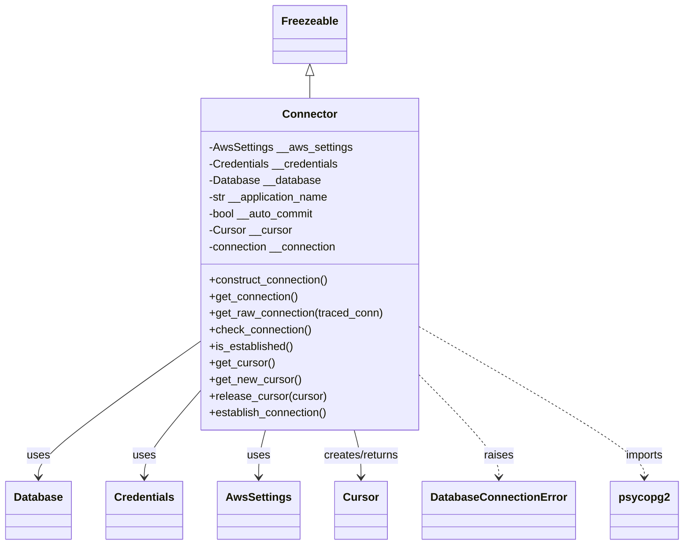
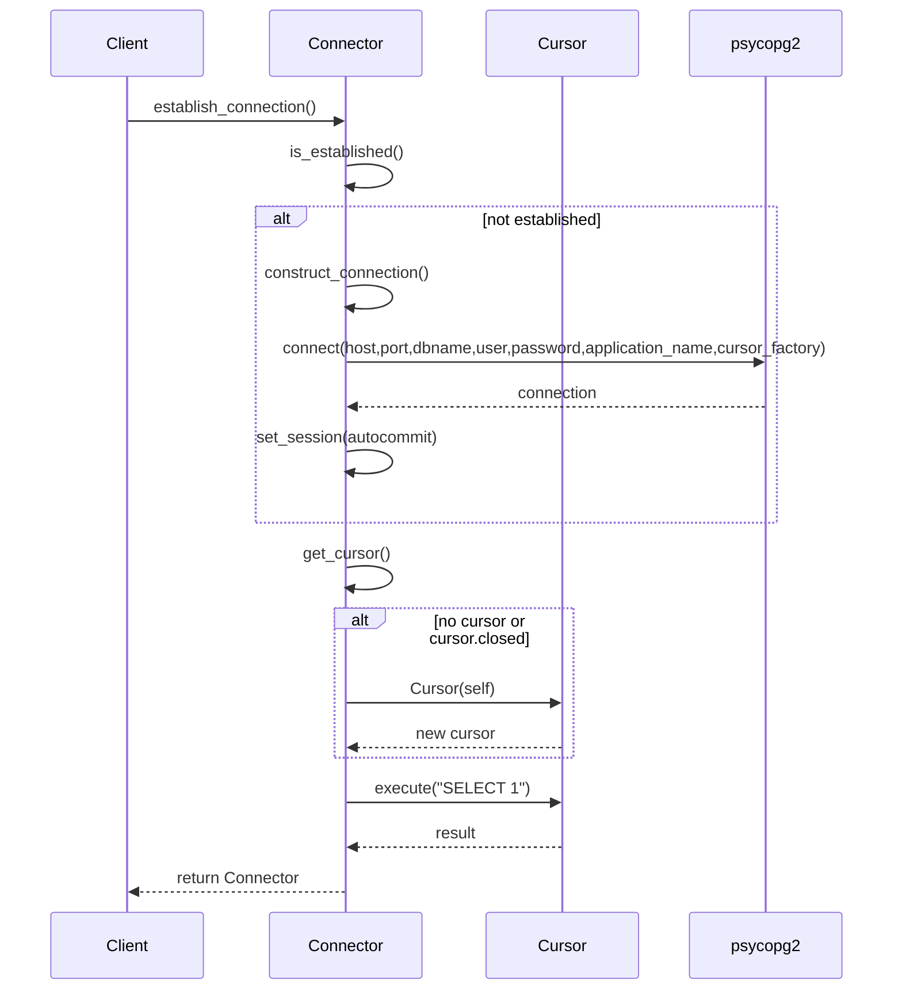

# Diagram: fv_core/fv_framework/python/fv_framework/persistence/sql/postgresql/Connector.py

> Auto-generated by Obscura crawlers

## Diagram 1

### SVG

<svg id="container" width="954.640625" xmlns="http://www.w3.org/2000/svg" class="classDiagram" height="788" viewBox="0 0 954.640625 788" role="graphics-document document" aria-roledescription="class"><g><defs><marker id="container_class-aggregationStart" class="marker aggregation class" refX="18" refY="7" markerWidth="190" markerHeight="240" orient="auto"><path d="M 18,7 L9,13 L1,7 L9,1 Z"></path></marker></defs><defs><marker id="container_class-aggregationEnd" class="marker aggregation class" refX="1" refY="7" markerWidth="20" markerHeight="28" orient="auto"><path d="M 18,7 L9,13 L1,7 L9,1 Z"></path></marker></defs><defs><marker id="container_class-extensionStart" class="marker extension class" refX="18" refY="7" markerWidth="190" markerHeight="240" orient="auto"><path d="M 1,7 L18,13 V 1 Z"></path></marker></defs><defs><marker id="container_class-extensionEnd" class="marker extension class" refX="1" refY="7" markerWidth="20" markerHeight="28" orient="auto"><path d="M 1,1 V 13 L18,7 Z"></path></marker></defs><defs><marker id="container_class-compositionStart" class="marker composition class" refX="18" refY="7" markerWidth="190" markerHeight="240" orient="auto"><path d="M 18,7 L9,13 L1,7 L9,1 Z"></path></marker></defs><defs><marker id="container_class-compositionEnd" class="marker composition class" refX="1" refY="7" markerWidth="20" markerHeight="28" orient="auto"><path d="M 18,7 L9,13 L1,7 L9,1 Z"></path></marker></defs><defs><marker id="container_class-dependencyStart" class="marker dependency class" refX="6" refY="7" markerWidth="190" markerHeight="240" orient="auto"><path d="M 5,7 L9,13 L1,7 L9,1 Z"></path></marker></defs><defs><marker id="container_class-dependencyEnd" class="marker dependency class" refX="13" refY="7" markerWidth="20" markerHeight="28" orient="auto"><path d="M 18,7 L9,13 L14,7 L9,1 Z"></path></marker></defs><defs><marker id="container_class-lollipopStart" class="marker lollipop class" refX="13" refY="7" markerWidth="190" markerHeight="240" orient="auto"><circle stroke="black" fill="transparent" cx="7" cy="7" r="6"></circle></marker></defs><defs><marker id="container_class-lollipopEnd" class="marker lollipop class" refX="1" refY="7" markerWidth="190" markerHeight="240" orient="auto"><circle stroke="black" fill="transparent" cx="7" cy="7" r="6"></circle></marker></defs><g class="root"><g class="clusters"></g><g class="edgePaths"><path d="M435.746,109.25L435.746,110.542C435.746,111.833,435.746,114.417,435.746,119.875C435.746,125.333,435.746,133.667,435.746,137.833L435.746,142" id="id_Freezeable_Connector_1" class="edge-thickness-normal edge-pattern-solid relation" style=";;;" data-edge="true" data-et="edge" data-id="id_Freezeable_Connector_1" data-points="W3sieCI6NDM1Ljc0NjA5Mzc1LCJ5Ijo5Mn0seyJ4Ijo0MzUuNzQ2MDkzNzUsInkiOjExN30seyJ4Ijo0MzUuNzQ2MDkzNzUsInkiOjE0Mn1d" marker-start="url(#container_class-extensionStart)"></path><path d="M278.754,495.967L241.324,523.139C203.893,550.311,129.033,604.656,91.602,636.994C54.172,669.333,54.172,679.667,54.172,684.833L54.172,690" id="id_Connector_Database_2" class="edge-thickness-normal edge-pattern-solid relation" style=";;;" data-edge="true" data-et="edge" data-id="id_Connector_Database_2" data-points="W3sieCI6Mjc4Ljc1MzkwNjI1LCJ5Ijo0OTUuOTY2OTEzMzgzMDg2MX0seyJ4Ijo1NC4xNzE4NzUsInkiOjY1OX0seyJ4Ijo1NC4xNzE4NzUsInkiOjY5Nn1d" marker-end="url(#container_class-dependencyEnd)"></path><path d="M278.754,569.611L266.287,584.509C253.82,599.407,228.887,629.204,216.42,649.268C203.953,669.333,203.953,679.667,203.953,684.833L203.953,690" id="id_Connector_Credentials_3" class="edge-thickness-normal edge-pattern-solid relation" style=";;;" data-edge="true" data-et="edge" data-id="id_Connector_Credentials_3" data-points="W3sieCI6Mjc4Ljc1MzkwNjI1LCJ5Ijo1NjkuNjEwNjc3NjMxOTExNn0seyJ4IjoyMDMuOTUzMTI1LCJ5Ijo2NTl9LHsieCI6MjAzLjk1MzEyNSwieSI6Njk2fV0=" marker-end="url(#container_class-dependencyEnd)"></path><path d="M373.915,622L372.326,628.167C370.738,634.333,367.56,646.667,365.972,658C364.383,669.333,364.383,679.667,364.383,684.833L364.383,690" id="id_Connector_AwsSettings_4" class="edge-thickness-normal edge-pattern-solid relation" style=";;;" data-edge="true" data-et="edge" data-id="id_Connector_AwsSettings_4" data-points="W3sieCI6MzczLjkxNTA5MTk0NDk0NTg2LCJ5Ijo2MjJ9LHsieCI6MzY0LjM4MjgxMjUsInkiOjY1OX0seyJ4IjozNjQuMzgyODEyNSwieSI6Njk2fV0=" marker-end="url(#container_class-dependencyEnd)"></path><path d="M497.577,622L499.166,628.167C500.755,634.333,503.932,646.667,505.521,658C507.109,669.333,507.109,679.667,507.109,684.833L507.109,690" id="id_Connector_Cursor_5" class="edge-thickness-normal edge-pattern-solid relation" style=";;;" data-edge="true" data-et="edge" data-id="id_Connector_Cursor_5" data-points="W3sieCI6NDk3LjU3NzA5NTU1NTA1NDE0LCJ5Ijo2MjJ9LHsieCI6NTA3LjEwOTM3NSwieSI6NjU5fSx7IngiOjUwNy4xMDkzNzUsInkiOjY5Nn1d" marker-end="url(#container_class-dependencyEnd)"></path><path d="M592.738,547.445L610.381,566.038C628.023,584.63,663.309,621.815,680.951,645.574C698.594,669.333,698.594,679.667,698.594,684.833L698.594,690" id="id_Connector_DatabaseConnectionError_6" class="edge-thickness-normal edge-pattern-dashed relation" style=";;;" data-edge="true" data-et="edge" data-id="id_Connector_DatabaseConnectionError_6" data-points="W3sieCI6NTkyLjczODI4MTI1LCJ5Ijo1NDcuNDQ1MDIwNzMxNDcxN30seyJ4Ijo2OTguNTkzNzUsInkiOjY1OX0seyJ4Ijo2OTguNTkzNzUsInkiOjY5Nn1d" marker-end="url(#container_class-dependencyEnd)"></path><path d="M592.738,475.588L644.016,506.157C695.294,536.726,797.85,597.863,849.128,633.598C900.406,669.333,900.406,679.667,900.406,684.833L900.406,690" id="id_Connector_psycopg2_7" class="edge-thickness-normal edge-pattern-dashed relation" style=";;;" data-edge="true" data-et="edge" data-id="id_Connector_psycopg2_7" data-points="W3sieCI6NTkyLjczODI4MTI1LCJ5Ijo0NzUuNTg4NDc2MTIwODIwOH0seyJ4Ijo5MDAuNDA2MjUsInkiOjY1OX0seyJ4Ijo5MDAuNDA2MjUsInkiOjY5Nn1d" marker-end="url(#container_class-dependencyEnd)"></path></g><g class="edgeLabels"><g class="edgeLabel"><g class="label" data-id="id_Freezeable_Connector_1" transform="translate(0, 0)"><foreignObject width="0" height="0">

</foreignObject></g></g><g class="edgeLabel" transform="translate(54.171875, 659)"><g class="label" data-id="id_Connector_Database_2" transform="translate(-16.4921875, -12)"><foreignObject width="32.984375" height="24">

uses

</foreignObject></g></g><g class="edgeLabel" transform="translate(203.953125, 659)"><g class="label" data-id="id_Connector_Credentials_3" transform="translate(-16.4921875, -12)"><foreignObject width="32.984375" height="24">

uses

</foreignObject></g></g><g class="edgeLabel" transform="translate(364.3828125, 659)"><g class="label" data-id="id_Connector_AwsSettings_4" transform="translate(-16.4921875, -12)"><foreignObject width="32.984375" height="24">

uses

</foreignObject></g></g><g class="edgeLabel" transform="translate(507.109375, 659)"><g class="label" data-id="id_Connector_Cursor_5" transform="translate(-56.359375, -12)"><foreignObject width="112.71875" height="24">

creates/returns

</foreignObject></g></g><g class="edgeLabel" transform="translate(698.59375, 659)"><g class="label" data-id="id_Connector_DatabaseConnectionError_6" transform="translate(-21.25, -12)"><foreignObject width="42.5" height="24">

raises

</foreignObject></g></g><g class="edgeLabel" transform="translate(900.40625, 659)"><g class="label" data-id="id_Connector_psycopg2_7" transform="translate(-28.25, -12)"><foreignObject width="56.5" height="24">

imports

</foreignObject></g></g></g><g class="nodes"><g class="node default" id="classId-Connector-0" transform="translate(435.74609375, 382)"><g class="basic label-container"><path d="M-156.9921875 -240 L156.9921875 -240 L156.9921875 240 L-156.9921875 240" stroke="none" stroke-width="0" fill="#ECECFF" style=""></path><path d="M-156.9921875 -240 C-46.47418002673774 -240, 64.04382744652452 -240, 156.9921875 -240 M-156.9921875 -240 C-89.31077726429832 -240, -21.629367028596647 -240, 156.9921875 -240 M156.9921875 -240 C156.9921875 -110.54733566256107, 156.9921875 18.905328674877865, 156.9921875 240 M156.9921875 -240 C156.9921875 -95.54888706934761, 156.9921875 48.90222586130477, 156.9921875 240 M156.9921875 240 C35.437972746323354 240, -86.11624200735329 240, -156.9921875 240 M156.9921875 240 C64.95747682687976 240, -27.07723384624049 240, -156.9921875 240 M-156.9921875 240 C-156.9921875 75.06063440158474, -156.9921875 -89.87873119683053, -156.9921875 -240 M-156.9921875 240 C-156.9921875 70.87333433757343, -156.9921875 -98.25333132485315, -156.9921875 -240" stroke="#9370DB" stroke-width="1.3" fill="none" stroke-dasharray="0 0" style=""></path></g><g class="annotation-group text" transform="translate(0, -216)"></g><g class="label-group text" transform="translate(-37.421875, -216)"><g class="label" style="font-weight: bolder" transform="translate(0,-12)"><foreignObject width="74.84375" height="24">

Connector

</foreignObject></g></g><g class="members-group text" transform="translate(-144.9921875, -168)"><g class="label" style="" transform="translate(0,-12)"><foreignObject width="206.25" height="24">

-AwsSettings __aws_settings

</foreignObject></g><g class="label" style="" transform="translate(0,12)"><foreignObject width="189.375" height="24">

-Credentials __credentials

</foreignObject></g><g class="label" style="" transform="translate(0,36)"><foreignObject width="160.875" height="24">

-Database __database

</foreignObject></g><g class="label" style="" transform="translate(0,60)"><foreignObject width="177.21875" height="24">

-str __application_name

</foreignObject></g><g class="label" style="" transform="translate(0,84)"><foreignObject width="154.703125" height="24">

-bool __auto_commit

</foreignObject></g><g class="label" style="" transform="translate(0,108)"><foreignObject width="119.515625" height="24">

-Cursor __cursor

</foreignObject></g><g class="label" style="" transform="translate(0,132)"><foreignObject width="188.453125" height="24">

-connection __connection

</foreignObject></g></g><g class="methods-group text" transform="translate(-144.9921875, 24)"><g class="label" style="" transform="translate(0,-12)"><foreignObject width="175.375" height="24">

+construct_connection()

</foreignObject></g><g class="label" style="" transform="translate(0,12)"><foreignObject width="129.71875" height="24">

+get_connection()

</foreignObject></g><g class="label" style="" transform="translate(0,36)"><foreignObject width="252.5625" height="24">

+get_raw_connection(traced_conn)

</foreignObject></g><g class="label" style="" transform="translate(0,60)"><foreignObject width="148.75" height="24">

+check_connection()

</foreignObject></g><g class="label" style="" transform="translate(0,84)"><foreignObject width="122.421875" height="24">

+is_established()

</foreignObject></g><g class="label" style="" transform="translate(0,108)"><foreignObject width="94.640625" height="24">

+get_cursor()

</foreignObject></g><g class="label" style="" transform="translate(0,132)"><foreignObject width="132.21875" height="24">

+get_new_cursor()

</foreignObject></g><g class="label" style="" transform="translate(0,156)"><foreignObject width="169.8125" height="24">

+release_cursor(cursor)

</foreignObject></g><g class="label" style="" transform="translate(0,180)"><foreignObject width="173.265625" height="24">

+establish_connection()

</foreignObject></g></g><g class="divider" style=""><path d="M-156.9921875 -192 C-79.44618570845901 -192, -1.9001839169180244 -192, 156.9921875 -192 M-156.9921875 -192 C-37.33337176446625 -192, 82.3254439710675 -192, 156.9921875 -192" stroke="#9370DB" stroke-width="1.3" fill="none" stroke-dasharray="0 0" style=""></path></g><g class="divider" style=""><path d="M-156.9921875 0 C-44.50175511438496 0, 67.98867727123007 0, 156.9921875 0 M-156.9921875 0 C-33.14841815624857 0, 90.69535118750287 0, 156.9921875 0" stroke="#9370DB" stroke-width="1.3" fill="none" stroke-dasharray="0 0" style=""></path></g></g><g class="node default" id="classId-Freezeable-1" transform="translate(435.74609375, 50)"><g class="basic label-container"><path d="M-51.1953125 -42 L51.1953125 -42 L51.1953125 42 L-51.1953125 42" stroke="none" stroke-width="0" fill="#ECECFF" style=""></path><path d="M-51.1953125 -42 C-20.11806826898859 -42, 10.959175962022819 -42, 51.1953125 -42 M-51.1953125 -42 C-20.268339168579327 -42, 10.658634162841345 -42, 51.1953125 -42 M51.1953125 -42 C51.1953125 -15.548937853828605, 51.1953125 10.90212429234279, 51.1953125 42 M51.1953125 -42 C51.1953125 -21.24797733156102, 51.1953125 -0.49595466312204195, 51.1953125 42 M51.1953125 42 C26.83587230241444 42, 2.4764321048288807 42, -51.1953125 42 M51.1953125 42 C24.725877023719857 42, -1.7435584525602863 42, -51.1953125 42 M-51.1953125 42 C-51.1953125 21.311405855668756, -51.1953125 0.622811711337512, -51.1953125 -42 M-51.1953125 42 C-51.1953125 16.578032662555064, -51.1953125 -8.843934674889873, -51.1953125 -42" stroke="#9370DB" stroke-width="1.3" fill="none" stroke-dasharray="0 0" style=""></path></g><g class="annotation-group text" transform="translate(0, -18)"></g><g class="label-group text" transform="translate(-39.1953125, -18)"><g class="label" style="font-weight: bolder" transform="translate(0,-12)"><foreignObject width="78.390625" height="24">

Freezeable

</foreignObject></g></g><g class="members-group text" transform="translate(-39.1953125, 30)"></g><g class="methods-group text" transform="translate(-39.1953125, 60)"></g><g class="divider" style=""><path d="M-51.1953125 6 C-14.6931873567287 6, 21.8089377865426 6, 51.1953125 6 M-51.1953125 6 C-26.588896503057942 6, -1.9824805061158841 6, 51.1953125 6" stroke="#9370DB" stroke-width="1.3" fill="none" stroke-dasharray="0 0" style=""></path></g><g class="divider" style=""><path d="M-51.1953125 24 C-27.56430998209291 24, -3.933307464185823 24, 51.1953125 24 M-51.1953125 24 C-12.323281629616837 24, 26.548749240766327 24, 51.1953125 24" stroke="#9370DB" stroke-width="1.3" fill="none" stroke-dasharray="0 0" style=""></path></g></g><g class="node default" id="classId-Database-2" transform="translate(54.171875, 738)"><g class="basic label-container"><path d="M-46.171875 -42 L46.171875 -42 L46.171875 42 L-46.171875 42" stroke="none" stroke-width="0" fill="#ECECFF" style=""></path><path d="M-46.171875 -42 C-22.614411120364483 -42, 0.9430527592710334 -42, 46.171875 -42 M-46.171875 -42 C-23.958416352577782 -42, -1.7449577051555636 -42, 46.171875 -42 M46.171875 -42 C46.171875 -18.832908819082373, 46.171875 4.3341823618352535, 46.171875 42 M46.171875 -42 C46.171875 -11.986947145968912, 46.171875 18.026105708062175, 46.171875 42 M46.171875 42 C18.91679409526968 42, -8.33828680946064 42, -46.171875 42 M46.171875 42 C10.521359606240772 42, -25.129155787518457 42, -46.171875 42 M-46.171875 42 C-46.171875 15.650702272638071, -46.171875 -10.698595454723858, -46.171875 -42 M-46.171875 42 C-46.171875 21.30821603162219, -46.171875 0.6164320632443818, -46.171875 -42" stroke="#9370DB" stroke-width="1.3" fill="none" stroke-dasharray="0 0" style=""></path></g><g class="annotation-group text" transform="translate(0, -18)"></g><g class="label-group text" transform="translate(-34.171875, -18)"><g class="label" style="font-weight: bolder" transform="translate(0,-12)"><foreignObject width="68.34375" height="24">

Database

</foreignObject></g></g><g class="members-group text" transform="translate(-34.171875, 30)"></g><g class="methods-group text" transform="translate(-34.171875, 60)"></g><g class="divider" style=""><path d="M-46.171875 6 C-10.860533719216654 6, 24.45080756156669 6, 46.171875 6 M-46.171875 6 C-15.460298961998795 6, 15.25127707600241 6, 46.171875 6" stroke="#9370DB" stroke-width="1.3" fill="none" stroke-dasharray="0 0" style=""></path></g><g class="divider" style=""><path d="M-46.171875 24 C-27.076449815420002 24, -7.981024630840004 24, 46.171875 24 M-46.171875 24 C-9.564331283659904 24, 27.043212432680193 24, 46.171875 24" stroke="#9370DB" stroke-width="1.3" fill="none" stroke-dasharray="0 0" style=""></path></g></g><g class="node default" id="classId-Credentials-3" transform="translate(203.953125, 738)"><g class="basic label-container"><path d="M-53.609375 -42 L53.609375 -42 L53.609375 42 L-53.609375 42" stroke="none" stroke-width="0" fill="#ECECFF" style=""></path><path d="M-53.609375 -42 C-14.71092309276061 -42, 24.18752881447878 -42, 53.609375 -42 M-53.609375 -42 C-11.30655099332651 -42, 30.99627301334698 -42, 53.609375 -42 M53.609375 -42 C53.609375 -24.683572411378154, 53.609375 -7.367144822756309, 53.609375 42 M53.609375 -42 C53.609375 -20.08376775664621, 53.609375 1.832464486707579, 53.609375 42 M53.609375 42 C19.144889406029456 42, -15.319596187941087 42, -53.609375 42 M53.609375 42 C17.035403578161315 42, -19.53856784367737 42, -53.609375 42 M-53.609375 42 C-53.609375 9.727137467665962, -53.609375 -22.545725064668076, -53.609375 -42 M-53.609375 42 C-53.609375 8.727194499385568, -53.609375 -24.545611001228863, -53.609375 -42" stroke="#9370DB" stroke-width="1.3" fill="none" stroke-dasharray="0 0" style=""></path></g><g class="annotation-group text" transform="translate(0, -18)"></g><g class="label-group text" transform="translate(-41.609375, -18)"><g class="label" style="font-weight: bolder" transform="translate(0,-12)"><foreignObject width="83.21875" height="24">

Credentials

</foreignObject></g></g><g class="members-group text" transform="translate(-41.609375, 30)"></g><g class="methods-group text" transform="translate(-41.609375, 60)"></g><g class="divider" style=""><path d="M-53.609375 6 C-19.290298734219434 6, 15.028777531561133 6, 53.609375 6 M-53.609375 6 C-11.690250075971434 6, 30.22887484805713 6, 53.609375 6" stroke="#9370DB" stroke-width="1.3" fill="none" stroke-dasharray="0 0" style=""></path></g><g class="divider" style=""><path d="M-53.609375 24 C-30.116384572340774 24, -6.623394144681548 24, 53.609375 24 M-53.609375 24 C-24.410390673474176 24, 4.788593653051649 24, 53.609375 24" stroke="#9370DB" stroke-width="1.3" fill="none" stroke-dasharray="0 0" style=""></path></g></g><g class="node default" id="classId-AwsSettings-4" transform="translate(364.3828125, 738)"><g class="basic label-container"><path d="M-56.8203125 -42 L56.8203125 -42 L56.8203125 42 L-56.8203125 42" stroke="none" stroke-width="0" fill="#ECECFF" style=""></path><path d="M-56.8203125 -42 C-13.439922448079017 -42, 29.940467603841967 -42, 56.8203125 -42 M-56.8203125 -42 C-21.8861858404929 -42, 13.047940819014201 -42, 56.8203125 -42 M56.8203125 -42 C56.8203125 -12.3320948049792, 56.8203125 17.3358103900416, 56.8203125 42 M56.8203125 -42 C56.8203125 -13.254824217904204, 56.8203125 15.490351564191592, 56.8203125 42 M56.8203125 42 C19.659391175621643 42, -17.501530148756714 42, -56.8203125 42 M56.8203125 42 C24.925606356662566 42, -6.969099786674867 42, -56.8203125 42 M-56.8203125 42 C-56.8203125 16.403961765901087, -56.8203125 -9.192076468197826, -56.8203125 -42 M-56.8203125 42 C-56.8203125 19.546498457319075, -56.8203125 -2.9070030853618505, -56.8203125 -42" stroke="#9370DB" stroke-width="1.3" fill="none" stroke-dasharray="0 0" style=""></path></g><g class="annotation-group text" transform="translate(0, -18)"></g><g class="label-group text" transform="translate(-44.8203125, -18)"><g class="label" style="font-weight: bolder" transform="translate(0,-12)"><foreignObject width="89.640625" height="24">

AwsSettings

</foreignObject></g></g><g class="members-group text" transform="translate(-44.8203125, 30)"></g><g class="methods-group text" transform="translate(-44.8203125, 60)"></g><g class="divider" style=""><path d="M-56.8203125 6 C-33.07397986099268 6, -9.327647221985366 6, 56.8203125 6 M-56.8203125 6 C-32.904658178609004 6, -8.989003857218009 6, 56.8203125 6" stroke="#9370DB" stroke-width="1.3" fill="none" stroke-dasharray="0 0" style=""></path></g><g class="divider" style=""><path d="M-56.8203125 24 C-25.26470997271836 24, 6.290892554563278 24, 56.8203125 24 M-56.8203125 24 C-12.130051671482171 24, 32.56020915703566 24, 56.8203125 24" stroke="#9370DB" stroke-width="1.3" fill="none" stroke-dasharray="0 0" style=""></path></g></g><g class="node default" id="classId-Cursor-5" transform="translate(507.109375, 738)"><g class="basic label-container"><path d="M-35.90625 -42 L35.90625 -42 L35.90625 42 L-35.90625 42" stroke="none" stroke-width="0" fill="#ECECFF" style=""></path><path d="M-35.90625 -42 C-14.119715747740479 -42, 7.666818504519043 -42, 35.90625 -42 M-35.90625 -42 C-16.265514282282567 -42, 3.3752214354348666 -42, 35.90625 -42 M35.90625 -42 C35.90625 -13.900229003829597, 35.90625 14.199541992340805, 35.90625 42 M35.90625 -42 C35.90625 -14.744472549957642, 35.90625 12.511054900084716, 35.90625 42 M35.90625 42 C10.531488847506786 42, -14.843272304986428 42, -35.90625 42 M35.90625 42 C15.98979485599244 42, -3.926660288015121 42, -35.90625 42 M-35.90625 42 C-35.90625 20.43695778907101, -35.90625 -1.126084421857982, -35.90625 -42 M-35.90625 42 C-35.90625 17.500871628971606, -35.90625 -6.998256742056789, -35.90625 -42" stroke="#9370DB" stroke-width="1.3" fill="none" stroke-dasharray="0 0" style=""></path></g><g class="annotation-group text" transform="translate(0, -18)"></g><g class="label-group text" transform="translate(-23.90625, -18)"><g class="label" style="font-weight: bolder" transform="translate(0,-12)"><foreignObject width="47.8125" height="24">

Cursor

</foreignObject></g></g><g class="members-group text" transform="translate(-23.90625, 30)"></g><g class="methods-group text" transform="translate(-23.90625, 60)"></g><g class="divider" style=""><path d="M-35.90625 6 C-19.555987331262866 6, -3.205724662525732 6, 35.90625 6 M-35.90625 6 C-16.942525006183118 6, 2.0211999876337643 6, 35.90625 6" stroke="#9370DB" stroke-width="1.3" fill="none" stroke-dasharray="0 0" style=""></path></g><g class="divider" style=""><path d="M-35.90625 24 C-10.11959839024776 24, 15.667053219504481 24, 35.90625 24 M-35.90625 24 C-17.762167344357728 24, 0.38191531128454415 24, 35.90625 24" stroke="#9370DB" stroke-width="1.3" fill="none" stroke-dasharray="0 0" style=""></path></g></g><g class="node default" id="classId-DatabaseConnectionError-6" transform="translate(698.59375, 738)"><g class="basic label-container"><path d="M-105.578125 -42 L105.578125 -42 L105.578125 42 L-105.578125 42" stroke="none" stroke-width="0" fill="#ECECFF" style=""></path><path d="M-105.578125 -42 C-58.46491777149898 -42, -11.351710542997964 -42, 105.578125 -42 M-105.578125 -42 C-51.947916452196516 -42, 1.682292095606968 -42, 105.578125 -42 M105.578125 -42 C105.578125 -22.311194677320028, 105.578125 -2.622389354640056, 105.578125 42 M105.578125 -42 C105.578125 -16.43473460582783, 105.578125 9.130530788344338, 105.578125 42 M105.578125 42 C57.91680285990942 42, 10.255480719818834 42, -105.578125 42 M105.578125 42 C29.63634476485238 42, -46.30543547029524 42, -105.578125 42 M-105.578125 42 C-105.578125 18.950134490902695, -105.578125 -4.0997310181946105, -105.578125 -42 M-105.578125 42 C-105.578125 19.391749723361126, -105.578125 -3.216500553277747, -105.578125 -42" stroke="#9370DB" stroke-width="1.3" fill="none" stroke-dasharray="0 0" style=""></path></g><g class="annotation-group text" transform="translate(0, -18)"></g><g class="label-group text" transform="translate(-93.578125, -18)"><g class="label" style="font-weight: bolder" transform="translate(0,-12)"><foreignObject width="187.15625" height="24">

DatabaseConnectionError

</foreignObject></g></g><g class="members-group text" transform="translate(-93.578125, 30)"></g><g class="methods-group text" transform="translate(-93.578125, 60)"></g><g class="divider" style=""><path d="M-105.578125 6 C-29.006371229662292 6, 47.565382540675415 6, 105.578125 6 M-105.578125 6 C-44.99366916638288 6, 15.59078666723424 6, 105.578125 6" stroke="#9370DB" stroke-width="1.3" fill="none" stroke-dasharray="0 0" style=""></path></g><g class="divider" style=""><path d="M-105.578125 24 C-40.00470629319808 24, 25.568712413603834 24, 105.578125 24 M-105.578125 24 C-56.917152709686 24, -8.256180419372 24, 105.578125 24" stroke="#9370DB" stroke-width="1.3" fill="none" stroke-dasharray="0 0" style=""></path></g></g><g class="node default" id="classId-psycopg2-7" transform="translate(900.40625, 738)"><g class="basic label-container"><path d="M-46.234375 -42 L46.234375 -42 L46.234375 42 L-46.234375 42" stroke="none" stroke-width="0" fill="#ECECFF" style=""></path><path d="M-46.234375 -42 C-12.216614787937083 -42, 21.801145424125835 -42, 46.234375 -42 M-46.234375 -42 C-20.669034294075445 -42, 4.89630641184911 -42, 46.234375 -42 M46.234375 -42 C46.234375 -15.02332096525182, 46.234375 11.95335806949636, 46.234375 42 M46.234375 -42 C46.234375 -25.14735716385738, 46.234375 -8.294714327714757, 46.234375 42 M46.234375 42 C11.362978023473516 42, -23.508418953052967 42, -46.234375 42 M46.234375 42 C13.632814389039744 42, -18.96874622192051 42, -46.234375 42 M-46.234375 42 C-46.234375 17.424509964199416, -46.234375 -7.150980071601168, -46.234375 -42 M-46.234375 42 C-46.234375 14.850934617011756, -46.234375 -12.298130765976488, -46.234375 -42" stroke="#9370DB" stroke-width="1.3" fill="none" stroke-dasharray="0 0" style=""></path></g><g class="annotation-group text" transform="translate(0, -18)"></g><g class="label-group text" transform="translate(-34.234375, -18)"><g class="label" style="font-weight: bolder" transform="translate(0,-12)"><foreignObject width="68.46875" height="24">

psycopg2

</foreignObject></g></g><g class="members-group text" transform="translate(-34.234375, 30)"></g><g class="methods-group text" transform="translate(-34.234375, 60)"></g><g class="divider" style=""><path d="M-46.234375 6 C-24.882548221953673 6, -3.530721443907346 6, 46.234375 6 M-46.234375 6 C-17.13496196627635 6, 11.9644510674473 6, 46.234375 6" stroke="#9370DB" stroke-width="1.3" fill="none" stroke-dasharray="0 0" style=""></path></g><g class="divider" style=""><path d="M-46.234375 24 C-13.16550056242837 24, 19.90337387514326 24, 46.234375 24 M-46.234375 24 C-24.943476926979894 24, -3.6525788539597883 24, 46.234375 24" stroke="#9370DB" stroke-width="1.3" fill="none" stroke-dasharray="0 0" style=""></path></g></g></g></g></g></svg>

## Diagram 2

### SVG

<svg id="container" width="896" xmlns="http://www.w3.org/2000/svg" height="1025" viewBox="-50 -10 896 1025" role="graphics-document document" aria-roledescription="sequence"><g><rect x="646" y="939" fill="#eaeaea" stroke="#666" width="150" height="65" name="psycopg2" rx="3" ry="3" class="actor actor-bottom"></rect><text x="721" y="971.5" dominant-baseline="central" alignment-baseline="central" class="actor actor-box" style="text-anchor: middle; font-size: 16px; font-weight: 400;"><tspan x="721" dy="0">psycopg2</tspan></text></g><g><rect x="446" y="939" fill="#eaeaea" stroke="#666" width="150" height="65" name="Cursor" rx="3" ry="3" class="actor actor-bottom"></rect><text x="521" y="971.5" dominant-baseline="central" alignment-baseline="central" class="actor actor-box" style="text-anchor: middle; font-size: 16px; font-weight: 400;"><tspan x="521" dy="0">Cursor</tspan></text></g><g><rect x="235" y="939" fill="#eaeaea" stroke="#666" width="150" height="65" name="Connector" rx="3" ry="3" class="actor actor-bottom"></rect><text x="310" y="971.5" dominant-baseline="central" alignment-baseline="central" class="actor actor-box" style="text-anchor: middle; font-size: 16px; font-weight: 400;"><tspan x="310" dy="0">Connector</tspan></text></g><g><rect x="0" y="939" fill="#eaeaea" stroke="#666" width="150" height="65" name="Client" rx="3" ry="3" class="actor actor-bottom"></rect><text x="75" y="971.5" dominant-baseline="central" alignment-baseline="central" class="actor actor-box" style="text-anchor: middle; font-size: 16px; font-weight: 400;"><tspan x="75" dy="0">Client</tspan></text></g><g><line id="actor3" x1="721" y1="65" x2="721" y2="939" class="actor-line 200" stroke-width="0.5px" stroke="#999" name="psycopg2"></line><g id="root-3"><rect x="646" y="0" fill="#eaeaea" stroke="#666" width="150" height="65" name="psycopg2" rx="3" ry="3" class="actor actor-top"></rect><text x="721" y="32.5" dominant-baseline="central" alignment-baseline="central" class="actor actor-box" style="text-anchor: middle; font-size: 16px; font-weight: 400;"><tspan x="721" dy="0">psycopg2</tspan></text></g></g><g><line id="actor2" x1="521" y1="65" x2="521" y2="939" class="actor-line 200" stroke-width="0.5px" stroke="#999" name="Cursor"></line><g id="root-2"><rect x="446" y="0" fill="#eaeaea" stroke="#666" width="150" height="65" name="Cursor" rx="3" ry="3" class="actor actor-top"></rect><text x="521" y="32.5" dominant-baseline="central" alignment-baseline="central" class="actor actor-box" style="text-anchor: middle; font-size: 16px; font-weight: 400;"><tspan x="521" dy="0">Cursor</tspan></text></g></g><g><line id="actor1" x1="310" y1="65" x2="310" y2="939" class="actor-line 200" stroke-width="0.5px" stroke="#999" name="Connector"></line><g id="root-1"><rect x="235" y="0" fill="#eaeaea" stroke="#666" width="150" height="65" name="Connector" rx="3" ry="3" class="actor actor-top"></rect><text x="310" y="32.5" dominant-baseline="central" alignment-baseline="central" class="actor actor-box" style="text-anchor: middle; font-size: 16px; font-weight: 400;"><tspan x="310" dy="0">Connector</tspan></text></g></g><g><line id="actor0" x1="75" y1="65" x2="75" y2="939" class="actor-line 200" stroke-width="0.5px" stroke="#999" name="Client"></line><g id="root-0"><rect x="0" y="0" fill="#eaeaea" stroke="#666" width="150" height="65" name="Client" rx="3" ry="3" class="actor actor-top"></rect><text x="75" y="32.5" dominant-baseline="central" alignment-baseline="central" class="actor actor-box" style="text-anchor: middle; font-size: 16px; font-weight: 400;"><tspan x="75" dy="0">Client</tspan></text></g></g><g></g><defs><symbol id="computer" width="24" height="24"><path transform="scale(.5)" d="M2 2v13h20v-13h-20zm18 11h-16v-9h16v9zm-10.228 6l.466-1h3.524l.467 1h-4.457zm14.228 3h-24l2-6h2.104l-1.33 4h18.45l-1.297-4h2.073l2 6zm-5-10h-14v-7h14v7z"></path></symbol></defs><defs><symbol id="database" fill-rule="evenodd" clip-rule="evenodd"><path transform="scale(.5)" d="M12.258.001l.256.004.255.005.253.008.251.01.249.012.247.015.246.016.242.019.241.02.239.023.236.024.233.027.231.028.229.031.225.032.223.034.22.036.217.038.214.04.211.041.208.043.205.045.201.046.198.048.194.05.191.051.187.053.183.054.18.056.175.057.172.059.168.06.163.061.16.063.155.064.15.066.074.033.073.033.071.034.07.034.069.035.068.035.067.035.066.035.064.036.064.036.062.036.06.036.06.037.058.037.058.037.055.038.055.038.053.038.052.038.051.039.05.039.048.039.047.039.045.04.044.04.043.04.041.04.04.041.039.041.037.041.036.041.034.041.033.042.032.042.03.042.029.042.027.042.026.043.024.043.023.043.021.043.02.043.018.044.017.043.015.044.013.044.012.044.011.045.009.044.007.045.006.045.004.045.002.045.001.045v17l-.001.045-.002.045-.004.045-.006.045-.007.045-.009.044-.011.045-.012.044-.013.044-.015.044-.017.043-.018.044-.02.043-.021.043-.023.043-.024.043-.026.043-.027.042-.029.042-.03.042-.032.042-.033.042-.034.041-.036.041-.037.041-.039.041-.04.041-.041.04-.043.04-.044.04-.045.04-.047.039-.048.039-.05.039-.051.039-.052.038-.053.038-.055.038-.055.038-.058.037-.058.037-.06.037-.06.036-.062.036-.064.036-.064.036-.066.035-.067.035-.068.035-.069.035-.07.034-.071.034-.073.033-.074.033-.15.066-.155.064-.16.063-.163.061-.168.06-.172.059-.175.057-.18.056-.183.054-.187.053-.191.051-.194.05-.198.048-.201.046-.205.045-.208.043-.211.041-.214.04-.217.038-.22.036-.223.034-.225.032-.229.031-.231.028-.233.027-.236.024-.239.023-.241.02-.242.019-.246.016-.247.015-.249.012-.251.01-.253.008-.255.005-.256.004-.258.001-.258-.001-.256-.004-.255-.005-.253-.008-.251-.01-.249-.012-.247-.015-.245-.016-.243-.019-.241-.02-.238-.023-.236-.024-.234-.027-.231-.028-.228-.031-.226-.032-.223-.034-.22-.036-.217-.038-.214-.04-.211-.041-.208-.043-.204-.045-.201-.046-.198-.048-.195-.05-.19-.051-.187-.053-.184-.054-.179-.056-.176-.057-.172-.059-.167-.06-.164-.061-.159-.063-.155-.064-.151-.066-.074-.033-.072-.033-.072-.034-.07-.034-.069-.035-.068-.035-.067-.035-.066-.035-.064-.036-.063-.036-.062-.036-.061-.036-.06-.037-.058-.037-.057-.037-.056-.038-.055-.038-.053-.038-.052-.038-.051-.039-.049-.039-.049-.039-.046-.039-.046-.04-.044-.04-.043-.04-.041-.04-.04-.041-.039-.041-.037-.041-.036-.041-.034-.041-.033-.042-.032-.042-.03-.042-.029-.042-.027-.042-.026-.043-.024-.043-.023-.043-.021-.043-.02-.043-.018-.044-.017-.043-.015-.044-.013-.044-.012-.044-.011-.045-.009-.044-.007-.045-.006-.045-.004-.045-.002-.045-.001-.045v-17l.001-.045.002-.045.004-.045.006-.045.007-.045.009-.044.011-.045.012-.044.013-.044.015-.044.017-.043.018-.044.02-.043.021-.043.023-.043.024-.043.026-.043.027-.042.029-.042.03-.042.032-.042.033-.042.034-.041.036-.041.037-.041.039-.041.04-.041.041-.04.043-.04.044-.04.046-.04.046-.039.049-.039.049-.039.051-.039.052-.038.053-.038.055-.038.056-.038.057-.037.058-.037.06-.037.061-.036.062-.036.063-.036.064-.036.066-.035.067-.035.068-.035.069-.035.07-.034.072-.034.072-.033.074-.033.151-.066.155-.064.159-.063.164-.061.167-.06.172-.059.176-.057.179-.056.184-.054.187-.053.19-.051.195-.05.198-.048.201-.046.204-.045.208-.043.211-.041.214-.04.217-.038.22-.036.223-.034.226-.032.228-.031.231-.028.234-.027.236-.024.238-.023.241-.02.243-.019.245-.016.247-.015.249-.012.251-.01.253-.008.255-.005.256-.004.258-.001.258.001zm-9.258 20.499v.01l.001.021.003.021.004.022.005.021.006.022.007.022.009.023.01.022.011.023.012.023.013.023.015.023.016.024.017.023.018.024.019.024.021.024.022.025.023.024.024.025.052.049.056.05.061.051.066.051.07.051.075.051.079.052.084.052.088.052.092.052.097.052.102.051.105.052.11.052.114.051.119.051.123.051.127.05.131.05.135.05.139.048.144.049.147.047.152.047.155.047.16.045.163.045.167.043.171.043.176.041.178.041.183.039.187.039.19.037.194.035.197.035.202.033.204.031.209.03.212.029.216.027.219.025.222.024.226.021.23.02.233.018.236.016.24.015.243.012.246.01.249.008.253.005.256.004.259.001.26-.001.257-.004.254-.005.25-.008.247-.011.244-.012.241-.014.237-.016.233-.018.231-.021.226-.021.224-.024.22-.026.216-.027.212-.028.21-.031.205-.031.202-.034.198-.034.194-.036.191-.037.187-.039.183-.04.179-.04.175-.042.172-.043.168-.044.163-.045.16-.046.155-.046.152-.047.148-.048.143-.049.139-.049.136-.05.131-.05.126-.05.123-.051.118-.052.114-.051.11-.052.106-.052.101-.052.096-.052.092-.052.088-.053.083-.051.079-.052.074-.052.07-.051.065-.051.06-.051.056-.05.051-.05.023-.024.023-.025.021-.024.02-.024.019-.024.018-.024.017-.024.015-.023.014-.024.013-.023.012-.023.01-.023.01-.022.008-.022.006-.022.006-.022.004-.022.004-.021.001-.021.001-.021v-4.127l-.077.055-.08.053-.083.054-.085.053-.087.052-.09.052-.093.051-.095.05-.097.05-.1.049-.102.049-.105.048-.106.047-.109.047-.111.046-.114.045-.115.045-.118.044-.12.043-.122.042-.124.042-.126.041-.128.04-.13.04-.132.038-.134.038-.135.037-.138.037-.139.035-.142.035-.143.034-.144.033-.147.032-.148.031-.15.03-.151.03-.153.029-.154.027-.156.027-.158.026-.159.025-.161.024-.162.023-.163.022-.165.021-.166.02-.167.019-.169.018-.169.017-.171.016-.173.015-.173.014-.175.013-.175.012-.177.011-.178.01-.179.008-.179.008-.181.006-.182.005-.182.004-.184.003-.184.002h-.37l-.184-.002-.184-.003-.182-.004-.182-.005-.181-.006-.179-.008-.179-.008-.178-.01-.176-.011-.176-.012-.175-.013-.173-.014-.172-.015-.171-.016-.17-.017-.169-.018-.167-.019-.166-.02-.165-.021-.163-.022-.162-.023-.161-.024-.159-.025-.157-.026-.156-.027-.155-.027-.153-.029-.151-.03-.15-.03-.148-.031-.146-.032-.145-.033-.143-.034-.141-.035-.14-.035-.137-.037-.136-.037-.134-.038-.132-.038-.13-.04-.128-.04-.126-.041-.124-.042-.122-.042-.12-.044-.117-.043-.116-.045-.113-.045-.112-.046-.109-.047-.106-.047-.105-.048-.102-.049-.1-.049-.097-.05-.095-.05-.093-.052-.09-.051-.087-.052-.085-.053-.083-.054-.08-.054-.077-.054v4.127zm0-5.654v.011l.001.021.003.021.004.021.005.022.006.022.007.022.009.022.01.022.011.023.012.023.013.023.015.024.016.023.017.024.018.024.019.024.021.024.022.024.023.025.024.024.052.05.056.05.061.05.066.051.07.051.075.052.079.051.084.052.088.052.092.052.097.052.102.052.105.052.11.051.114.051.119.052.123.05.127.051.131.05.135.049.139.049.144.048.147.048.152.047.155.046.16.045.163.045.167.044.171.042.176.042.178.04.183.04.187.038.19.037.194.036.197.034.202.033.204.032.209.03.212.028.216.027.219.025.222.024.226.022.23.02.233.018.236.016.24.014.243.012.246.01.249.008.253.006.256.003.259.001.26-.001.257-.003.254-.006.25-.008.247-.01.244-.012.241-.015.237-.016.233-.018.231-.02.226-.022.224-.024.22-.025.216-.027.212-.029.21-.03.205-.032.202-.033.198-.035.194-.036.191-.037.187-.039.183-.039.179-.041.175-.042.172-.043.168-.044.163-.045.16-.045.155-.047.152-.047.148-.048.143-.048.139-.05.136-.049.131-.05.126-.051.123-.051.118-.051.114-.052.11-.052.106-.052.101-.052.096-.052.092-.052.088-.052.083-.052.079-.052.074-.051.07-.052.065-.051.06-.05.056-.051.051-.049.023-.025.023-.024.021-.025.02-.024.019-.024.018-.024.017-.024.015-.023.014-.023.013-.024.012-.022.01-.023.01-.023.008-.022.006-.022.006-.022.004-.021.004-.022.001-.021.001-.021v-4.139l-.077.054-.08.054-.083.054-.085.052-.087.053-.09.051-.093.051-.095.051-.097.05-.1.049-.102.049-.105.048-.106.047-.109.047-.111.046-.114.045-.115.044-.118.044-.12.044-.122.042-.124.042-.126.041-.128.04-.13.039-.132.039-.134.038-.135.037-.138.036-.139.036-.142.035-.143.033-.144.033-.147.033-.148.031-.15.03-.151.03-.153.028-.154.028-.156.027-.158.026-.159.025-.161.024-.162.023-.163.022-.165.021-.166.02-.167.019-.169.018-.169.017-.171.016-.173.015-.173.014-.175.013-.175.012-.177.011-.178.009-.179.009-.179.007-.181.007-.182.005-.182.004-.184.003-.184.002h-.37l-.184-.002-.184-.003-.182-.004-.182-.005-.181-.007-.179-.007-.179-.009-.178-.009-.176-.011-.176-.012-.175-.013-.173-.014-.172-.015-.171-.016-.17-.017-.169-.018-.167-.019-.166-.02-.165-.021-.163-.022-.162-.023-.161-.024-.159-.025-.157-.026-.156-.027-.155-.028-.153-.028-.151-.03-.15-.03-.148-.031-.146-.033-.145-.033-.143-.033-.141-.035-.14-.036-.137-.036-.136-.037-.134-.038-.132-.039-.13-.039-.128-.04-.126-.041-.124-.042-.122-.043-.12-.043-.117-.044-.116-.044-.113-.046-.112-.046-.109-.046-.106-.047-.105-.048-.102-.049-.1-.049-.097-.05-.095-.051-.093-.051-.09-.051-.087-.053-.085-.052-.083-.054-.08-.054-.077-.054v4.139zm0-5.666v.011l.001.02.003.022.004.021.005.022.006.021.007.022.009.023.01.022.011.023.012.023.013.023.015.023.016.024.017.024.018.023.019.024.021.025.022.024.023.024.024.025.052.05.056.05.061.05.066.051.07.051.075.052.079.051.084.052.088.052.092.052.097.052.102.052.105.051.11.052.114.051.119.051.123.051.127.05.131.05.135.05.139.049.144.048.147.048.152.047.155.046.16.045.163.045.167.043.171.043.176.042.178.04.183.04.187.038.19.037.194.036.197.034.202.033.204.032.209.03.212.028.216.027.219.025.222.024.226.021.23.02.233.018.236.017.24.014.243.012.246.01.249.008.253.006.256.003.259.001.26-.001.257-.003.254-.006.25-.008.247-.01.244-.013.241-.014.237-.016.233-.018.231-.02.226-.022.224-.024.22-.025.216-.027.212-.029.21-.03.205-.032.202-.033.198-.035.194-.036.191-.037.187-.039.183-.039.179-.041.175-.042.172-.043.168-.044.163-.045.16-.045.155-.047.152-.047.148-.048.143-.049.139-.049.136-.049.131-.051.126-.05.123-.051.118-.052.114-.051.11-.052.106-.052.101-.052.096-.052.092-.052.088-.052.083-.052.079-.052.074-.052.07-.051.065-.051.06-.051.056-.05.051-.049.023-.025.023-.025.021-.024.02-.024.019-.024.018-.024.017-.024.015-.023.014-.024.013-.023.012-.023.01-.022.01-.023.008-.022.006-.022.006-.022.004-.022.004-.021.001-.021.001-.021v-4.153l-.077.054-.08.054-.083.053-.085.053-.087.053-.09.051-.093.051-.095.051-.097.05-.1.049-.102.048-.105.048-.106.048-.109.046-.111.046-.114.046-.115.044-.118.044-.12.043-.122.043-.124.042-.126.041-.128.04-.13.039-.132.039-.134.038-.135.037-.138.036-.139.036-.142.034-.143.034-.144.033-.147.032-.148.032-.15.03-.151.03-.153.028-.154.028-.156.027-.158.026-.159.024-.161.024-.162.023-.163.023-.165.021-.166.02-.167.019-.169.018-.169.017-.171.016-.173.015-.173.014-.175.013-.175.012-.177.01-.178.01-.179.009-.179.007-.181.006-.182.006-.182.004-.184.003-.184.001-.185.001-.185-.001-.184-.001-.184-.003-.182-.004-.182-.006-.181-.006-.179-.007-.179-.009-.178-.01-.176-.01-.176-.012-.175-.013-.173-.014-.172-.015-.171-.016-.17-.017-.169-.018-.167-.019-.166-.02-.165-.021-.163-.023-.162-.023-.161-.024-.159-.024-.157-.026-.156-.027-.155-.028-.153-.028-.151-.03-.15-.03-.148-.032-.146-.032-.145-.033-.143-.034-.141-.034-.14-.036-.137-.036-.136-.037-.134-.038-.132-.039-.13-.039-.128-.041-.126-.041-.124-.041-.122-.043-.12-.043-.117-.044-.116-.044-.113-.046-.112-.046-.109-.046-.106-.048-.105-.048-.102-.048-.1-.05-.097-.049-.095-.051-.093-.051-.09-.052-.087-.052-.085-.053-.083-.053-.08-.054-.077-.054v4.153zm8.74-8.179l-.257.004-.254.005-.25.008-.247.011-.244.012-.241.014-.237.016-.233.018-.231.021-.226.022-.224.023-.22.026-.216.027-.212.028-.21.031-.205.032-.202.033-.198.034-.194.036-.191.038-.187.038-.183.04-.179.041-.175.042-.172.043-.168.043-.163.045-.16.046-.155.046-.152.048-.148.048-.143.048-.139.049-.136.05-.131.05-.126.051-.123.051-.118.051-.114.052-.11.052-.106.052-.101.052-.096.052-.092.052-.088.052-.083.052-.079.052-.074.051-.07.052-.065.051-.06.05-.056.05-.051.05-.023.025-.023.024-.021.024-.02.025-.019.024-.018.024-.017.023-.015.024-.014.023-.013.023-.012.023-.01.023-.01.022-.008.022-.006.023-.006.021-.004.022-.004.021-.001.021-.001.021.001.021.001.021.004.021.004.022.006.021.006.023.008.022.01.022.01.023.012.023.013.023.014.023.015.024.017.023.018.024.019.024.02.025.021.024.023.024.023.025.051.05.056.05.06.05.065.051.07.052.074.051.079.052.083.052.088.052.092.052.096.052.101.052.106.052.11.052.114.052.118.051.123.051.126.051.131.05.136.05.139.049.143.048.148.048.152.048.155.046.16.046.163.045.168.043.172.043.175.042.179.041.183.04.187.038.191.038.194.036.198.034.202.033.205.032.21.031.212.028.216.027.22.026.224.023.226.022.231.021.233.018.237.016.241.014.244.012.247.011.25.008.254.005.257.004.26.001.26-.001.257-.004.254-.005.25-.008.247-.011.244-.012.241-.014.237-.016.233-.018.231-.021.226-.022.224-.023.22-.026.216-.027.212-.028.21-.031.205-.032.202-.033.198-.034.194-.036.191-.038.187-.038.183-.04.179-.041.175-.042.172-.043.168-.043.163-.045.16-.046.155-.046.152-.048.148-.048.143-.048.139-.049.136-.05.131-.05.126-.051.123-.051.118-.051.114-.052.11-.052.106-.052.101-.052.096-.052.092-.052.088-.052.083-.052.079-.052.074-.051.07-.052.065-.051.06-.05.056-.05.051-.05.023-.025.023-.024.021-.024.02-.025.019-.024.018-.024.017-.023.015-.024.014-.023.013-.023.012-.023.01-.023.01-.022.008-.022.006-.023.006-.021.004-.022.004-.021.001-.021.001-.021-.001-.021-.001-.021-.004-.021-.004-.022-.006-.021-.006-.023-.008-.022-.01-.022-.01-.023-.012-.023-.013-.023-.014-.023-.015-.024-.017-.023-.018-.024-.019-.024-.02-.025-.021-.024-.023-.024-.023-.025-.051-.05-.056-.05-.06-.05-.065-.051-.07-.052-.074-.051-.079-.052-.083-.052-.088-.052-.092-.052-.096-.052-.101-.052-.106-.052-.11-.052-.114-.052-.118-.051-.123-.051-.126-.051-.131-.05-.136-.05-.139-.049-.143-.048-.148-.048-.152-.048-.155-.046-.16-.046-.163-.045-.168-.043-.172-.043-.175-.042-.179-.041-.183-.04-.187-.038-.191-.038-.194-.036-.198-.034-.202-.033-.205-.032-.21-.031-.212-.028-.216-.027-.22-.026-.224-.023-.226-.022-.231-.021-.233-.018-.237-.016-.241-.014-.244-.012-.247-.011-.25-.008-.254-.005-.257-.004-.26-.001-.26.001z"></path></symbol></defs><defs><symbol id="clock" width="24" height="24"><path transform="scale(.5)" d="M12 2c5.514 0 10 4.486 10 10s-4.486 10-10 10-10-4.486-10-10 4.486-10 10-10zm0-2c-6.627 0-12 5.373-12 12s5.373 12 12 12 12-5.373 12-12-5.373-12-12-12zm5.848 12.459c.202.038.202.333.001.372-1.907.361-6.045 1.111-6.547 1.111-.719 0-1.301-.582-1.301-1.301 0-.512.77-5.447 1.125-7.445.034-.192.312-.181.343.014l.985 6.238 5.394 1.011z"></path></symbol></defs><defs><marker id="arrowhead" refX="7.9" refY="5" markerUnits="userSpaceOnUse" markerWidth="12" markerHeight="12" orient="auto-start-reverse"><path d="M -1 0 L 10 5 L 0 10 z"></path></marker></defs><defs><marker id="crosshead" markerWidth="15" markerHeight="8" orient="auto" refX="4" refY="4.5"><path fill="none" stroke="#000000" stroke-width="1pt" d="M 1,2 L 6,7 M 6,2 L 1,7" style="stroke-dasharray: 0, 0;"></path></marker></defs><defs><marker id="filled-head" refX="15.5" refY="7" markerWidth="20" markerHeight="28" orient="auto"><path d="M 18,7 L9,13 L14,7 L9,1 Z"></path></marker></defs><defs><marker id="sequencenumber" refX="15" refY="15" markerWidth="60" markerHeight="40" orient="auto"><circle cx="15" cy="15" r="6"></circle></marker></defs><g><line x1="210" y1="201" x2="732" y2="201" class="loopLine"></line><line x1="732" y1="201" x2="732" y2="528" class="loopLine"></line><line x1="210" y1="528" x2="732" y2="528" class="loopLine"></line><line x1="210" y1="201" x2="210" y2="528" class="loopLine"></line><polygon points="210,201 260,201 260,214 251.6,221 210,221" class="labelBox"></polygon><text x="235" y="214" text-anchor="middle" dominant-baseline="middle" alignment-baseline="middle" class="labelText" style="font-size: 16px; font-weight: 400;">alt</text><text x="496" y="219" text-anchor="middle" class="loopText" style="font-size: 16px; font-weight: 400;"><tspan x="496">[not established]</tspan></text></g><g><line x1="299" y1="616" x2="532" y2="616" class="loopLine"></line><line x1="532" y1="616" x2="532" y2="775" class="loopLine"></line><line x1="299" y1="775" x2="532" y2="775" class="loopLine"></line><line x1="299" y1="616" x2="299" y2="775" class="loopLine"></line><polygon points="299,616 349,616 349,629 340.6,636 299,636" class="labelBox"></polygon><text x="324" y="629" text-anchor="middle" dominant-baseline="middle" alignment-baseline="middle" class="labelText" style="font-size: 16px; font-weight: 400;">alt</text><text x="440.5" y="634" text-anchor="middle" class="loopText" style="font-size: 16px; font-weight: 400;"><tspan x="440.5">[no cursor or</tspan></text><text x="440.5" y="653" text-anchor="middle" class="loopText" style="font-size: 16px; font-weight: 400;"><tspan x="440.5">cursor.closed]</tspan></text></g><text x="191" y="80" text-anchor="middle" dominant-baseline="middle" alignment-baseline="middle" class="messageText" dy="1em" style="font-size: 16px; font-weight: 400;">establish_connection()</text><line x1="76" y1="113" x2="306" y2="113" class="messageLine0" stroke-width="2" stroke="none" marker-end="url(#arrowhead)" style="fill: none;"></line><text x="311" y="128" text-anchor="middle" dominant-baseline="middle" alignment-baseline="middle" class="messageText" dy="1em" style="font-size: 16px; font-weight: 400;">is_established()</text><path d="M 311,161 C 371,151 371,191 311,181" class="messageLine0" stroke-width="2" stroke="none" marker-end="url(#arrowhead)" style="fill: none;"></path><text x="311" y="251" text-anchor="middle" dominant-baseline="middle" alignment-baseline="middle" class="messageText" dy="1em" style="font-size: 16px; font-weight: 400;">construct_connection()</text><path d="M 311,284 C 371,274 371,314 311,304" class="messageLine0" stroke-width="2" stroke="none" marker-end="url(#arrowhead)" style="fill: none;"></path><text x="514" y="329" text-anchor="middle" dominant-baseline="middle" alignment-baseline="middle" class="messageText" dy="1em" style="font-size: 16px; font-weight: 400;">connect(host,port,dbname,user,password,application_name,cursor_factory)</text><line x1="311" y1="362" x2="717" y2="362" class="messageLine0" stroke-width="2" stroke="none" marker-end="url(#arrowhead)" style="fill: none;"></line><text x="517" y="377" text-anchor="middle" dominant-baseline="middle" alignment-baseline="middle" class="messageText" dy="1em" style="font-size: 16px; font-weight: 400;">connection</text><line x1="720" y1="410" x2="314" y2="410" class="messageLine1" stroke-width="2" stroke="none" marker-end="url(#arrowhead)" style="stroke-dasharray: 3, 3; fill: none;"></line><text x="311" y="425" text-anchor="middle" dominant-baseline="middle" alignment-baseline="middle" class="messageText" dy="1em" style="font-size: 16px; font-weight: 400;">set_session(autocommit)</text><path d="M 311,458 C 371,448 371,488 311,478" class="messageLine0" stroke-width="2" stroke="none" marker-end="url(#arrowhead)" style="fill: none;"></path><text x="311" y="543" text-anchor="middle" dominant-baseline="middle" alignment-baseline="middle" class="messageText" dy="1em" style="font-size: 16px; font-weight: 400;">get_cursor()</text><path d="M 311,576 C 371,566 371,606 311,596" class="messageLine0" stroke-width="2" stroke="none" marker-end="url(#arrowhead)" style="fill: none;"></path><text x="414" y="684" text-anchor="middle" dominant-baseline="middle" alignment-baseline="middle" class="messageText" dy="1em" style="font-size: 16px; font-weight: 400;">Cursor(self)</text><line x1="311" y1="717" x2="517" y2="717" class="messageLine0" stroke-width="2" stroke="none" marker-end="url(#arrowhead)" style="fill: none;"></line><text x="417" y="732" text-anchor="middle" dominant-baseline="middle" alignment-baseline="middle" class="messageText" dy="1em" style="font-size: 16px; font-weight: 400;">new cursor</text><line x1="520" y1="765" x2="314" y2="765" class="messageLine1" stroke-width="2" stroke="none" marker-end="url(#arrowhead)" style="stroke-dasharray: 3, 3; fill: none;"></line><text x="414" y="790" text-anchor="middle" dominant-baseline="middle" alignment-baseline="middle" class="messageText" dy="1em" style="font-size: 16px; font-weight: 400;">execute("SELECT 1")</text><line x1="311" y1="823" x2="517" y2="823" class="messageLine0" stroke-width="2" stroke="none" marker-end="url(#arrowhead)" style="fill: none;"></line><text x="417" y="838" text-anchor="middle" dominant-baseline="middle" alignment-baseline="middle" class="messageText" dy="1em" style="font-size: 16px; font-weight: 400;">result</text><line x1="520" y1="871" x2="314" y2="871" class="messageLine1" stroke-width="2" stroke="none" marker-end="url(#arrowhead)" style="stroke-dasharray: 3, 3; fill: none;"></line><text x="194" y="886" text-anchor="middle" dominant-baseline="middle" alignment-baseline="middle" class="messageText" dy="1em" style="font-size: 16px; font-weight: 400;">return Connector</text><line x1="309" y1="919" x2="79" y2="919" class="messageLine1" stroke-width="2" stroke="none" marker-end="url(#arrowhead)" style="stroke-dasharray: 3, 3; fill: none;"></line></svg>
