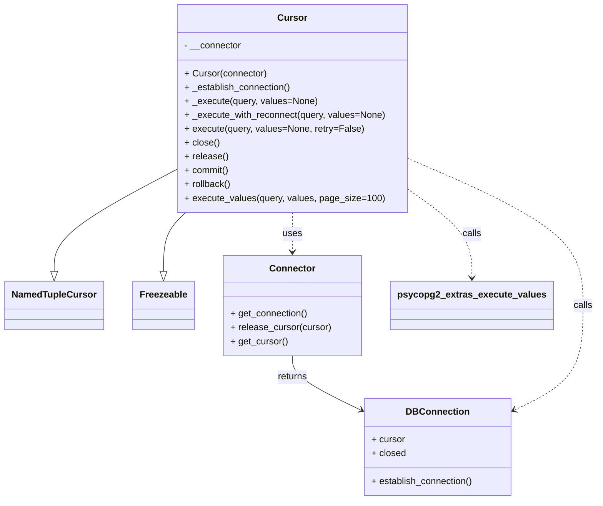

# Diagram: fv_core/fv_framework/python/fv_framework/persistence/sql/postgresql/Cursor.py

> Auto-generated by Obscura crawlers

## Mermaid

```mermaid
classDiagram
    class Cursor {
        - __connector
        + Cursor(connector)
        + _establish_connection()
        + _execute(query, values=None)
        + _execute_with_reconnect(query, values=None)
        + execute(query, values=None, retry=False)
        + close()
        + release()
        + commit()
        + rollback()
        + execute_values(query, values, page_size=100)
    }
    class NamedTupleCursor
    class Freezeable
    class Connector {
        + get_connection()
        + release_cursor(cursor)
        + get_cursor()
    }
    class DBConnection {
        + establish_connection()
        + cursor
        + closed
    }
    class psycopg2_extras_execute_values

    Cursor --|> NamedTupleCursor
    Cursor --|> Freezeable
    Cursor ..> Connector : uses
    Connector --> DBConnection : returns
    Cursor ..> DBConnection : calls
    Cursor ..> psycopg2_extras_execute_values : calls
```

> SVG rendering failed for this diagram.
