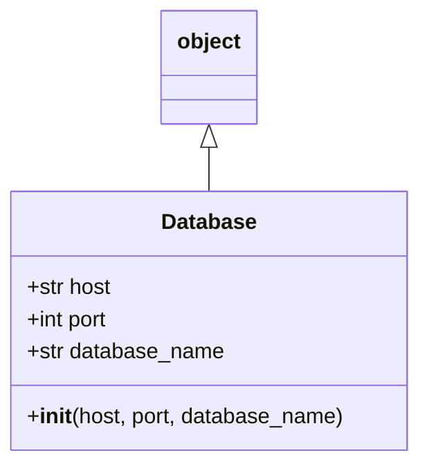

# Diagram: fv_core/fv_framework/python/fv_framework/persistence/sql/postgresql/Database.py

> Auto-generated by Obscura crawlers

## Mermaid

### SVG

<svg id="container" width="311.265625" xmlns="http://www.w3.org/2000/svg" class="classDiagram" height="342" viewBox="0 0 311.265625 342" role="graphics-document document" aria-roledescription="class"><g><defs><marker id="container_class-aggregationStart" class="marker aggregation class" refX="18" refY="7" markerWidth="190" markerHeight="240" orient="auto"><path d="M 18,7 L9,13 L1,7 L9,1 Z"></path></marker></defs><defs><marker id="container_class-aggregationEnd" class="marker aggregation class" refX="1" refY="7" markerWidth="20" markerHeight="28" orient="auto"><path d="M 18,7 L9,13 L1,7 L9,1 Z"></path></marker></defs><defs><marker id="container_class-extensionStart" class="marker extension class" refX="18" refY="7" markerWidth="190" markerHeight="240" orient="auto"><path d="M 1,7 L18,13 V 1 Z"></path></marker></defs><defs><marker id="container_class-extensionEnd" class="marker extension class" refX="1" refY="7" markerWidth="20" markerHeight="28" orient="auto"><path d="M 1,1 V 13 L18,7 Z"></path></marker></defs><defs><marker id="container_class-compositionStart" class="marker composition class" refX="18" refY="7" markerWidth="190" markerHeight="240" orient="auto"><path d="M 18,7 L9,13 L1,7 L9,1 Z"></path></marker></defs><defs><marker id="container_class-compositionEnd" class="marker composition class" refX="1" refY="7" markerWidth="20" markerHeight="28" orient="auto"><path d="M 18,7 L9,13 L1,7 L9,1 Z"></path></marker></defs><defs><marker id="container_class-dependencyStart" class="marker dependency class" refX="6" refY="7" markerWidth="190" markerHeight="240" orient="auto"><path d="M 5,7 L9,13 L1,7 L9,1 Z"></path></marker></defs><defs><marker id="container_class-dependencyEnd" class="marker dependency class" refX="13" refY="7" markerWidth="20" markerHeight="28" orient="auto"><path d="M 18,7 L9,13 L14,7 L9,1 Z"></path></marker></defs><defs><marker id="container_class-lollipopStart" class="marker lollipop class" refX="13" refY="7" markerWidth="190" markerHeight="240" orient="auto"><circle stroke="black" fill="transparent" cx="7" cy="7" r="6"></circle></marker></defs><defs><marker id="container_class-lollipopEnd" class="marker lollipop class" refX="1" refY="7" markerWidth="190" markerHeight="240" orient="auto"><circle stroke="black" fill="transparent" cx="7" cy="7" r="6"></circle></marker></defs><g class="root"><g class="clusters"></g><g class="edgePaths"><path d="M155.633,109.25L155.633,110.542C155.633,111.833,155.633,114.417,155.633,119.875C155.633,125.333,155.633,133.667,155.633,137.833L155.633,142" id="id_object_Database_1" class="edge-thickness-normal edge-pattern-solid relation" style=";;;" data-edge="true" data-et="edge" data-id="id_object_Database_1" data-points="W3sieCI6MTU1LjYzMjgxMjUsInkiOjkyfSx7IngiOjE1NS42MzI4MTI1LCJ5IjoxMTd9LHsieCI6MTU1LjYzMjgxMjUsInkiOjE0Mn1d" marker-start="url(#container_class-extensionStart)"></path></g><g class="edgeLabels"><g class="edgeLabel"><g class="label" data-id="id_object_Database_1" transform="translate(0, 0)"><foreignObject width="0" height="0">

</foreignObject></g></g></g><g class="nodes"><g class="node default" id="classId-object-0" transform="translate(155.6328125, 50)"><g class="basic label-container"><path d="M-35.0390625 -42 L35.0390625 -42 L35.0390625 42 L-35.0390625 42" stroke="none" stroke-width="0" fill="#ECECFF" style=""></path><path d="M-35.0390625 -42 C-17.782362294310342 -42, -0.5256620886206846 -42, 35.0390625 -42 M-35.0390625 -42 C-16.88965435916506 -42, 1.259753781669879 -42, 35.0390625 -42 M35.0390625 -42 C35.0390625 -10.898386267925346, 35.0390625 20.203227464149307, 35.0390625 42 M35.0390625 -42 C35.0390625 -17.074638456465735, 35.0390625 7.8507230870685305, 35.0390625 42 M35.0390625 42 C15.454356745249427 42, -4.1303490095011455 42, -35.0390625 42 M35.0390625 42 C18.56640012600438 42, 2.0937377520087566 42, -35.0390625 42 M-35.0390625 42 C-35.0390625 18.415662798998717, -35.0390625 -5.168674402002566, -35.0390625 -42 M-35.0390625 42 C-35.0390625 20.01728341027617, -35.0390625 -1.9654331794476576, -35.0390625 -42" stroke="#9370DB" stroke-width="1.3" fill="none" stroke-dasharray="0 0" style=""></path></g><g class="annotation-group text" transform="translate(0, -18)"></g><g class="label-group text" transform="translate(-23.0390625, -18)"><g class="label" style="font-weight: bolder" transform="translate(0,-12)"><foreignObject width="46.078125" height="24">

object

</foreignObject></g></g><g class="members-group text" transform="translate(-23.0390625, 30)"></g><g class="methods-group text" transform="translate(-23.0390625, 60)"></g><g class="divider" style=""><path d="M-35.0390625 6 C-10.516537485594288 6, 14.005987528811424 6, 35.0390625 6 M-35.0390625 6 C-9.89159742826449 6, 15.25586764347102 6, 35.0390625 6" stroke="#9370DB" stroke-width="1.3" fill="none" stroke-dasharray="0 0" style=""></path></g><g class="divider" style=""><path d="M-35.0390625 24 C-10.685243421386168 24, 13.668575657227663 24, 35.0390625 24 M-35.0390625 24 C-19.20314057690489 24, -3.367218653809779 24, 35.0390625 24" stroke="#9370DB" stroke-width="1.3" fill="none" stroke-dasharray="0 0" style=""></path></g></g><g class="node default" id="classId-Database-1" transform="translate(155.6328125, 238)"><g class="basic label-container"><path d="M-147.6328125 -96 L147.6328125 -96 L147.6328125 96 L-147.6328125 96" stroke="none" stroke-width="0" fill="#ECECFF" style=""></path><path d="M-147.6328125 -96 C-73.82498104795742 -96, -0.01714959591484444 -96, 147.6328125 -96 M-147.6328125 -96 C-65.14429340958796 -96, 17.34422568082408 -96, 147.6328125 -96 M147.6328125 -96 C147.6328125 -32.649328488092465, 147.6328125 30.70134302381507, 147.6328125 96 M147.6328125 -96 C147.6328125 -24.44584056958064, 147.6328125 47.10831886083872, 147.6328125 96 M147.6328125 96 C71.32408745420226 96, -4.984637591595487 96, -147.6328125 96 M147.6328125 96 C37.585458534457445 96, -72.46189543108511 96, -147.6328125 96 M-147.6328125 96 C-147.6328125 28.752784032932254, -147.6328125 -38.49443193413549, -147.6328125 -96 M-147.6328125 96 C-147.6328125 47.54707245315966, -147.6328125 -0.9058550936806853, -147.6328125 -96" stroke="#9370DB" stroke-width="1.3" fill="none" stroke-dasharray="0 0" style=""></path></g><g class="annotation-group text" transform="translate(0, -72)"></g><g class="label-group text" transform="translate(-34.171875, -72)"><g class="label" style="font-weight: bolder" transform="translate(0,-12)"><foreignObject width="68.34375" height="24">

Database

</foreignObject></g></g><g class="members-group text" transform="translate(-135.6328125, -24)"><g class="label" style="" transform="translate(0,-12)"><foreignObject width="63.625" height="24">

+str host

</foreignObject></g><g class="label" style="" transform="translate(0,12)"><foreignObject width="62.703125" height="24">

+int port

</foreignObject></g><g class="label" style="" transform="translate(0,36)"><foreignObject width="146.890625" height="24">

+str database_name

</foreignObject></g></g><g class="methods-group text" transform="translate(-135.6328125, 72)"><g class="label" style="" transform="translate(0,-12)"><foreignObject width="237.09375" height="24">

+<strong>init</strong>(host, port, database_name)

</foreignObject></g></g><g class="divider" style=""><path d="M-147.6328125 -48 C-87.34156935049506 -48, -27.050326200990128 -48, 147.6328125 -48 M-147.6328125 -48 C-35.236154779833 -48, 77.160502940334 -48, 147.6328125 -48" stroke="#9370DB" stroke-width="1.3" fill="none" stroke-dasharray="0 0" style=""></path></g><g class="divider" style=""><path d="M-147.6328125 48 C-68.18952419140238 48, 11.253764117195232 48, 147.6328125 48 M-147.6328125 48 C-39.48514802168678 48, 68.66251645662643 48, 147.6328125 48" stroke="#9370DB" stroke-width="1.3" fill="none" stroke-dasharray="0 0" style=""></path></g></g></g></g></g></svg>
