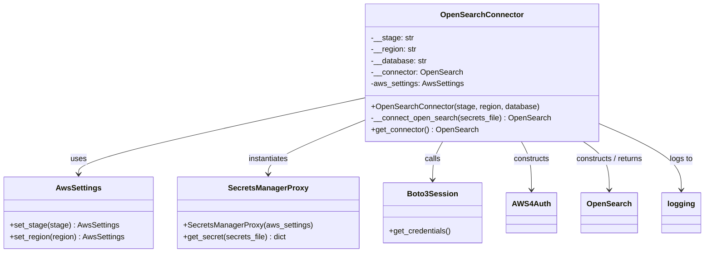
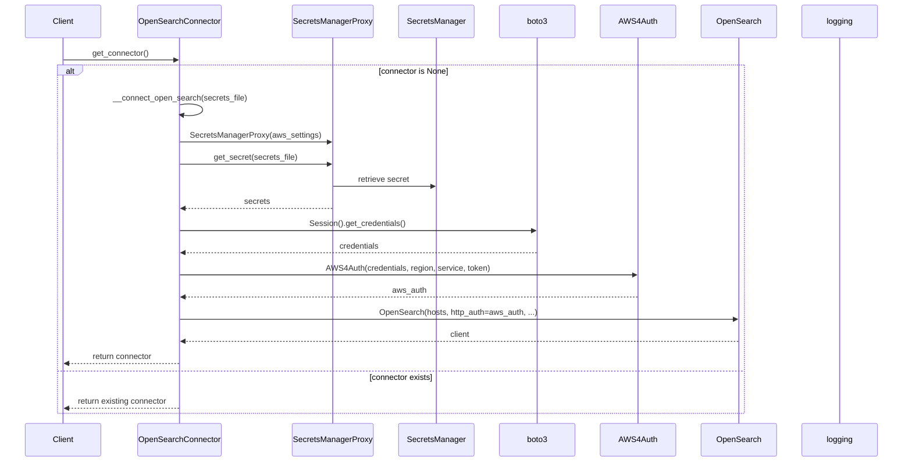

# Diagram: fv_core/fv_framework/python/fv_framework/persistence_adapter/open_search/opensearch_connector.py

> Auto-generated by Obscura crawlers

## Diagram 1

### SVG

<svg id="container" width="1434.7578125" xmlns="http://www.w3.org/2000/svg" class="classDiagram" height="528" viewBox="0 0 1434.7578125 528" role="graphics-document document" aria-roledescription="class"><g><defs><marker id="container_class-aggregationStart" class="marker aggregation class" refX="18" refY="7" markerWidth="190" markerHeight="240" orient="auto"><path d="M 18,7 L9,13 L1,7 L9,1 Z"></path></marker></defs><defs><marker id="container_class-aggregationEnd" class="marker aggregation class" refX="1" refY="7" markerWidth="20" markerHeight="28" orient="auto"><path d="M 18,7 L9,13 L1,7 L9,1 Z"></path></marker></defs><defs><marker id="container_class-extensionStart" class="marker extension class" refX="18" refY="7" markerWidth="190" markerHeight="240" orient="auto"><path d="M 1,7 L18,13 V 1 Z"></path></marker></defs><defs><marker id="container_class-extensionEnd" class="marker extension class" refX="1" refY="7" markerWidth="20" markerHeight="28" orient="auto"><path d="M 1,1 V 13 L18,7 Z"></path></marker></defs><defs><marker id="container_class-compositionStart" class="marker composition class" refX="18" refY="7" markerWidth="190" markerHeight="240" orient="auto"><path d="M 18,7 L9,13 L1,7 L9,1 Z"></path></marker></defs><defs><marker id="container_class-compositionEnd" class="marker composition class" refX="1" refY="7" markerWidth="20" markerHeight="28" orient="auto"><path d="M 18,7 L9,13 L1,7 L9,1 Z"></path></marker></defs><defs><marker id="container_class-dependencyStart" class="marker dependency class" refX="6" refY="7" markerWidth="190" markerHeight="240" orient="auto"><path d="M 5,7 L9,13 L1,7 L9,1 Z"></path></marker></defs><defs><marker id="container_class-dependencyEnd" class="marker dependency class" refX="13" refY="7" markerWidth="20" markerHeight="28" orient="auto"><path d="M 18,7 L9,13 L14,7 L9,1 Z"></path></marker></defs><defs><marker id="container_class-lollipopStart" class="marker lollipop class" refX="13" refY="7" markerWidth="190" markerHeight="240" orient="auto"><circle stroke="black" fill="transparent" cx="7" cy="7" r="6"></circle></marker></defs><defs><marker id="container_class-lollipopEnd" class="marker lollipop class" refX="1" refY="7" markerWidth="190" markerHeight="240" orient="auto"><circle stroke="black" fill="transparent" cx="7" cy="7" r="6"></circle></marker></defs><g class="root"><g class="clusters"></g><g class="edgePaths"><path d="M747.949,204.363L650.324,225.803C552.699,247.242,357.449,290.121,259.824,316.727C162.199,343.333,162.199,353.667,162.199,358.833L162.199,364" id="id_OpenSearchConnector_AwsSettings_1" class="edge-thickness-normal edge-pattern-solid relation" style=";;;" data-edge="true" data-et="edge" data-id="id_OpenSearchConnector_AwsSettings_1" data-points="W3sieCI6NzQ3Ljk0OTIxODc1LCJ5IjoyMDQuMzYzMzEyMzUzMDc1fSx7IngiOjE2Mi4xOTkyMTg3NSwieSI6MzMzfSx7IngiOjE2Mi4xOTkyMTg3NSwieSI6MzcwfV0=" marker-end="url(#container_class-dependencyEnd)"></path><path d="M747.949,250.978L715.018,264.648C682.086,278.319,616.223,305.659,583.291,324.496C550.359,343.333,550.359,353.667,550.359,358.833L550.359,364" id="id_OpenSearchConnector_SecretsManagerProxy_2" class="edge-thickness-normal edge-pattern-solid relation" style=";;;" data-edge="true" data-et="edge" data-id="id_OpenSearchConnector_SecretsManagerProxy_2" data-points="W3sieCI6NzQ3Ljk0OTIxODc1LCJ5IjoyNTAuOTc4MTY3NTgxOTQ5OTV9LHsieCI6NTUwLjM1OTM3NSwieSI6MzMzfSx7IngiOjU1MC4zNTkzNzUsInkiOjM3MH1d" marker-end="url(#container_class-dependencyEnd)"></path><path d="M906.409,296L902.984,302.167C899.559,308.333,892.709,320.667,889.284,334C885.859,347.333,885.859,361.667,885.859,368.833L885.859,376" id="id_OpenSearchConnector_Boto3Session_3" class="edge-thickness-normal edge-pattern-solid relation" style=";;;" data-edge="true" data-et="edge" data-id="id_OpenSearchConnector_Boto3Session_3" data-points="W3sieCI6OTA2LjQwOTE2MzUwMTM4MTMsInkiOjI5Nn0seyJ4Ijo4ODUuODU5Mzc1LCJ5IjozMzN9LHsieCI6ODg1Ljg1OTM3NSwieSI6MzgyfV0=" marker-end="url(#container_class-dependencyEnd)"></path><path d="M1066.364,296L1069.789,302.167C1073.214,308.333,1080.064,320.667,1083.489,337.5C1086.914,354.333,1086.914,375.667,1086.914,386.333L1086.914,397" id="id_OpenSearchConnector_AWS4Auth_4" class="edge-thickness-normal edge-pattern-solid relation" style=";;;" data-edge="true" data-et="edge" data-id="id_OpenSearchConnector_AWS4Auth_4" data-points="W3sieCI6MTA2Ni4zNjQyNzM5OTg2MTg3LCJ5IjoyOTZ9LHsieCI6MTA4Ni45MTQwNjI1LCJ5IjozMzN9LHsieCI6MTA4Ni45MTQwNjI1LCJ5Ijo0MDN9XQ==" marker-end="url(#container_class-dependencyEnd)"></path><path d="M1190.133,296L1198.858,302.167C1207.583,308.333,1225.034,320.667,1233.759,337.5C1242.484,354.333,1242.484,375.667,1242.484,386.333L1242.484,397" id="id_OpenSearchConnector_OpenSearch_5" class="edge-thickness-normal edge-pattern-solid relation" style=";;;" data-edge="true" data-et="edge" data-id="id_OpenSearchConnector_OpenSearch_5" data-points="W3sieCI6MTE5MC4xMzI5MjA0MDc0NTg2LCJ5IjoyOTZ9LHsieCI6MTI0Mi40ODQzNzUsInkiOjMzM30seyJ4IjoxMjQyLjQ4NDM3NSwieSI6NDAzfV0=" marker-end="url(#container_class-dependencyEnd)"></path><path d="M1224.824,259.554L1251.962,271.795C1279.099,284.036,1333.374,308.518,1360.511,331.426C1387.648,354.333,1387.648,375.667,1387.648,386.333L1387.648,397" id="id_OpenSearchConnector_logging_6" class="edge-thickness-normal edge-pattern-solid relation" style=";;;" data-edge="true" data-et="edge" data-id="id_OpenSearchConnector_logging_6" data-points="W3sieCI6MTIyNC44MjQyMTg3NSwieSI6MjU5LjU1MzcxMjQxMTA0NzJ9LHsieCI6MTM4Ny42NDg0Mzc1LCJ5IjozMzN9LHsieCI6MTM4Ny42NDg0Mzc1LCJ5Ijo0MDN9XQ==" marker-end="url(#container_class-dependencyEnd)"></path></g><g class="edgeLabels"><g class="edgeLabel" transform="translate(162.19921875, 333)"><g class="label" data-id="id_OpenSearchConnector_AwsSettings_1" transform="translate(-16.4921875, -12)"><foreignObject width="32.984375" height="24">

uses

</foreignObject></g></g><g class="edgeLabel" transform="translate(550.359375, 333)"><g class="label" data-id="id_OpenSearchConnector_SecretsManagerProxy_2" transform="translate(-42.9140625, -12)"><foreignObject width="85.828125" height="24">

instantiates

</foreignObject></g></g><g class="edgeLabel" transform="translate(885.859375, 333)"><g class="label" data-id="id_OpenSearchConnector_Boto3Session_3" transform="translate(-16.4453125, -12)"><foreignObject width="32.890625" height="24">

calls

</foreignObject></g></g><g class="edgeLabel" transform="translate(1086.9140625, 333)"><g class="label" data-id="id_OpenSearchConnector_AWS4Auth_4" transform="translate(-37.84375, -12)"><foreignObject width="75.6875" height="24">

constructs

</foreignObject></g></g><g class="edgeLabel" transform="translate(1242.484375, 333)"><g class="label" data-id="id_OpenSearchConnector_OpenSearch_5" transform="translate(-72.5078125, -12)"><foreignObject width="145.015625" height="24">

constructs / returns

</foreignObject></g></g><g class="edgeLabel" transform="translate(1387.6484375, 333)"><g class="label" data-id="id_OpenSearchConnector_logging_6" transform="translate(-24.3828125, -12)"><foreignObject width="48.765625" height="24">

logs to

</foreignObject></g></g></g><g class="nodes"><g class="node default" id="classId-OpenSearchConnector-0" transform="translate(986.38671875, 152)"><g class="basic label-container"><path d="M-238.4375 -144 L238.4375 -144 L238.4375 144 L-238.4375 144" stroke="none" stroke-width="0" fill="#ECECFF" style=""></path><path d="M-238.4375 -144 C-90.44110506421583 -144, 57.555289871568334 -144, 238.4375 -144 M-238.4375 -144 C-127.31835015669999 -144, -16.199200313399984 -144, 238.4375 -144 M238.4375 -144 C238.4375 -42.066589815215636, 238.4375 59.86682036956873, 238.4375 144 M238.4375 -144 C238.4375 -56.80272198808309, 238.4375 30.394556023833815, 238.4375 144 M238.4375 144 C74.56179129309822 144, -89.31391741380355 144, -238.4375 144 M238.4375 144 C84.90003101113317 144, -68.63743797773367 144, -238.4375 144 M-238.4375 144 C-238.4375 63.18434180273347, -238.4375 -17.63131639453306, -238.4375 -144 M-238.4375 144 C-238.4375 79.48520669364008, -238.4375 14.97041338728016, -238.4375 -144" stroke="#9370DB" stroke-width="1.3" fill="none" stroke-dasharray="0 0" style=""></path></g><g class="annotation-group text" transform="translate(0, -120)"></g><g class="label-group text" transform="translate(-81.46875, -120)"><g class="label" style="font-weight: bolder" transform="translate(0,-12)"><foreignObject width="162.9375" height="24">

OpenSearchConnector

</foreignObject></g></g><g class="members-group text" transform="translate(-226.4375, -72)"><g class="label" style="" transform="translate(0,-12)"><foreignObject width="87.625" height="24">

-__stage: str

</foreignObject></g><g class="label" style="" transform="translate(0,12)"><foreignObject width="95.125" height="24">

-__region: str

</foreignObject></g><g class="label" style="" transform="translate(0,36)"><foreignObject width="115.5625" height="24">

-__database: str

</foreignObject></g><g class="label" style="" transform="translate(0,60)"><foreignObject width="189.796875" height="24">

-__connector: OpenSearch

</foreignObject></g><g class="label" style="" transform="translate(0,84)"><foreignObject width="193.84375" height="24">

-aws_settings: AwsSettings

</foreignObject></g></g><g class="methods-group text" transform="translate(-226.4375, 72)"><g class="label" style="" transform="translate(0,-12)"><foreignObject width="347.046875" height="24">

+OpenSearchConnector(stage, region, database)

</foreignObject></g><g class="label" style="" transform="translate(0,12)"><foreignObject width="371.40625" height="24">

-__connect_open_search(secrets_file) : OpenSearch

</foreignObject></g><g class="label" style="" transform="translate(0,36)"><foreignObject width="221.46875" height="24">

+get_connector() : OpenSearch

</foreignObject></g></g><g class="divider" style=""><path d="M-238.4375 -96 C-128.2122992975269 -96, -17.987098595053766 -96, 238.4375 -96 M-238.4375 -96 C-132.2815263064739 -96, -26.125552612947786 -96, 238.4375 -96" stroke="#9370DB" stroke-width="1.3" fill="none" stroke-dasharray="0 0" style=""></path></g><g class="divider" style=""><path d="M-238.4375 48 C-53.78165731940072 48, 130.87418536119856 48, 238.4375 48 M-238.4375 48 C-110.7793057993789 48, 16.878888401242193 48, 238.4375 48" stroke="#9370DB" stroke-width="1.3" fill="none" stroke-dasharray="0 0" style=""></path></g></g><g class="node default" id="classId-AwsSettings-1" transform="translate(162.19921875, 445)"><g class="basic label-container"><path d="M-154.19921875 -75 L154.19921875 -75 L154.19921875 75 L-154.19921875 75" stroke="none" stroke-width="0" fill="#ECECFF" style=""></path><path d="M-154.19921875 -75 C-90.9610927246931 -75, -27.722966699386205 -75, 154.19921875 -75 M-154.19921875 -75 C-59.57938922704099 -75, 35.04044029591802 -75, 154.19921875 -75 M154.19921875 -75 C154.19921875 -37.342202663883704, 154.19921875 0.3155946722325922, 154.19921875 75 M154.19921875 -75 C154.19921875 -18.771716357409638, 154.19921875 37.456567285180725, 154.19921875 75 M154.19921875 75 C31.96303289881621 75, -90.27315295236758 75, -154.19921875 75 M154.19921875 75 C58.680757897669764 75, -36.83770295466047 75, -154.19921875 75 M-154.19921875 75 C-154.19921875 32.60193969210484, -154.19921875 -9.796120615790315, -154.19921875 -75 M-154.19921875 75 C-154.19921875 42.971684478942215, -154.19921875 10.94336895788443, -154.19921875 -75" stroke="#9370DB" stroke-width="1.3" fill="none" stroke-dasharray="0 0" style=""></path></g><g class="annotation-group text" transform="translate(0, -51)"></g><g class="label-group text" transform="translate(-44.8203125, -51)"><g class="label" style="font-weight: bolder" transform="translate(0,-12)"><foreignObject width="89.640625" height="24">

AwsSettings

</foreignObject></g></g><g class="members-group text" transform="translate(-142.19921875, -3)"></g><g class="methods-group text" transform="translate(-142.19921875, 27)"><g class="label" style="" transform="translate(0,-12)"><foreignObject width="224.5625" height="24">

+set_stage(stage) : AwsSettings

</foreignObject></g><g class="label" style="" transform="translate(0,12)"><foreignObject width="239.578125" height="24">

+set_region(region) : AwsSettings

</foreignObject></g></g><g class="divider" style=""><path d="M-154.19921875 -27 C-49.12120985726209 -27, 55.956799035475825 -27, 154.19921875 -27 M-154.19921875 -27 C-60.699547917086974 -27, 32.80012291582605 -27, 154.19921875 -27" stroke="#9370DB" stroke-width="1.3" fill="none" stroke-dasharray="0 0" style=""></path></g><g class="divider" style=""><path d="M-154.19921875 -3 C-61.981586883988726 -3, 30.23604498202255 -3, 154.19921875 -3 M-154.19921875 -3 C-49.073415222260465 -3, 56.05238830547907 -3, 154.19921875 -3" stroke="#9370DB" stroke-width="1.3" fill="none" stroke-dasharray="0 0" style=""></path></g></g><g class="node default" id="classId-SecretsManagerProxy-2" transform="translate(550.359375, 445)"><g class="basic label-container"><path d="M-183.9609375 -75 L183.9609375 -75 L183.9609375 75 L-183.9609375 75" stroke="none" stroke-width="0" fill="#ECECFF" style=""></path><path d="M-183.9609375 -75 C-100.06627534072834 -75, -16.171613181456678 -75, 183.9609375 -75 M-183.9609375 -75 C-79.30150899373118 -75, 25.35791951253765 -75, 183.9609375 -75 M183.9609375 -75 C183.9609375 -32.099204163229786, 183.9609375 10.801591673540429, 183.9609375 75 M183.9609375 -75 C183.9609375 -31.281223424374396, 183.9609375 12.437553151251208, 183.9609375 75 M183.9609375 75 C63.03388157520601 75, -57.89317434958798 75, -183.9609375 75 M183.9609375 75 C74.97410631763387 75, -34.01272486473226 75, -183.9609375 75 M-183.9609375 75 C-183.9609375 40.315030662338486, -183.9609375 5.630061324676973, -183.9609375 -75 M-183.9609375 75 C-183.9609375 30.142275638168805, -183.9609375 -14.71544872366239, -183.9609375 -75" stroke="#9370DB" stroke-width="1.3" fill="none" stroke-dasharray="0 0" style=""></path></g><g class="annotation-group text" transform="translate(0, -51)"></g><g class="label-group text" transform="translate(-79.03125, -51)"><g class="label" style="font-weight: bolder" transform="translate(0,-12)"><foreignObject width="158.0625" height="24">

SecretsManagerProxy

</foreignObject></g></g><g class="members-group text" transform="translate(-171.9609375, -3)"></g><g class="methods-group text" transform="translate(-171.9609375, 27)"><g class="label" style="" transform="translate(0,-12)"><foreignObject width="264.890625" height="24">

+SecretsManagerProxy(aws_settings)

</foreignObject></g><g class="label" style="" transform="translate(0,12)"><foreignObject width="214.8125" height="24">

+get_secret(secrets_file) : dict

</foreignObject></g></g><g class="divider" style=""><path d="M-183.9609375 -27 C-101.01915256039268 -27, -18.077367620785367 -27, 183.9609375 -27 M-183.9609375 -27 C-78.74804847469959 -27, 26.464840550600826 -27, 183.9609375 -27" stroke="#9370DB" stroke-width="1.3" fill="none" stroke-dasharray="0 0" style=""></path></g><g class="divider" style=""><path d="M-183.9609375 -3 C-65.89982614104206 -3, 52.16128521791589 -3, 183.9609375 -3 M-183.9609375 -3 C-88.10734311945963 -3, 7.746251261080744 -3, 183.9609375 -3" stroke="#9370DB" stroke-width="1.3" fill="none" stroke-dasharray="0 0" style=""></path></g></g><g class="node default" id="classId-OpenSearch-3" transform="translate(1242.484375, 445)"><g class="basic label-container"><path d="M-56.0546875 -42 L56.0546875 -42 L56.0546875 42 L-56.0546875 42" stroke="none" stroke-width="0" fill="#ECECFF" style=""></path><path d="M-56.0546875 -42 C-21.685060724725204 -42, 12.684566050549591 -42, 56.0546875 -42 M-56.0546875 -42 C-22.321811181820955 -42, 11.41106513635809 -42, 56.0546875 -42 M56.0546875 -42 C56.0546875 -14.263693820543967, 56.0546875 13.472612358912066, 56.0546875 42 M56.0546875 -42 C56.0546875 -13.566250006005152, 56.0546875 14.867499987989696, 56.0546875 42 M56.0546875 42 C31.405527702261498 42, 6.756367904522996 42, -56.0546875 42 M56.0546875 42 C33.05612521476586 42, 10.057562929531727 42, -56.0546875 42 M-56.0546875 42 C-56.0546875 8.496117013627547, -56.0546875 -25.007765972744906, -56.0546875 -42 M-56.0546875 42 C-56.0546875 17.863665093388022, -56.0546875 -6.272669813223956, -56.0546875 -42" stroke="#9370DB" stroke-width="1.3" fill="none" stroke-dasharray="0 0" style=""></path></g><g class="annotation-group text" transform="translate(0, -18)"></g><g class="label-group text" transform="translate(-44.0546875, -18)"><g class="label" style="font-weight: bolder" transform="translate(0,-12)"><foreignObject width="88.109375" height="24">

OpenSearch

</foreignObject></g></g><g class="members-group text" transform="translate(-44.0546875, 30)"></g><g class="methods-group text" transform="translate(-44.0546875, 60)"></g><g class="divider" style=""><path d="M-56.0546875 6 C-14.668930819151342 6, 26.716825861697316 6, 56.0546875 6 M-56.0546875 6 C-31.101412886785084 6, -6.148138273570169 6, 56.0546875 6" stroke="#9370DB" stroke-width="1.3" fill="none" stroke-dasharray="0 0" style=""></path></g><g class="divider" style=""><path d="M-56.0546875 24 C-17.595240218117198 24, 20.864207063765605 24, 56.0546875 24 M-56.0546875 24 C-27.93537501121427 24, 0.18393747757146173 24, 56.0546875 24" stroke="#9370DB" stroke-width="1.3" fill="none" stroke-dasharray="0 0" style=""></path></g></g><g class="node default" id="classId-AWS4Auth-4" transform="translate(1086.9140625, 445)"><g class="basic label-container"><path d="M-49.515625 -42 L49.515625 -42 L49.515625 42 L-49.515625 42" stroke="none" stroke-width="0" fill="#ECECFF" style=""></path><path d="M-49.515625 -42 C-20.43935642407956 -42, 8.636912151840882 -42, 49.515625 -42 M-49.515625 -42 C-27.339531925248448 -42, -5.163438850496895 -42, 49.515625 -42 M49.515625 -42 C49.515625 -11.665872586450796, 49.515625 18.66825482709841, 49.515625 42 M49.515625 -42 C49.515625 -19.181900141859277, 49.515625 3.636199716281446, 49.515625 42 M49.515625 42 C14.543782241215268 42, -20.428060517569463 42, -49.515625 42 M49.515625 42 C23.420019729357456 42, -2.6755855412850877 42, -49.515625 42 M-49.515625 42 C-49.515625 22.72416767485442, -49.515625 3.4483353497088416, -49.515625 -42 M-49.515625 42 C-49.515625 20.005320262498856, -49.515625 -1.9893594750022885, -49.515625 -42" stroke="#9370DB" stroke-width="1.3" fill="none" stroke-dasharray="0 0" style=""></path></g><g class="annotation-group text" transform="translate(0, -18)"></g><g class="label-group text" transform="translate(-37.515625, -18)"><g class="label" style="font-weight: bolder" transform="translate(0,-12)"><foreignObject width="75.03125" height="24">

AWS4Auth

</foreignObject></g></g><g class="members-group text" transform="translate(-37.515625, 30)"></g><g class="methods-group text" transform="translate(-37.515625, 60)"></g><g class="divider" style=""><path d="M-49.515625 6 C-29.645146528830892 6, -9.774668057661785 6, 49.515625 6 M-49.515625 6 C-12.402638733989441 6, 24.710347532021117 6, 49.515625 6" stroke="#9370DB" stroke-width="1.3" fill="none" stroke-dasharray="0 0" style=""></path></g><g class="divider" style=""><path d="M-49.515625 24 C-10.203111719283811 24, 29.109401561432378 24, 49.515625 24 M-49.515625 24 C-16.53192666305403 24, 16.45177167389194 24, 49.515625 24" stroke="#9370DB" stroke-width="1.3" fill="none" stroke-dasharray="0 0" style=""></path></g></g><g class="node default" id="classId-Boto3Session-5" transform="translate(885.859375, 445)"><g class="basic label-container"><path d="M-101.5390625 -63 L101.5390625 -63 L101.5390625 63 L-101.5390625 63" stroke="none" stroke-width="0" fill="#ECECFF" style=""></path><path d="M-101.5390625 -63 C-29.94334780565501 -63, 41.65236688868998 -63, 101.5390625 -63 M-101.5390625 -63 C-55.19474903513683 -63, -8.85043557027366 -63, 101.5390625 -63 M101.5390625 -63 C101.5390625 -19.88138154992052, 101.5390625 23.237236900158962, 101.5390625 63 M101.5390625 -63 C101.5390625 -25.930428010210008, 101.5390625 11.139143979579984, 101.5390625 63 M101.5390625 63 C53.878251914433115 63, 6.217441328866229 63, -101.5390625 63 M101.5390625 63 C54.85367857453617 63, 8.168294649072337 63, -101.5390625 63 M-101.5390625 63 C-101.5390625 19.58646018194596, -101.5390625 -23.82707963610808, -101.5390625 -63 M-101.5390625 63 C-101.5390625 18.4270587934218, -101.5390625 -26.1458824131564, -101.5390625 -63" stroke="#9370DB" stroke-width="1.3" fill="none" stroke-dasharray="0 0" style=""></path></g><g class="annotation-group text" transform="translate(0, -39)"></g><g class="label-group text" transform="translate(-49.4375, -39)"><g class="label" style="font-weight: bolder" transform="translate(0,-12)"><foreignObject width="98.875" height="24">

Boto3Session

</foreignObject></g></g><g class="members-group text" transform="translate(-89.5390625, 9)"></g><g class="methods-group text" transform="translate(-89.5390625, 39)"><g class="label" style="" transform="translate(0,-12)"><foreignObject width="129.640625" height="24">

+get_credentials()

</foreignObject></g></g><g class="divider" style=""><path d="M-101.5390625 -15 C-20.635550162670683 -15, 60.267962174658635 -15, 101.5390625 -15 M-101.5390625 -15 C-35.05482549598314 -15, 31.429411508033724 -15, 101.5390625 -15" stroke="#9370DB" stroke-width="1.3" fill="none" stroke-dasharray="0 0" style=""></path></g><g class="divider" style=""><path d="M-101.5390625 9 C-39.60925823950034 9, 22.320546020999316 9, 101.5390625 9 M-101.5390625 9 C-22.35166694052434 9, 56.83572861895132 9, 101.5390625 9" stroke="#9370DB" stroke-width="1.3" fill="none" stroke-dasharray="0 0" style=""></path></g></g><g class="node default" id="classId-logging-6" transform="translate(1387.6484375, 445)"><g class="basic label-container"><path d="M-39.109375 -42 L39.109375 -42 L39.109375 42 L-39.109375 42" stroke="none" stroke-width="0" fill="#ECECFF" style=""></path><path d="M-39.109375 -42 C-18.35786385856394 -42, 2.3936472828721165 -42, 39.109375 -42 M-39.109375 -42 C-13.55969573764401 -42, 11.989983524711981 -42, 39.109375 -42 M39.109375 -42 C39.109375 -19.627370382594496, 39.109375 2.7452592348110088, 39.109375 42 M39.109375 -42 C39.109375 -23.389024032012827, 39.109375 -4.778048064025654, 39.109375 42 M39.109375 42 C11.02872925127626 42, -17.05191649744748 42, -39.109375 42 M39.109375 42 C16.777984350595048 42, -5.553406298809904 42, -39.109375 42 M-39.109375 42 C-39.109375 14.052051945869803, -39.109375 -13.895896108260395, -39.109375 -42 M-39.109375 42 C-39.109375 14.252539378545244, -39.109375 -13.494921242909513, -39.109375 -42" stroke="#9370DB" stroke-width="1.3" fill="none" stroke-dasharray="0 0" style=""></path></g><g class="annotation-group text" transform="translate(0, -18)"></g><g class="label-group text" transform="translate(-27.109375, -18)"><g class="label" style="font-weight: bolder" transform="translate(0,-12)"><foreignObject width="54.21875" height="24">

logging

</foreignObject></g></g><g class="members-group text" transform="translate(-27.109375, 30)"></g><g class="methods-group text" transform="translate(-27.109375, 60)"></g><g class="divider" style=""><path d="M-39.109375 6 C-15.101893436286389 6, 8.905588127427222 6, 39.109375 6 M-39.109375 6 C-8.732186342869614 6, 21.645002314260772 6, 39.109375 6" stroke="#9370DB" stroke-width="1.3" fill="none" stroke-dasharray="0 0" style=""></path></g><g class="divider" style=""><path d="M-39.109375 24 C-10.361229464839745 24, 18.38691607032051 24, 39.109375 24 M-39.109375 24 C-20.947055218644287 24, -2.7847354372885746 24, 39.109375 24" stroke="#9370DB" stroke-width="1.3" fill="none" stroke-dasharray="0 0" style=""></path></g></g></g></g></g></svg>

## Diagram 2

### SVG

<svg id="container" width="1844" xmlns="http://www.w3.org/2000/svg" height="973" viewBox="-50 -10 1844 973" role="graphics-document document" aria-roledescription="sequence"><g><rect x="1594" y="887" fill="#eaeaea" stroke="#666" width="150" height="65" name="logging" rx="3" ry="3" class="actor actor-bottom"></rect><text x="1669" y="919.5" dominant-baseline="central" alignment-baseline="central" class="actor actor-box" style="text-anchor: middle; font-size: 16px; font-weight: 400;"><tspan x="1669" dy="0">logging</tspan></text></g><g><rect x="1394" y="887" fill="#eaeaea" stroke="#666" width="150" height="65" name="OpenSearch" rx="3" ry="3" class="actor actor-bottom"></rect><text x="1469" y="919.5" dominant-baseline="central" alignment-baseline="central" class="actor actor-box" style="text-anchor: middle; font-size: 16px; font-weight: 400;"><tspan x="1469" dy="0">OpenSearch</tspan></text></g><g><rect x="1194" y="887" fill="#eaeaea" stroke="#666" width="150" height="65" name="AWS4Auth" rx="3" ry="3" class="actor actor-bottom"></rect><text x="1269" y="919.5" dominant-baseline="central" alignment-baseline="central" class="actor actor-box" style="text-anchor: middle; font-size: 16px; font-weight: 400;"><tspan x="1269" dy="0">AWS4Auth</tspan></text></g><g><rect x="994" y="887" fill="#eaeaea" stroke="#666" width="150" height="65" name="boto3" rx="3" ry="3" class="actor actor-bottom"></rect><text x="1069" y="919.5" dominant-baseline="central" alignment-baseline="central" class="actor actor-box" style="text-anchor: middle; font-size: 16px; font-weight: 400;"><tspan x="1069" dy="0">boto3</tspan></text></g><g><rect x="794" y="887" fill="#eaeaea" stroke="#666" width="150" height="65" name="SecretsManager" rx="3" ry="3" class="actor actor-bottom"></rect><text x="869" y="919.5" dominant-baseline="central" alignment-baseline="central" class="actor actor-box" style="text-anchor: middle; font-size: 16px; font-weight: 400;"><tspan x="869" dy="0">SecretsManager</tspan></text></g><g><rect x="570" y="887" fill="#eaeaea" stroke="#666" width="174" height="65" name="SecretsManagerProxy" rx="3" ry="3" class="actor actor-bottom"></rect><text x="657" y="919.5" dominant-baseline="central" alignment-baseline="central" class="actor actor-box" style="text-anchor: middle; font-size: 16px; font-weight: 400;"><tspan x="657" dy="0">SecretsManagerProxy</tspan></text></g><g><rect x="238" y="887" fill="#eaeaea" stroke="#666" width="182" height="65" name="OpenSearchConnector" rx="3" ry="3" class="actor actor-bottom"></rect><text x="329" y="919.5" dominant-baseline="central" alignment-baseline="central" class="actor actor-box" style="text-anchor: middle; font-size: 16px; font-weight: 400;"><tspan x="329" dy="0">OpenSearchConnector</tspan></text></g><g><rect x="0" y="887" fill="#eaeaea" stroke="#666" width="150" height="65" name="Client" rx="3" ry="3" class="actor actor-bottom"></rect><text x="75" y="919.5" dominant-baseline="central" alignment-baseline="central" class="actor actor-box" style="text-anchor: middle; font-size: 16px; font-weight: 400;"><tspan x="75" dy="0">Client</tspan></text></g><g><line id="actor7" x1="1669" y1="65" x2="1669" y2="887" class="actor-line 200" stroke-width="0.5px" stroke="#999" name="logging"></line><g id="root-7"><rect x="1594" y="0" fill="#eaeaea" stroke="#666" width="150" height="65" name="logging" rx="3" ry="3" class="actor actor-top"></rect><text x="1669" y="32.5" dominant-baseline="central" alignment-baseline="central" class="actor actor-box" style="text-anchor: middle; font-size: 16px; font-weight: 400;"><tspan x="1669" dy="0">logging</tspan></text></g></g><g><line id="actor6" x1="1469" y1="65" x2="1469" y2="887" class="actor-line 200" stroke-width="0.5px" stroke="#999" name="OpenSearch"></line><g id="root-6"><rect x="1394" y="0" fill="#eaeaea" stroke="#666" width="150" height="65" name="OpenSearch" rx="3" ry="3" class="actor actor-top"></rect><text x="1469" y="32.5" dominant-baseline="central" alignment-baseline="central" class="actor actor-box" style="text-anchor: middle; font-size: 16px; font-weight: 400;"><tspan x="1469" dy="0">OpenSearch</tspan></text></g></g><g><line id="actor5" x1="1269" y1="65" x2="1269" y2="887" class="actor-line 200" stroke-width="0.5px" stroke="#999" name="AWS4Auth"></line><g id="root-5"><rect x="1194" y="0" fill="#eaeaea" stroke="#666" width="150" height="65" name="AWS4Auth" rx="3" ry="3" class="actor actor-top"></rect><text x="1269" y="32.5" dominant-baseline="central" alignment-baseline="central" class="actor actor-box" style="text-anchor: middle; font-size: 16px; font-weight: 400;"><tspan x="1269" dy="0">AWS4Auth</tspan></text></g></g><g><line id="actor4" x1="1069" y1="65" x2="1069" y2="887" class="actor-line 200" stroke-width="0.5px" stroke="#999" name="boto3"></line><g id="root-4"><rect x="994" y="0" fill="#eaeaea" stroke="#666" width="150" height="65" name="boto3" rx="3" ry="3" class="actor actor-top"></rect><text x="1069" y="32.5" dominant-baseline="central" alignment-baseline="central" class="actor actor-box" style="text-anchor: middle; font-size: 16px; font-weight: 400;"><tspan x="1069" dy="0">boto3</tspan></text></g></g><g><line id="actor3" x1="869" y1="65" x2="869" y2="887" class="actor-line 200" stroke-width="0.5px" stroke="#999" name="SecretsManager"></line><g id="root-3"><rect x="794" y="0" fill="#eaeaea" stroke="#666" width="150" height="65" name="SecretsManager" rx="3" ry="3" class="actor actor-top"></rect><text x="869" y="32.5" dominant-baseline="central" alignment-baseline="central" class="actor actor-box" style="text-anchor: middle; font-size: 16px; font-weight: 400;"><tspan x="869" dy="0">SecretsManager</tspan></text></g></g><g><line id="actor2" x1="657" y1="65" x2="657" y2="887" class="actor-line 200" stroke-width="0.5px" stroke="#999" name="SecretsManagerProxy"></line><g id="root-2"><rect x="570" y="0" fill="#eaeaea" stroke="#666" width="174" height="65" name="SecretsManagerProxy" rx="3" ry="3" class="actor actor-top"></rect><text x="657" y="32.5" dominant-baseline="central" alignment-baseline="central" class="actor actor-box" style="text-anchor: middle; font-size: 16px; font-weight: 400;"><tspan x="657" dy="0">SecretsManagerProxy</tspan></text></g></g><g><line id="actor1" x1="329" y1="65" x2="329" y2="887" class="actor-line 200" stroke-width="0.5px" stroke="#999" name="OpenSearchConnector"></line><g id="root-1"><rect x="238" y="0" fill="#eaeaea" stroke="#666" width="182" height="65" name="OpenSearchConnector" rx="3" ry="3" class="actor actor-top"></rect><text x="329" y="32.5" dominant-baseline="central" alignment-baseline="central" class="actor actor-box" style="text-anchor: middle; font-size: 16px; font-weight: 400;"><tspan x="329" dy="0">OpenSearchConnector</tspan></text></g></g><g><line id="actor0" x1="75" y1="65" x2="75" y2="887" class="actor-line 200" stroke-width="0.5px" stroke="#999" name="Client"></line><g id="root-0"><rect x="0" y="0" fill="#eaeaea" stroke="#666" width="150" height="65" name="Client" rx="3" ry="3" class="actor actor-top"></rect><text x="75" y="32.5" dominant-baseline="central" alignment-baseline="central" class="actor actor-box" style="text-anchor: middle; font-size: 16px; font-weight: 400;"><tspan x="75" dy="0">Client</tspan></text></g></g><g></g><defs><symbol id="computer" width="24" height="24"><path transform="scale(.5)" d="M2 2v13h20v-13h-20zm18 11h-16v-9h16v9zm-10.228 6l.466-1h3.524l.467 1h-4.457zm14.228 3h-24l2-6h2.104l-1.33 4h18.45l-1.297-4h2.073l2 6zm-5-10h-14v-7h14v7z"></path></symbol></defs><defs><symbol id="database" fill-rule="evenodd" clip-rule="evenodd"><path transform="scale(.5)" d="M12.258.001l.256.004.255.005.253.008.251.01.249.012.247.015.246.016.242.019.241.02.239.023.236.024.233.027.231.028.229.031.225.032.223.034.22.036.217.038.214.04.211.041.208.043.205.045.201.046.198.048.194.05.191.051.187.053.183.054.18.056.175.057.172.059.168.06.163.061.16.063.155.064.15.066.074.033.073.033.071.034.07.034.069.035.068.035.067.035.066.035.064.036.064.036.062.036.06.036.06.037.058.037.058.037.055.038.055.038.053.038.052.038.051.039.05.039.048.039.047.039.045.04.044.04.043.04.041.04.04.041.039.041.037.041.036.041.034.041.033.042.032.042.03.042.029.042.027.042.026.043.024.043.023.043.021.043.02.043.018.044.017.043.015.044.013.044.012.044.011.045.009.044.007.045.006.045.004.045.002.045.001.045v17l-.001.045-.002.045-.004.045-.006.045-.007.045-.009.044-.011.045-.012.044-.013.044-.015.044-.017.043-.018.044-.02.043-.021.043-.023.043-.024.043-.026.043-.027.042-.029.042-.03.042-.032.042-.033.042-.034.041-.036.041-.037.041-.039.041-.04.041-.041.04-.043.04-.044.04-.045.04-.047.039-.048.039-.05.039-.051.039-.052.038-.053.038-.055.038-.055.038-.058.037-.058.037-.06.037-.06.036-.062.036-.064.036-.064.036-.066.035-.067.035-.068.035-.069.035-.07.034-.071.034-.073.033-.074.033-.15.066-.155.064-.16.063-.163.061-.168.06-.172.059-.175.057-.18.056-.183.054-.187.053-.191.051-.194.05-.198.048-.201.046-.205.045-.208.043-.211.041-.214.04-.217.038-.22.036-.223.034-.225.032-.229.031-.231.028-.233.027-.236.024-.239.023-.241.02-.242.019-.246.016-.247.015-.249.012-.251.01-.253.008-.255.005-.256.004-.258.001-.258-.001-.256-.004-.255-.005-.253-.008-.251-.01-.249-.012-.247-.015-.245-.016-.243-.019-.241-.02-.238-.023-.236-.024-.234-.027-.231-.028-.228-.031-.226-.032-.223-.034-.22-.036-.217-.038-.214-.04-.211-.041-.208-.043-.204-.045-.201-.046-.198-.048-.195-.05-.19-.051-.187-.053-.184-.054-.179-.056-.176-.057-.172-.059-.167-.06-.164-.061-.159-.063-.155-.064-.151-.066-.074-.033-.072-.033-.072-.034-.07-.034-.069-.035-.068-.035-.067-.035-.066-.035-.064-.036-.063-.036-.062-.036-.061-.036-.06-.037-.058-.037-.057-.037-.056-.038-.055-.038-.053-.038-.052-.038-.051-.039-.049-.039-.049-.039-.046-.039-.046-.04-.044-.04-.043-.04-.041-.04-.04-.041-.039-.041-.037-.041-.036-.041-.034-.041-.033-.042-.032-.042-.03-.042-.029-.042-.027-.042-.026-.043-.024-.043-.023-.043-.021-.043-.02-.043-.018-.044-.017-.043-.015-.044-.013-.044-.012-.044-.011-.045-.009-.044-.007-.045-.006-.045-.004-.045-.002-.045-.001-.045v-17l.001-.045.002-.045.004-.045.006-.045.007-.045.009-.044.011-.045.012-.044.013-.044.015-.044.017-.043.018-.044.02-.043.021-.043.023-.043.024-.043.026-.043.027-.042.029-.042.03-.042.032-.042.033-.042.034-.041.036-.041.037-.041.039-.041.04-.041.041-.04.043-.04.044-.04.046-.04.046-.039.049-.039.049-.039.051-.039.052-.038.053-.038.055-.038.056-.038.057-.037.058-.037.06-.037.061-.036.062-.036.063-.036.064-.036.066-.035.067-.035.068-.035.069-.035.07-.034.072-.034.072-.033.074-.033.151-.066.155-.064.159-.063.164-.061.167-.06.172-.059.176-.057.179-.056.184-.054.187-.053.19-.051.195-.05.198-.048.201-.046.204-.045.208-.043.211-.041.214-.04.217-.038.22-.036.223-.034.226-.032.228-.031.231-.028.234-.027.236-.024.238-.023.241-.02.243-.019.245-.016.247-.015.249-.012.251-.01.253-.008.255-.005.256-.004.258-.001.258.001zm-9.258 20.499v.01l.001.021.003.021.004.022.005.021.006.022.007.022.009.023.01.022.011.023.012.023.013.023.015.023.016.024.017.023.018.024.019.024.021.024.022.025.023.024.024.025.052.049.056.05.061.051.066.051.07.051.075.051.079.052.084.052.088.052.092.052.097.052.102.051.105.052.11.052.114.051.119.051.123.051.127.05.131.05.135.05.139.048.144.049.147.047.152.047.155.047.16.045.163.045.167.043.171.043.176.041.178.041.183.039.187.039.19.037.194.035.197.035.202.033.204.031.209.03.212.029.216.027.219.025.222.024.226.021.23.02.233.018.236.016.24.015.243.012.246.01.249.008.253.005.256.004.259.001.26-.001.257-.004.254-.005.25-.008.247-.011.244-.012.241-.014.237-.016.233-.018.231-.021.226-.021.224-.024.22-.026.216-.027.212-.028.21-.031.205-.031.202-.034.198-.034.194-.036.191-.037.187-.039.183-.04.179-.04.175-.042.172-.043.168-.044.163-.045.16-.046.155-.046.152-.047.148-.048.143-.049.139-.049.136-.05.131-.05.126-.05.123-.051.118-.052.114-.051.11-.052.106-.052.101-.052.096-.052.092-.052.088-.053.083-.051.079-.052.074-.052.07-.051.065-.051.06-.051.056-.05.051-.05.023-.024.023-.025.021-.024.02-.024.019-.024.018-.024.017-.024.015-.023.014-.024.013-.023.012-.023.01-.023.01-.022.008-.022.006-.022.006-.022.004-.022.004-.021.001-.021.001-.021v-4.127l-.077.055-.08.053-.083.054-.085.053-.087.052-.09.052-.093.051-.095.05-.097.05-.1.049-.102.049-.105.048-.106.047-.109.047-.111.046-.114.045-.115.045-.118.044-.12.043-.122.042-.124.042-.126.041-.128.04-.13.04-.132.038-.134.038-.135.037-.138.037-.139.035-.142.035-.143.034-.144.033-.147.032-.148.031-.15.03-.151.03-.153.029-.154.027-.156.027-.158.026-.159.025-.161.024-.162.023-.163.022-.165.021-.166.02-.167.019-.169.018-.169.017-.171.016-.173.015-.173.014-.175.013-.175.012-.177.011-.178.01-.179.008-.179.008-.181.006-.182.005-.182.004-.184.003-.184.002h-.37l-.184-.002-.184-.003-.182-.004-.182-.005-.181-.006-.179-.008-.179-.008-.178-.01-.176-.011-.176-.012-.175-.013-.173-.014-.172-.015-.171-.016-.17-.017-.169-.018-.167-.019-.166-.02-.165-.021-.163-.022-.162-.023-.161-.024-.159-.025-.157-.026-.156-.027-.155-.027-.153-.029-.151-.03-.15-.03-.148-.031-.146-.032-.145-.033-.143-.034-.141-.035-.14-.035-.137-.037-.136-.037-.134-.038-.132-.038-.13-.04-.128-.04-.126-.041-.124-.042-.122-.042-.12-.044-.117-.043-.116-.045-.113-.045-.112-.046-.109-.047-.106-.047-.105-.048-.102-.049-.1-.049-.097-.05-.095-.05-.093-.052-.09-.051-.087-.052-.085-.053-.083-.054-.08-.054-.077-.054v4.127zm0-5.654v.011l.001.021.003.021.004.021.005.022.006.022.007.022.009.022.01.022.011.023.012.023.013.023.015.024.016.023.017.024.018.024.019.024.021.024.022.024.023.025.024.024.052.05.056.05.061.05.066.051.07.051.075.052.079.051.084.052.088.052.092.052.097.052.102.052.105.052.11.051.114.051.119.052.123.05.127.051.131.05.135.049.139.049.144.048.147.048.152.047.155.046.16.045.163.045.167.044.171.042.176.042.178.04.183.04.187.038.19.037.194.036.197.034.202.033.204.032.209.03.212.028.216.027.219.025.222.024.226.022.23.02.233.018.236.016.24.014.243.012.246.01.249.008.253.006.256.003.259.001.26-.001.257-.003.254-.006.25-.008.247-.01.244-.012.241-.015.237-.016.233-.018.231-.02.226-.022.224-.024.22-.025.216-.027.212-.029.21-.03.205-.032.202-.033.198-.035.194-.036.191-.037.187-.039.183-.039.179-.041.175-.042.172-.043.168-.044.163-.045.16-.045.155-.047.152-.047.148-.048.143-.048.139-.05.136-.049.131-.05.126-.051.123-.051.118-.051.114-.052.11-.052.106-.052.101-.052.096-.052.092-.052.088-.052.083-.052.079-.052.074-.051.07-.052.065-.051.06-.05.056-.051.051-.049.023-.025.023-.024.021-.025.02-.024.019-.024.018-.024.017-.024.015-.023.014-.023.013-.024.012-.022.01-.023.01-.023.008-.022.006-.022.006-.022.004-.021.004-.022.001-.021.001-.021v-4.139l-.077.054-.08.054-.083.054-.085.052-.087.053-.09.051-.093.051-.095.051-.097.05-.1.049-.102.049-.105.048-.106.047-.109.047-.111.046-.114.045-.115.044-.118.044-.12.044-.122.042-.124.042-.126.041-.128.04-.13.039-.132.039-.134.038-.135.037-.138.036-.139.036-.142.035-.143.033-.144.033-.147.033-.148.031-.15.03-.151.03-.153.028-.154.028-.156.027-.158.026-.159.025-.161.024-.162.023-.163.022-.165.021-.166.02-.167.019-.169.018-.169.017-.171.016-.173.015-.173.014-.175.013-.175.012-.177.011-.178.009-.179.009-.179.007-.181.007-.182.005-.182.004-.184.003-.184.002h-.37l-.184-.002-.184-.003-.182-.004-.182-.005-.181-.007-.179-.007-.179-.009-.178-.009-.176-.011-.176-.012-.175-.013-.173-.014-.172-.015-.171-.016-.17-.017-.169-.018-.167-.019-.166-.02-.165-.021-.163-.022-.162-.023-.161-.024-.159-.025-.157-.026-.156-.027-.155-.028-.153-.028-.151-.03-.15-.03-.148-.031-.146-.033-.145-.033-.143-.033-.141-.035-.14-.036-.137-.036-.136-.037-.134-.038-.132-.039-.13-.039-.128-.04-.126-.041-.124-.042-.122-.043-.12-.043-.117-.044-.116-.044-.113-.046-.112-.046-.109-.046-.106-.047-.105-.048-.102-.049-.1-.049-.097-.05-.095-.051-.093-.051-.09-.051-.087-.053-.085-.052-.083-.054-.08-.054-.077-.054v4.139zm0-5.666v.011l.001.02.003.022.004.021.005.022.006.021.007.022.009.023.01.022.011.023.012.023.013.023.015.023.016.024.017.024.018.023.019.024.021.025.022.024.023.024.024.025.052.05.056.05.061.05.066.051.07.051.075.052.079.051.084.052.088.052.092.052.097.052.102.052.105.051.11.052.114.051.119.051.123.051.127.05.131.05.135.05.139.049.144.048.147.048.152.047.155.046.16.045.163.045.167.043.171.043.176.042.178.04.183.04.187.038.19.037.194.036.197.034.202.033.204.032.209.03.212.028.216.027.219.025.222.024.226.021.23.02.233.018.236.017.24.014.243.012.246.01.249.008.253.006.256.003.259.001.26-.001.257-.003.254-.006.25-.008.247-.01.244-.013.241-.014.237-.016.233-.018.231-.02.226-.022.224-.024.22-.025.216-.027.212-.029.21-.03.205-.032.202-.033.198-.035.194-.036.191-.037.187-.039.183-.039.179-.041.175-.042.172-.043.168-.044.163-.045.16-.045.155-.047.152-.047.148-.048.143-.049.139-.049.136-.049.131-.051.126-.05.123-.051.118-.052.114-.051.11-.052.106-.052.101-.052.096-.052.092-.052.088-.052.083-.052.079-.052.074-.052.07-.051.065-.051.06-.051.056-.05.051-.049.023-.025.023-.025.021-.024.02-.024.019-.024.018-.024.017-.024.015-.023.014-.024.013-.023.012-.023.01-.022.01-.023.008-.022.006-.022.006-.022.004-.022.004-.021.001-.021.001-.021v-4.153l-.077.054-.08.054-.083.053-.085.053-.087.053-.09.051-.093.051-.095.051-.097.05-.1.049-.102.048-.105.048-.106.048-.109.046-.111.046-.114.046-.115.044-.118.044-.12.043-.122.043-.124.042-.126.041-.128.04-.13.039-.132.039-.134.038-.135.037-.138.036-.139.036-.142.034-.143.034-.144.033-.147.032-.148.032-.15.03-.151.03-.153.028-.154.028-.156.027-.158.026-.159.024-.161.024-.162.023-.163.023-.165.021-.166.02-.167.019-.169.018-.169.017-.171.016-.173.015-.173.014-.175.013-.175.012-.177.01-.178.01-.179.009-.179.007-.181.006-.182.006-.182.004-.184.003-.184.001-.185.001-.185-.001-.184-.001-.184-.003-.182-.004-.182-.006-.181-.006-.179-.007-.179-.009-.178-.01-.176-.01-.176-.012-.175-.013-.173-.014-.172-.015-.171-.016-.17-.017-.169-.018-.167-.019-.166-.02-.165-.021-.163-.023-.162-.023-.161-.024-.159-.024-.157-.026-.156-.027-.155-.028-.153-.028-.151-.03-.15-.03-.148-.032-.146-.032-.145-.033-.143-.034-.141-.034-.14-.036-.137-.036-.136-.037-.134-.038-.132-.039-.13-.039-.128-.041-.126-.041-.124-.041-.122-.043-.12-.043-.117-.044-.116-.044-.113-.046-.112-.046-.109-.046-.106-.048-.105-.048-.102-.048-.1-.05-.097-.049-.095-.051-.093-.051-.09-.052-.087-.052-.085-.053-.083-.053-.08-.054-.077-.054v4.153zm8.74-8.179l-.257.004-.254.005-.25.008-.247.011-.244.012-.241.014-.237.016-.233.018-.231.021-.226.022-.224.023-.22.026-.216.027-.212.028-.21.031-.205.032-.202.033-.198.034-.194.036-.191.038-.187.038-.183.04-.179.041-.175.042-.172.043-.168.043-.163.045-.16.046-.155.046-.152.048-.148.048-.143.048-.139.049-.136.05-.131.05-.126.051-.123.051-.118.051-.114.052-.11.052-.106.052-.101.052-.096.052-.092.052-.088.052-.083.052-.079.052-.074.051-.07.052-.065.051-.06.05-.056.05-.051.05-.023.025-.023.024-.021.024-.02.025-.019.024-.018.024-.017.023-.015.024-.014.023-.013.023-.012.023-.01.023-.01.022-.008.022-.006.023-.006.021-.004.022-.004.021-.001.021-.001.021.001.021.001.021.004.021.004.022.006.021.006.023.008.022.01.022.01.023.012.023.013.023.014.023.015.024.017.023.018.024.019.024.02.025.021.024.023.024.023.025.051.05.056.05.06.05.065.051.07.052.074.051.079.052.083.052.088.052.092.052.096.052.101.052.106.052.11.052.114.052.118.051.123.051.126.051.131.05.136.05.139.049.143.048.148.048.152.048.155.046.16.046.163.045.168.043.172.043.175.042.179.041.183.04.187.038.191.038.194.036.198.034.202.033.205.032.21.031.212.028.216.027.22.026.224.023.226.022.231.021.233.018.237.016.241.014.244.012.247.011.25.008.254.005.257.004.26.001.26-.001.257-.004.254-.005.25-.008.247-.011.244-.012.241-.014.237-.016.233-.018.231-.021.226-.022.224-.023.22-.026.216-.027.212-.028.21-.031.205-.032.202-.033.198-.034.194-.036.191-.038.187-.038.183-.04.179-.041.175-.042.172-.043.168-.043.163-.045.16-.046.155-.046.152-.048.148-.048.143-.048.139-.049.136-.05.131-.05.126-.051.123-.051.118-.051.114-.052.11-.052.106-.052.101-.052.096-.052.092-.052.088-.052.083-.052.079-.052.074-.051.07-.052.065-.051.06-.05.056-.05.051-.05.023-.025.023-.024.021-.024.02-.025.019-.024.018-.024.017-.023.015-.024.014-.023.013-.023.012-.023.01-.023.01-.022.008-.022.006-.023.006-.021.004-.022.004-.021.001-.021.001-.021-.001-.021-.001-.021-.004-.021-.004-.022-.006-.021-.006-.023-.008-.022-.01-.022-.01-.023-.012-.023-.013-.023-.014-.023-.015-.024-.017-.023-.018-.024-.019-.024-.02-.025-.021-.024-.023-.024-.023-.025-.051-.05-.056-.05-.06-.05-.065-.051-.07-.052-.074-.051-.079-.052-.083-.052-.088-.052-.092-.052-.096-.052-.101-.052-.106-.052-.11-.052-.114-.052-.118-.051-.123-.051-.126-.051-.131-.05-.136-.05-.139-.049-.143-.048-.148-.048-.152-.048-.155-.046-.16-.046-.163-.045-.168-.043-.172-.043-.175-.042-.179-.041-.183-.04-.187-.038-.191-.038-.194-.036-.198-.034-.202-.033-.205-.032-.21-.031-.212-.028-.216-.027-.22-.026-.224-.023-.226-.022-.231-.021-.233-.018-.237-.016-.241-.014-.244-.012-.247-.011-.25-.008-.254-.005-.257-.004-.26-.001-.26.001z"></path></symbol></defs><defs><symbol id="clock" width="24" height="24"><path transform="scale(.5)" d="M12 2c5.514 0 10 4.486 10 10s-4.486 10-10 10-10-4.486-10-10 4.486-10 10-10zm0-2c-6.627 0-12 5.373-12 12s5.373 12 12 12 12-5.373 12-12-5.373-12-12-12zm5.848 12.459c.202.038.202.333.001.372-1.907.361-6.045 1.111-6.547 1.111-.719 0-1.301-.582-1.301-1.301 0-.512.77-5.447 1.125-7.445.034-.192.312-.181.343.014l.985 6.238 5.394 1.011z"></path></symbol></defs><defs><marker id="arrowhead" refX="7.9" refY="5" markerUnits="userSpaceOnUse" markerWidth="12" markerHeight="12" orient="auto-start-reverse"><path d="M -1 0 L 10 5 L 0 10 z"></path></marker></defs><defs><marker id="crosshead" markerWidth="15" markerHeight="8" orient="auto" refX="4" refY="4.5"><path fill="none" stroke="#000000" stroke-width="1pt" d="M 1,2 L 6,7 M 6,2 L 1,7" style="stroke-dasharray: 0, 0;"></path></marker></defs><defs><marker id="filled-head" refX="15.5" refY="7" markerWidth="20" markerHeight="28" orient="auto"><path d="M 18,7 L9,13 L14,7 L9,1 Z"></path></marker></defs><defs><marker id="sequencenumber" refX="15" refY="15" markerWidth="60" markerHeight="40" orient="auto"><circle cx="15" cy="15" r="6"></circle></marker></defs><g><line x1="64" y1="123" x2="1480" y2="123" class="loopLine"></line><line x1="1480" y1="123" x2="1480" y2="867" class="loopLine"></line><line x1="64" y1="867" x2="1480" y2="867" class="loopLine"></line><line x1="64" y1="123" x2="64" y2="867" class="loopLine"></line><line x1="64" y1="779" x2="1480" y2="779" class="loopLine" style="stroke-dasharray: 3, 3;"></line><polygon points="64,123 114,123 114,136 105.6,143 64,143" class="labelBox"></polygon><text x="89" y="136" text-anchor="middle" dominant-baseline="middle" alignment-baseline="middle" class="labelText" style="font-size: 16px; font-weight: 400;">alt</text><text x="797" y="141" text-anchor="middle" class="loopText" style="font-size: 16px; font-weight: 400;"><tspan x="797">[connector is None]</tspan></text><text x="772" y="797" text-anchor="middle" class="loopText" style="font-size: 16px; font-weight: 400;">[connector exists]</text></g><text x="201" y="80" text-anchor="middle" dominant-baseline="middle" alignment-baseline="middle" class="messageText" dy="1em" style="font-size: 16px; font-weight: 400;">get_connector()</text><line x1="76" y1="113" x2="325" y2="113" class="messageLine0" stroke-width="2" stroke="none" marker-end="url(#arrowhead)" style="fill: none;"></line><text x="330" y="173" text-anchor="middle" dominant-baseline="middle" alignment-baseline="middle" class="messageText" dy="1em" style="font-size: 16px; font-weight: 400;">__connect_open_search(secrets_file)</text><path d="M 330,206 C 390,196 390,236 330,226" class="messageLine0" stroke-width="2" stroke="none" marker-end="url(#arrowhead)" style="fill: none;"></path><text x="492" y="251" text-anchor="middle" dominant-baseline="middle" alignment-baseline="middle" class="messageText" dy="1em" style="font-size: 16px; font-weight: 400;">SecretsManagerProxy(aws_settings)</text><line x1="330" y1="284" x2="653" y2="284" class="messageLine0" stroke-width="2" stroke="none" marker-end="url(#arrowhead)" style="fill: none;"></line><text x="492" y="299" text-anchor="middle" dominant-baseline="middle" alignment-baseline="middle" class="messageText" dy="1em" style="font-size: 16px; font-weight: 400;">get_secret(secrets_file)</text><line x1="330" y1="332" x2="653" y2="332" class="messageLine0" stroke-width="2" stroke="none" marker-end="url(#arrowhead)" style="fill: none;"></line><text x="762" y="347" text-anchor="middle" dominant-baseline="middle" alignment-baseline="middle" class="messageText" dy="1em" style="font-size: 16px; font-weight: 400;">retrieve secret</text><line x1="658" y1="380" x2="865" y2="380" class="messageLine0" stroke-width="2" stroke="none" marker-end="url(#arrowhead)" style="fill: none;"></line><text x="495" y="395" text-anchor="middle" dominant-baseline="middle" alignment-baseline="middle" class="messageText" dy="1em" style="font-size: 16px; font-weight: 400;">secrets</text><line x1="656" y1="428" x2="333" y2="428" class="messageLine1" stroke-width="2" stroke="none" marker-end="url(#arrowhead)" style="stroke-dasharray: 3, 3; fill: none;"></line><text x="698" y="443" text-anchor="middle" dominant-baseline="middle" alignment-baseline="middle" class="messageText" dy="1em" style="font-size: 16px; font-weight: 400;">Session().get_credentials()</text><line x1="330" y1="476" x2="1065" y2="476" class="messageLine0" stroke-width="2" stroke="none" marker-end="url(#arrowhead)" style="fill: none;"></line><text x="701" y="491" text-anchor="middle" dominant-baseline="middle" alignment-baseline="middle" class="messageText" dy="1em" style="font-size: 16px; font-weight: 400;">credentials</text><line x1="1068" y1="524" x2="333" y2="524" class="messageLine1" stroke-width="2" stroke="none" marker-end="url(#arrowhead)" style="stroke-dasharray: 3, 3; fill: none;"></line><text x="798" y="539" text-anchor="middle" dominant-baseline="middle" alignment-baseline="middle" class="messageText" dy="1em" style="font-size: 16px; font-weight: 400;">AWS4Auth(credentials, region, service, token)</text><line x1="330" y1="572" x2="1265" y2="572" class="messageLine0" stroke-width="2" stroke="none" marker-end="url(#arrowhead)" style="fill: none;"></line><text x="801" y="587" text-anchor="middle" dominant-baseline="middle" alignment-baseline="middle" class="messageText" dy="1em" style="font-size: 16px; font-weight: 400;">aws_auth</text><line x1="1268" y1="620" x2="333" y2="620" class="messageLine1" stroke-width="2" stroke="none" marker-end="url(#arrowhead)" style="stroke-dasharray: 3, 3; fill: none;"></line><text x="898" y="635" text-anchor="middle" dominant-baseline="middle" alignment-baseline="middle" class="messageText" dy="1em" style="font-size: 16px; font-weight: 400;">OpenSearch(hosts, http_auth=aws_auth, ...)</text><line x1="330" y1="668" x2="1465" y2="668" class="messageLine0" stroke-width="2" stroke="none" marker-end="url(#arrowhead)" style="fill: none;"></line><text x="901" y="683" text-anchor="middle" dominant-baseline="middle" alignment-baseline="middle" class="messageText" dy="1em" style="font-size: 16px; font-weight: 400;">client</text><line x1="1468" y1="716" x2="333" y2="716" class="messageLine1" stroke-width="2" stroke="none" marker-end="url(#arrowhead)" style="stroke-dasharray: 3, 3; fill: none;"></line><text x="204" y="731" text-anchor="middle" dominant-baseline="middle" alignment-baseline="middle" class="messageText" dy="1em" style="font-size: 16px; font-weight: 400;">return connector</text><line x1="328" y1="764" x2="79" y2="764" class="messageLine1" stroke-width="2" stroke="none" marker-end="url(#arrowhead)" style="stroke-dasharray: 3, 3; fill: none;"></line><text x="204" y="824" text-anchor="middle" dominant-baseline="middle" alignment-baseline="middle" class="messageText" dy="1em" style="font-size: 16px; font-weight: 400;">return existing connector</text><line x1="328" y1="857" x2="79" y2="857" class="messageLine1" stroke-width="2" stroke="none" marker-end="url(#arrowhead)" style="stroke-dasharray: 3, 3; fill: none;"></line></svg>
