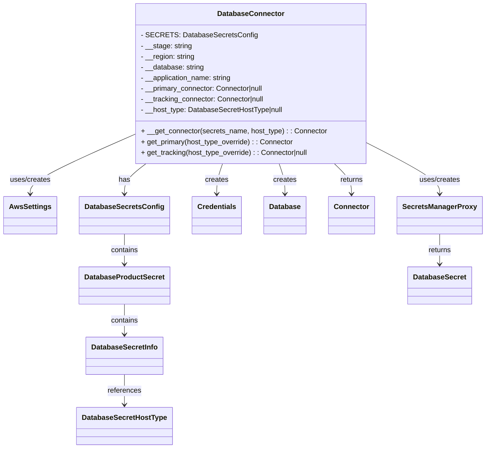
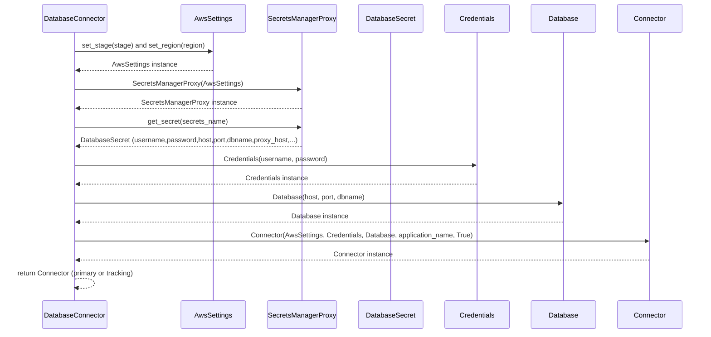

# Diagram: fv_core/fv_framework/python/fv_framework/persistence_adapter/postgresql/DatabaseConnector.py

> Auto-generated by Obscura crawlers

## Diagram 1

### SVG

<svg id="container" width="1052.625" xmlns="http://www.w3.org/2000/svg" class="classDiagram" height="1008" viewBox="0 0 1052.625 1008" role="graphics-document document" aria-roledescription="class"><g><defs><marker id="container_class-aggregationStart" class="marker aggregation class" refX="18" refY="7" markerWidth="190" markerHeight="240" orient="auto"><path d="M 18,7 L9,13 L1,7 L9,1 Z"></path></marker></defs><defs><marker id="container_class-aggregationEnd" class="marker aggregation class" refX="1" refY="7" markerWidth="20" markerHeight="28" orient="auto"><path d="M 18,7 L9,13 L1,7 L9,1 Z"></path></marker></defs><defs><marker id="container_class-extensionStart" class="marker extension class" refX="18" refY="7" markerWidth="190" markerHeight="240" orient="auto"><path d="M 1,7 L18,13 V 1 Z"></path></marker></defs><defs><marker id="container_class-extensionEnd" class="marker extension class" refX="1" refY="7" markerWidth="20" markerHeight="28" orient="auto"><path d="M 1,1 V 13 L18,7 Z"></path></marker></defs><defs><marker id="container_class-compositionStart" class="marker composition class" refX="18" refY="7" markerWidth="190" markerHeight="240" orient="auto"><path d="M 18,7 L9,13 L1,7 L9,1 Z"></path></marker></defs><defs><marker id="container_class-compositionEnd" class="marker composition class" refX="1" refY="7" markerWidth="20" markerHeight="28" orient="auto"><path d="M 18,7 L9,13 L1,7 L9,1 Z"></path></marker></defs><defs><marker id="container_class-dependencyStart" class="marker dependency class" refX="6" refY="7" markerWidth="190" markerHeight="240" orient="auto"><path d="M 5,7 L9,13 L1,7 L9,1 Z"></path></marker></defs><defs><marker id="container_class-dependencyEnd" class="marker dependency class" refX="13" refY="7" markerWidth="20" markerHeight="28" orient="auto"><path d="M 18,7 L9,13 L14,7 L9,1 Z"></path></marker></defs><defs><marker id="container_class-lollipopStart" class="marker lollipop class" refX="13" refY="7" markerWidth="190" markerHeight="240" orient="auto"><circle stroke="black" fill="transparent" cx="7" cy="7" r="6"></circle></marker></defs><defs><marker id="container_class-lollipopEnd" class="marker lollipop class" refX="1" refY="7" markerWidth="190" markerHeight="240" orient="auto"><circle stroke="black" fill="transparent" cx="7" cy="7" r="6"></circle></marker></defs><g class="root"><g class="clusters"></g><g class="edgePaths"><path d="M286.418,304.366L249.485,321.138C212.552,337.91,138.686,371.455,101.753,393.394C64.82,415.333,64.82,425.667,64.82,430.833L64.82,436" id="id_DatabaseConnector_AwsSettings_1" class="edge-thickness-normal edge-pattern-solid relation" style=";;;" data-edge="true" data-et="edge" data-id="id_DatabaseConnector_AwsSettings_1" data-points="W3sieCI6Mjg2LjQxNzk2ODc1LCJ5IjozMDQuMzY1Njg2NzcxNDE0MDZ9LHsieCI6NjQuODIwMzEyNSwieSI6NDA1fSx7IngiOjY0LjgyMDMxMjUsInkiOjQ0Mn1d" marker-end="url(#container_class-dependencyEnd)"></path><path d="M798.895,323.309L824.678,336.925C850.461,350.54,902.027,377.77,927.811,396.552C953.594,415.333,953.594,425.667,953.594,430.833L953.594,436" id="id_DatabaseConnector_SecretsManagerProxy_2" class="edge-thickness-normal edge-pattern-solid relation" style=";;;" data-edge="true" data-et="edge" data-id="id_DatabaseConnector_SecretsManagerProxy_2" data-points="W3sieCI6Nzk4Ljg5NDUzMTI1LCJ5IjozMjMuMzA5NDAxMTQwNjg0NH0seyJ4Ijo5NTMuNTkzNzUsInkiOjQwNX0seyJ4Ijo5NTMuNTkzNzUsInkiOjQ0Mn1d" marker-end="url(#container_class-dependencyEnd)"></path><path d="M480.535,368L478.407,374.167C476.279,380.333,472.022,392.667,469.894,404C467.766,415.333,467.766,425.667,467.766,430.833L467.766,436" id="id_DatabaseConnector_Credentials_3" class="edge-thickness-normal edge-pattern-solid relation" style=";;;" data-edge="true" data-et="edge" data-id="id_DatabaseConnector_Credentials_3" data-points="W3sieCI6NDgwLjUzNDk5NDIzOTYzMTMsInkiOjM2OH0seyJ4Ijo0NjcuNzY1NjI1LCJ5Ijo0MDV9LHsieCI6NDY3Ljc2NTYyNSwieSI6NDQyfV0=" marker-end="url(#container_class-dependencyEnd)"></path><path d="M604.778,368L606.906,374.167C609.034,380.333,613.29,392.667,615.419,404C617.547,415.333,617.547,425.667,617.547,430.833L617.547,436" id="id_DatabaseConnector_Database_4" class="edge-thickness-normal edge-pattern-solid relation" style=";;;" data-edge="true" data-et="edge" data-id="id_DatabaseConnector_Database_4" data-points="W3sieCI6NjA0Ljc3NzUwNTc2MDM2ODYsInkiOjM2OH0seyJ4Ijo2MTcuNTQ2ODc1LCJ5Ijo0MDV9LHsieCI6NjE3LjU0Njg3NSwieSI6NDQyfV0=" marker-end="url(#container_class-dependencyEnd)"></path><path d="M725.547,368L731.812,374.167C738.078,380.333,750.609,392.667,756.875,404C763.141,415.333,763.141,425.667,763.141,430.833L763.141,436" id="id_DatabaseConnector_Connector_5" class="edge-thickness-normal edge-pattern-solid relation" style=";;;" data-edge="true" data-et="edge" data-id="id_DatabaseConnector_Connector_5" data-points="W3sieCI6NzI1LjU0NjUxNDk3Njk1ODUsInkiOjM2OH0seyJ4Ijo3NjMuMTQwNjI1LCJ5Ijo0MDV9LHsieCI6NzYzLjE0MDYyNSwieSI6NDQyfV0=" marker-end="url(#container_class-dependencyEnd)"></path><path d="M314.747,368L306.939,374.167C299.131,380.333,283.514,392.667,275.706,404C267.898,415.333,267.898,425.667,267.898,430.833L267.898,436" id="id_DatabaseConnector_DatabaseSecretsConfig_6" class="edge-thickness-normal edge-pattern-solid relation" style=";;;" data-edge="true" data-et="edge" data-id="id_DatabaseConnector_DatabaseSecretsConfig_6" data-points="W3sieCI6MzE0Ljc0NjU0Mzc3ODgwMTksInkiOjM2OH0seyJ4IjoyNjcuODk4NDM3NSwieSI6NDA1fSx7IngiOjI2Ny44OTg0Mzc1LCJ5Ijo0NDJ9XQ==" marker-end="url(#container_class-dependencyEnd)"></path><path d="M267.898,526L267.898,532.167C267.898,538.333,267.898,550.667,267.898,562C267.898,573.333,267.898,583.667,267.898,588.833L267.898,594" id="id_DatabaseSecretsConfig_DatabaseProductSecret_7" class="edge-thickness-normal edge-pattern-solid relation" style=";;;" data-edge="true" data-et="edge" data-id="id_DatabaseSecretsConfig_DatabaseProductSecret_7" data-points="W3sieCI6MjY3Ljg5ODQzNzUsInkiOjUyNn0seyJ4IjoyNjcuODk4NDM3NSwieSI6NTYzfSx7IngiOjI2Ny44OTg0Mzc1LCJ5Ijo2MDB9XQ==" marker-end="url(#container_class-dependencyEnd)"></path><path d="M267.898,684L267.898,690.167C267.898,696.333,267.898,708.667,267.898,720C267.898,731.333,267.898,741.667,267.898,746.833L267.898,752" id="id_DatabaseProductSecret_DatabaseSecretInfo_8" class="edge-thickness-normal edge-pattern-solid relation" style=";;;" data-edge="true" data-et="edge" data-id="id_DatabaseProductSecret_DatabaseSecretInfo_8" data-points="W3sieCI6MjY3Ljg5ODQzNzUsInkiOjY4NH0seyJ4IjoyNjcuODk4NDM3NSwieSI6NzIxfSx7IngiOjI2Ny44OTg0Mzc1LCJ5Ijo3NTh9XQ==" marker-end="url(#container_class-dependencyEnd)"></path><path d="M267.898,842L267.898,848.167C267.898,854.333,267.898,866.667,267.898,878C267.898,889.333,267.898,899.667,267.898,904.833L267.898,910" id="id_DatabaseSecretInfo_DatabaseSecretHostType_9" class="edge-thickness-normal edge-pattern-solid relation" style=";;;" data-edge="true" data-et="edge" data-id="id_DatabaseSecretInfo_DatabaseSecretHostType_9" data-points="W3sieCI6MjY3Ljg5ODQzNzUsInkiOjg0Mn0seyJ4IjoyNjcuODk4NDM3NSwieSI6ODc5fSx7IngiOjI2Ny44OTg0Mzc1LCJ5Ijo5MTZ9XQ==" marker-end="url(#container_class-dependencyEnd)"></path><path d="M953.594,526L953.594,532.167C953.594,538.333,953.594,550.667,953.594,562C953.594,573.333,953.594,583.667,953.594,588.833L953.594,594" id="id_SecretsManagerProxy_DatabaseSecret_10" class="edge-thickness-normal edge-pattern-solid relation" style=";;;" data-edge="true" data-et="edge" data-id="id_SecretsManagerProxy_DatabaseSecret_10" data-points="W3sieCI6OTUzLjU5Mzc1LCJ5Ijo1MjZ9LHsieCI6OTUzLjU5Mzc1LCJ5Ijo1NjN9LHsieCI6OTUzLjU5Mzc1LCJ5Ijo2MDB9XQ==" marker-end="url(#container_class-dependencyEnd)"></path></g><g class="edgeLabels"><g class="edgeLabel" transform="translate(64.8203125, 405)"><g class="label" data-id="id_DatabaseConnector_AwsSettings_1" transform="translate(-46.421875, -12)"><foreignObject width="92.84375" height="24">

uses/creates

</foreignObject></g></g><g class="edgeLabel" transform="translate(953.59375, 405)"><g class="label" data-id="id_DatabaseConnector_SecretsManagerProxy_2" transform="translate(-46.421875, -12)"><foreignObject width="92.84375" height="24">

uses/creates

</foreignObject></g></g><g class="edgeLabel" transform="translate(467.765625, 405)"><g class="label" data-id="id_DatabaseConnector_Credentials_3" transform="translate(-26.171875, -12)"><foreignObject width="52.34375" height="24">

creates

</foreignObject></g></g><g class="edgeLabel" transform="translate(617.546875, 405)"><g class="label" data-id="id_DatabaseConnector_Database_4" transform="translate(-26.171875, -12)"><foreignObject width="52.34375" height="24">

creates

</foreignObject></g></g><g class="edgeLabel" transform="translate(763.140625, 405)"><g class="label" data-id="id_DatabaseConnector_Connector_5" transform="translate(-26.265625, -12)"><foreignObject width="52.53125" height="24">

returns

</foreignObject></g></g><g class="edgeLabel" transform="translate(267.8984375, 405)"><g class="label" data-id="id_DatabaseConnector_DatabaseSecretsConfig_6" transform="translate(-12.703125, -12)"><foreignObject width="25.40625" height="24">

has

</foreignObject></g></g><g class="edgeLabel" transform="translate(267.8984375, 563)"><g class="label" data-id="id_DatabaseSecretsConfig_DatabaseProductSecret_7" transform="translate(-30.890625, -12)"><foreignObject width="61.78125" height="24">

contains

</foreignObject></g></g><g class="edgeLabel" transform="translate(267.8984375, 721)"><g class="label" data-id="id_DatabaseProductSecret_DatabaseSecretInfo_8" transform="translate(-30.890625, -12)"><foreignObject width="61.78125" height="24">

contains

</foreignObject></g></g><g class="edgeLabel" transform="translate(267.8984375, 879)"><g class="label" data-id="id_DatabaseSecretInfo_DatabaseSecretHostType_9" transform="translate(-37.828125, -12)"><foreignObject width="75.65625" height="24">

references

</foreignObject></g></g><g class="edgeLabel" transform="translate(953.59375, 563)"><g class="label" data-id="id_SecretsManagerProxy_DatabaseSecret_10" transform="translate(-26.265625, -12)"><foreignObject width="52.53125" height="24">

returns

</foreignObject></g></g></g><g class="nodes"><g class="node default" id="classId-DatabaseConnector-0" transform="translate(542.65625, 188)"><g class="basic label-container"><path d="M-256.23828125 -180 L256.23828125 -180 L256.23828125 180 L-256.23828125 180" stroke="none" stroke-width="0" fill="#ECECFF" style=""></path><path d="M-256.23828125 -180 C-85.36799578787321 -180, 85.50228967425357 -180, 256.23828125 -180 M-256.23828125 -180 C-60.71641914814859 -180, 134.80544295370282 -180, 256.23828125 -180 M256.23828125 -180 C256.23828125 -95.88288718359259, 256.23828125 -11.765774367185173, 256.23828125 180 M256.23828125 -180 C256.23828125 -63.87802430614245, 256.23828125 52.2439513877151, 256.23828125 180 M256.23828125 180 C83.12156984140844 180, -89.99514156718311 180, -256.23828125 180 M256.23828125 180 C136.1472699470036 180, 16.056258644007187 180, -256.23828125 180 M-256.23828125 180 C-256.23828125 83.70846021783653, -256.23828125 -12.583079564326937, -256.23828125 -180 M-256.23828125 180 C-256.23828125 81.621948657162, -256.23828125 -16.756102685676012, -256.23828125 -180" stroke="#9370DB" stroke-width="1.3" fill="none" stroke-dasharray="0 0" style=""></path></g><g class="annotation-group text" transform="translate(0, -156)"></g><g class="label-group text" transform="translate(-71.5859375, -156)"><g class="label" style="font-weight: bolder" transform="translate(0,-12)"><foreignObject width="143.171875" height="24">

DatabaseConnector

</foreignObject></g></g><g class="members-group text" transform="translate(-244.23828125, -108)"><g class="label" style="" transform="translate(0,-12)"><foreignObject width="244.671875" height="24">

- SECRETS: DatabaseSecretsConfig

</foreignObject></g><g class="label" style="" transform="translate(0,12)"><foreignObject width="115.359375" height="24">

- __stage: string

</foreignObject></g><g class="label" style="" transform="translate(0,36)"><foreignObject width="122.859375" height="24">

- __region: string

</foreignObject></g><g class="label" style="" transform="translate(0,60)"><foreignObject width="143.28125" height="24">

- __database: string

</foreignObject></g><g class="label" style="" transform="translate(0,84)"><foreignObject width="207.515625" height="24">

- __application_name: string

</foreignObject></g><g class="label" style="" transform="translate(0,108)"><foreignObject width="281.109375" height="24">

- __primary_connector: Connector|null

</foreignObject></g><g class="label" style="" transform="translate(0,132)"><foreignObject width="282.828125" height="24">

- __tracking_connector: Connector|null

</foreignObject></g><g class="label" style="" transform="translate(0,156)"><foreignObject width="321.296875" height="24">

- __host_type: DatabaseSecretHostType|null

</foreignObject></g></g><g class="methods-group text" transform="translate(-244.23828125, 108)"><g class="label" style="" transform="translate(0,-12)"><foreignObject width="416.890625" height="24">

+ __get_connector(secrets_name, host_type) : : Connector

</foreignObject></g><g class="label" style="" transform="translate(0,12)"><foreignObject width="345.09375" height="24">

+ get_primary(host_type_override) : : Connector

</foreignObject></g><g class="label" style="" transform="translate(0,36)"><foreignObject width="380.78125" height="24">

+ get_tracking(host_type_override) : : Connector|null

</foreignObject></g></g><g class="divider" style=""><path d="M-256.23828125 -132 C-139.4779039995475 -132, -22.717526749094958 -132, 256.23828125 -132 M-256.23828125 -132 C-121.46486467179582 -132, 13.308551906408354 -132, 256.23828125 -132" stroke="#9370DB" stroke-width="1.3" fill="none" stroke-dasharray="0 0" style=""></path></g><g class="divider" style=""><path d="M-256.23828125 84 C-135.93234202133476 84, -15.626402792669552 84, 256.23828125 84 M-256.23828125 84 C-111.1852782952958 84, 33.867724659408395 84, 256.23828125 84" stroke="#9370DB" stroke-width="1.3" fill="none" stroke-dasharray="0 0" style=""></path></g></g><g class="node default" id="classId-AwsSettings-1" transform="translate(64.8203125, 484)"><g class="basic label-container"><path d="M-56.8203125 -42 L56.8203125 -42 L56.8203125 42 L-56.8203125 42" stroke="none" stroke-width="0" fill="#ECECFF" style=""></path><path d="M-56.8203125 -42 C-28.495251996194202 -42, -0.1701914923884047 -42, 56.8203125 -42 M-56.8203125 -42 C-13.212072246525615 -42, 30.39616800694877 -42, 56.8203125 -42 M56.8203125 -42 C56.8203125 -13.652636725108053, 56.8203125 14.694726549783894, 56.8203125 42 M56.8203125 -42 C56.8203125 -23.719356013785433, 56.8203125 -5.438712027570865, 56.8203125 42 M56.8203125 42 C20.664863418521144 42, -15.490585662957713 42, -56.8203125 42 M56.8203125 42 C14.739852411139374 42, -27.340607677721252 42, -56.8203125 42 M-56.8203125 42 C-56.8203125 19.629186457543685, -56.8203125 -2.741627084912629, -56.8203125 -42 M-56.8203125 42 C-56.8203125 20.558258360508805, -56.8203125 -0.8834832789823892, -56.8203125 -42" stroke="#9370DB" stroke-width="1.3" fill="none" stroke-dasharray="0 0" style=""></path></g><g class="annotation-group text" transform="translate(0, -18)"></g><g class="label-group text" transform="translate(-44.8203125, -18)"><g class="label" style="font-weight: bolder" transform="translate(0,-12)"><foreignObject width="89.640625" height="24">

AwsSettings

</foreignObject></g></g><g class="members-group text" transform="translate(-44.8203125, 30)"></g><g class="methods-group text" transform="translate(-44.8203125, 60)"></g><g class="divider" style=""><path d="M-56.8203125 6 C-23.506852422698977 6, 9.806607654602047 6, 56.8203125 6 M-56.8203125 6 C-25.912144873908048 6, 4.9960227521839045 6, 56.8203125 6" stroke="#9370DB" stroke-width="1.3" fill="none" stroke-dasharray="0 0" style=""></path></g><g class="divider" style=""><path d="M-56.8203125 24 C-28.93645811749464 24, -1.0526037349892832 24, 56.8203125 24 M-56.8203125 24 C-15.062335267006027 24, 26.695641965987946 24, 56.8203125 24" stroke="#9370DB" stroke-width="1.3" fill="none" stroke-dasharray="0 0" style=""></path></g></g><g class="node default" id="classId-SecretsManagerProxy-2" transform="translate(953.59375, 484)"><g class="basic label-container"><path d="M-91.03125 -42 L91.03125 -42 L91.03125 42 L-91.03125 42" stroke="none" stroke-width="0" fill="#ECECFF" style=""></path><path d="M-91.03125 -42 C-54.39370043929388 -42, -17.75615087858776 -42, 91.03125 -42 M-91.03125 -42 C-52.63674239273605 -42, -14.242234785472107 -42, 91.03125 -42 M91.03125 -42 C91.03125 -8.985492507626219, 91.03125 24.029014984747562, 91.03125 42 M91.03125 -42 C91.03125 -14.552233447872172, 91.03125 12.895533104255655, 91.03125 42 M91.03125 42 C40.67328578766866 42, -9.684678424662678 42, -91.03125 42 M91.03125 42 C27.96300404534731 42, -35.10524190930538 42, -91.03125 42 M-91.03125 42 C-91.03125 20.70817104443241, -91.03125 -0.5836579111351767, -91.03125 -42 M-91.03125 42 C-91.03125 23.845325975102295, -91.03125 5.69065195020459, -91.03125 -42" stroke="#9370DB" stroke-width="1.3" fill="none" stroke-dasharray="0 0" style=""></path></g><g class="annotation-group text" transform="translate(0, -18)"></g><g class="label-group text" transform="translate(-79.03125, -18)"><g class="label" style="font-weight: bolder" transform="translate(0,-12)"><foreignObject width="158.0625" height="24">

SecretsManagerProxy

</foreignObject></g></g><g class="members-group text" transform="translate(-79.03125, 30)"></g><g class="methods-group text" transform="translate(-79.03125, 60)"></g><g class="divider" style=""><path d="M-91.03125 6 C-35.54148018780992 6, 19.948289624380166 6, 91.03125 6 M-91.03125 6 C-46.46325541599009 6, -1.8952608319801811 6, 91.03125 6" stroke="#9370DB" stroke-width="1.3" fill="none" stroke-dasharray="0 0" style=""></path></g><g class="divider" style=""><path d="M-91.03125 24 C-19.059084010579966 24, 52.91308197884007 24, 91.03125 24 M-91.03125 24 C-19.40044246957757 24, 52.23036506084486 24, 91.03125 24" stroke="#9370DB" stroke-width="1.3" fill="none" stroke-dasharray="0 0" style=""></path></g></g><g class="node default" id="classId-Credentials-3" transform="translate(467.765625, 484)"><g class="basic label-container"><path d="M-53.609375 -42 L53.609375 -42 L53.609375 42 L-53.609375 42" stroke="none" stroke-width="0" fill="#ECECFF" style=""></path><path d="M-53.609375 -42 C-15.783729537315345 -42, 22.04191592536931 -42, 53.609375 -42 M-53.609375 -42 C-30.28714532185281 -42, -6.964915643705623 -42, 53.609375 -42 M53.609375 -42 C53.609375 -15.795137711499773, 53.609375 10.409724577000453, 53.609375 42 M53.609375 -42 C53.609375 -19.024735299860588, 53.609375 3.9505294002788247, 53.609375 42 M53.609375 42 C27.697546116865805 42, 1.78571723373161 42, -53.609375 42 M53.609375 42 C20.300549753892952 42, -13.008275492214096 42, -53.609375 42 M-53.609375 42 C-53.609375 11.186635893864782, -53.609375 -19.626728212270436, -53.609375 -42 M-53.609375 42 C-53.609375 10.584000036568327, -53.609375 -20.831999926863347, -53.609375 -42" stroke="#9370DB" stroke-width="1.3" fill="none" stroke-dasharray="0 0" style=""></path></g><g class="annotation-group text" transform="translate(0, -18)"></g><g class="label-group text" transform="translate(-41.609375, -18)"><g class="label" style="font-weight: bolder" transform="translate(0,-12)"><foreignObject width="83.21875" height="24">

Credentials

</foreignObject></g></g><g class="members-group text" transform="translate(-41.609375, 30)"></g><g class="methods-group text" transform="translate(-41.609375, 60)"></g><g class="divider" style=""><path d="M-53.609375 6 C-16.74556604872317 6, 20.11824290255366 6, 53.609375 6 M-53.609375 6 C-20.422171684485804 6, 12.765031631028393 6, 53.609375 6" stroke="#9370DB" stroke-width="1.3" fill="none" stroke-dasharray="0 0" style=""></path></g><g class="divider" style=""><path d="M-53.609375 24 C-23.911829793983756 24, 5.785715412032488 24, 53.609375 24 M-53.609375 24 C-26.300776502307986 24, 1.0078219953840275 24, 53.609375 24" stroke="#9370DB" stroke-width="1.3" fill="none" stroke-dasharray="0 0" style=""></path></g></g><g class="node default" id="classId-Database-4" transform="translate(617.546875, 484)"><g class="basic label-container"><path d="M-46.171875 -42 L46.171875 -42 L46.171875 42 L-46.171875 42" stroke="none" stroke-width="0" fill="#ECECFF" style=""></path><path d="M-46.171875 -42 C-9.484867525886429 -42, 27.202139948227142 -42, 46.171875 -42 M-46.171875 -42 C-13.170366425371427 -42, 19.831142149257147 -42, 46.171875 -42 M46.171875 -42 C46.171875 -17.1272659798286, 46.171875 7.7454680403428, 46.171875 42 M46.171875 -42 C46.171875 -18.460475960722036, 46.171875 5.079048078555928, 46.171875 42 M46.171875 42 C14.28419000241772 42, -17.60349499516456 42, -46.171875 42 M46.171875 42 C11.13045439752215 42, -23.9109662049557 42, -46.171875 42 M-46.171875 42 C-46.171875 19.140896638806357, -46.171875 -3.7182067223872863, -46.171875 -42 M-46.171875 42 C-46.171875 16.902832137412677, -46.171875 -8.194335725174646, -46.171875 -42" stroke="#9370DB" stroke-width="1.3" fill="none" stroke-dasharray="0 0" style=""></path></g><g class="annotation-group text" transform="translate(0, -18)"></g><g class="label-group text" transform="translate(-34.171875, -18)"><g class="label" style="font-weight: bolder" transform="translate(0,-12)"><foreignObject width="68.34375" height="24">

Database

</foreignObject></g></g><g class="members-group text" transform="translate(-34.171875, 30)"></g><g class="methods-group text" transform="translate(-34.171875, 60)"></g><g class="divider" style=""><path d="M-46.171875 6 C-13.493280888499946 6, 19.185313223000108 6, 46.171875 6 M-46.171875 6 C-10.210694827381474 6, 25.750485345237053 6, 46.171875 6" stroke="#9370DB" stroke-width="1.3" fill="none" stroke-dasharray="0 0" style=""></path></g><g class="divider" style=""><path d="M-46.171875 24 C-10.939400326046623 24, 24.293074347906753 24, 46.171875 24 M-46.171875 24 C-23.92030714541662 24, -1.668739290833237 24, 46.171875 24" stroke="#9370DB" stroke-width="1.3" fill="none" stroke-dasharray="0 0" style=""></path></g></g><g class="node default" id="classId-Connector-5" transform="translate(763.140625, 484)"><g class="basic label-container"><path d="M-49.421875 -42 L49.421875 -42 L49.421875 42 L-49.421875 42" stroke="none" stroke-width="0" fill="#ECECFF" style=""></path><path d="M-49.421875 -42 C-16.336132197791898 -42, 16.749610604416205 -42, 49.421875 -42 M-49.421875 -42 C-17.966344887144135 -42, 13.48918522571173 -42, 49.421875 -42 M49.421875 -42 C49.421875 -18.34304799751525, 49.421875 5.313904004969501, 49.421875 42 M49.421875 -42 C49.421875 -14.120231490649804, 49.421875 13.759537018700392, 49.421875 42 M49.421875 42 C15.335724137538222 42, -18.750426724923557 42, -49.421875 42 M49.421875 42 C17.931420927907617 42, -13.559033144184767 42, -49.421875 42 M-49.421875 42 C-49.421875 9.113518803600385, -49.421875 -23.77296239279923, -49.421875 -42 M-49.421875 42 C-49.421875 8.96226670585743, -49.421875 -24.07546658828514, -49.421875 -42" stroke="#9370DB" stroke-width="1.3" fill="none" stroke-dasharray="0 0" style=""></path></g><g class="annotation-group text" transform="translate(0, -18)"></g><g class="label-group text" transform="translate(-37.421875, -18)"><g class="label" style="font-weight: bolder" transform="translate(0,-12)"><foreignObject width="74.84375" height="24">

Connector

</foreignObject></g></g><g class="members-group text" transform="translate(-37.421875, 30)"></g><g class="methods-group text" transform="translate(-37.421875, 60)"></g><g class="divider" style=""><path d="M-49.421875 6 C-26.47222249002092 6, -3.522569980041837 6, 49.421875 6 M-49.421875 6 C-22.31254395465075 6, 4.796787090698501 6, 49.421875 6" stroke="#9370DB" stroke-width="1.3" fill="none" stroke-dasharray="0 0" style=""></path></g><g class="divider" style=""><path d="M-49.421875 24 C-12.375957364794523 24, 24.669960270410954 24, 49.421875 24 M-49.421875 24 C-27.788486052466595 24, -6.155097104933191 24, 49.421875 24" stroke="#9370DB" stroke-width="1.3" fill="none" stroke-dasharray="0 0" style=""></path></g></g><g class="node default" id="classId-DatabaseSecretsConfig-6" transform="translate(267.8984375, 484)"><g class="basic label-container"><path d="M-96.2578125 -42 L96.2578125 -42 L96.2578125 42 L-96.2578125 42" stroke="none" stroke-width="0" fill="#ECECFF" style=""></path><path d="M-96.2578125 -42 C-36.19543089379887 -42, 23.866950712402257 -42, 96.2578125 -42 M-96.2578125 -42 C-45.19057874595403 -42, 5.876655008091944 -42, 96.2578125 -42 M96.2578125 -42 C96.2578125 -22.45035347788362, 96.2578125 -2.900706955767241, 96.2578125 42 M96.2578125 -42 C96.2578125 -12.091307818656983, 96.2578125 17.817384362686035, 96.2578125 42 M96.2578125 42 C54.78096203444905 42, 13.304111568898094 42, -96.2578125 42 M96.2578125 42 C24.2890952139185 42, -47.679622072163 42, -96.2578125 42 M-96.2578125 42 C-96.2578125 13.193936628129894, -96.2578125 -15.612126743740212, -96.2578125 -42 M-96.2578125 42 C-96.2578125 16.612968502522083, -96.2578125 -8.774062994955834, -96.2578125 -42" stroke="#9370DB" stroke-width="1.3" fill="none" stroke-dasharray="0 0" style=""></path></g><g class="annotation-group text" transform="translate(0, -18)"></g><g class="label-group text" transform="translate(-84.2578125, -18)"><g class="label" style="font-weight: bolder" transform="translate(0,-12)"><foreignObject width="168.515625" height="24">

DatabaseSecretsConfig

</foreignObject></g></g><g class="members-group text" transform="translate(-84.2578125, 30)"></g><g class="methods-group text" transform="translate(-84.2578125, 60)"></g><g class="divider" style=""><path d="M-96.2578125 6 C-43.02050994190438 6, 10.216792616191242 6, 96.2578125 6 M-96.2578125 6 C-46.11942436574915 6, 4.018963768501706 6, 96.2578125 6" stroke="#9370DB" stroke-width="1.3" fill="none" stroke-dasharray="0 0" style=""></path></g><g class="divider" style=""><path d="M-96.2578125 24 C-37.56839087383369 24, 21.121030752332615 24, 96.2578125 24 M-96.2578125 24 C-49.31643127232848 24, -2.375050044656959 24, 96.2578125 24" stroke="#9370DB" stroke-width="1.3" fill="none" stroke-dasharray="0 0" style=""></path></g></g><g class="node default" id="classId-DatabaseProductSecret-7" transform="translate(267.8984375, 642)"><g class="basic label-container"><path d="M-98.046875 -42 L98.046875 -42 L98.046875 42 L-98.046875 42" stroke="none" stroke-width="0" fill="#ECECFF" style=""></path><path d="M-98.046875 -42 C-27.52415562483901 -42, 42.99856375032198 -42, 98.046875 -42 M-98.046875 -42 C-53.11711978597718 -42, -8.187364571954362 -42, 98.046875 -42 M98.046875 -42 C98.046875 -9.549718700980087, 98.046875 22.900562598039826, 98.046875 42 M98.046875 -42 C98.046875 -19.323187418030276, 98.046875 3.353625163939448, 98.046875 42 M98.046875 42 C50.766428367620016 42, 3.4859817352400313 42, -98.046875 42 M98.046875 42 C35.261339789644175 42, -27.52419542071165 42, -98.046875 42 M-98.046875 42 C-98.046875 22.07425010637983, -98.046875 2.1485002127596573, -98.046875 -42 M-98.046875 42 C-98.046875 22.269115467150034, -98.046875 2.538230934300067, -98.046875 -42" stroke="#9370DB" stroke-width="1.3" fill="none" stroke-dasharray="0 0" style=""></path></g><g class="annotation-group text" transform="translate(0, -18)"></g><g class="label-group text" transform="translate(-86.046875, -18)"><g class="label" style="font-weight: bolder" transform="translate(0,-12)"><foreignObject width="172.09375" height="24">

DatabaseProductSecret

</foreignObject></g></g><g class="members-group text" transform="translate(-86.046875, 30)"></g><g class="methods-group text" transform="translate(-86.046875, 60)"></g><g class="divider" style=""><path d="M-98.046875 6 C-50.609831252206014 6, -3.172787504412028 6, 98.046875 6 M-98.046875 6 C-55.74663386936282 6, -13.446392738725635 6, 98.046875 6" stroke="#9370DB" stroke-width="1.3" fill="none" stroke-dasharray="0 0" style=""></path></g><g class="divider" style=""><path d="M-98.046875 24 C-38.75348052579243 24, 20.539913948415133 24, 98.046875 24 M-98.046875 24 C-49.86099011578669 24, -1.675105231573383 24, 98.046875 24" stroke="#9370DB" stroke-width="1.3" fill="none" stroke-dasharray="0 0" style=""></path></g></g><g class="node default" id="classId-DatabaseSecretInfo-8" transform="translate(267.8984375, 800)"><g class="basic label-container"><path d="M-83.8671875 -42 L83.8671875 -42 L83.8671875 42 L-83.8671875 42" stroke="none" stroke-width="0" fill="#ECECFF" style=""></path><path d="M-83.8671875 -42 C-27.883573426494962 -42, 28.100040647010076 -42, 83.8671875 -42 M-83.8671875 -42 C-21.672470691266284 -42, 40.52224611746743 -42, 83.8671875 -42 M83.8671875 -42 C83.8671875 -16.363185279825224, 83.8671875 9.273629440349552, 83.8671875 42 M83.8671875 -42 C83.8671875 -9.464115640290146, 83.8671875 23.07176871941971, 83.8671875 42 M83.8671875 42 C29.391859505927478 42, -25.083468488145044 42, -83.8671875 42 M83.8671875 42 C43.08605473997647 42, 2.304921979952937 42, -83.8671875 42 M-83.8671875 42 C-83.8671875 18.92102815637966, -83.8671875 -4.157943687240682, -83.8671875 -42 M-83.8671875 42 C-83.8671875 13.441362768607924, -83.8671875 -15.117274462784152, -83.8671875 -42" stroke="#9370DB" stroke-width="1.3" fill="none" stroke-dasharray="0 0" style=""></path></g><g class="annotation-group text" transform="translate(0, -18)"></g><g class="label-group text" transform="translate(-71.8671875, -18)"><g class="label" style="font-weight: bolder" transform="translate(0,-12)"><foreignObject width="143.734375" height="24">

DatabaseSecretInfo

</foreignObject></g></g><g class="members-group text" transform="translate(-71.8671875, 30)"></g><g class="methods-group text" transform="translate(-71.8671875, 60)"></g><g class="divider" style=""><path d="M-83.8671875 6 C-19.036303115599026 6, 45.79458126880195 6, 83.8671875 6 M-83.8671875 6 C-46.33120565538667 6, -8.795223810773336 6, 83.8671875 6" stroke="#9370DB" stroke-width="1.3" fill="none" stroke-dasharray="0 0" style=""></path></g><g class="divider" style=""><path d="M-83.8671875 24 C-40.020975637833374 24, 3.8252362243332527 24, 83.8671875 24 M-83.8671875 24 C-45.18065749728116 24, -6.494127494562321 24, 83.8671875 24" stroke="#9370DB" stroke-width="1.3" fill="none" stroke-dasharray="0 0" style=""></path></g></g><g class="node default" id="classId-DatabaseSecretHostType-9" transform="translate(267.8984375, 958)"><g class="basic label-container"><path d="M-103.7578125 -42 L103.7578125 -42 L103.7578125 42 L-103.7578125 42" stroke="none" stroke-width="0" fill="#ECECFF" style=""></path><path d="M-103.7578125 -42 C-35.77166449543262 -42, 32.214483509134766 -42, 103.7578125 -42 M-103.7578125 -42 C-33.26901544729077 -42, 37.21978160541846 -42, 103.7578125 -42 M103.7578125 -42 C103.7578125 -18.610918737309024, 103.7578125 4.778162525381951, 103.7578125 42 M103.7578125 -42 C103.7578125 -11.67861250746256, 103.7578125 18.64277498507488, 103.7578125 42 M103.7578125 42 C55.7572990742694 42, 7.756785648538795 42, -103.7578125 42 M103.7578125 42 C61.56945578275329 42, 19.381099065506575 42, -103.7578125 42 M-103.7578125 42 C-103.7578125 15.491552166791976, -103.7578125 -11.016895666416048, -103.7578125 -42 M-103.7578125 42 C-103.7578125 20.32184942832135, -103.7578125 -1.3563011433572996, -103.7578125 -42" stroke="#9370DB" stroke-width="1.3" fill="none" stroke-dasharray="0 0" style=""></path></g><g class="annotation-group text" transform="translate(0, -18)"></g><g class="label-group text" transform="translate(-91.7578125, -18)"><g class="label" style="font-weight: bolder" transform="translate(0,-12)"><foreignObject width="183.515625" height="24">

DatabaseSecretHostType

</foreignObject></g></g><g class="members-group text" transform="translate(-91.7578125, 30)"></g><g class="methods-group text" transform="translate(-91.7578125, 60)"></g><g class="divider" style=""><path d="M-103.7578125 6 C-39.05842400475794 6, 25.640964490484123 6, 103.7578125 6 M-103.7578125 6 C-43.79718373564199 6, 16.163445028716026 6, 103.7578125 6" stroke="#9370DB" stroke-width="1.3" fill="none" stroke-dasharray="0 0" style=""></path></g><g class="divider" style=""><path d="M-103.7578125 24 C-42.013725163261235 24, 19.73036217347753 24, 103.7578125 24 M-103.7578125 24 C-44.31033494738303 24, 15.137142605233933 24, 103.7578125 24" stroke="#9370DB" stroke-width="1.3" fill="none" stroke-dasharray="0 0" style=""></path></g></g><g class="node default" id="classId-DatabaseSecret-10" transform="translate(953.59375, 642)"><g class="basic label-container"><path d="M-69.46875 -42 L69.46875 -42 L69.46875 42 L-69.46875 42" stroke="none" stroke-width="0" fill="#ECECFF" style=""></path><path d="M-69.46875 -42 C-40.55941085697796 -42, -11.650071713955931 -42, 69.46875 -42 M-69.46875 -42 C-18.53620794999894 -42, 32.39633410000212 -42, 69.46875 -42 M69.46875 -42 C69.46875 -9.06577650425384, 69.46875 23.86844699149232, 69.46875 42 M69.46875 -42 C69.46875 -17.209845277422392, 69.46875 7.5803094451552155, 69.46875 42 M69.46875 42 C19.554223950997034 42, -30.36030209800593 42, -69.46875 42 M69.46875 42 C37.09795266280348 42, 4.727155325606958 42, -69.46875 42 M-69.46875 42 C-69.46875 21.931556534884486, -69.46875 1.8631130697689713, -69.46875 -42 M-69.46875 42 C-69.46875 20.513027774777306, -69.46875 -0.9739444504453871, -69.46875 -42" stroke="#9370DB" stroke-width="1.3" fill="none" stroke-dasharray="0 0" style=""></path></g><g class="annotation-group text" transform="translate(0, -18)"></g><g class="label-group text" transform="translate(-57.46875, -18)"><g class="label" style="font-weight: bolder" transform="translate(0,-12)"><foreignObject width="114.9375" height="24">

DatabaseSecret

</foreignObject></g></g><g class="members-group text" transform="translate(-57.46875, 30)"></g><g class="methods-group text" transform="translate(-57.46875, 60)"></g><g class="divider" style=""><path d="M-69.46875 6 C-34.98499495307449 6, -0.5012399061489816 6, 69.46875 6 M-69.46875 6 C-18.936576150310515 6, 31.59559769937897 6, 69.46875 6" stroke="#9370DB" stroke-width="1.3" fill="none" stroke-dasharray="0 0" style=""></path></g><g class="divider" style=""><path d="M-69.46875 24 C-36.925745432552134 24, -4.382740865104267 24, 69.46875 24 M-69.46875 24 C-16.922031391823566 24, 35.62468721635287 24, 69.46875 24" stroke="#9370DB" stroke-width="1.3" fill="none" stroke-dasharray="0 0" style=""></path></g></g></g></g></g></svg>

## Diagram 2

> SVG rendering failed for this diagram.
