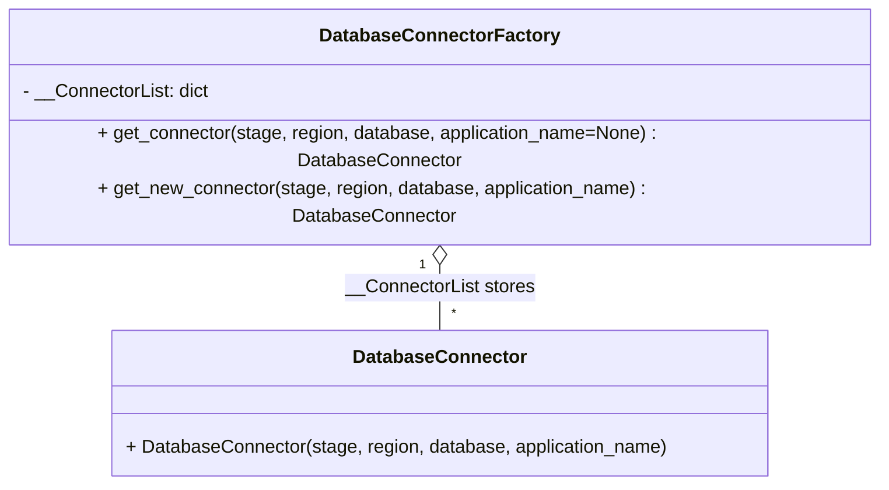

# Diagram: fv_core/fv_framework/python/fv_framework/persistence_adapter/postgresql/DatabaseConnectorFactory.py

> Auto-generated by Obscura crawlers

## Mermaid

### SVG

<svg id="container" width="770.359375" xmlns="http://www.w3.org/2000/svg" class="classDiagram" height="384" viewBox="0 0 770.359375 384" role="graphics-document document" aria-roledescription="class"><g><defs><marker id="container_class-aggregationStart" class="marker aggregation class" refX="18" refY="7" markerWidth="190" markerHeight="240" orient="auto"><path d="M 18,7 L9,13 L1,7 L9,1 Z"></path></marker></defs><defs><marker id="container_class-aggregationEnd" class="marker aggregation class" refX="1" refY="7" markerWidth="20" markerHeight="28" orient="auto"><path d="M 18,7 L9,13 L1,7 L9,1 Z"></path></marker></defs><defs><marker id="container_class-extensionStart" class="marker extension class" refX="18" refY="7" markerWidth="190" markerHeight="240" orient="auto"><path d="M 1,7 L18,13 V 1 Z"></path></marker></defs><defs><marker id="container_class-extensionEnd" class="marker extension class" refX="1" refY="7" markerWidth="20" markerHeight="28" orient="auto"><path d="M 1,1 V 13 L18,7 Z"></path></marker></defs><defs><marker id="container_class-compositionStart" class="marker composition class" refX="18" refY="7" markerWidth="190" markerHeight="240" orient="auto"><path d="M 18,7 L9,13 L1,7 L9,1 Z"></path></marker></defs><defs><marker id="container_class-compositionEnd" class="marker composition class" refX="1" refY="7" markerWidth="20" markerHeight="28" orient="auto"><path d="M 18,7 L9,13 L1,7 L9,1 Z"></path></marker></defs><defs><marker id="container_class-dependencyStart" class="marker dependency class" refX="6" refY="7" markerWidth="190" markerHeight="240" orient="auto"><path d="M 5,7 L9,13 L1,7 L9,1 Z"></path></marker></defs><defs><marker id="container_class-dependencyEnd" class="marker dependency class" refX="13" refY="7" markerWidth="20" markerHeight="28" orient="auto"><path d="M 18,7 L9,13 L14,7 L9,1 Z"></path></marker></defs><defs><marker id="container_class-lollipopStart" class="marker lollipop class" refX="13" refY="7" markerWidth="190" markerHeight="240" orient="auto"><circle stroke="black" fill="transparent" cx="7" cy="7" r="6"></circle></marker></defs><defs><marker id="container_class-lollipopEnd" class="marker lollipop class" refX="1" refY="7" markerWidth="190" markerHeight="240" orient="auto"><circle stroke="black" fill="transparent" cx="7" cy="7" r="6"></circle></marker></defs><g class="root"><g class="clusters"></g><g class="edgePaths"><path d="M385.18,193.25L385.18,196.542C385.18,199.833,385.18,206.417,385.18,215.875C385.18,225.333,385.18,237.667,385.18,243.833L385.18,250" id="id_DatabaseConnectorFactory_DatabaseConnector_1" class="edge-thickness-normal edge-pattern-solid relation" style=";;;" data-edge="true" data-et="edge" data-id="id_DatabaseConnectorFactory_DatabaseConnector_1" data-points="W3sieCI6Mzg1LjE3OTY4NzUsInkiOjE3Nn0seyJ4IjozODUuMTc5Njg3NSwieSI6MjEzfSx7IngiOjM4NS4xNzk2ODc1LCJ5IjoyNTB9XQ==" marker-start="url(#container_class-aggregationStart)"></path></g><g class="edgeLabels"><g class="edgeLabel" transform="translate(385.1796875, 213)"><g class="label" data-id="id_DatabaseConnectorFactory_DatabaseConnector_1" transform="translate(-82.109375, -12)"><foreignObject width="164.21875" height="24">

__ConnectorList stores

</foreignObject></g></g><g class="edgeTerminals" transform="translate(370.17968875, 193.50000107142858)"><g class="inner" transform="translate(0, 0)"><foreignObject style="width: 9px; height: 12px;">
1
</foreignObject></g></g><g class="edgeTerminals" transform="translate(395.1796887499999, 227.50000107142858)"><g class="inner" transform="translate(0, 0)"></g><foreignObject style="width: 9px; height: 12px;">
*
</foreignObject></g></g><g class="nodes"><g class="node default" id="classId-DatabaseConnectorFactory-0" transform="translate(385.1796875, 92)"><g class="basic label-container"><path d="M-377.1796875 -84 L377.1796875 -84 L377.1796875 84 L-377.1796875 84" stroke="none" stroke-width="0" fill="#ECECFF" style=""></path><path d="M-377.1796875 -84 C-179.99503481198605 -84, 17.18961787602791 -84, 377.1796875 -84 M-377.1796875 -84 C-218.78030565331605 -84, -60.3809238066321 -84, 377.1796875 -84 M377.1796875 -84 C377.1796875 -18.140887362276402, 377.1796875 47.718225275447196, 377.1796875 84 M377.1796875 -84 C377.1796875 -35.142985687715694, 377.1796875 13.714028624568613, 377.1796875 84 M377.1796875 84 C135.4866618927809 84, -106.20636371443823 84, -377.1796875 84 M377.1796875 84 C210.28220912846757 84, 43.38473075693514 84, -377.1796875 84 M-377.1796875 84 C-377.1796875 47.4016381907392, -377.1796875 10.803276381478398, -377.1796875 -84 M-377.1796875 84 C-377.1796875 45.05872989179236, -377.1796875 6.117459783584721, -377.1796875 -84" stroke="#9370DB" stroke-width="1.3" fill="none" stroke-dasharray="0 0" style=""></path></g><g class="annotation-group text" transform="translate(0, -60)"></g><g class="label-group text" transform="translate(-98.1875, -60)"><g class="label" style="font-weight: bolder" transform="translate(0,-12)"><foreignObject width="196.375" height="24">

DatabaseConnectorFactory

</foreignObject></g></g><g class="members-group text" transform="translate(-365.1796875, -12)"><g class="label" style="" transform="translate(0,-12)"><foreignObject width="162.078125" height="24">

- __ConnectorList: dict

</foreignObject></g></g><g class="methods-group text" transform="translate(-365.1796875, 36)"><g class="label" style="" transform="translate(0,-12)"><foreignObject width="632.171875" height="24">

+ get_connector(stage, region, database, application_name=None) : DatabaseConnector

</foreignObject></g><g class="label" style="" transform="translate(0,12)"><foreignObject width="623.375" height="24">

+ get_new_connector(stage, region, database, application_name) : DatabaseConnector

</foreignObject></g></g><g class="divider" style=""><path d="M-377.1796875 -36 C-216.19021885022127 -36, -55.20075020044254 -36, 377.1796875 -36 M-377.1796875 -36 C-98.7529585043552 -36, 179.6737704912896 -36, 377.1796875 -36" stroke="#9370DB" stroke-width="1.3" fill="none" stroke-dasharray="0 0" style=""></path></g><g class="divider" style=""><path d="M-377.1796875 12 C-103.54071488315776 12, 170.09825773368448 12, 377.1796875 12 M-377.1796875 12 C-219.9949561286571 12, -62.81022475731419 12, 377.1796875 12" stroke="#9370DB" stroke-width="1.3" fill="none" stroke-dasharray="0 0" style=""></path></g></g><g class="node default" id="classId-DatabaseConnector-1" transform="translate(385.1796875, 313)"><g class="basic label-container"><path d="M-282.83203125 -63 L282.83203125 -63 L282.83203125 63 L-282.83203125 63" stroke="none" stroke-width="0" fill="#ECECFF" style=""></path><path d="M-282.83203125 -63 C-126.5315530831526 -63, 29.768925083694796 -63, 282.83203125 -63 M-282.83203125 -63 C-146.35520061201953 -63, -9.87836997403906 -63, 282.83203125 -63 M282.83203125 -63 C282.83203125 -16.100371956459114, 282.83203125 30.799256087081773, 282.83203125 63 M282.83203125 -63 C282.83203125 -33.36525699929311, 282.83203125 -3.7305139985862183, 282.83203125 63 M282.83203125 63 C100.75579703613317 63, -81.32043717773365 63, -282.83203125 63 M282.83203125 63 C142.09978272386965 63, 1.3675341977393032 63, -282.83203125 63 M-282.83203125 63 C-282.83203125 34.600984120218115, -282.83203125 6.20196824043623, -282.83203125 -63 M-282.83203125 63 C-282.83203125 24.406582085606274, -282.83203125 -14.186835828787451, -282.83203125 -63" stroke="#9370DB" stroke-width="1.3" fill="none" stroke-dasharray="0 0" style=""></path></g><g class="annotation-group text" transform="translate(0, -39)"></g><g class="label-group text" transform="translate(-71.5859375, -39)"><g class="label" style="font-weight: bolder" transform="translate(0,-12)"><foreignObject width="143.171875" height="24">

DatabaseConnector

</foreignObject></g></g><g class="members-group text" transform="translate(-270.83203125, 9)"></g><g class="methods-group text" transform="translate(-270.83203125, 39)"><g class="label" style="" transform="translate(0,-12)"><foreignObject width="470.078125" height="24">

+ DatabaseConnector(stage, region, database, application_name)

</foreignObject></g></g><g class="divider" style=""><path d="M-282.83203125 -15 C-84.4209596011759 -15, 113.99011204764821 -15, 282.83203125 -15 M-282.83203125 -15 C-113.95338366405869 -15, 54.92526392188262 -15, 282.83203125 -15" stroke="#9370DB" stroke-width="1.3" fill="none" stroke-dasharray="0 0" style=""></path></g><g class="divider" style=""><path d="M-282.83203125 9 C-128.02558795444946 9, 26.780855341101073 9, 282.83203125 9 M-282.83203125 9 C-128.09943130698326 9, 26.633168636033474 9, 282.83203125 9" stroke="#9370DB" stroke-width="1.3" fill="none" stroke-dasharray="0 0" style=""></path></g></g></g></g></g></svg>
