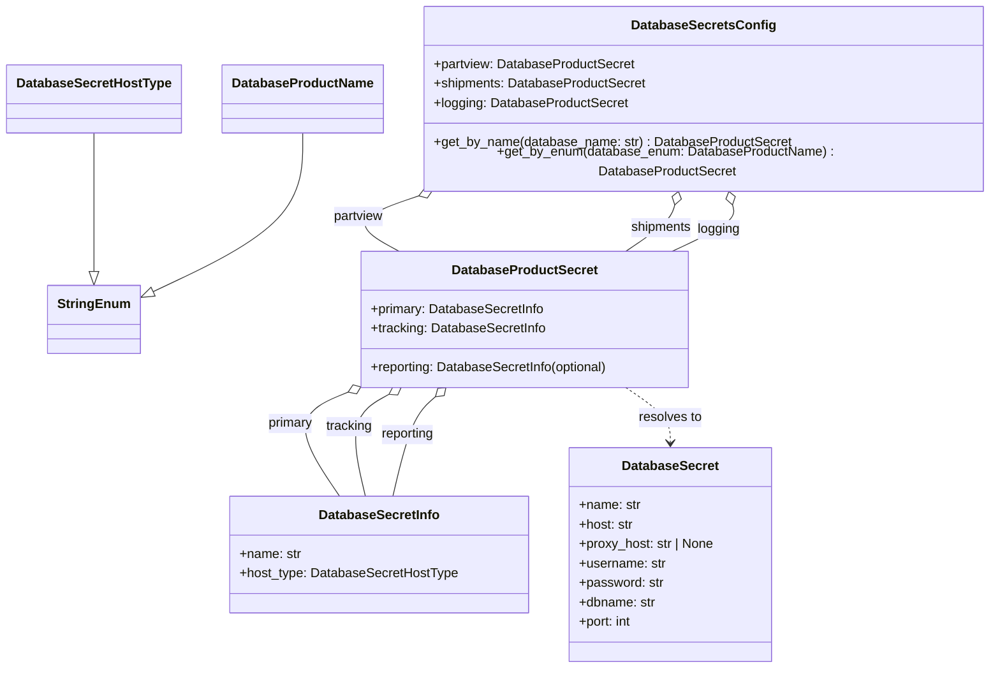

# Diagram: fv_core/fv_framework/python/fv_framework/persistence_adapter/postgresql/DatabaseConnectorModels.py

> Auto-generated by Obscura crawlers

## Mermaid

### SVG

<svg id="container" width="1208.6796875" xmlns="http://www.w3.org/2000/svg" class="classDiagram" height="812" viewBox="0 0 1208.6796875 812" role="graphics-document document" aria-roledescription="class"><g><defs><marker id="container_class-aggregationStart" class="marker aggregation class" refX="18" refY="7" markerWidth="190" markerHeight="240" orient="auto"><path d="M 18,7 L9,13 L1,7 L9,1 Z"></path></marker></defs><defs><marker id="container_class-aggregationEnd" class="marker aggregation class" refX="1" refY="7" markerWidth="20" markerHeight="28" orient="auto"><path d="M 18,7 L9,13 L1,7 L9,1 Z"></path></marker></defs><defs><marker id="container_class-extensionStart" class="marker extension class" refX="18" refY="7" markerWidth="190" markerHeight="240" orient="auto"><path d="M 1,7 L18,13 V 1 Z"></path></marker></defs><defs><marker id="container_class-extensionEnd" class="marker extension class" refX="1" refY="7" markerWidth="20" markerHeight="28" orient="auto"><path d="M 1,1 V 13 L18,7 Z"></path></marker></defs><defs><marker id="container_class-compositionStart" class="marker composition class" refX="18" refY="7" markerWidth="190" markerHeight="240" orient="auto"><path d="M 18,7 L9,13 L1,7 L9,1 Z"></path></marker></defs><defs><marker id="container_class-compositionEnd" class="marker composition class" refX="1" refY="7" markerWidth="20" markerHeight="28" orient="auto"><path d="M 18,7 L9,13 L1,7 L9,1 Z"></path></marker></defs><defs><marker id="container_class-dependencyStart" class="marker dependency class" refX="6" refY="7" markerWidth="190" markerHeight="240" orient="auto"><path d="M 5,7 L9,13 L1,7 L9,1 Z"></path></marker></defs><defs><marker id="container_class-dependencyEnd" class="marker dependency class" refX="13" refY="7" markerWidth="20" markerHeight="28" orient="auto"><path d="M 18,7 L9,13 L14,7 L9,1 Z"></path></marker></defs><defs><marker id="container_class-lollipopStart" class="marker lollipop class" refX="13" refY="7" markerWidth="190" markerHeight="240" orient="auto"><circle stroke="black" fill="transparent" cx="7" cy="7" r="6"></circle></marker></defs><defs><marker id="container_class-lollipopEnd" class="marker lollipop class" refX="1" refY="7" markerWidth="190" markerHeight="240" orient="auto"><circle stroke="black" fill="transparent" cx="7" cy="7" r="6"></circle></marker></defs><g class="root"><g class="clusters"></g><g class="edgePaths"><path d="M111.758,158L111.758,175.167C111.758,192.333,111.758,226.667,111.758,254.125C111.758,281.583,111.758,302.167,111.758,312.458L111.758,322.75" id="id_DatabaseSecretHostType_StringEnum_1" class="edge-thickness-normal edge-pattern-solid relation" style=";;;" data-edge="true" data-et="edge" data-id="id_DatabaseSecretHostType_StringEnum_1" data-points="W3sieCI6MTExLjc1NzgxMjUsInkiOjE1OH0seyJ4IjoxMTEuNzU3ODEyNSwieSI6MjYxfSx7IngiOjExMS43NTc4MTI1LCJ5IjozNDB9XQ==" marker-end="url(#container_class-extensionEnd)"></path><path d="M361.125,158L361.125,175.167C361.125,192.333,361.125,226.667,331.189,258.359C301.254,290.051,241.383,319.102,211.447,333.628L181.512,348.153" id="id_DatabaseProductName_StringEnum_2" class="edge-thickness-normal edge-pattern-solid relation" style=";;;" data-edge="true" data-et="edge" data-id="id_DatabaseProductName_StringEnum_2" data-points="W3sieCI6MzYxLjEyNSwieSI6MTU4fSx7IngiOjM2MS4xMjUsInkiOjI2MX0seyJ4IjoxNjUuOTkyMTg3NSwieSI6MzU1LjY4Mzk0OTk5ODQzMzU1fV0=" marker-end="url(#container_class-extensionEnd)"></path><path d="M414.025,471.192L401.003,476.494C387.982,481.795,361.938,492.397,360.281,513.865C358.624,535.333,381.354,567.667,392.719,583.833L404.084,600" id="id_DatabaseProductSecret_DatabaseSecretInfo_3" class="edge-thickness-normal edge-pattern-solid relation" style=";;;" data-edge="true" data-et="edge" data-id="id_DatabaseProductSecret_DatabaseSecretInfo_3" data-points="W3sieCI6NDMwLjAwMTk1MzEyNSwieSI6NDY0LjY4NzkwNTM3MjEwNDQ3fSx7IngiOjMzNS44OTQ1MzEyNSwieSI6NTAzfSx7IngiOjQwNC4wODQyMDM5NTcxMDA2LCJ5Ijo2MDB9XQ==" marker-start="url(#container_class-aggregationStart)"></path><path d="M467.743,474.415L459.219,479.179C450.694,483.943,433.644,493.472,428.764,514.403C423.884,535.333,431.175,567.667,434.82,583.833L438.465,600" id="id_DatabaseProductSecret_DatabaseSecretInfo_4" class="edge-thickness-normal edge-pattern-solid relation" style=";;;" data-edge="true" data-et="edge" data-id="id_DatabaseProductSecret_DatabaseSecretInfo_4" data-points="W3sieCI6NDgyLjgwMTYwNDQ2Nzk3NTIsInkiOjQ2Nn0seyJ4Ijo0MTYuNTkzNzUsInkiOjUwM30seyJ4Ijo0MzguNDY0OTM2MjA1NjIxMywieSI6NjAwfV0=" marker-start="url(#container_class-aggregationStart)"></path><path d="M527.49,477.574L522.806,481.812C518.123,486.049,508.757,494.525,499.799,514.929C490.84,535.333,482.29,567.667,478.015,583.833L473.739,600" id="id_DatabaseProductSecret_DatabaseSecretInfo_5" class="edge-thickness-normal edge-pattern-solid relation" style=";;;" data-edge="true" data-et="edge" data-id="id_DatabaseProductSecret_DatabaseSecretInfo_5" data-points="W3sieCI6NTQwLjI4MDQyNjc4MjAyNDcsInkiOjQ2Nn0seyJ4Ijo0OTkuMzkwNjI1LCJ5Ijo1MDN9LHsieCI6NDczLjczOTM0NDQ4OTY0NDk2LCJ5Ijo2MDB9XQ==" marker-start="url(#container_class-aggregationStart)"></path><path d="M511.12,229.422L495.223,234.685C479.326,239.948,447.532,250.474,442.713,261.904C437.895,273.333,460.051,285.667,471.129,291.833L482.208,298" id="id_DatabaseSecretsConfig_DatabaseProductSecret_6" class="edge-thickness-normal edge-pattern-solid relation" style=";;;" data-edge="true" data-et="edge" data-id="id_DatabaseSecretsConfig_DatabaseProductSecret_6" data-points="W3sieCI6NTI3LjQ5NTgyNDM1MzQ0ODMsInkiOjIyNH0seyJ4Ijo0MTUuNzM4MjgxMjUsInkiOjI2MX0seyJ4Ijo0ODIuMjA3NzI1MzM1NzQzOCwieSI6Mjk4fV0=" marker-start="url(#container_class-aggregationStart)"></path><path d="M817.469,240.563L816.478,243.969C815.487,247.376,813.505,254.188,803.422,263.761C793.338,273.333,775.153,285.667,766.06,291.833L756.968,298" id="id_DatabaseSecretsConfig_DatabaseProductSecret_7" class="edge-thickness-normal edge-pattern-solid relation" style=";;;" data-edge="true" data-et="edge" data-id="id_DatabaseSecretsConfig_DatabaseProductSecret_7" data-points="W3sieCI6ODIyLjI4NzUyNjkzOTY1NTIsInkiOjIyNH0seyJ4Ijo4MTEuNTIzNDM3NSwieSI6MjYxfSx7IngiOjc1Ni45Njc2Njg1MTc1NjIsInkiOjI5OH1d" marker-start="url(#container_class-aggregationStart)"></path><path d="M889.945,240.563L890.936,243.969C891.927,247.376,893.909,254.188,881.507,263.761C869.106,273.333,842.321,285.667,828.929,291.833L815.537,298" id="id_DatabaseSecretsConfig_DatabaseProductSecret_8" class="edge-thickness-normal edge-pattern-solid relation" style=";;;" data-edge="true" data-et="edge" data-id="id_DatabaseSecretsConfig_DatabaseProductSecret_8" data-points="W3sieCI6ODg1LjEyNjUzNTU2MDM0NDgsInkiOjIyNH0seyJ4Ijo4OTUuODkwNjI1LCJ5IjoyNjF9LHsieCI6ODE1LjUzNjYyNTEyOTEzMjMsInkiOjI5OH1d" marker-start="url(#container_class-aggregationStart)"></path><path d="M756.968,466L766.06,472.167C775.153,478.333,793.338,490.667,802.431,502C811.523,513.333,811.523,523.667,811.523,528.833L811.523,534" id="id_DatabaseProductSecret_DatabaseSecret_9" class="edge-thickness-normal edge-pattern-dashed relation" style=";;;" data-edge="true" data-et="edge" data-id="id_DatabaseProductSecret_DatabaseSecret_9" data-points="W3sieCI6NzU2Ljk2NzY2ODUxNzU2MiwieSI6NDY2fSx7IngiOjgxMS41MjM0Mzc1LCJ5Ijo1MDN9LHsieCI6ODExLjUyMzQzNzUsInkiOjU0MH1d" marker-end="url(#container_class-dependencyEnd)"></path></g><g class="edgeLabels"><g class="edgeLabel"><g class="label" data-id="id_DatabaseSecretHostType_StringEnum_1" transform="translate(0, 0)"><foreignObject width="0" height="0">

</foreignObject></g></g><g class="edgeLabel"><g class="label" data-id="id_DatabaseProductName_StringEnum_2" transform="translate(0, 0)"><foreignObject width="0" height="0">

</foreignObject></g></g><g class="edgeLabel" transform="translate(340.77217, 509.93846)"><g class="label" data-id="id_DatabaseProductSecret_DatabaseSecretInfo_3" transform="translate(-28.328125, -12)"><foreignObject width="56.65625" height="24">

primary

</foreignObject></g></g><g class="edgeLabel" transform="translate(419.18812, 514.50616)"><g class="label" data-id="id_DatabaseProductSecret_DatabaseSecretInfo_4" transform="translate(-29.078125, -12)"><foreignObject width="58.15625" height="24">

tracking

</foreignObject></g></g><g class="edgeLabel" transform="translate(493.61412, 524.84379)"><g class="label" data-id="id_DatabaseProductSecret_DatabaseSecretInfo_5" transform="translate(-33.71875, -12)"><foreignObject width="67.4375" height="24">

reporting

</foreignObject></g></g><g class="edgeLabel" transform="translate(435.50779, 254.45483)"><g class="label" data-id="id_DatabaseSecretsConfig_DatabaseProductSecret_6" transform="translate(-31.25, -12)"><foreignObject width="62.5" height="24">

partview

</foreignObject></g></g><g class="edgeLabel" transform="translate(800.19122, 268.68557)"><g class="label" data-id="id_DatabaseSecretsConfig_DatabaseProductSecret_7" transform="translate(-37.9609375, -12)"><foreignObject width="75.921875" height="24">

shipments

</foreignObject></g></g><g class="edgeLabel" transform="translate(873.21442, 271.44154)"><g class="label" data-id="id_DatabaseSecretsConfig_DatabaseProductSecret_8" transform="translate(-26.40625, -12)"><foreignObject width="52.8125" height="24">

logging

</foreignObject></g></g><g class="edgeLabel" transform="translate(811.5234375, 503)"><g class="label" data-id="id_DatabaseProductSecret_DatabaseSecret_9" transform="translate(-39.4453125, -12)"><foreignObject width="78.890625" height="24">

resolves to

</foreignObject></g></g></g><g class="nodes"><g class="node default" id="classId-StringEnum-0" transform="translate(111.7578125, 382)"><g class="basic label-container"><path d="M-54.234375 -42 L54.234375 -42 L54.234375 42 L-54.234375 42" stroke="none" stroke-width="0" fill="#ECECFF" style=""></path><path d="M-54.234375 -42 C-31.89934698531079 -42, -9.564318970621578 -42, 54.234375 -42 M-54.234375 -42 C-25.095471548844085 -42, 4.043431902311831 -42, 54.234375 -42 M54.234375 -42 C54.234375 -24.125312818722026, 54.234375 -6.2506256374440525, 54.234375 42 M54.234375 -42 C54.234375 -12.631046595412645, 54.234375 16.73790680917471, 54.234375 42 M54.234375 42 C28.34709870967378 42, 2.45982241934756 42, -54.234375 42 M54.234375 42 C12.803353533649108 42, -28.627667932701783 42, -54.234375 42 M-54.234375 42 C-54.234375 11.394165434929384, -54.234375 -19.21166913014123, -54.234375 -42 M-54.234375 42 C-54.234375 20.277113439264426, -54.234375 -1.4457731214711487, -54.234375 -42" stroke="#9370DB" stroke-width="1.3" fill="none" stroke-dasharray="0 0" style=""></path></g><g class="annotation-group text" transform="translate(0, -18)"></g><g class="label-group text" transform="translate(-42.234375, -18)"><g class="label" style="font-weight: bolder" transform="translate(0,-12)"><foreignObject width="84.46875" height="24">

StringEnum

</foreignObject></g></g><g class="members-group text" transform="translate(-42.234375, 30)"></g><g class="methods-group text" transform="translate(-42.234375, 60)"></g><g class="divider" style=""><path d="M-54.234375 6 C-24.177186768572966 6, 5.880001462854068 6, 54.234375 6 M-54.234375 6 C-31.853656086677567 6, -9.472937173355135 6, 54.234375 6" stroke="#9370DB" stroke-width="1.3" fill="none" stroke-dasharray="0 0" style=""></path></g><g class="divider" style=""><path d="M-54.234375 24 C-12.926998383408865 24, 28.38037823318227 24, 54.234375 24 M-54.234375 24 C-21.729814332484466 24, 10.774746335031068 24, 54.234375 24" stroke="#9370DB" stroke-width="1.3" fill="none" stroke-dasharray="0 0" style=""></path></g></g><g class="node default" id="classId-DatabaseSecretHostType-1" transform="translate(111.7578125, 116)"><g class="basic label-container"><path d="M-103.7578125 -42 L103.7578125 -42 L103.7578125 42 L-103.7578125 42" stroke="none" stroke-width="0" fill="#ECECFF" style=""></path><path d="M-103.7578125 -42 C-29.748618410274858 -42, 44.260575679450284 -42, 103.7578125 -42 M-103.7578125 -42 C-26.73317210481835 -42, 50.2914682903633 -42, 103.7578125 -42 M103.7578125 -42 C103.7578125 -9.95283593428848, 103.7578125 22.09432813142304, 103.7578125 42 M103.7578125 -42 C103.7578125 -23.478396951351062, 103.7578125 -4.956793902702124, 103.7578125 42 M103.7578125 42 C37.58861281883486 42, -28.58058686233028 42, -103.7578125 42 M103.7578125 42 C50.88077076817252 42, -1.9962709636549647 42, -103.7578125 42 M-103.7578125 42 C-103.7578125 19.422900635325156, -103.7578125 -3.1541987293496874, -103.7578125 -42 M-103.7578125 42 C-103.7578125 12.558359425070599, -103.7578125 -16.883281149858803, -103.7578125 -42" stroke="#9370DB" stroke-width="1.3" fill="none" stroke-dasharray="0 0" style=""></path></g><g class="annotation-group text" transform="translate(0, -18)"></g><g class="label-group text" transform="translate(-91.7578125, -18)"><g class="label" style="font-weight: bolder" transform="translate(0,-12)"><foreignObject width="183.515625" height="24">

DatabaseSecretHostType

</foreignObject></g></g><g class="members-group text" transform="translate(-91.7578125, 30)"></g><g class="methods-group text" transform="translate(-91.7578125, 60)"></g><g class="divider" style=""><path d="M-103.7578125 6 C-28.555864111054134 6, 46.64608427789173 6, 103.7578125 6 M-103.7578125 6 C-38.64855072136437 6, 26.460711057271254 6, 103.7578125 6" stroke="#9370DB" stroke-width="1.3" fill="none" stroke-dasharray="0 0" style=""></path></g><g class="divider" style=""><path d="M-103.7578125 24 C-40.35798741793291 24, 23.041837664134178 24, 103.7578125 24 M-103.7578125 24 C-44.833020074980396 24, 14.091772350039207 24, 103.7578125 24" stroke="#9370DB" stroke-width="1.3" fill="none" stroke-dasharray="0 0" style=""></path></g></g><g class="node default" id="classId-DatabaseProductName-2" transform="translate(361.125, 116)"><g class="basic label-container"><path d="M-95.609375 -42 L95.609375 -42 L95.609375 42 L-95.609375 42" stroke="none" stroke-width="0" fill="#ECECFF" style=""></path><path d="M-95.609375 -42 C-22.119238696209777 -42, 51.370897607580446 -42, 95.609375 -42 M-95.609375 -42 C-29.38140900160529 -42, 36.84655699678942 -42, 95.609375 -42 M95.609375 -42 C95.609375 -18.475121133369264, 95.609375 5.0497577332614725, 95.609375 42 M95.609375 -42 C95.609375 -15.313500880470603, 95.609375 11.372998239058795, 95.609375 42 M95.609375 42 C51.35012576424646 42, 7.090876528492913 42, -95.609375 42 M95.609375 42 C24.857430186558688 42, -45.894514626882625 42, -95.609375 42 M-95.609375 42 C-95.609375 22.29595742903041, -95.609375 2.591914858060818, -95.609375 -42 M-95.609375 42 C-95.609375 12.86022402070309, -95.609375 -16.27955195859382, -95.609375 -42" stroke="#9370DB" stroke-width="1.3" fill="none" stroke-dasharray="0 0" style=""></path></g><g class="annotation-group text" transform="translate(0, -18)"></g><g class="label-group text" transform="translate(-83.609375, -18)"><g class="label" style="font-weight: bolder" transform="translate(0,-12)"><foreignObject width="167.21875" height="24">

DatabaseProductName

</foreignObject></g></g><g class="members-group text" transform="translate(-83.609375, 30)"></g><g class="methods-group text" transform="translate(-83.609375, 60)"></g><g class="divider" style=""><path d="M-95.609375 6 C-27.830826603975154 6, 39.94772179204969 6, 95.609375 6 M-95.609375 6 C-22.316860285331046 6, 50.97565442933791 6, 95.609375 6" stroke="#9370DB" stroke-width="1.3" fill="none" stroke-dasharray="0 0" style=""></path></g><g class="divider" style=""><path d="M-95.609375 24 C-20.145129995575033 24, 55.319115008849934 24, 95.609375 24 M-95.609375 24 C-55.7425223677118 24, -15.8756697354236 24, 95.609375 24" stroke="#9370DB" stroke-width="1.3" fill="none" stroke-dasharray="0 0" style=""></path></g></g><g class="node default" id="classId-DatabaseSecretInfo-3" transform="translate(454.69921875, 672)"><g class="basic label-container"><path d="M-181.73828125 -72 L181.73828125 -72 L181.73828125 72 L-181.73828125 72" stroke="none" stroke-width="0" fill="#ECECFF" style=""></path><path d="M-181.73828125 -72 C-92.8402395882639 -72, -3.942197926527797 -72, 181.73828125 -72 M-181.73828125 -72 C-78.61574327315701 -72, 24.506794703685983 -72, 181.73828125 -72 M181.73828125 -72 C181.73828125 -19.880421027114735, 181.73828125 32.23915794577053, 181.73828125 72 M181.73828125 -72 C181.73828125 -19.93017571002199, 181.73828125 32.13964857995602, 181.73828125 72 M181.73828125 72 C100.17252365634964 72, 18.60676606269928 72, -181.73828125 72 M181.73828125 72 C77.67782124623469 72, -26.38263875753063 72, -181.73828125 72 M-181.73828125 72 C-181.73828125 29.87574885325533, -181.73828125 -12.248502293489338, -181.73828125 -72 M-181.73828125 72 C-181.73828125 17.818729569290518, -181.73828125 -36.362540861418964, -181.73828125 -72" stroke="#9370DB" stroke-width="1.3" fill="none" stroke-dasharray="0 0" style=""></path></g><g class="annotation-group text" transform="translate(0, -48)"></g><g class="label-group text" transform="translate(-71.8671875, -48)"><g class="label" style="font-weight: bolder" transform="translate(0,-12)"><foreignObject width="143.734375" height="24">

DatabaseSecretInfo

</foreignObject></g></g><g class="members-group text" transform="translate(-169.73828125, 0)"><g class="label" style="" transform="translate(0,-12)"><foreignObject width="76.015625" height="24">

+name: str

</foreignObject></g><g class="label" style="" transform="translate(0,12)"><foreignObject width="267.609375" height="24">

+host_type: DatabaseSecretHostType

</foreignObject></g></g><g class="methods-group text" transform="translate(-169.73828125, 72)"></g><g class="divider" style=""><path d="M-181.73828125 -24 C-65.94870042664301 -24, 49.84088039671397 -24, 181.73828125 -24 M-181.73828125 -24 C-88.89992543011647 -24, 3.9384303897670634 -24, 181.73828125 -24" stroke="#9370DB" stroke-width="1.3" fill="none" stroke-dasharray="0 0" style=""></path></g><g class="divider" style=""><path d="M-181.73828125 48 C-64.2201911468143 48, 53.2978989563714 48, 181.73828125 48 M-181.73828125 48 C-100.03068045678735 48, -18.323079663574703 48, 181.73828125 48" stroke="#9370DB" stroke-width="1.3" fill="none" stroke-dasharray="0 0" style=""></path></g></g><g class="node default" id="classId-DatabaseProductSecret-4" transform="translate(633.111328125, 382)"><g class="basic label-container"><path d="M-203.109375 -84 L203.109375 -84 L203.109375 84 L-203.109375 84" stroke="none" stroke-width="0" fill="#ECECFF" style=""></path><path d="M-203.109375 -84 C-47.52217469306288 -84, 108.06502561387424 -84, 203.109375 -84 M-203.109375 -84 C-67.6972615252638 -84, 67.7148519494724 -84, 203.109375 -84 M203.109375 -84 C203.109375 -42.75702085104119, 203.109375 -1.5140417020823804, 203.109375 84 M203.109375 -84 C203.109375 -24.519276394429745, 203.109375 34.96144721114051, 203.109375 84 M203.109375 84 C119.16274485287808 84, 35.216114705756155 84, -203.109375 84 M203.109375 84 C45.79619130397114 84, -111.51699239205772 84, -203.109375 84 M-203.109375 84 C-203.109375 26.210730578585455, -203.109375 -31.57853884282909, -203.109375 -84 M-203.109375 84 C-203.109375 46.41169097953066, -203.109375 8.823381959061322, -203.109375 -84" stroke="#9370DB" stroke-width="1.3" fill="none" stroke-dasharray="0 0" style=""></path></g><g class="annotation-group text" transform="translate(0, -60)"></g><g class="label-group text" transform="translate(-86.046875, -60)"><g class="label" style="font-weight: bolder" transform="translate(0,-12)"><foreignObject width="172.09375" height="24">

DatabaseProductSecret

</foreignObject></g></g><g class="members-group text" transform="translate(-191.109375, -12)"><g class="label" style="" transform="translate(0,-12)"><foreignObject width="214.015625" height="24">

+primary: DatabaseSecretInfo

</foreignObject></g><g class="label" style="" transform="translate(0,12)"><foreignObject width="215.359375" height="24">

+tracking: DatabaseSecretInfo

</foreignObject></g></g><g class="methods-group text" transform="translate(-191.109375, 60)"><g class="label" style="" transform="translate(0,-12)"><foreignObject width="296.171875" height="24">

+reporting: DatabaseSecretInfo(optional)

</foreignObject></g></g><g class="divider" style=""><path d="M-203.109375 -36 C-112.30869702154051 -36, -21.50801904308102 -36, 203.109375 -36 M-203.109375 -36 C-86.26032482845696 -36, 30.588725343086082 -36, 203.109375 -36" stroke="#9370DB" stroke-width="1.3" fill="none" stroke-dasharray="0 0" style=""></path></g><g class="divider" style=""><path d="M-203.109375 36 C-41.6953788762016 36, 119.7186172475968 36, 203.109375 36 M-203.109375 36 C-99.06274892782355 36, 4.983877144352903 36, 203.109375 36" stroke="#9370DB" stroke-width="1.3" fill="none" stroke-dasharray="0 0" style=""></path></g></g><g class="node default" id="classId-DatabaseSecretsConfig-5" transform="translate(853.70703125, 116)"><g class="basic label-container"><path d="M-346.97265625 -108 L346.97265625 -108 L346.97265625 108 L-346.97265625 108" stroke="none" stroke-width="0" fill="#ECECFF" style=""></path><path d="M-346.97265625 -108 C-93.96783874466075 -108, 159.0369787606785 -108, 346.97265625 -108 M-346.97265625 -108 C-73.27861653112888 -108, 200.41542318774225 -108, 346.97265625 -108 M346.97265625 -108 C346.97265625 -31.06140887512504, 346.97265625 45.87718224974992, 346.97265625 108 M346.97265625 -108 C346.97265625 -38.11821274928778, 346.97265625 31.763574501424443, 346.97265625 108 M346.97265625 108 C93.47063456675434 108, -160.03138711649132 108, -346.97265625 108 M346.97265625 108 C95.00790006644337 108, -156.95685611711326 108, -346.97265625 108 M-346.97265625 108 C-346.97265625 40.735830426091766, -346.97265625 -26.528339147816467, -346.97265625 -108 M-346.97265625 108 C-346.97265625 28.539863802297987, -346.97265625 -50.92027239540403, -346.97265625 -108" stroke="#9370DB" stroke-width="1.3" fill="none" stroke-dasharray="0 0" style=""></path></g><g class="annotation-group text" transform="translate(0, -84)"></g><g class="label-group text" transform="translate(-84.2578125, -84)"><g class="label" style="font-weight: bolder" transform="translate(0,-12)"><foreignObject width="168.515625" height="24">

DatabaseSecretsConfig

</foreignObject></g></g><g class="members-group text" transform="translate(-334.97265625, -36)"><g class="label" style="" transform="translate(0,-12)"><foreignObject width="247.53125" height="24">

+partview: DatabaseProductSecret

</foreignObject></g><g class="label" style="" transform="translate(0,12)"><foreignObject width="260.890625" height="24">

+shipments: DatabaseProductSecret

</foreignObject></g><g class="label" style="" transform="translate(0,36)"><foreignObject width="237.765625" height="24">

+logging: DatabaseProductSecret

</foreignObject></g></g><g class="methods-group text" transform="translate(-334.97265625, 60)"><g class="label" style="" transform="translate(0,-12)"><foreignObject width="438.859375" height="24">

+get_by_name(database_name: str) : DatabaseProductSecret

</foreignObject></g><g class="label" style="" transform="translate(0,12)"><foreignObject width="585.6875" height="24">

+get_by_enum(database_enum: DatabaseProductName) : DatabaseProductSecret

</foreignObject></g></g><g class="divider" style=""><path d="M-346.97265625 -60 C-180.1942549256922 -60, -13.415853601384413 -60, 346.97265625 -60 M-346.97265625 -60 C-164.16958530076334 -60, 18.63348564847331 -60, 346.97265625 -60" stroke="#9370DB" stroke-width="1.3" fill="none" stroke-dasharray="0 0" style=""></path></g><g class="divider" style=""><path d="M-346.97265625 36 C-170.9911369198881 36, 4.990382410223788 36, 346.97265625 36 M-346.97265625 36 C-201.90518878649632 36, -56.83772132299265 36, 346.97265625 36" stroke="#9370DB" stroke-width="1.3" fill="none" stroke-dasharray="0 0" style=""></path></g></g><g class="node default" id="classId-DatabaseSecret-6" transform="translate(811.5234375, 672)"><g class="basic label-container"><path d="M-125.0859375 -132 L125.0859375 -132 L125.0859375 132 L-125.0859375 132" stroke="none" stroke-width="0" fill="#ECECFF" style=""></path><path d="M-125.0859375 -132 C-55.38309981256093 -132, 14.319737874878143 -132, 125.0859375 -132 M-125.0859375 -132 C-49.57919532045969 -132, 25.92754685908062 -132, 125.0859375 -132 M125.0859375 -132 C125.0859375 -58.97848296140235, 125.0859375 14.043034077195301, 125.0859375 132 M125.0859375 -132 C125.0859375 -77.11318494016557, 125.0859375 -22.226369880331134, 125.0859375 132 M125.0859375 132 C66.86974030869999 132, 8.653543117399977 132, -125.0859375 132 M125.0859375 132 C36.79013025952425 132, -51.505676980951506 132, -125.0859375 132 M-125.0859375 132 C-125.0859375 37.93746087815212, -125.0859375 -56.125078243695754, -125.0859375 -132 M-125.0859375 132 C-125.0859375 75.0705777065204, -125.0859375 18.141155413040792, -125.0859375 -132" stroke="#9370DB" stroke-width="1.3" fill="none" stroke-dasharray="0 0" style=""></path></g><g class="annotation-group text" transform="translate(0, -108)"></g><g class="label-group text" transform="translate(-57.46875, -108)"><g class="label" style="font-weight: bolder" transform="translate(0,-12)"><foreignObject width="114.9375" height="24">

DatabaseSecret

</foreignObject></g></g><g class="members-group text" transform="translate(-113.0859375, -60)"><g class="label" style="" transform="translate(0,-12)"><foreignObject width="76.015625" height="24">

+name: str

</foreignObject></g><g class="label" style="" transform="translate(0,12)"><foreignObject width="67.53125" height="24">

+host: str

</foreignObject></g><g class="label" style="" transform="translate(0,36)"><foreignObject width="168.703125" height="24">

+proxy_host: str | None

</foreignObject></g><g class="label" style="" transform="translate(0,60)"><foreignObject width="107.6875" height="24">

+username: str

</foreignObject></g><g class="label" style="" transform="translate(0,84)"><foreignObject width="104.140625" height="24">

+password: str

</foreignObject></g><g class="label" style="" transform="translate(0,108)"><foreignObject width="95.078125" height="24">

+dbname: str

</foreignObject></g><g class="label" style="" transform="translate(0,132)"><foreignObject width="66.59375" height="24">

+port: int

</foreignObject></g></g><g class="methods-group text" transform="translate(-113.0859375, 132)"></g><g class="divider" style=""><path d="M-125.0859375 -84 C-32.41574280313523 -84, 60.25445189372954 -84, 125.0859375 -84 M-125.0859375 -84 C-69.89367205722802 -84, -14.701406614456033 -84, 125.0859375 -84" stroke="#9370DB" stroke-width="1.3" fill="none" stroke-dasharray="0 0" style=""></path></g><g class="divider" style=""><path d="M-125.0859375 108 C-29.253306726132408 108, 66.57932404773518 108, 125.0859375 108 M-125.0859375 108 C-29.665968619120022 108, 65.75400026175996 108, 125.0859375 108" stroke="#9370DB" stroke-width="1.3" fill="none" stroke-dasharray="0 0" style=""></path></g></g></g></g></g></svg>
