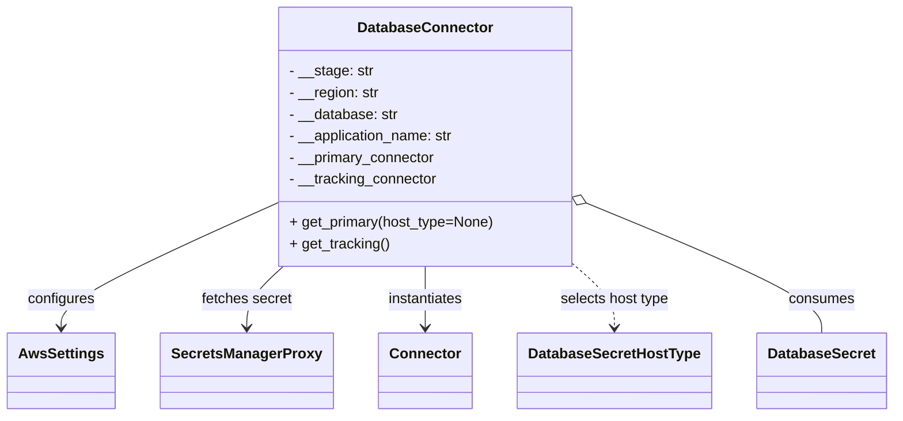
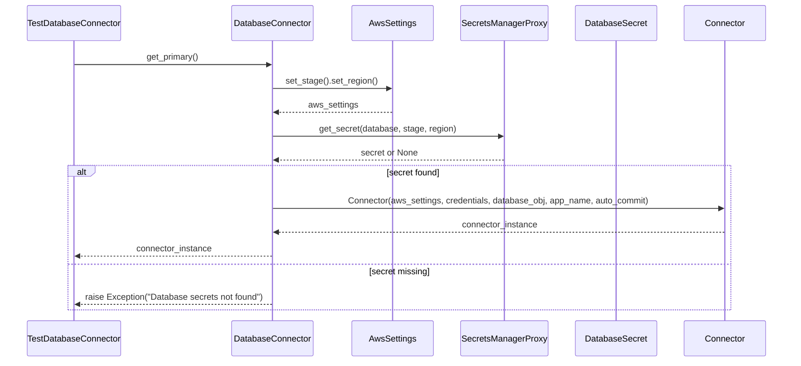

# Diagram: fv_core/fv_framework/python/fv_framework/persistence_adapter/postgresql/test_DatabaseConnector.py


> Auto-generated by Obscura crawlers

## Diagram 1



### SVG

<svg id="container" width="957" xmlns="http://www.w3.org/2000/svg" class="classDiagram" height="462" viewBox="0 0 957 462" role="graphics-document document" aria-roledescription="class"><style>#container{font-family:"trebuchet ms",verdana,arial,sans-serif;font-size:16px;fill:#333;}@keyframes edge-animation-frame{from{stroke-dashoffset:0;}}@keyframes dash{to{stroke-dashoffset:0;}}#container .edge-animation-slow{stroke-dasharray:9,5!important;stroke-dashoffset:900;animation:dash 50s linear infinite;stroke-linecap:round;}#container .edge-animation-fast{stroke-dasharray:9,5!important;stroke-dashoffset:900;animation:dash 20s linear infinite;stroke-linecap:round;}#container .error-icon{fill:#552222;}#container .error-text{fill:#552222;stroke:#552222;}#container .edge-thickness-normal{stroke-width:1px;}#container .edge-thickness-thick{stroke-width:3.5px;}#container .edge-pattern-solid{stroke-dasharray:0;}#container .edge-thickness-invisible{stroke-width:0;fill:none;}#container .edge-pattern-dashed{stroke-dasharray:3;}#container .edge-pattern-dotted{stroke-dasharray:2;}#container .marker{fill:#333333;stroke:#333333;}#container .marker.cross{stroke:#333333;}#container svg{font-family:"trebuchet ms",verdana,arial,sans-serif;font-size:16px;}#container p{margin:0;}#container g.classGroup text{fill:#9370DB;stroke:none;font-family:"trebuchet ms",verdana,arial,sans-serif;font-size:10px;}#container g.classGroup text .title{font-weight:bolder;}#container .nodeLabel,#container .edgeLabel{color:#131300;}#container .edgeLabel .label rect{fill:#ECECFF;}#container .label text{fill:#131300;}#container .labelBkg{background:#ECECFF;}#container .edgeLabel .label span{background:#ECECFF;}#container .classTitle{font-weight:bolder;}#container .node rect,#container .node circle,#container .node ellipse,#container .node polygon,#container .node path{fill:#ECECFF;stroke:#9370DB;stroke-width:1px;}#container .divider{stroke:#9370DB;stroke-width:1;}#container g.clickable{cursor:pointer;}#container g.classGroup rect{fill:#ECECFF;stroke:#9370DB;}#container g.classGroup line{stroke:#9370DB;stroke-width:1;}#container .classLabel .box{stroke:none;stroke-width:0;fill:#ECECFF;opacity:0.5;}#container .classLabel .label{fill:#9370DB;font-size:10px;}#container .relation{stroke:#333333;stroke-width:1;fill:none;}#container .dashed-line{stroke-dasharray:3;}#container .dotted-line{stroke-dasharray:1 2;}#container #compositionStart,#container .composition{fill:#333333!important;stroke:#333333!important;stroke-width:1;}#container #compositionEnd,#container .composition{fill:#333333!important;stroke:#333333!important;stroke-width:1;}#container #dependencyStart,#container .dependency{fill:#333333!important;stroke:#333333!important;stroke-width:1;}#container #dependencyStart,#container .dependency{fill:#333333!important;stroke:#333333!important;stroke-width:1;}#container #extensionStart,#container .extension{fill:transparent!important;stroke:#333333!important;stroke-width:1;}#container #extensionEnd,#container .extension{fill:transparent!important;stroke:#333333!important;stroke-width:1;}#container #aggregationStart,#container .aggregation{fill:transparent!important;stroke:#333333!important;stroke-width:1;}#container #aggregationEnd,#container .aggregation{fill:transparent!important;stroke:#333333!important;stroke-width:1;}#container #lollipopStart,#container .lollipop{fill:#ECECFF!important;stroke:#333333!important;stroke-width:1;}#container #lollipopEnd,#container .lollipop{fill:#ECECFF!important;stroke:#333333!important;stroke-width:1;}#container .edgeTerminals{font-size:11px;line-height:initial;}#container .classTitleText{text-anchor:middle;font-size:18px;fill:#333;}#container .label-icon{display:inline-block;height:1em;overflow:visible;vertical-align:-0.125em;}#container .node .label-icon path{fill:currentColor;stroke:revert;stroke-width:revert;}#container :root{--mermaid-font-family:"trebuchet ms",verdana,arial,sans-serif;}</style><g><defs><marker id="container_class-aggregationStart" class="marker aggregation class" refX="18" refY="7" markerWidth="190" markerHeight="240" orient="auto"><path d="M 18,7 L9,13 L1,7 L9,1 Z"></path></marker></defs><defs><marker id="container_class-aggregationEnd" class="marker aggregation class" refX="1" refY="7" markerWidth="20" markerHeight="28" orient="auto"><path d="M 18,7 L9,13 L1,7 L9,1 Z"></path></marker></defs><defs><marker id="container_class-extensionStart" class="marker extension class" refX="18" refY="7" markerWidth="190" markerHeight="240" orient="auto"><path d="M 1,7 L18,13 V 1 Z"></path></marker></defs><defs><marker id="container_class-extensionEnd" class="marker extension class" refX="1" refY="7" markerWidth="20" markerHeight="28" orient="auto"><path d="M 1,1 V 13 L18,7 Z"></path></marker></defs><defs><marker id="container_class-compositionStart" class="marker composition class" refX="18" refY="7" markerWidth="190" markerHeight="240" orient="auto"><path d="M 18,7 L9,13 L1,7 L9,1 Z"></path></marker></defs><defs><marker id="container_class-compositionEnd" class="marker composition class" refX="1" refY="7" markerWidth="20" markerHeight="28" orient="auto"><path d="M 18,7 L9,13 L1,7 L9,1 Z"></path></marker></defs><defs><marker id="container_class-dependencyStart" class="marker dependency class" refX="6" refY="7" markerWidth="190" markerHeight="240" orient="auto"><path d="M 5,7 L9,13 L1,7 L9,1 Z"></path></marker></defs><defs><marker id="container_class-dependencyEnd" class="marker dependency class" refX="13" refY="7" markerWidth="20" markerHeight="28" orient="auto"><path d="M 18,7 L9,13 L14,7 L9,1 Z"></path></marker></defs><defs><marker id="container_class-lollipopStart" class="marker lollipop class" refX="13" refY="7" markerWidth="190" markerHeight="240" orient="auto"><circle stroke="black" fill="transparent" cx="7" cy="7" r="6"></circle></marker></defs><defs><marker id="container_class-lollipopEnd" class="marker lollipop class" refX="1" refY="7" markerWidth="190" markerHeight="240" orient="auto"><circle stroke="black" fill="transparent" cx="7" cy="7" r="6"></circle></marker></defs><g class="root"><g class="clusters"></g><g class="edgePaths"><path d="M291.199,227.478L253.469,245.065C215.74,262.652,140.28,297.826,102.55,320.58C64.82,343.333,64.82,353.667,64.82,358.833L64.82,364" id="id_DatabaseConnector_AwsSettings_1" class="edge-thickness-normal edge-pattern-solid relation" style=";;;" data-edge="true" data-et="edge" data-id="id_DatabaseConnector_AwsSettings_1" data-points="W3sieCI6MjkxLjE5OTIxODc1LCJ5IjoyMjcuNDc4MjcwOTI5MzIwMTZ9LHsieCI6NjQuODIwMzEyNSwieSI6MzMzfSx7IngiOjY0LjgyMDMxMjUsInkiOjM3MH1d" marker-end="url(#container_class-dependencyEnd)"></path><path d="M301.604,296L295.116,302.167C288.627,308.333,275.649,320.667,269.161,332C262.672,343.333,262.672,353.667,262.672,358.833L262.672,364" id="id_DatabaseConnector_SecretsManagerProxy_2" class="edge-thickness-normal edge-pattern-solid relation" style=";;;" data-edge="true" data-et="edge" data-id="id_DatabaseConnector_SecretsManagerProxy_2" data-points="W3sieCI6MzAxLjYwNDI4MTc2Nzk1NTgsInkiOjI5Nn0seyJ4IjoyNjIuNjcxODc1LCJ5IjozMzN9LHsieCI6MjYyLjY3MTg3NSwieSI6MzcwfV0=" marker-end="url(#container_class-dependencyEnd)"></path><path d="M453.125,296L453.125,302.167C453.125,308.333,453.125,320.667,453.125,332C453.125,343.333,453.125,353.667,453.125,358.833L453.125,364" id="id_DatabaseConnector_Connector_3" class="edge-thickness-normal edge-pattern-solid relation" style=";;;" data-edge="true" data-et="edge" data-id="id_DatabaseConnector_Connector_3" data-points="W3sieCI6NDUzLjEyNSwieSI6Mjk2fSx7IngiOjQ1My4xMjUsInkiOjMzM30seyJ4Ijo0NTMuMTI1LCJ5IjozNzB9XQ==" marker-end="url(#container_class-dependencyEnd)"></path><path d="M614.771,296L621.693,302.167C628.615,308.333,642.46,320.667,649.382,332C656.305,343.333,656.305,353.667,656.305,358.833L656.305,364" id="id_DatabaseConnector_DatabaseSecretHostType_4" class="edge-thickness-normal edge-pattern-dashed relation" style=";;;" data-edge="true" data-et="edge" data-id="id_DatabaseConnector_DatabaseSecretHostType_4" data-points="W3sieCI6NjE0Ljc3MDcxODIzMjA0NDEsInkiOjI5Nn0seyJ4Ijo2NTYuMzA0Njg3NSwieSI6MzMzfSx7IngiOjY1Ni4zMDQ2ODc1LCJ5IjozNzB9XQ==" marker-end="url(#container_class-dependencyEnd)"></path><path d="M630.929,227.474L672.363,245.062C713.797,262.649,796.664,297.825,838.098,321.579C879.531,345.333,879.531,357.667,879.531,363.833L879.531,370" id="id_DatabaseConnector_DatabaseSecret_5" class="edge-thickness-normal edge-pattern-solid relation" style=";;;" data-edge="true" data-et="edge" data-id="id_DatabaseConnector_DatabaseSecret_5" data-points="W3sieCI6NjE1LjA1MDc4MTI1LCJ5IjoyMjAuNzMzOTA0MzYwNTcxNjR9LHsieCI6ODc5LjUzMTI1LCJ5IjozMzN9LHsieCI6ODc5LjUzMTI1LCJ5IjozNzB9XQ==" marker-start="url(#container_class-aggregationStart)"></path></g><g class="edgeLabels"><g class="edgeLabel" transform="translate(64.8203125, 333)"><g class="label" data-id="id_DatabaseConnector_AwsSettings_1" transform="translate(-37.3046875, -12)"><foreignObject width="74.609375" height="24"><div xmlns="http://www.w3.org/1999/xhtml" class="labelBkg" style="display: table-cell; white-space: nowrap; line-height: 1.5; max-width: 200px; text-align: center;"><span class="edgeLabel"><p>configures</p></span></div></foreignObject></g></g><g class="edgeLabel" transform="translate(262.671875, 333)"><g class="label" data-id="id_DatabaseConnector_SecretsManagerProxy_2" transform="translate(-50.4765625, -12)"><foreignObject width="100.953125" height="24"><div xmlns="http://www.w3.org/1999/xhtml" class="labelBkg" style="display: table-cell; white-space: nowrap; line-height: 1.5; max-width: 200px; text-align: center;"><span class="edgeLabel"><p>fetches secret</p></span></div></foreignObject></g></g><g class="edgeLabel" transform="translate(453.125, 333)"><g class="label" data-id="id_DatabaseConnector_Connector_3" transform="translate(-42.9140625, -12)"><foreignObject width="85.828125" height="24"><div xmlns="http://www.w3.org/1999/xhtml" class="labelBkg" style="display: table-cell; white-space: nowrap; line-height: 1.5; max-width: 200px; text-align: center;"><span class="edgeLabel"><p>instantiates</p></span></div></foreignObject></g></g><g class="edgeLabel" transform="translate(656.3046875, 333)"><g class="label" data-id="id_DatabaseConnector_DatabaseSecretHostType_4" transform="translate(-61.328125, -12)"><foreignObject width="122.65625" height="24"><div xmlns="http://www.w3.org/1999/xhtml" class="labelBkg" style="display: table-cell; white-space: nowrap; line-height: 1.5; max-width: 200px; text-align: center;"><span class="edgeLabel"><p>selects host type</p></span></div></foreignObject></g></g><g class="edgeLabel" transform="translate(879.53125, 333)"><g class="label" data-id="id_DatabaseConnector_DatabaseSecret_5" transform="translate(-36.375, -12)"><foreignObject width="72.75" height="24"><div xmlns="http://www.w3.org/1999/xhtml" class="labelBkg" style="display: table-cell; white-space: nowrap; line-height: 1.5; max-width: 200px; text-align: center;"><span class="edgeLabel"><p>consumes</p></span></div></foreignObject></g></g></g><g class="nodes"><g class="node default" id="classId-DatabaseConnector-0" transform="translate(453.125, 152)"><g class="basic label-container"><path d="M-161.92578125 -144 L161.92578125 -144 L161.92578125 144 L-161.92578125 144" stroke="none" stroke-width="0" fill="#ECECFF" style=""></path><path d="M-161.92578125 -144 C-58.58522337059472 -144, 44.75533450881056 -144, 161.92578125 -144 M-161.92578125 -144 C-47.322132347208125 -144, 67.28151655558375 -144, 161.92578125 -144 M161.92578125 -144 C161.92578125 -57.781018075960816, 161.92578125 28.43796384807837, 161.92578125 144 M161.92578125 -144 C161.92578125 -65.66213561266753, 161.92578125 12.675728774664947, 161.92578125 144 M161.92578125 144 C95.913595526117 144, 29.901409802234014 144, -161.92578125 144 M161.92578125 144 C94.11869544317 144, 26.311609636339995 144, -161.92578125 144 M-161.92578125 144 C-161.92578125 32.361181178280034, -161.92578125 -79.27763764343993, -161.92578125 -144 M-161.92578125 144 C-161.92578125 62.63604537390398, -161.92578125 -18.727909252192035, -161.92578125 -144" stroke="#9370DB" stroke-width="1.3" fill="none" stroke-dasharray="0 0" style=""></path></g><g class="annotation-group text" transform="translate(0, -120)"></g><g class="label-group text" transform="translate(-71.5859375, -120)"><g class="label" style="font-weight: bolder" transform="translate(0,-12)"><foreignObject width="143.171875" height="24"><div xmlns="http://www.w3.org/1999/xhtml" style="display: table-cell; white-space: nowrap; line-height: 1.5; max-width: 192px; text-align: center;"><span class="nodeLabel markdown-node-label" style=""><p>DatabaseConnector</p></span></div></foreignObject></g></g><g class="members-group text" transform="translate(-149.92578125, -72)"><g class="label" style="" transform="translate(0,-12)"><foreignObject width="93.140625" height="24"><div xmlns="http://www.w3.org/1999/xhtml" style="display: table-cell; white-space: nowrap; line-height: 1.5; max-width: 151px; text-align: center;"><span class="nodeLabel markdown-node-label" style=""><p>- __stage: str</p></span></div></foreignObject></g><g class="label" style="" transform="translate(0,12)"><foreignObject width="100.640625" height="24"><div xmlns="http://www.w3.org/1999/xhtml" style="display: table-cell; white-space: nowrap; line-height: 1.5; max-width: 159px; text-align: center;"><span class="nodeLabel markdown-node-label" style=""><p>- __region: str</p></span></div></foreignObject></g><g class="label" style="" transform="translate(0,36)"><foreignObject width="121.078125" height="24"><div xmlns="http://www.w3.org/1999/xhtml" style="display: table-cell; white-space: nowrap; line-height: 1.5; max-width: 179px; text-align: center;"><span class="nodeLabel markdown-node-label" style=""><p>- __database: str</p></span></div></foreignObject></g><g class="label" style="" transform="translate(0,60)"><foreignObject width="185.296875" height="24"><div xmlns="http://www.w3.org/1999/xhtml" style="display: table-cell; white-space: nowrap; line-height: 1.5; max-width: 243px; text-align: center;"><span class="nodeLabel markdown-node-label" style=""><p>- __application_name: str</p></span></div></foreignObject></g><g class="label" style="" transform="translate(0,84)"><foreignObject width="164.203125" height="24"><div xmlns="http://www.w3.org/1999/xhtml" style="display: table-cell; white-space: nowrap; line-height: 1.5; max-width: 222px; text-align: center;"><span class="nodeLabel markdown-node-label" style=""><p>- __primary_connector</p></span></div></foreignObject></g><g class="label" style="" transform="translate(0,108)"><foreignObject width="165.90625" height="24"><div xmlns="http://www.w3.org/1999/xhtml" style="display: table-cell; white-space: nowrap; line-height: 1.5; max-width: 224px; text-align: center;"><span class="nodeLabel markdown-node-label" style=""><p>- __tracking_connector</p></span></div></foreignObject></g></g><g class="methods-group text" transform="translate(-149.92578125, 96)"><g class="label" style="" transform="translate(0,-12)"><foreignObject width="228.265625" height="24"><div xmlns="http://www.w3.org/1999/xhtml" style="display: table-cell; white-space: nowrap; line-height: 1.5; max-width: 286px; text-align: center;"><span class="nodeLabel markdown-node-label" style=""><p>+ get_primary(host_type=None)</p></span></div></foreignObject></g><g class="label" style="" transform="translate(0,12)"><foreignObject width="111.296875" height="24"><div xmlns="http://www.w3.org/1999/xhtml" style="display: table-cell; white-space: nowrap; line-height: 1.5; max-width: 169px; text-align: center;"><span class="nodeLabel markdown-node-label" style=""><p>+ get_tracking()</p></span></div></foreignObject></g></g><g class="divider" style=""><path d="M-161.92578125 -96 C-90.80970906111439 -96, -19.69363687222878 -96, 161.92578125 -96 M-161.92578125 -96 C-57.36408744504266 -96, 47.19760635991469 -96, 161.92578125 -96" stroke="#9370DB" stroke-width="1.3" fill="none" stroke-dasharray="0 0" style=""></path></g><g class="divider" style=""><path d="M-161.92578125 72 C-86.61741432964408 72, -11.309047409288155 72, 161.92578125 72 M-161.92578125 72 C-68.79593128941967 72, 24.33391867116066 72, 161.92578125 72" stroke="#9370DB" stroke-width="1.3" fill="none" stroke-dasharray="0 0" style=""></path></g></g><g class="node default" id="classId-AwsSettings-1" transform="translate(64.8203125, 412)"><g class="basic label-container"><path d="M-56.8203125 -42 L56.8203125 -42 L56.8203125 42 L-56.8203125 42" stroke="none" stroke-width="0" fill="#ECECFF" style=""></path><path d="M-56.8203125 -42 C-21.58329290507219 -42, 13.653726689855617 -42, 56.8203125 -42 M-56.8203125 -42 C-13.44645940275386 -42, 29.92739369449228 -42, 56.8203125 -42 M56.8203125 -42 C56.8203125 -20.637216635282435, 56.8203125 0.7255667294351298, 56.8203125 42 M56.8203125 -42 C56.8203125 -12.426597600003884, 56.8203125 17.146804799992232, 56.8203125 42 M56.8203125 42 C18.878661321976445 42, -19.06298985604711 42, -56.8203125 42 M56.8203125 42 C25.303931881782578 42, -6.212448736434844 42, -56.8203125 42 M-56.8203125 42 C-56.8203125 21.90172891980338, -56.8203125 1.8034578396067573, -56.8203125 -42 M-56.8203125 42 C-56.8203125 20.29180338646125, -56.8203125 -1.4163932270774993, -56.8203125 -42" stroke="#9370DB" stroke-width="1.3" fill="none" stroke-dasharray="0 0" style=""></path></g><g class="annotation-group text" transform="translate(0, -18)"></g><g class="label-group text" transform="translate(-44.8203125, -18)"><g class="label" style="font-weight: bolder" transform="translate(0,-12)"><foreignObject width="89.640625" height="24"><div xmlns="http://www.w3.org/1999/xhtml" style="display: table-cell; white-space: nowrap; line-height: 1.5; max-width: 137px; text-align: center;"><span class="nodeLabel markdown-node-label" style=""><p>AwsSettings</p></span></div></foreignObject></g></g><g class="members-group text" transform="translate(-44.8203125, 30)"></g><g class="methods-group text" transform="translate(-44.8203125, 60)"></g><g class="divider" style=""><path d="M-56.8203125 6 C-30.71715058317859 6, -4.61398866635718 6, 56.8203125 6 M-56.8203125 6 C-24.84429174092309 6, 7.13172901815382 6, 56.8203125 6" stroke="#9370DB" stroke-width="1.3" fill="none" stroke-dasharray="0 0" style=""></path></g><g class="divider" style=""><path d="M-56.8203125 24 C-27.99603147362717 24, 0.8282495527456604 24, 56.8203125 24 M-56.8203125 24 C-14.31136012249626 24, 28.19759225500748 24, 56.8203125 24" stroke="#9370DB" stroke-width="1.3" fill="none" stroke-dasharray="0 0" style=""></path></g></g><g class="node default" id="classId-SecretsManagerProxy-2" transform="translate(262.671875, 412)"><g class="basic label-container"><path d="M-91.03125 -42 L91.03125 -42 L91.03125 42 L-91.03125 42" stroke="none" stroke-width="0" fill="#ECECFF" style=""></path><path d="M-91.03125 -42 C-43.27320479007591 -42, 4.484840419848183 -42, 91.03125 -42 M-91.03125 -42 C-21.75888300185126 -42, 47.51348399629748 -42, 91.03125 -42 M91.03125 -42 C91.03125 -24.26365887347761, 91.03125 -6.5273177469552195, 91.03125 42 M91.03125 -42 C91.03125 -9.22213334335251, 91.03125 23.55573331329498, 91.03125 42 M91.03125 42 C52.69543089827657 42, 14.35961179655314 42, -91.03125 42 M91.03125 42 C21.52606094443246 42, -47.97912811113508 42, -91.03125 42 M-91.03125 42 C-91.03125 19.4634128357115, -91.03125 -3.0731743285769966, -91.03125 -42 M-91.03125 42 C-91.03125 24.03021390502031, -91.03125 6.060427810040622, -91.03125 -42" stroke="#9370DB" stroke-width="1.3" fill="none" stroke-dasharray="0 0" style=""></path></g><g class="annotation-group text" transform="translate(0, -18)"></g><g class="label-group text" transform="translate(-79.03125, -18)"><g class="label" style="font-weight: bolder" transform="translate(0,-12)"><foreignObject width="158.0625" height="24"><div xmlns="http://www.w3.org/1999/xhtml" style="display: table-cell; white-space: nowrap; line-height: 1.5; max-width: 204px; text-align: center;"><span class="nodeLabel markdown-node-label" style=""><p>SecretsManagerProxy</p></span></div></foreignObject></g></g><g class="members-group text" transform="translate(-79.03125, 30)"></g><g class="methods-group text" transform="translate(-79.03125, 60)"></g><g class="divider" style=""><path d="M-91.03125 6 C-27.03503916457118 6, 36.96117167085764 6, 91.03125 6 M-91.03125 6 C-30.509138048218077 6, 30.012973903563847 6, 91.03125 6" stroke="#9370DB" stroke-width="1.3" fill="none" stroke-dasharray="0 0" style=""></path></g><g class="divider" style=""><path d="M-91.03125 24 C-38.12733982040646 24, 14.776570359187076 24, 91.03125 24 M-91.03125 24 C-52.74765681477395 24, -14.464063629547894 24, 91.03125 24" stroke="#9370DB" stroke-width="1.3" fill="none" stroke-dasharray="0 0" style=""></path></g></g><g class="node default" id="classId-Connector-3" transform="translate(453.125, 412)"><g class="basic label-container"><path d="M-49.421875 -42 L49.421875 -42 L49.421875 42 L-49.421875 42" stroke="none" stroke-width="0" fill="#ECECFF" style=""></path><path d="M-49.421875 -42 C-12.321571680312395 -42, 24.77873163937521 -42, 49.421875 -42 M-49.421875 -42 C-27.868460128564205 -42, -6.315045257128411 -42, 49.421875 -42 M49.421875 -42 C49.421875 -23.459556784657742, 49.421875 -4.919113569315485, 49.421875 42 M49.421875 -42 C49.421875 -14.80010222663212, 49.421875 12.39979554673576, 49.421875 42 M49.421875 42 C16.99512287420245 42, -15.431629251595098 42, -49.421875 42 M49.421875 42 C14.360902216310848 42, -20.700070567378305 42, -49.421875 42 M-49.421875 42 C-49.421875 20.536745153931903, -49.421875 -0.926509692136193, -49.421875 -42 M-49.421875 42 C-49.421875 21.324623053212655, -49.421875 0.6492461064253092, -49.421875 -42" stroke="#9370DB" stroke-width="1.3" fill="none" stroke-dasharray="0 0" style=""></path></g><g class="annotation-group text" transform="translate(0, -18)"></g><g class="label-group text" transform="translate(-37.421875, -18)"><g class="label" style="font-weight: bolder" transform="translate(0,-12)"><foreignObject width="74.84375" height="24"><div xmlns="http://www.w3.org/1999/xhtml" style="display: table-cell; white-space: nowrap; line-height: 1.5; max-width: 125px; text-align: center;"><span class="nodeLabel markdown-node-label" style=""><p>Connector</p></span></div></foreignObject></g></g><g class="members-group text" transform="translate(-37.421875, 30)"></g><g class="methods-group text" transform="translate(-37.421875, 60)"></g><g class="divider" style=""><path d="M-49.421875 6 C-27.24962669327239 6, -5.07737838654478 6, 49.421875 6 M-49.421875 6 C-16.32965546779571 6, 16.76256406440858 6, 49.421875 6" stroke="#9370DB" stroke-width="1.3" fill="none" stroke-dasharray="0 0" style=""></path></g><g class="divider" style=""><path d="M-49.421875 24 C-12.434669554539774 24, 24.552535890920453 24, 49.421875 24 M-49.421875 24 C-24.08777466449935 24, 1.2463256710013013 24, 49.421875 24" stroke="#9370DB" stroke-width="1.3" fill="none" stroke-dasharray="0 0" style=""></path></g></g><g class="node default" id="classId-DatabaseSecret-4" transform="translate(879.53125, 412)"><g class="basic label-container"><path d="M-69.46875 -42 L69.46875 -42 L69.46875 42 L-69.46875 42" stroke="none" stroke-width="0" fill="#ECECFF" style=""></path><path d="M-69.46875 -42 C-34.78233583236508 -42, -0.09592166473015595 -42, 69.46875 -42 M-69.46875 -42 C-30.9207697875823 -42, 7.627210424835397 -42, 69.46875 -42 M69.46875 -42 C69.46875 -23.683075790764956, 69.46875 -5.366151581529913, 69.46875 42 M69.46875 -42 C69.46875 -18.014296466586014, 69.46875 5.971407066827972, 69.46875 42 M69.46875 42 C36.93425431884466 42, 4.399758637689317 42, -69.46875 42 M69.46875 42 C14.274491870010493 42, -40.91976625997901 42, -69.46875 42 M-69.46875 42 C-69.46875 12.509519159790969, -69.46875 -16.980961680418062, -69.46875 -42 M-69.46875 42 C-69.46875 13.690588028442992, -69.46875 -14.618823943114016, -69.46875 -42" stroke="#9370DB" stroke-width="1.3" fill="none" stroke-dasharray="0 0" style=""></path></g><g class="annotation-group text" transform="translate(0, -18)"></g><g class="label-group text" transform="translate(-57.46875, -18)"><g class="label" style="font-weight: bolder" transform="translate(0,-12)"><foreignObject width="114.9375" height="24"><div xmlns="http://www.w3.org/1999/xhtml" style="display: table-cell; white-space: nowrap; line-height: 1.5; max-width: 163px; text-align: center;"><span class="nodeLabel markdown-node-label" style=""><p>DatabaseSecret</p></span></div></foreignObject></g></g><g class="members-group text" transform="translate(-57.46875, 30)"></g><g class="methods-group text" transform="translate(-57.46875, 60)"></g><g class="divider" style=""><path d="M-69.46875 6 C-21.07080276937846 6, 27.32714446124308 6, 69.46875 6 M-69.46875 6 C-36.70583947332891 6, -3.9429289466578155 6, 69.46875 6" stroke="#9370DB" stroke-width="1.3" fill="none" stroke-dasharray="0 0" style=""></path></g><g class="divider" style=""><path d="M-69.46875 24 C-27.115386820149162 24, 15.237976359701676 24, 69.46875 24 M-69.46875 24 C-33.86531513548617 24, 1.7381197290276589 24, 69.46875 24" stroke="#9370DB" stroke-width="1.3" fill="none" stroke-dasharray="0 0" style=""></path></g></g><g class="node default" id="classId-DatabaseSecretHostType-5" transform="translate(656.3046875, 412)"><g class="basic label-container"><path d="M-103.7578125 -42 L103.7578125 -42 L103.7578125 42 L-103.7578125 42" stroke="none" stroke-width="0" fill="#ECECFF" style=""></path><path d="M-103.7578125 -42 C-31.553270076091394 -42, 40.65127234781721 -42, 103.7578125 -42 M-103.7578125 -42 C-53.654619314764396 -42, -3.5514261295287923 -42, 103.7578125 -42 M103.7578125 -42 C103.7578125 -14.186227043269046, 103.7578125 13.627545913461908, 103.7578125 42 M103.7578125 -42 C103.7578125 -17.616038096988337, 103.7578125 6.767923806023326, 103.7578125 42 M103.7578125 42 C23.757167264427835 42, -56.24347797114433 42, -103.7578125 42 M103.7578125 42 C42.40708219604372 42, -18.943648107912566 42, -103.7578125 42 M-103.7578125 42 C-103.7578125 20.583489861809284, -103.7578125 -0.8330202763814327, -103.7578125 -42 M-103.7578125 42 C-103.7578125 16.760871261496632, -103.7578125 -8.478257477006736, -103.7578125 -42" stroke="#9370DB" stroke-width="1.3" fill="none" stroke-dasharray="0 0" style=""></path></g><g class="annotation-group text" transform="translate(0, -18)"></g><g class="label-group text" transform="translate(-91.7578125, -18)"><g class="label" style="font-weight: bolder" transform="translate(0,-12)"><foreignObject width="183.515625" height="24"><div xmlns="http://www.w3.org/1999/xhtml" style="display: table-cell; white-space: nowrap; line-height: 1.5; max-width: 230px; text-align: center;"><span class="nodeLabel markdown-node-label" style=""><p>DatabaseSecretHostType</p></span></div></foreignObject></g></g><g class="members-group text" transform="translate(-91.7578125, 30)"></g><g class="methods-group text" transform="translate(-91.7578125, 60)"></g><g class="divider" style=""><path d="M-103.7578125 6 C-28.344085820726733 6, 47.069640858546535 6, 103.7578125 6 M-103.7578125 6 C-45.671547643141764 6, 12.414717213716472 6, 103.7578125 6" stroke="#9370DB" stroke-width="1.3" fill="none" stroke-dasharray="0 0" style=""></path></g><g class="divider" style=""><path d="M-103.7578125 24 C-43.13126253057683 24, 17.495287438846347 24, 103.7578125 24 M-103.7578125 24 C-34.020210531695795 24, 35.71739143660841 24, 103.7578125 24" stroke="#9370DB" stroke-width="1.3" fill="none" stroke-dasharray="0 0" style=""></path></g></g></g></g></g></svg>

## Diagram 2



> SVG rendering failed for this diagram.

## Diagram 3

```mermaid
flowchart LR
Start([Start]) --> CheckCache{Primary connector cached?}
CheckCache -- yes --> ReturnCached[Return cached connector]
CheckCache -- no --> ConfigureAWS[Configure AwsSettings]
ConfigureAWS --> FetchSecret[Fetch secret via SecretsManagerProxy]
FetchSecret --> IsSecretFound{Secret found?}
IsSecretFound -- no --> Error[Raise "Database secrets not found"]
IsSecretFound -- yes --> HostTypeDecision{Host type explicit?}
HostTypeDecision -- HOST --> UseHost[use secret.host]
HostTypeDecision -- PROXY_HOST --> UseProxy[use secret.proxy_host if present]
UseProxy --> ProxyExists{proxy_host present?}
ProxyExists -- yes --> SelectedHost[host = proxy_host]
ProxyExists -- no --> SelectedHost2[host = host]
UseHost --> SelectedHost2
SelectedHost --> Instantiate[Instantiate Connector(...)]
SelectedHost2 --> Instantiate
Instantiate --> CacheAndReturn[Cache in __primary_connector and return connector]
CacheAndReturn --> End([End])
```

> SVG rendering failed for this diagram.
