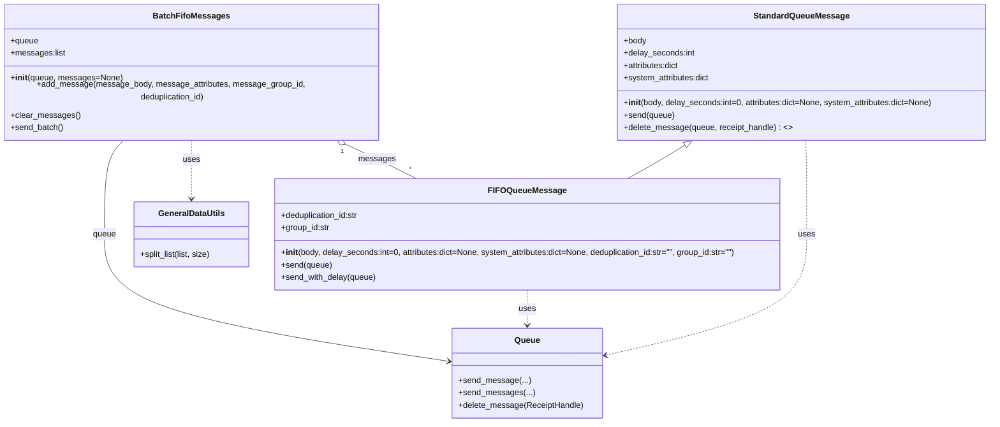

# Diagram: fv_core/fv_framework/python/fv_framework/sqs/core/message.py

> Auto-generated by Obscura crawlers

## Mermaid

```mermaid
classDiagram
class StandardQueueMessage {
  +body
  +delay_seconds:int
  +attributes:dict
  +system_attributes:dict
  +__init__(body, delay_seconds:int=0, attributes:dict=None, system_attributes:dict=None)
  +send(queue)
  +delete_message(queue, receipt_handle) <<static>>
}
class FIFOQueueMessage {
  +deduplication_id:str
  +group_id:str
  +__init__(body, delay_seconds:int=0, attributes:dict=None, system_attributes:dict=None, deduplication_id:str="", group_id:str="")
  +send(queue)
  +send_with_delay(queue)
}
StandardQueueMessage <|-- FIFOQueueMessage
class BatchFifoMessages {
  +queue
  +messages:list
  +__init__(queue, messages=None)
  +add_message(message_body, message_attributes, message_group_id, deduplication_id)
  +clear_messages()
  +send_batch()
}
BatchFifoMessages "1" o-- "*" FIFOQueueMessage : messages
class GeneralDataUtils {
  +split_list(list, size)
}
BatchFifoMessages ..> GeneralDataUtils : uses
class Queue {
  +send_message(...)
  +send_messages(...)
  +delete_message(ReceiptHandle)
}
StandardQueueMessage ..> Queue : uses
FIFOQueueMessage ..> Queue : uses
BatchFifoMessages --> Queue : queue
```

> SVG rendering failed for this diagram.
