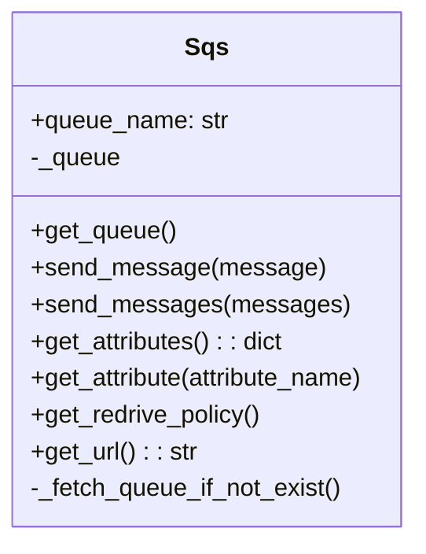
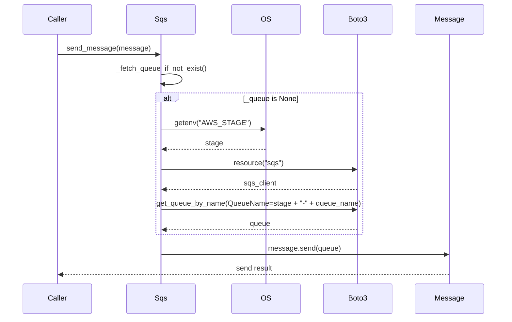

# Diagram: fv_core/fv_framework/python/fv_framework/sqs/core/queue.py

> Auto-generated by Obscura crawlers

## Diagram 1

### SVG

<svg id="container" width="278.7109375" xmlns="http://www.w3.org/2000/svg" class="classDiagram" height="352" viewBox="0 0 278.7109375 352" role="graphics-document document" aria-roledescription="class"><g><defs><marker id="container_class-aggregationStart" class="marker aggregation class" refX="18" refY="7" markerWidth="190" markerHeight="240" orient="auto"><path d="M 18,7 L9,13 L1,7 L9,1 Z"></path></marker></defs><defs><marker id="container_class-aggregationEnd" class="marker aggregation class" refX="1" refY="7" markerWidth="20" markerHeight="28" orient="auto"><path d="M 18,7 L9,13 L1,7 L9,1 Z"></path></marker></defs><defs><marker id="container_class-extensionStart" class="marker extension class" refX="18" refY="7" markerWidth="190" markerHeight="240" orient="auto"><path d="M 1,7 L18,13 V 1 Z"></path></marker></defs><defs><marker id="container_class-extensionEnd" class="marker extension class" refX="1" refY="7" markerWidth="20" markerHeight="28" orient="auto"><path d="M 1,1 V 13 L18,7 Z"></path></marker></defs><defs><marker id="container_class-compositionStart" class="marker composition class" refX="18" refY="7" markerWidth="190" markerHeight="240" orient="auto"><path d="M 18,7 L9,13 L1,7 L9,1 Z"></path></marker></defs><defs><marker id="container_class-compositionEnd" class="marker composition class" refX="1" refY="7" markerWidth="20" markerHeight="28" orient="auto"><path d="M 18,7 L9,13 L1,7 L9,1 Z"></path></marker></defs><defs><marker id="container_class-dependencyStart" class="marker dependency class" refX="6" refY="7" markerWidth="190" markerHeight="240" orient="auto"><path d="M 5,7 L9,13 L1,7 L9,1 Z"></path></marker></defs><defs><marker id="container_class-dependencyEnd" class="marker dependency class" refX="13" refY="7" markerWidth="20" markerHeight="28" orient="auto"><path d="M 18,7 L9,13 L14,7 L9,1 Z"></path></marker></defs><defs><marker id="container_class-lollipopStart" class="marker lollipop class" refX="13" refY="7" markerWidth="190" markerHeight="240" orient="auto"><circle stroke="black" fill="transparent" cx="7" cy="7" r="6"></circle></marker></defs><defs><marker id="container_class-lollipopEnd" class="marker lollipop class" refX="1" refY="7" markerWidth="190" markerHeight="240" orient="auto"><circle stroke="black" fill="transparent" cx="7" cy="7" r="6"></circle></marker></defs><g class="root"><g class="clusters"></g><g class="edgePaths"></g><g class="edgeLabels"></g><g class="nodes"><g class="node default" id="classId-Sqs-0" transform="translate(139.35546875, 176)"><g class="basic label-container"><path d="M-131.35546875 -168 L131.35546875 -168 L131.35546875 168 L-131.35546875 168" stroke="none" stroke-width="0" fill="#ECECFF" style=""></path><path d="M-131.35546875 -168 C-65.140727345531 -168, 1.0740140589379905 -168, 131.35546875 -168 M-131.35546875 -168 C-52.62209149602042 -168, 26.111285757959166 -168, 131.35546875 -168 M131.35546875 -168 C131.35546875 -86.82231090693413, 131.35546875 -5.6446218138682696, 131.35546875 168 M131.35546875 -168 C131.35546875 -62.96297986372099, 131.35546875 42.07404027255802, 131.35546875 168 M131.35546875 168 C46.47626074020252 168, -38.40294726959496 168, -131.35546875 168 M131.35546875 168 C74.98641555100008 168, 18.61736235200017 168, -131.35546875 168 M-131.35546875 168 C-131.35546875 61.47675044182783, -131.35546875 -45.046499116344336, -131.35546875 -168 M-131.35546875 168 C-131.35546875 85.42059590842118, -131.35546875 2.841191816842354, -131.35546875 -168" stroke="#9370DB" stroke-width="1.3" fill="none" stroke-dasharray="0 0" style=""></path></g><g class="annotation-group text" transform="translate(0, -144)"></g><g class="label-group text" transform="translate(-13.2421875, -144)"><g class="label" style="font-weight: bolder" transform="translate(0,-12)"><foreignObject width="26.484375" height="24">

Sqs

</foreignObject></g></g><g class="members-group text" transform="translate(-119.35546875, -96)"><g class="label" style="" transform="translate(0,-12)"><foreignObject width="129.640625" height="24">

+queue_name: str

</foreignObject></g><g class="label" style="" transform="translate(0,12)"><foreignObject width="58.8125" height="24">

-_queue

</foreignObject></g></g><g class="methods-group text" transform="translate(-119.35546875, -24)"><g class="label" style="" transform="translate(0,-12)"><foreignObject width="94.546875" height="24">

+get_queue()

</foreignObject></g><g class="label" style="" transform="translate(0,12)"><foreignObject width="186.578125" height="24">

+send_message(message)

</foreignObject></g><g class="label" style="" transform="translate(0,36)"><foreignObject width="201.53125" height="24">

+send_messages(messages)

</foreignObject></g><g class="label" style="" transform="translate(0,60)"><foreignObject width="168.3125" height="24">

+get_attributes() : : dict

</foreignObject></g><g class="label" style="" transform="translate(0,84)"><foreignObject width="225.46875" height="24">

+get_attribute(attribute_name)

</foreignObject></g><g class="label" style="" transform="translate(0,108)"><foreignObject width="152.015625" height="24">

+get_redrive_policy()

</foreignObject></g><g class="label" style="" transform="translate(0,132)"><foreignObject width="108.921875" height="24">

+get_url() : : str

</foreignObject></g><g class="label" style="" transform="translate(0,156)"><foreignObject width="205.953125" height="24">

-_fetch_queue_if_not_exist()

</foreignObject></g></g><g class="divider" style=""><path d="M-131.35546875 -120 C-44.910215377849426 -120, 41.53503799430115 -120, 131.35546875 -120 M-131.35546875 -120 C-43.43615117461566 -120, 44.48316640076868 -120, 131.35546875 -120" stroke="#9370DB" stroke-width="1.3" fill="none" stroke-dasharray="0 0" style=""></path></g><g class="divider" style=""><path d="M-131.35546875 -48 C-64.90174639642113 -48, 1.5519759571577367 -48, 131.35546875 -48 M-131.35546875 -48 C-77.57375286322011 -48, -23.792036976440215 -48, 131.35546875 -48" stroke="#9370DB" stroke-width="1.3" fill="none" stroke-dasharray="0 0" style=""></path></g></g></g></g></g></svg>

## Diagram 2

> SVG rendering failed for this diagram.
