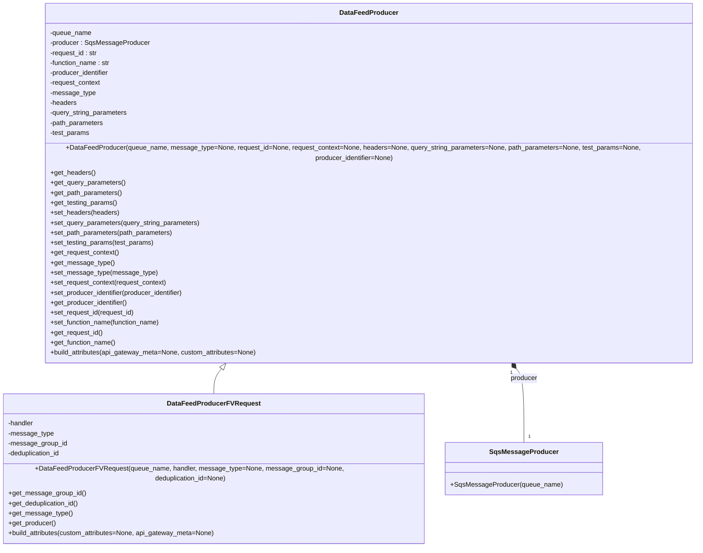

# Diagram: fv_core/fv_framework/python/fv_framework/sqs/handlers/data_feed_producer.py

> Auto-generated by Obscura crawlers

## Mermaid

### SVG

<svg id="container" width="1739.83984375" xmlns="http://www.w3.org/2000/svg" class="classDiagram" height="1266" viewBox="0 0 1739.83984375 1266" role="graphics-document document" aria-roledescription="class"><g><defs><marker id="container_class-aggregationStart" class="marker aggregation class" refX="18" refY="7" markerWidth="190" markerHeight="240" orient="auto"><path d="M 18,7 L9,13 L1,7 L9,1 Z"></path></marker></defs><defs><marker id="container_class-aggregationEnd" class="marker aggregation class" refX="1" refY="7" markerWidth="20" markerHeight="28" orient="auto"><path d="M 18,7 L9,13 L1,7 L9,1 Z"></path></marker></defs><defs><marker id="container_class-extensionStart" class="marker extension class" refX="18" refY="7" markerWidth="190" markerHeight="240" orient="auto"><path d="M 1,7 L18,13 V 1 Z"></path></marker></defs><defs><marker id="container_class-extensionEnd" class="marker extension class" refX="1" refY="7" markerWidth="20" markerHeight="28" orient="auto"><path d="M 1,1 V 13 L18,7 Z"></path></marker></defs><defs><marker id="container_class-compositionStart" class="marker composition class" refX="18" refY="7" markerWidth="190" markerHeight="240" orient="auto"><path d="M 18,7 L9,13 L1,7 L9,1 Z"></path></marker></defs><defs><marker id="container_class-compositionEnd" class="marker composition class" refX="1" refY="7" markerWidth="20" markerHeight="28" orient="auto"><path d="M 18,7 L9,13 L1,7 L9,1 Z"></path></marker></defs><defs><marker id="container_class-dependencyStart" class="marker dependency class" refX="6" refY="7" markerWidth="190" markerHeight="240" orient="auto"><path d="M 5,7 L9,13 L1,7 L9,1 Z"></path></marker></defs><defs><marker id="container_class-dependencyEnd" class="marker dependency class" refX="13" refY="7" markerWidth="20" markerHeight="28" orient="auto"><path d="M 18,7 L9,13 L14,7 L9,1 Z"></path></marker></defs><defs><marker id="container_class-lollipopStart" class="marker lollipop class" refX="13" refY="7" markerWidth="190" markerHeight="240" orient="auto"><circle stroke="black" fill="transparent" cx="7" cy="7" r="6"></circle></marker></defs><defs><marker id="container_class-lollipopEnd" class="marker lollipop class" refX="1" refY="7" markerWidth="190" markerHeight="240" orient="auto"><circle stroke="black" fill="transparent" cx="7" cy="7" r="6"></circle></marker></defs><g class="root"><g class="clusters"></g><g class="edgePaths"><path d="M545.814,861.328L542.572,865.273C539.331,869.219,532.847,877.109,529.605,887.221C526.363,897.333,526.363,909.667,526.363,915.833L526.363,922" id="id_DataFeedProducer_DataFeedProducerFVRequest_1" class="edge-thickness-normal edge-pattern-solid relation" style=";;;" data-edge="true" data-et="edge" data-id="id_DataFeedProducer_DataFeedProducerFVRequest_1" data-points="W3sieCI6NTU2Ljc2NTQ0NTUwMDU0NywieSI6ODQ4fSx7IngiOjUyNi4zNjMyODEyNSwieSI6ODg1fSx7IngiOjUyNi4zNjMyODEyNSwieSI6OTIyfV0=" marker-start="url(#container_class-extensionStart)"></path><path d="M1257.928,861.328L1261.17,865.273C1264.412,869.219,1270.895,877.109,1274.137,904.721C1277.379,932.333,1277.379,979.667,1277.379,1003.333L1277.379,1027" id="id_DataFeedProducer_SqsMessageProducer_2" class="edge-thickness-normal edge-pattern-solid relation" style=";;;" data-edge="true" data-et="edge" data-id="id_DataFeedProducer_SqsMessageProducer_2" data-points="W3sieCI6MTI0Ni45NzY3NDE5OTk0NTMsInkiOjg0OH0seyJ4IjoxMjc3LjM3ODkwNjI1LCJ5Ijo4ODV9LHsieCI6MTI3Ny4zNzg5MDYyNSwieSI6MTAyN31d" marker-start="url(#container_class-compositionStart)"></path></g><g class="edgeLabels"><g class="edgeLabel"><g class="label" data-id="id_DataFeedProducer_DataFeedProducerFVRequest_1" transform="translate(0, 0)"><foreignObject width="0" height="0">

</foreignObject></g></g><g class="edgeLabel" transform="translate(1277.37890625, 885)"><g class="label" data-id="id_DataFeedProducer_SqsMessageProducer_2" transform="translate(-32.828125, -12)"><foreignObject width="65.65625" height="24">

producer

</foreignObject></g></g><g class="edgeTerminals" transform="translate(1246.4972468912742, 871.0438715998391)"><g class="inner" transform="translate(0, 0)"><foreignObject style="width: 9px; height: 12px;">
1
</foreignObject></g></g><g class="edgeTerminals" transform="translate(1287.378908125, 1004.5000016071428)"><g class="inner" transform="translate(0, 0)"></g><foreignObject style="width: 9px; height: 12px;">
1
</foreignObject></g></g><g class="nodes"><g class="node default" id="classId-SqsMessageProducer-0" transform="translate(1277.37890625, 1090)"><g class="basic label-container"><path d="M-182.65234375 -63 L182.65234375 -63 L182.65234375 63 L-182.65234375 63" stroke="none" stroke-width="0" fill="#ECECFF" style=""></path><path d="M-182.65234375 -63 C-36.660596532715914 -63, 109.33115068456817 -63, 182.65234375 -63 M-182.65234375 -63 C-64.36448592927117 -63, 53.92337189145766 -63, 182.65234375 -63 M182.65234375 -63 C182.65234375 -37.354691104478846, 182.65234375 -11.709382208957699, 182.65234375 63 M182.65234375 -63 C182.65234375 -25.243708624016108, 182.65234375 12.512582751967784, 182.65234375 63 M182.65234375 63 C47.48328851696078 63, -87.68576671607843 63, -182.65234375 63 M182.65234375 63 C96.54443269572063 63, 10.43652164144126 63, -182.65234375 63 M-182.65234375 63 C-182.65234375 20.918782259260055, -182.65234375 -21.16243548147989, -182.65234375 -63 M-182.65234375 63 C-182.65234375 23.406585639820776, -182.65234375 -16.18682872035845, -182.65234375 -63" stroke="#9370DB" stroke-width="1.3" fill="none" stroke-dasharray="0 0" style=""></path></g><g class="annotation-group text" transform="translate(0, -39)"></g><g class="label-group text" transform="translate(-77.4453125, -39)"><g class="label" style="font-weight: bolder" transform="translate(0,-12)"><foreignObject width="154.890625" height="24">

SqsMessageProducer

</foreignObject></g></g><g class="members-group text" transform="translate(-170.65234375, 9)"></g><g class="methods-group text" transform="translate(-170.65234375, 39)"><g class="label" style="" transform="translate(0,-12)"><foreignObject width="263.859375" height="24">

+SqsMessageProducer(queue_name)

</foreignObject></g></g><g class="divider" style=""><path d="M-182.65234375 -15 C-60.854802988570896 -15, 60.94273777285821 -15, 182.65234375 -15 M-182.65234375 -15 C-78.11389047798146 -15, 26.424562794037087 -15, 182.65234375 -15" stroke="#9370DB" stroke-width="1.3" fill="none" stroke-dasharray="0 0" style=""></path></g><g class="divider" style=""><path d="M-182.65234375 9 C-94.7439298690208 9, -6.835515988041607 9, 182.65234375 9 M-182.65234375 9 C-94.70952317436351 9, -6.766702598727022 9, 182.65234375 9" stroke="#9370DB" stroke-width="1.3" fill="none" stroke-dasharray="0 0" style=""></path></g></g><g class="node default" id="classId-DataFeedProducer-1" transform="translate(901.87109375, 428)"><g class="basic label-container"><path d="M-829.96875 -420 L829.96875 -420 L829.96875 420 L-829.96875 420" stroke="none" stroke-width="0" fill="#ECECFF" style=""></path><path d="M-829.96875 -420 C-438.2328591664153 -420, -46.49696833283065 -420, 829.96875 -420 M-829.96875 -420 C-338.6543577044871 -420, 152.6600345910258 -420, 829.96875 -420 M829.96875 -420 C829.96875 -133.2368654951399, 829.96875 153.52626900972018, 829.96875 420 M829.96875 -420 C829.96875 -197.04264650588036, 829.96875 25.91470698823929, 829.96875 420 M829.96875 420 C215.98988791623697 420, -397.98897416752607 420, -829.96875 420 M829.96875 420 C419.22339941739216 420, 8.478048834784317 420, -829.96875 420 M-829.96875 420 C-829.96875 211.68666558531058, -829.96875 3.3733311706211566, -829.96875 -420 M-829.96875 420 C-829.96875 207.66216183083299, -829.96875 -4.6756763383340285, -829.96875 -420" stroke="#9370DB" stroke-width="1.3" fill="none" stroke-dasharray="0 0" style=""></path></g><g class="annotation-group text" transform="translate(0, -396)"></g><g class="label-group text" transform="translate(-67.09375, -396)"><g class="label" style="font-weight: bolder" transform="translate(0,-12)"><foreignObject width="134.1875" height="24">

DataFeedProducer

</foreignObject></g></g><g class="members-group text" transform="translate(-817.96875, -348)"><g class="label" style="" transform="translate(0,-12)"><foreignObject width="100.59375" height="24">

-queue_name

</foreignObject></g><g class="label" style="" transform="translate(0,12)"><foreignObject width="236.421875" height="24">

-producer : SqsMessageProducer

</foreignObject></g><g class="label" style="" transform="translate(0,36)"><foreignObject width="115.859375" height="24">

-request_id : str

</foreignObject></g><g class="label" style="" transform="translate(0,60)"><foreignObject width="147.5" height="24">

-function_name : str

</foreignObject></g><g class="label" style="" transform="translate(0,84)"><foreignObject width="145.703125" height="24">

-producer_identifier

</foreignObject></g><g class="label" style="" transform="translate(0,108)"><foreignObject width="123.421875" height="24">

-request_context

</foreignObject></g><g class="label" style="" transform="translate(0,132)"><foreignObject width="108.3125" height="24">

-message_type

</foreignObject></g><g class="label" style="" transform="translate(0,156)"><foreignObject width="64.796875" height="24">

-headers

</foreignObject></g><g class="label" style="" transform="translate(0,180)"><foreignObject width="188.421875" height="24">

-query_string_parameters

</foreignObject></g><g class="label" style="" transform="translate(0,204)"><foreignObject width="130.4375" height="24">

-path_parameters

</foreignObject></g><g class="label" style="" transform="translate(0,228)"><foreignObject width="95.75" height="24">

-test_params

</foreignObject></g></g><g class="methods-group text" transform="translate(-817.96875, -60)"><g class="label" style="" transform="translate(0,-12)"><foreignObject width="1568.84375" height="24">

+DataFeedProducer(queue_name, message_type=None, request_id=None, request_context=None, headers=None, query_string_parameters=None, path_parameters=None, test_params=None, producer_identifier=None)

</foreignObject></g><g class="label" style="" transform="translate(0,12)"><foreignObject width="107.578125" height="24">

+get_headers()

</foreignObject></g><g class="label" style="" transform="translate(0,36)"><foreignObject width="180.875" height="24">

+get_query_parameters()

</foreignObject></g><g class="label" style="" transform="translate(0,60)"><foreignObject width="173.21875" height="24">

+get_path_parameters()

</foreignObject></g><g class="label" style="" transform="translate(0,84)"><foreignObject width="160.5625" height="24">

+get_testing_params()

</foreignObject></g><g class="label" style="" transform="translate(0,108)"><foreignObject width="165.3125" height="24">

+set_headers(headers)

</foreignObject></g><g class="label" style="" transform="translate(0,132)"><foreignObject width="362.25" height="24">

+set_query_parameters(query_string_parameters)

</foreignObject></g><g class="label" style="" transform="translate(0,156)"><foreignObject width="296.609375" height="24">

+set_path_parameters(path_parameters)

</foreignObject></g><g class="label" style="" transform="translate(0,180)"><foreignObject width="249.359375" height="24">

+set_testing_params(test_params)

</foreignObject></g><g class="label" style="" transform="translate(0,204)"><foreignObject width="166.203125" height="24">

+get_request_context()

</foreignObject></g><g class="label" style="" transform="translate(0,228)"><foreignObject width="151.09375" height="24">

+get_message_type()

</foreignObject></g><g class="label" style="" transform="translate(0,252)"><foreignObject width="252.359375" height="24">

+set_message_type(message_type)

</foreignObject></g><g class="label" style="" transform="translate(0,276)"><foreignObject width="282.5625" height="24">

+set_request_context(request_context)

</foreignObject></g><g class="label" style="" transform="translate(0,300)"><foreignObject width="327.140625" height="24">

+set_producer_identifier(producer_identifier)

</foreignObject></g><g class="label" style="" transform="translate(0,324)"><foreignObject width="188.484375" height="24">

+get_producer_identifier()

</foreignObject></g><g class="label" style="" transform="translate(0,348)"><foreignObject width="203.96875" height="24">

+set_request_id(request_id)

</foreignObject></g><g class="label" style="" transform="translate(0,372)"><foreignObject width="267.40625" height="24">

+set_function_name(function_name)

</foreignObject></g><g class="label" style="" transform="translate(0,396)"><foreignObject width="126.90625" height="24">

+get_request_id()

</foreignObject></g><g class="label" style="" transform="translate(0,420)"><foreignObject width="158.453125" height="24">

+get_function_name()

</foreignObject></g><g class="label" style="" transform="translate(0,444)"><foreignObject width="502.78125" height="24">

+build_attributes(api_gateway_meta=None, custom_attributes=None)

</foreignObject></g></g><g class="divider" style=""><path d="M-829.96875 -372 C-248.63096316487542 -372, 332.70682367024915 -372, 829.96875 -372 M-829.96875 -372 C-422.3294393695253 -372, -14.690128739050579 -372, 829.96875 -372" stroke="#9370DB" stroke-width="1.3" fill="none" stroke-dasharray="0 0" style=""></path></g><g class="divider" style=""><path d="M-829.96875 -84 C-490.06514438206483 -84, -150.16153876412966 -84, 829.96875 -84 M-829.96875 -84 C-229.1819876903212 -84, 371.6047746193576 -84, 829.96875 -84" stroke="#9370DB" stroke-width="1.3" fill="none" stroke-dasharray="0 0" style=""></path></g></g><g class="node default" id="classId-DataFeedProducerFVRequest-2" transform="translate(526.36328125, 1090)"><g class="basic label-container"><path d="M-518.36328125 -168 L518.36328125 -168 L518.36328125 168 L-518.36328125 168" stroke="none" stroke-width="0" fill="#ECECFF" style=""></path><path d="M-518.36328125 -168 C-162.45120715966755 -168, 193.4608669306649 -168, 518.36328125 -168 M-518.36328125 -168 C-108.64711068398168 -168, 301.06905988203664 -168, 518.36328125 -168 M518.36328125 -168 C518.36328125 -93.56005994787043, 518.36328125 -19.120119895740856, 518.36328125 168 M518.36328125 -168 C518.36328125 -90.2099708362345, 518.36328125 -12.419941672469008, 518.36328125 168 M518.36328125 168 C302.93308243135886 168, 87.50288361271771 168, -518.36328125 168 M518.36328125 168 C129.7479428254719 168, -258.8673955990562 168, -518.36328125 168 M-518.36328125 168 C-518.36328125 34.00376539063254, -518.36328125 -99.99246921873493, -518.36328125 -168 M-518.36328125 168 C-518.36328125 63.00453792156941, -518.36328125 -41.99092415686118, -518.36328125 -168" stroke="#9370DB" stroke-width="1.3" fill="none" stroke-dasharray="0 0" style=""></path></g><g class="annotation-group text" transform="translate(0, -144)"></g><g class="label-group text" transform="translate(-105.5234375, -144)"><g class="label" style="font-weight: bolder" transform="translate(0,-12)"><foreignObject width="211.046875" height="24">

DataFeedProducerFVRequest

</foreignObject></g></g><g class="members-group text" transform="translate(-506.36328125, -96)"><g class="label" style="" transform="translate(0,-12)"><foreignObject width="62.984375" height="24">

-handler

</foreignObject></g><g class="label" style="" transform="translate(0,12)"><foreignObject width="108.3125" height="24">

-message_type

</foreignObject></g><g class="label" style="" transform="translate(0,36)"><foreignObject width="141.234375" height="24">

-message_group_id

</foreignObject></g><g class="label" style="" transform="translate(0,60)"><foreignObject width="129.921875" height="24">

-deduplication_id

</foreignObject></g></g><g class="methods-group text" transform="translate(-506.36328125, 24)"><g class="label" style="" transform="translate(0,-12)"><foreignObject width="907.203125" height="24">

+DataFeedProducerFVRequest(queue_name, handler, message_type=None, message_group_id=None, deduplication_id=None)

</foreignObject></g><g class="label" style="" transform="translate(0,12)"><foreignObject width="184.03125" height="24">

+get_message_group_id()

</foreignObject></g><g class="label" style="" transform="translate(0,36)"><foreignObject width="172.390625" height="24">

+get_deduplication_id()

</foreignObject></g><g class="label" style="" transform="translate(0,60)"><foreignObject width="151.09375" height="24">

+get_message_type()

</foreignObject></g><g class="label" style="" transform="translate(0,84)"><foreignObject width="114.890625" height="24">

+get_producer()

</foreignObject></g><g class="label" style="" transform="translate(0,108)"><foreignObject width="502.78125" height="24">

+build_attributes(custom_attributes=None, api_gateway_meta=None)

</foreignObject></g></g><g class="divider" style=""><path d="M-518.36328125 -120 C-105.2965112446168 -120, 307.7702587607664 -120, 518.36328125 -120 M-518.36328125 -120 C-213.48118982814844 -120, 91.40090159370311 -120, 518.36328125 -120" stroke="#9370DB" stroke-width="1.3" fill="none" stroke-dasharray="0 0" style=""></path></g><g class="divider" style=""><path d="M-518.36328125 0 C-297.29177920749225 0, -76.22027716498451 0, 518.36328125 0 M-518.36328125 0 C-187.2182373058568 0, 143.9268066382864 0, 518.36328125 0" stroke="#9370DB" stroke-width="1.3" fill="none" stroke-dasharray="0 0" style=""></path></g></g></g></g></g></svg>
