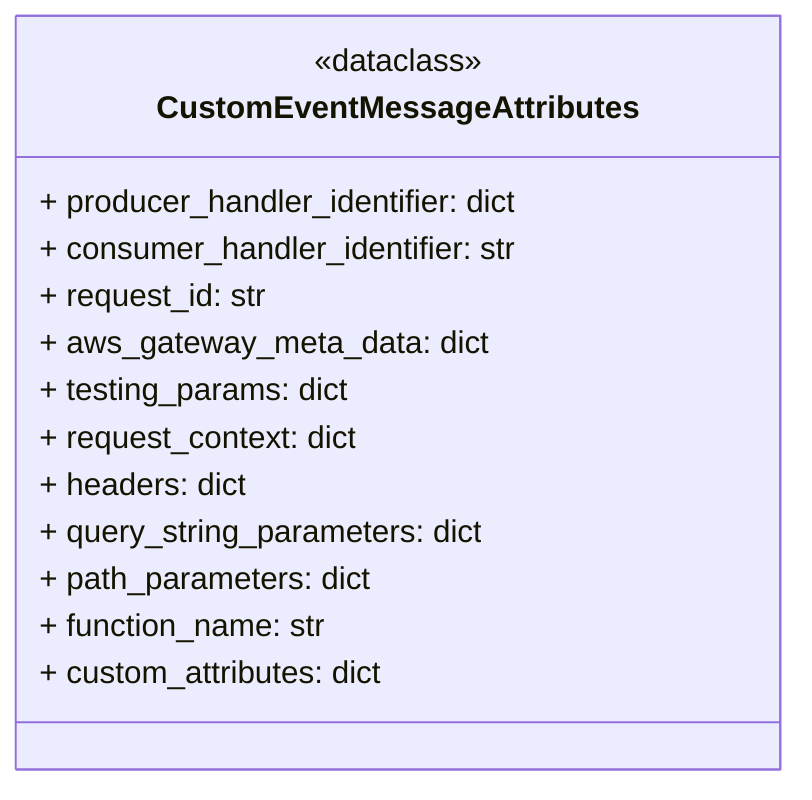

# Diagram: fv_core/fv_framework/python/fv_framework/sqs/models/custom_event.py

> Auto-generated by Obscura crawlers

## Mermaid

```mermaid
classDiagram
class CustomEventMessageAttributes <<dataclass>> {
+ producer_handler_identifier: dict
+ consumer_handler_identifier: str
+ request_id: str
+ aws_gateway_meta_data: dict
+ testing_params: dict
+ request_context: dict
+ headers: dict
+ query_string_parameters: dict
+ path_parameters: dict
+ function_name: str
+ custom_attributes: dict
}
```

> SVG rendering failed for this diagram.
