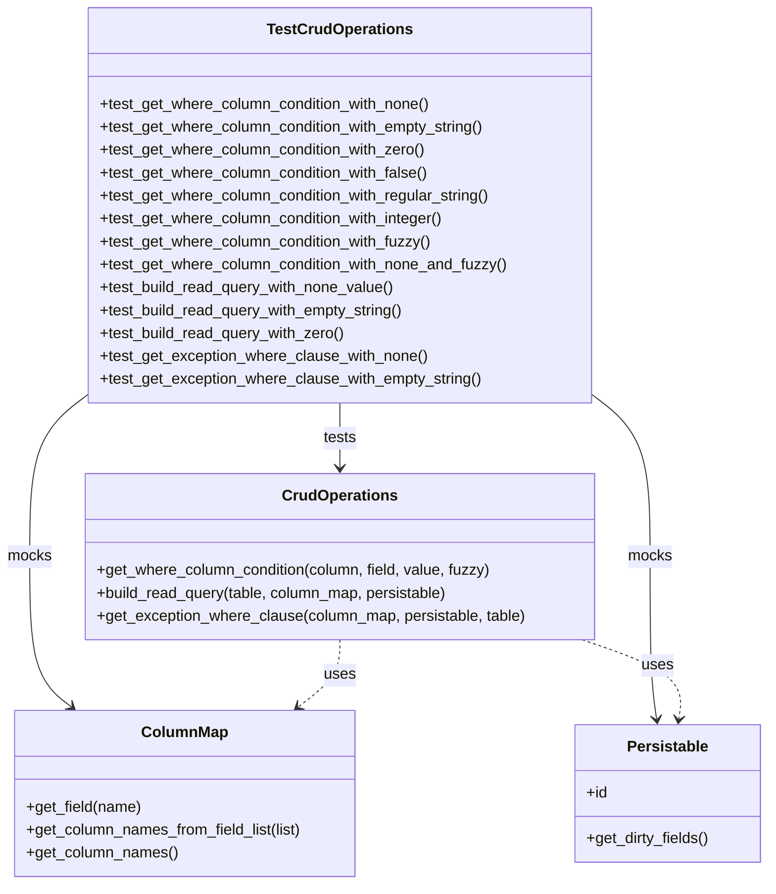

# Diagram: fv_core/fv_framework/python/fv_framework/test/test_CrudOperations.py


> Auto-generated by Obscura crawlers

## Diagram 1



> SVG rendering failed for this diagram.

## Diagram 2

```mermaid
flowchart TD
    Start([get_where_column_condition(column, field, value, fuzzy)]) --> IsNone?{value == None?}
    IsNone? -- yes --> IS["Return: column_name IS %(field_name)s"]
    IsNone? -- no --> IsFuzzy?{fuzzy == True?}
    IsFuzzy? -- yes --> ILIKE["Return: column_name ILIKE %(field_name)s"]
    IsFuzzy? -- no --> EQ["Return: column_name = %(field_name)s"]
    subgraph Examples
      EmptyString["value = \"\""] --> EQ
      Zero["value = 0"] --> EQ
      FalseVal["value = False"] --> EQ
      Integer["value = 42"] --> EQ
      RegularString["value = \"test\""] --> EQ
      FuzzyString["value = \"test\", fuzzy=True"] --> ILIKE
      NoneVal["value = None, fuzzy=True"] --> IS
    end
```

> SVG rendering failed for this diagram.
