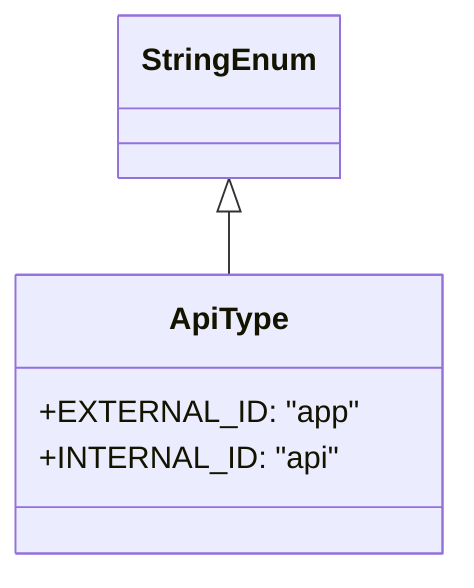

# Diagram: fv_core/fv_framework/python/fv_framework/utility/ApiType.py

> Auto-generated by Obscura crawlers

## Mermaid

```mermaid
classDiagram
class StringEnum {
}
class ApiType {
  +EXTERNAL_ID: "app"
  +INTERNAL_ID: "api"
}
StringEnum <|-- ApiType
```

> SVG rendering failed for this diagram.
