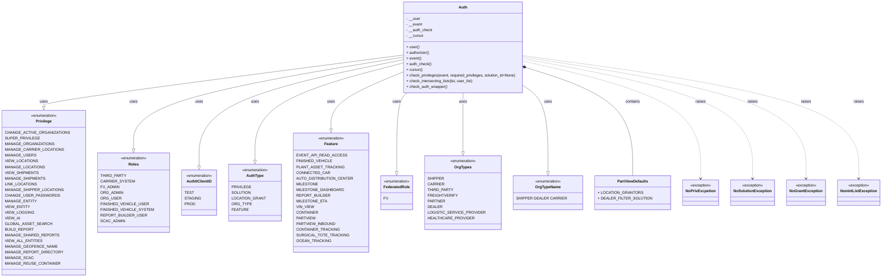
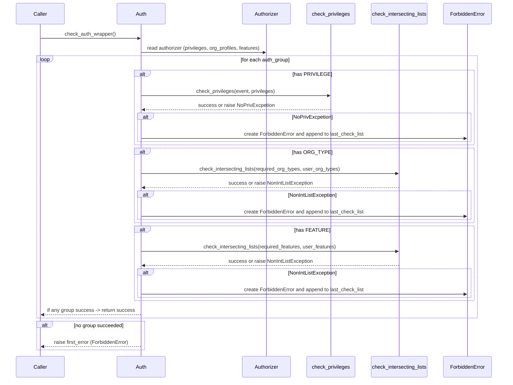

# Diagram: fv_core/fv_framework/python/fv_framework/utility/Authorization.py


> Auto-generated by Obscura crawlers

## Diagram 1



> SVG rendering failed for this diagram.

## Diagram 2

```mermaid
flowchart TD
  Start([Start]) --> ForEachGroup{For each auth_group in auth_check}
  ForEachGroup --> CheckPrivilege{AuthType.PRIVILEGE in auth_group?}
  CheckPrivilege -- Yes --> CallCheckPrivileges[call check_privileges(event, privileges)]
  CallCheckPrivileges --> PrivOK{NoPrivExcpetion raised?}
  PrivOK -- Yes --> AddForbidden1[append ForbiddenError to last_check_list]
  PrivOK -- No --> Continue1
  CheckPrivilege -- No --> Continue1
  Continue1 --> CheckOrgType{AuthType.ORG_TYPE in auth_group?}
  CheckOrgType -- Yes --> CallCheckIntersect1[call check_intersecting_lists(required_org_types, user_org_types)]
  CallCheckIntersect1 --> OrgOK{NonIntListException raised?}
  OrgOK -- Yes --> AddForbidden2[append ForbiddenError to last_check_list]
  OrgOK -- No --> Continue2
  CheckOrgType -- No --> Continue2
  Continue2 --> CheckFeature{AuthType.FEATURE in auth_group?}
  CheckFeature -- Yes --> CallCheckIntersect2[call check_intersecting_lists(required_features, user_features)]
  CallCheckIntersect2 --> FeatureOK{NonIntListException raised?}
  FeatureOK -- Yes --> AddForbidden3[append ForbiddenError to last_check_list]
  FeatureOK -- No --> Continue3
  CheckFeature -- No --> Continue3
  Continue3 --> EvaluateChecks{all checks passed or none?}
  EvaluateChecks -- Yes --> Success([Authorization Success])
  Success --> End([End])
  EvaluateChecks -- No --> CollectFirstError[set first_error if unset]
  CollectFirstError --> NextGroup{More auth_group?}
  NextGroup -- Yes --> ForEachGroup
  NextGroup -- No --> RaiseFirstError[raise first_error] --> End
```

> SVG rendering failed for this diagram.

## Diagram 3



> SVG rendering failed for this diagram.
