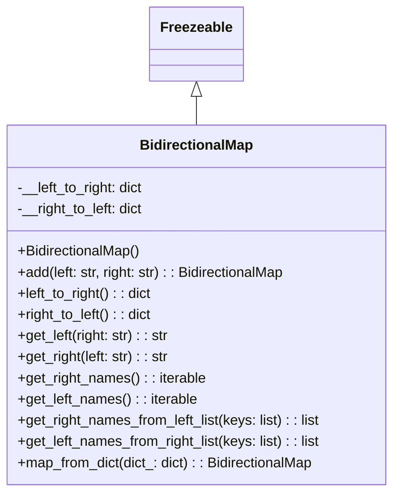

# Diagram: fv_core/fv_framework/python/fv_framework/utility/BidirectionalMap.py

> Auto-generated by Obscura crawlers

## Mermaid

### SVG

<svg id="container" width="452.2734375" xmlns="http://www.w3.org/2000/svg" class="classDiagram" height="558" viewBox="0 0 452.2734375 558" role="graphics-document document" aria-roledescription="class"><g><defs><marker id="container_class-aggregationStart" class="marker aggregation class" refX="18" refY="7" markerWidth="190" markerHeight="240" orient="auto"><path d="M 18,7 L9,13 L1,7 L9,1 Z"></path></marker></defs><defs><marker id="container_class-aggregationEnd" class="marker aggregation class" refX="1" refY="7" markerWidth="20" markerHeight="28" orient="auto"><path d="M 18,7 L9,13 L1,7 L9,1 Z"></path></marker></defs><defs><marker id="container_class-extensionStart" class="marker extension class" refX="18" refY="7" markerWidth="190" markerHeight="240" orient="auto"><path d="M 1,7 L18,13 V 1 Z"></path></marker></defs><defs><marker id="container_class-extensionEnd" class="marker extension class" refX="1" refY="7" markerWidth="20" markerHeight="28" orient="auto"><path d="M 1,1 V 13 L18,7 Z"></path></marker></defs><defs><marker id="container_class-compositionStart" class="marker composition class" refX="18" refY="7" markerWidth="190" markerHeight="240" orient="auto"><path d="M 18,7 L9,13 L1,7 L9,1 Z"></path></marker></defs><defs><marker id="container_class-compositionEnd" class="marker composition class" refX="1" refY="7" markerWidth="20" markerHeight="28" orient="auto"><path d="M 18,7 L9,13 L1,7 L9,1 Z"></path></marker></defs><defs><marker id="container_class-dependencyStart" class="marker dependency class" refX="6" refY="7" markerWidth="190" markerHeight="240" orient="auto"><path d="M 5,7 L9,13 L1,7 L9,1 Z"></path></marker></defs><defs><marker id="container_class-dependencyEnd" class="marker dependency class" refX="13" refY="7" markerWidth="20" markerHeight="28" orient="auto"><path d="M 18,7 L9,13 L14,7 L9,1 Z"></path></marker></defs><defs><marker id="container_class-lollipopStart" class="marker lollipop class" refX="13" refY="7" markerWidth="190" markerHeight="240" orient="auto"><circle stroke="black" fill="transparent" cx="7" cy="7" r="6"></circle></marker></defs><defs><marker id="container_class-lollipopEnd" class="marker lollipop class" refX="1" refY="7" markerWidth="190" markerHeight="240" orient="auto"><circle stroke="black" fill="transparent" cx="7" cy="7" r="6"></circle></marker></defs><g class="root"><g class="clusters"></g><g class="edgePaths"><path d="M226.137,109.25L226.137,110.542C226.137,111.833,226.137,114.417,226.137,119.875C226.137,125.333,226.137,133.667,226.137,137.833L226.137,142" id="id_Freezeable_BidirectionalMap_1" class="edge-thickness-normal edge-pattern-solid relation" style=";;;" data-edge="true" data-et="edge" data-id="id_Freezeable_BidirectionalMap_1" data-points="W3sieCI6MjI2LjEzNjcxODc1LCJ5Ijo5Mn0seyJ4IjoyMjYuMTM2NzE4NzUsInkiOjExN30seyJ4IjoyMjYuMTM2NzE4NzUsInkiOjE0Mn1d" marker-start="url(#container_class-extensionStart)"></path></g><g class="edgeLabels"><g class="edgeLabel"><g class="label" data-id="id_Freezeable_BidirectionalMap_1" transform="translate(0, 0)"><foreignObject width="0" height="0">

</foreignObject></g></g></g><g class="nodes"><g class="node default" id="classId-Freezeable-0" transform="translate(226.13671875, 50)"><g class="basic label-container"><path d="M-51.1953125 -42 L51.1953125 -42 L51.1953125 42 L-51.1953125 42" stroke="none" stroke-width="0" fill="#ECECFF" style=""></path><path d="M-51.1953125 -42 C-20.289249991884216 -42, 10.616812516231569 -42, 51.1953125 -42 M-51.1953125 -42 C-28.545877630695397 -42, -5.896442761390794 -42, 51.1953125 -42 M51.1953125 -42 C51.1953125 -10.84123493140659, 51.1953125 20.31753013718682, 51.1953125 42 M51.1953125 -42 C51.1953125 -11.01808439241816, 51.1953125 19.96383121516368, 51.1953125 42 M51.1953125 42 C18.193139759817754 42, -14.809032980364492 42, -51.1953125 42 M51.1953125 42 C22.96719942465697 42, -5.2609136506860565 42, -51.1953125 42 M-51.1953125 42 C-51.1953125 21.94362392290336, -51.1953125 1.8872478458067192, -51.1953125 -42 M-51.1953125 42 C-51.1953125 13.163276765470464, -51.1953125 -15.673446469059073, -51.1953125 -42" stroke="#9370DB" stroke-width="1.3" fill="none" stroke-dasharray="0 0" style=""></path></g><g class="annotation-group text" transform="translate(0, -18)"></g><g class="label-group text" transform="translate(-39.1953125, -18)"><g class="label" style="font-weight: bolder" transform="translate(0,-12)"><foreignObject width="78.390625" height="24">

Freezeable

</foreignObject></g></g><g class="members-group text" transform="translate(-39.1953125, 30)"></g><g class="methods-group text" transform="translate(-39.1953125, 60)"></g><g class="divider" style=""><path d="M-51.1953125 6 C-16.573437961805425 6, 18.04843657638915 6, 51.1953125 6 M-51.1953125 6 C-18.518956967169707 6, 14.157398565660586 6, 51.1953125 6" stroke="#9370DB" stroke-width="1.3" fill="none" stroke-dasharray="0 0" style=""></path></g><g class="divider" style=""><path d="M-51.1953125 24 C-26.7717817337316 24, -2.3482509674632013 24, 51.1953125 24 M-51.1953125 24 C-25.892710240485016 24, -0.590107980970032 24, 51.1953125 24" stroke="#9370DB" stroke-width="1.3" fill="none" stroke-dasharray="0 0" style=""></path></g></g><g class="node default" id="classId-BidirectionalMap-1" transform="translate(226.13671875, 346)"><g class="basic label-container"><path d="M-218.13671875 -204 L218.13671875 -204 L218.13671875 204 L-218.13671875 204" stroke="none" stroke-width="0" fill="#ECECFF" style=""></path><path d="M-218.13671875 -204 C-95.02545240096202 -204, 28.085813948075952 -204, 218.13671875 -204 M-218.13671875 -204 C-51.21285978935194 -204, 115.71099917129612 -204, 218.13671875 -204 M218.13671875 -204 C218.13671875 -65.23870761917138, 218.13671875 73.52258476165724, 218.13671875 204 M218.13671875 -204 C218.13671875 -86.08743589002626, 218.13671875 31.825128219947487, 218.13671875 204 M218.13671875 204 C62.76227020090403 204, -92.61217834819195 204, -218.13671875 204 M218.13671875 204 C79.29495938395988 204, -59.546799982080245 204, -218.13671875 204 M-218.13671875 204 C-218.13671875 97.85288811001901, -218.13671875 -8.294223779961982, -218.13671875 -204 M-218.13671875 204 C-218.13671875 74.64766015609078, -218.13671875 -54.70467968781844, -218.13671875 -204" stroke="#9370DB" stroke-width="1.3" fill="none" stroke-dasharray="0 0" style=""></path></g><g class="annotation-group text" transform="translate(0, -180)"></g><g class="label-group text" transform="translate(-62.2265625, -180)"><g class="label" style="font-weight: bolder" transform="translate(0,-12)"><foreignObject width="124.453125" height="24">

BidirectionalMap

</foreignObject></g></g><g class="members-group text" transform="translate(-206.13671875, -132)"><g class="label" style="" transform="translate(0,-12)"><foreignObject width="146.640625" height="24">

-__left_to_right: dict

</foreignObject></g><g class="label" style="" transform="translate(0,12)"><foreignObject width="146.640625" height="24">

-__right_to_left: dict

</foreignObject></g></g><g class="methods-group text" transform="translate(-206.13671875, -60)"><g class="label" style="" transform="translate(0,-12)"><foreignObject width="141.640625" height="24">

+BidirectionalMap()

</foreignObject></g><g class="label" style="" transform="translate(0,12)"><foreignObject width="310.203125" height="24">

+add(left: str, right: str) : : BidirectionalMap

</foreignObject></g><g class="label" style="" transform="translate(0,36)"><foreignObject width="155.765625" height="24">

+left_to_right() : : dict

</foreignObject></g><g class="label" style="" transform="translate(0,60)"><foreignObject width="155.609375" height="24">

+right_to_left() : : dict

</foreignObject></g><g class="label" style="" transform="translate(0,84)"><foreignObject width="175.09375" height="24">

+get_left(right: str) : : str

</foreignObject></g><g class="label" style="" transform="translate(0,108)"><foreignObject width="175.25" height="24">

+get_right(left: str) : : str

</foreignObject></g><g class="label" style="" transform="translate(0,132)"><foreignObject width="216.03125" height="24">

+get_right_names() : : iterable

</foreignObject></g><g class="label" style="" transform="translate(0,156)"><foreignObject width="206.171875" height="24">

+get_left_names() : : iterable

</foreignObject></g><g class="label" style="" transform="translate(0,180)"><foreignObject width="350.046875" height="24">

+get_right_names_from_left_list(keys: list) : : list

</foreignObject></g><g class="label" style="" transform="translate(0,204)"><foreignObject width="350.046875" height="24">

+get_left_names_from_right_list(keys: list) : : list

</foreignObject></g><g class="label" style="" transform="translate(0,228)"><foreignObject width="342.671875" height="24">

+map_from_dict(dict_: dict) : : BidirectionalMap

</foreignObject></g></g><g class="divider" style=""><path d="M-218.13671875 -156 C-99.92958268665448 -156, 18.27755337669103 -156, 218.13671875 -156 M-218.13671875 -156 C-75.9610130083071 -156, 66.21469273338579 -156, 218.13671875 -156" stroke="#9370DB" stroke-width="1.3" fill="none" stroke-dasharray="0 0" style=""></path></g><g class="divider" style=""><path d="M-218.13671875 -84 C-102.31283244076228 -84, 13.511053868475443 -84, 218.13671875 -84 M-218.13671875 -84 C-74.87945483235606 -84, 68.37780908528788 -84, 218.13671875 -84" stroke="#9370DB" stroke-width="1.3" fill="none" stroke-dasharray="0 0" style=""></path></g></g></g></g></g></svg>
