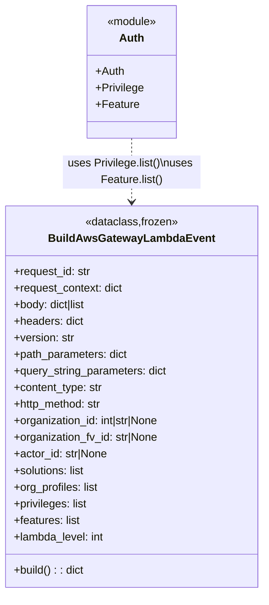

# Diagram: fv_core/fv_framework/python/fv_framework/utility/BuildAwsGatewayLambdaEvent.py


> Auto-generated by Obscura crawlers

## Diagram 1



> SVG rendering failed for this diagram.

## Diagram 2

```mermaid
flowchart LR
  Start([start]) --> Init["Create new_event = {\"httpMethod\": http_method}"]
  Init --> CheckVersion{"version exists?"}
  CheckVersion -- yes --> InjectHeaders["new_event.headers.Accept = content_type;version=version"]
  CheckVersion -- no --> SkipHeader["skip version header injection"]
  InjectHeaders --> CheckBody
  SkipHeader --> CheckBody
  CheckBody{"body?"} -- yes --> SetBody["new_event['body'] = body"]
  CheckBody -- no --> AfterBody
  SetBody --> AfterBody
  AfterBody --> CheckPath{"path_parameters?"}
  CheckPath -- yes --> SetPath["new_event['pathParameters'] = path_parameters"]
  CheckPath -- no --> AfterPath
  SetPath --> AfterPath
  AfterPath --> CheckQuery{"query_string_parameters?"}
  CheckQuery -- yes --> SetQuery["new_event['queryStringParameters'] = query_string_parameters"]
  CheckQuery -- no --> AfterQuery
  SetQuery --> AfterQuery
  AfterQuery --> CheckHeaders{"headers?"}
  CheckHeaders -- yes --> SetHeaders["new_event['headers'] = headers"]
  CheckHeaders -- no --> EmptyHeaders["new_event['headers'] = {}"]
  SetHeaders --> AfterHeaders
  EmptyHeaders --> AfterHeaders
  AfterHeaders --> EnsureAccept["new_event['headers']['accept'] = content_type;version=version"]
  EnsureAccept --> SetHttpMethod["new_event['httpMethod'] = http_method"]
  SetHttpMethod --> EnsureLambdaLevel["if request_context.lambda_level is None then set to lambda_level"]
  EnsureLambdaLevel --> UpdateRequestContext["update request_context with requestId, requestTimeEpoch, stage, httpMethod"]
  UpdateRequestContext --> UpdateAuthorizer["authorizer = request_context.setdefault('authorizer', {}); update privileges, features, solutions, org_profiles, organization_id, organization_fv_id, email"]
  UpdateAuthorizer --> AttachRequestContext{"request_context present?"}
  AttachRequestContext -- yes --> SetRequestContext["new_event['requestContext'] = request_context"]
  AttachRequestContext -- no --> SkipAttach
  SetRequestContext --> ReturnEvent["return new_event"]
  SkipAttach --> ReturnEvent
```

> SVG rendering failed for this diagram.
