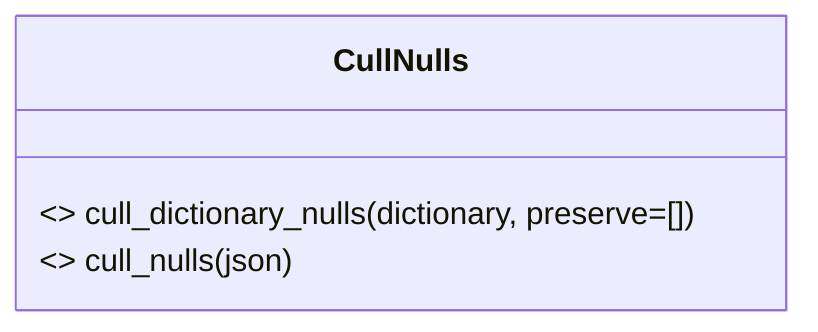

# Diagram: fv_core/fv_framework/python/fv_framework/utility/CullNulls.py


> Auto-generated by Obscura crawlers

## Diagram 1



> SVG rendering failed for this diagram.

## Diagram 2

```mermaid
flowchart TD
    Start([Start]) --> ForEach{For each key, value in dictionary.items()}
    ForEach --> IsPreserve{key in preserve_set?}
    IsPreserve -- Yes --> AddPreserve[retval[key] = value]
    AddPreserve --> ContinueLoop[Next item]
    IsPreserve -- No --> IsNone{value is None?}
    IsNone -- Yes --> ContinueLoop
    IsNone -- No --> IsDict{isinstance(value, dict)?}
    IsDict -- No --> AddValue[retval[key] = value]
    AddValue --> ContinueLoop
    IsDict -- Yes --> Recurse[ new_dictionary = cull_dictionary_nulls(value) ]
    Recurse --> HasNew{new_dictionary non-empty?}
    HasNew -- Yes --> AddDict[retval[key] = new_dictionary]
    AddDict --> ContinueLoop
    HasNew -- No --> ContinueLoop
    ContinueLoop --> ForEach
    ForEach --> EndCheck{len(retval) != 0?}
    EndCheck -- Yes --> ReturnRetval([return retval])
    EndCheck -- No --> ReturnNone([return None])
```

> SVG rendering failed for this diagram.

## Diagram 3

```mermaid
flowchart TD
    S2([Start]) --> Loop{For each entry in list(json.keys())}
    Loop --> IsNone2{json[entry] is None?}
    IsNone2 -- Yes --> Delete[del json[entry]]
    Delete --> Next2[Next entry]
    IsNone2 -- No --> Next2
    Next2 --> Loop
    Loop --> End2([End])
```

> SVG rendering failed for this diagram.
