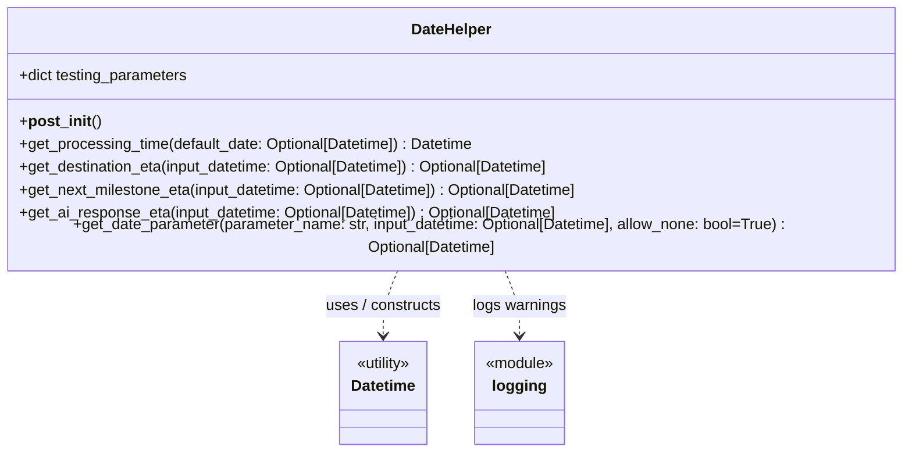

# Diagram: fv_core/fv_framework/python/fv_framework/utility/DateHelper.py


> Auto-generated by Obscura crawlers

## Diagram 1



> SVG rendering failed for this diagram.

## Diagram 2

```mermaid
flowchart TD
    Start([get_date_parameter]) --> GetParam[parameter_value = testing_parameters[parameter_name]; output_datetime = input_datetime]
    GetParam --> IsStr{parameter_value is a string?}
    IsStr -- yes --> IsNone{parameter_value.lower() == "none"?}
    IsStr -- no --> SkipParse[keep output_datetime = input_datetime]
    IsNone -- yes --> SetNone[output_datetime = None]
    IsNone -- no --> TryParse[attempt Datetime(parameter_value, False)]
    TryParse --> ParseOk{parsed successfully?}
    ParseOk -- yes --> SetParsed[output_datetime = parsed Datetime]
    ParseOk -- no --> Warn[logging.warning("Invalid testing parameter date format")]
    Warn --> Continue
    SetParsed --> Continue
    SetNone --> Continue
    SkipParse --> Continue
    Continue --> CheckAllowNone{output_datetime is None and allow_none == false?}
    CheckAllowNone -- yes --> SetCurrent[output_datetime = Datetime(None)]
    CheckAllowNone -- no --> Return
    SetCurrent --> Return[return output_datetime]
    Return --> End([return output_datetime])
```

> SVG rendering failed for this diagram.
