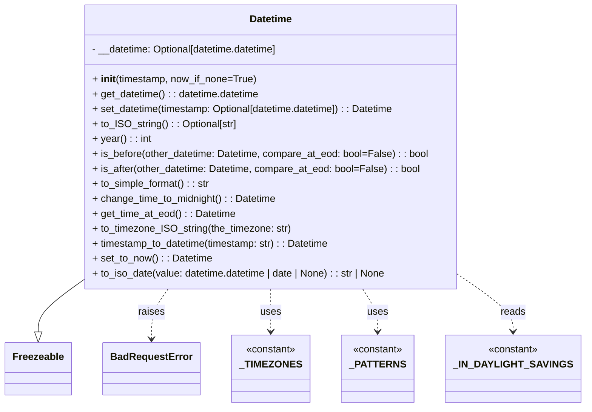

# Diagram: fv_core/fv_framework/python/fv_framework/utility/Datetime.py


> Auto-generated by Obscura crawlers

## Diagram 1



> SVG rendering failed for this diagram.

## Diagram 2

```mermaid
flowchart TD
A[Input timestamp string] --> B[Replace trailing 'Z' placeholder and map TZ abbreviations]
B --> C{Matches \"+/-HH:MM\" timezone format?}
C -- yes --> D[Remove colon from timezone offset]
C -- no --> E[Skip colon removal]
D --> F[Apply regex to compact timezone digits]
E --> F
F --> G[Loop: try datetime.strptime with patterns from _PATTERNS]
G --> H{Parse succeeded?}
H -- yes --> I[If no tzinfo: set tzinfo=UTC; then astimezone(UTC)]
H -- no --> J[Raise BadRequestError("Invalid timestamp format")]
I --> K[call set_datetime(new_datetime) and return self]
J --> K
```

> SVG rendering failed for this diagram.
