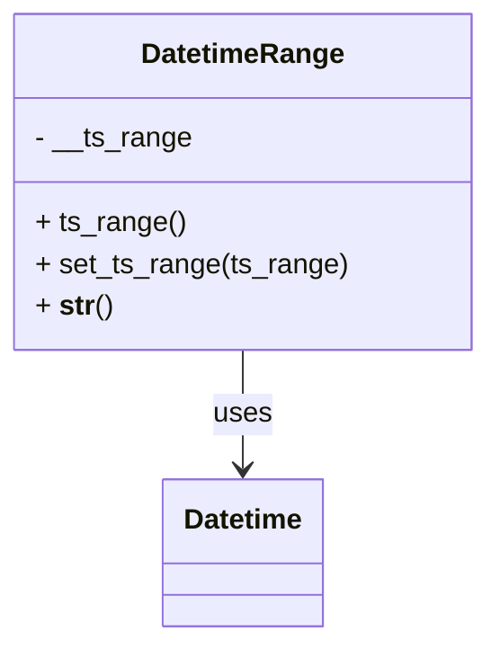

# Diagram: fv_core/fv_framework/python/fv_framework/utility/DatetimeRange.py


> Auto-generated by Obscura crawlers

## Diagram 1



> SVG rendering failed for this diagram.

## Diagram 2

```mermaid
flowchart TD
    Start((Start)) --> CheckType{ts_range is None, str, or list?}
    CheckType -->|None| Pass([pass / no-op])
    CheckType -->|str| IsComma{string contains two comma-separated parts?}
    CheckType -->|list| ListParse([parse lower & upper from list -> to_ISO_string()])
    IsComma -->|yes| TryParse([parse parts -> to_ISO_string()])
    TryParse --> Compare1{lower <= upper?}
    Compare1 -->|yes| SetRange1([set __ts_range = [lower, upper]])
    Compare1 -->|no| RaiseRange1([raise Exception: upper must be >= lower])
    TryParse -->|exception| RaiseInvalid([raise Exception: invalid timestamp timerange value])
    IsComma -->|no| SingleParse([set __ts_range = [ISO(ts_range), ISO(ts_range)]])
    ListParse --> Compare2{lower <= upper?}
    Compare2 -->|yes| SetRange2([set __ts_range = [lower, upper]])
    Compare2 -->|no| RaiseRange2([raise Exception: upper must be > lower])
    Pass --> Return([return self])
    SetRange1 --> Return
    SetRange2 --> Return
    SingleParse --> Return
    RaiseRange1 --> Return
    RaiseRange2 --> Return
    RaiseInvalid --> Return
```

> SVG rendering failed for this diagram.
