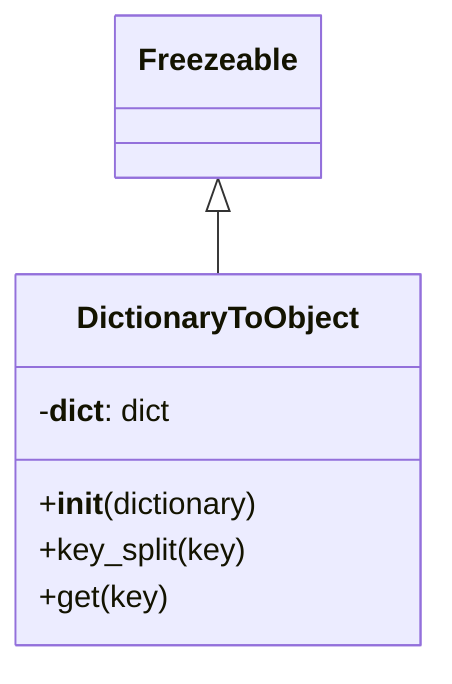

# Diagram: fv_core/fv_framework/python/fv_framework/utility/DictionaryToObject.py

> Auto-generated by Obscura crawlers

## Mermaid

### SVG

<svg id="container" width="226.390625" xmlns="http://www.w3.org/2000/svg" class="classDiagram" height="342" viewBox="0 0 226.390625 342" role="graphics-document document" aria-roledescription="class"><g><defs><marker id="container_class-aggregationStart" class="marker aggregation class" refX="18" refY="7" markerWidth="190" markerHeight="240" orient="auto"><path d="M 18,7 L9,13 L1,7 L9,1 Z"></path></marker></defs><defs><marker id="container_class-aggregationEnd" class="marker aggregation class" refX="1" refY="7" markerWidth="20" markerHeight="28" orient="auto"><path d="M 18,7 L9,13 L1,7 L9,1 Z"></path></marker></defs><defs><marker id="container_class-extensionStart" class="marker extension class" refX="18" refY="7" markerWidth="190" markerHeight="240" orient="auto"><path d="M 1,7 L18,13 V 1 Z"></path></marker></defs><defs><marker id="container_class-extensionEnd" class="marker extension class" refX="1" refY="7" markerWidth="20" markerHeight="28" orient="auto"><path d="M 1,1 V 13 L18,7 Z"></path></marker></defs><defs><marker id="container_class-compositionStart" class="marker composition class" refX="18" refY="7" markerWidth="190" markerHeight="240" orient="auto"><path d="M 18,7 L9,13 L1,7 L9,1 Z"></path></marker></defs><defs><marker id="container_class-compositionEnd" class="marker composition class" refX="1" refY="7" markerWidth="20" markerHeight="28" orient="auto"><path d="M 18,7 L9,13 L1,7 L9,1 Z"></path></marker></defs><defs><marker id="container_class-dependencyStart" class="marker dependency class" refX="6" refY="7" markerWidth="190" markerHeight="240" orient="auto"><path d="M 5,7 L9,13 L1,7 L9,1 Z"></path></marker></defs><defs><marker id="container_class-dependencyEnd" class="marker dependency class" refX="13" refY="7" markerWidth="20" markerHeight="28" orient="auto"><path d="M 18,7 L9,13 L14,7 L9,1 Z"></path></marker></defs><defs><marker id="container_class-lollipopStart" class="marker lollipop class" refX="13" refY="7" markerWidth="190" markerHeight="240" orient="auto"><circle stroke="black" fill="transparent" cx="7" cy="7" r="6"></circle></marker></defs><defs><marker id="container_class-lollipopEnd" class="marker lollipop class" refX="1" refY="7" markerWidth="190" markerHeight="240" orient="auto"><circle stroke="black" fill="transparent" cx="7" cy="7" r="6"></circle></marker></defs><g class="root"><g class="clusters"></g><g class="edgePaths"><path d="M113.195,109.25L113.195,110.542C113.195,111.833,113.195,114.417,113.195,119.875C113.195,125.333,113.195,133.667,113.195,137.833L113.195,142" id="id_Freezeable_DictionaryToObject_1" class="edge-thickness-normal edge-pattern-solid relation" style=";;;" data-edge="true" data-et="edge" data-id="id_Freezeable_DictionaryToObject_1" data-points="W3sieCI6MTEzLjE5NTMxMjUsInkiOjkyfSx7IngiOjExMy4xOTUzMTI1LCJ5IjoxMTd9LHsieCI6MTEzLjE5NTMxMjUsInkiOjE0Mn1d" marker-start="url(#container_class-extensionStart)"></path></g><g class="edgeLabels"><g class="edgeLabel"><g class="label" data-id="id_Freezeable_DictionaryToObject_1" transform="translate(0, 0)"><foreignObject width="0" height="0">

</foreignObject></g></g></g><g class="nodes"><g class="node default" id="classId-Freezeable-0" transform="translate(113.1953125, 50)"><g class="basic label-container"><path d="M-51.1953125 -42 L51.1953125 -42 L51.1953125 42 L-51.1953125 42" stroke="none" stroke-width="0" fill="#ECECFF" style=""></path><path d="M-51.1953125 -42 C-28.421759425821005 -42, -5.64820635164201 -42, 51.1953125 -42 M-51.1953125 -42 C-22.15061651631377 -42, 6.894079467372457 -42, 51.1953125 -42 M51.1953125 -42 C51.1953125 -23.274815330431014, 51.1953125 -4.549630660862029, 51.1953125 42 M51.1953125 -42 C51.1953125 -22.90340057824312, 51.1953125 -3.8068011564862374, 51.1953125 42 M51.1953125 42 C22.805123679835948 42, -5.585065140328105 42, -51.1953125 42 M51.1953125 42 C25.249892635477778 42, -0.6955272290444441 42, -51.1953125 42 M-51.1953125 42 C-51.1953125 19.298446185359143, -51.1953125 -3.4031076292817133, -51.1953125 -42 M-51.1953125 42 C-51.1953125 20.355900074567824, -51.1953125 -1.288199850864352, -51.1953125 -42" stroke="#9370DB" stroke-width="1.3" fill="none" stroke-dasharray="0 0" style=""></path></g><g class="annotation-group text" transform="translate(0, -18)"></g><g class="label-group text" transform="translate(-39.1953125, -18)"><g class="label" style="font-weight: bolder" transform="translate(0,-12)"><foreignObject width="78.390625" height="24">

Freezeable

</foreignObject></g></g><g class="members-group text" transform="translate(-39.1953125, 30)"></g><g class="methods-group text" transform="translate(-39.1953125, 60)"></g><g class="divider" style=""><path d="M-51.1953125 6 C-18.06880179063547 6, 15.057708918729062 6, 51.1953125 6 M-51.1953125 6 C-16.304398510017812 6, 18.586515479964376 6, 51.1953125 6" stroke="#9370DB" stroke-width="1.3" fill="none" stroke-dasharray="0 0" style=""></path></g><g class="divider" style=""><path d="M-51.1953125 24 C-10.841032494209003 24, 29.513247511581994 24, 51.1953125 24 M-51.1953125 24 C-15.987234818431176 24, 19.220842863137648 24, 51.1953125 24" stroke="#9370DB" stroke-width="1.3" fill="none" stroke-dasharray="0 0" style=""></path></g></g><g class="node default" id="classId-DictionaryToObject-1" transform="translate(113.1953125, 238)"><g class="basic label-container"><path d="M-105.1953125 -96 L105.1953125 -96 L105.1953125 96 L-105.1953125 96" stroke="none" stroke-width="0" fill="#ECECFF" style=""></path><path d="M-105.1953125 -96 C-45.19399730818092 -96, 14.807317883638163 -96, 105.1953125 -96 M-105.1953125 -96 C-24.31296820051601 -96, 56.56937609896798 -96, 105.1953125 -96 M105.1953125 -96 C105.1953125 -26.129719263374255, 105.1953125 43.74056147325149, 105.1953125 96 M105.1953125 -96 C105.1953125 -51.20563745102251, 105.1953125 -6.411274902045022, 105.1953125 96 M105.1953125 96 C41.76699425855158 96, -21.661323982896846 96, -105.1953125 96 M105.1953125 96 C32.52345215636704 96, -40.148408187265915 96, -105.1953125 96 M-105.1953125 96 C-105.1953125 22.398075650304392, -105.1953125 -51.203848699391216, -105.1953125 -96 M-105.1953125 96 C-105.1953125 47.91348945489155, -105.1953125 -0.17302109021690626, -105.1953125 -96" stroke="#9370DB" stroke-width="1.3" fill="none" stroke-dasharray="0 0" style=""></path></g><g class="annotation-group text" transform="translate(0, -72)"></g><g class="label-group text" transform="translate(-70.109375, -72)"><g class="label" style="font-weight: bolder" transform="translate(0,-12)"><foreignObject width="140.21875" height="24">

DictionaryToObject

</foreignObject></g></g><g class="members-group text" transform="translate(-93.1953125, -24)"><g class="label" style="" transform="translate(0,-12)"><foreignObject width="70" height="24">

-<strong>dict</strong>: dict

</foreignObject></g></g><g class="methods-group text" transform="translate(-93.1953125, 24)"><g class="label" style="" transform="translate(0,-12)"><foreignObject width="116.28125" height="24">

+<strong>init</strong>(dictionary)

</foreignObject></g><g class="label" style="" transform="translate(0,12)"><foreignObject width="107.296875" height="24">

+key_split(key)

</foreignObject></g><g class="label" style="" transform="translate(0,36)"><foreignObject width="65.5" height="24">

+get(key)

</foreignObject></g></g><g class="divider" style=""><path d="M-105.1953125 -48 C-21.332444420667855 -48, 62.53042365866429 -48, 105.1953125 -48 M-105.1953125 -48 C-49.70006417049055 -48, 5.795184159018902 -48, 105.1953125 -48" stroke="#9370DB" stroke-width="1.3" fill="none" stroke-dasharray="0 0" style=""></path></g><g class="divider" style=""><path d="M-105.1953125 0 C-40.826479731896185 0, 23.54235303620763 0, 105.1953125 0 M-105.1953125 0 C-29.645658238264474 0, 45.90399602347105 0, 105.1953125 0" stroke="#9370DB" stroke-width="1.3" fill="none" stroke-dasharray="0 0" style=""></path></g></g></g></g></g></svg>
