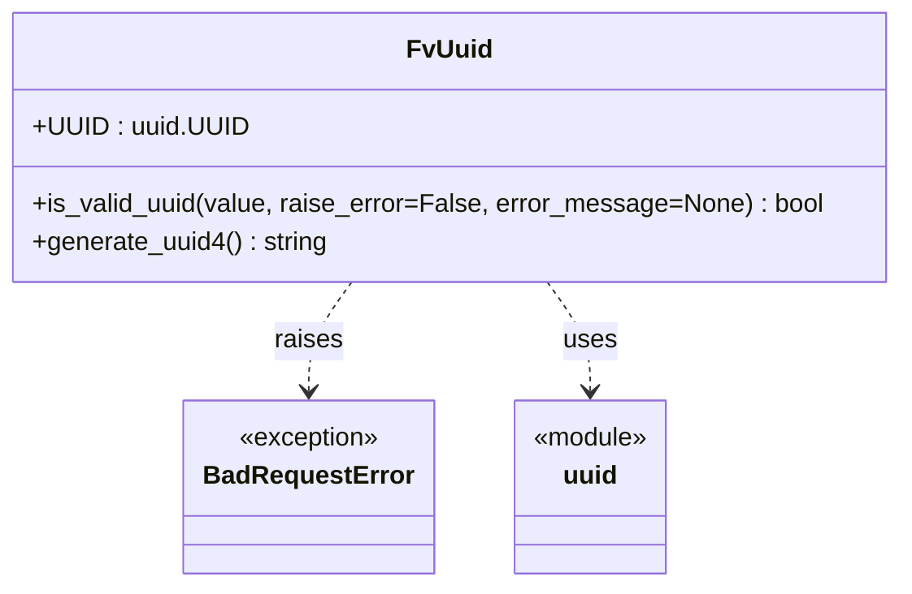

# Diagram: fv_core/fv_framework/python/fv_framework/utility/FvUuid.py

> Auto-generated by Obscura crawlers

## Mermaid

```mermaid
classDiagram
    class FvUuid {
        +UUID : uuid.UUID
        +is_valid_uuid(value, raise_error=False, error_message=None) bool
        +generate_uuid4() string
    }
    class BadRequestError <<exception>>
    class uuid <<module>>
    FvUuid ..> BadRequestError : raises
    FvUuid ..> uuid : uses
```

> SVG rendering failed for this diagram.
