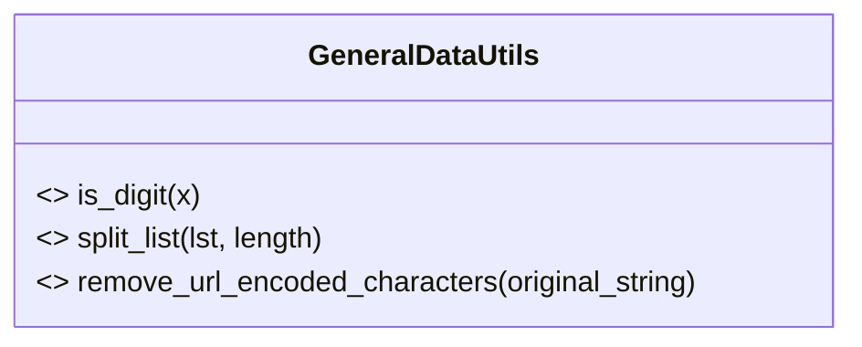

# Diagram: fv_core/fv_framework/python/fv_framework/utility/GeneralDataUtils.py


> Auto-generated by Obscura crawlers

## Diagram 1



> SVG rendering failed for this diagram.

## Diagram 2

```mermaid
flowchart TD
  subgraph IS_DIGIT["is_digit(x)"]
    A1[Start] --> A2[Try float(x)]
    A2 --> A3{Success?}
    A3 -- Yes --> A4[retval = True]
    A3 -- No --> A5[retval = False]
    A4 --> A6[return retval]
    A5 --> A6
  end

  subgraph SPLIT_LIST["split_list(lst, length)"]
    B1[Start] --> B2[Compute n = ceil(len(lst) / length)]
    B2 --> B3[For i in range(n): slice lst[i*length:(i+1)*length]]
    B3 --> B4[Collect slices into list]
    B4 --> B5[return list of slices]
  end

  subgraph REMOVE_URL["remove_url_encoded_characters(original_string)"]
    C1[Start] --> C2[cleaned_string = original_string]
    C2 --> C3{original_string is truthy?}
    C3 -- Yes --> C4[cleaned_string = urllib.parse.unquote(original_string)]
    C3 -- No --> C5[keep cleaned_string as original_string]
    C4 --> C6[return cleaned_string]
    C5 --> C6
  end
```

> SVG rendering failed for this diagram.
