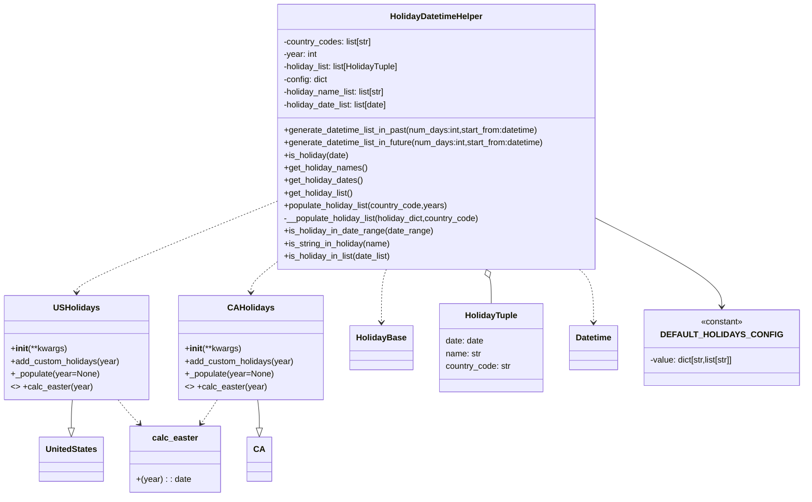

# Diagram: fv_core/fv_framework/python/fv_framework/utility/HolidayDatetimeHelper.py


> Auto-generated by Obscura crawlers

## Diagram 1



> SVG rendering failed for this diagram.

## Diagram 2

```mermaid
graph TD
Start([Start]) --> Init[Instantiate HolidayDatetimeHelper]
Init --> LoopYears[Loop years: year, year+1, year-1]
LoopYears --> ForEachCode[For each country_code in country_codes]
ForEachCode --> CheckSupported{country_code supported?}
CheckSupported -- No --> Skip[Skip unsupported code] --> ForEachCode
CheckSupported -- Yes --> IsUS{country_code == "US"}
IsUS -- Yes --> USConstruct[Construct USHolidays(years)]
IsUS -- Yes --> USPopulate[Call __populate_holiday_list(USHolidays, "US")]
IsUS -- Yes --> USBase[Call __populate_holiday_list(HolidayBase, "US")]
IsUS -- No --> IsCA{country_code == "CA"}
IsCA -- Yes --> CAConstruct[Construct CAHolidays(years)]
IsCA -- Yes --> CAPopulate[Call __populate_holiday_list(CAHolidays, "CA")]
IsCA -- Yes --> CABase[Call __populate_holiday_list(HolidayBase, "CA")]
IsCA -- No --> ForEachCode

USConstruct --> USAdd[USHolidays._populate -> add_custom_holidays]
CAConstruct --> CAAdd[CAHolidays._populate -> add_custom_holidays]
USAdd --> CalcEasterUS[uses calc_easter to compute Easter & Holy Saturday and Friday after Thanksgiving]
CAAdd --> CalcEasterCA[uses calc_easter to compute Easter, Holy Saturday, Victoria Day]

USPopulate --> PopulateLoop
USBase --> PopulateLoop
CAPopulate --> PopulateLoop
CABase --> PopulateLoop

subgraph PopulateLoopModule["__populate_holiday_list processing"]
  PIter[Iterate over holiday_dict.items()] --> PFilter{name in config[country_code]?}
  PFilter -- No --> PIter
  PFilter -- Yes --> PAppend[Append HolidayTuple(date,name,country_code) to holiday_list]
  PAppend --> PUpdate[Extend holiday_date_list and holiday_name_list if new]
  PUpdate --> PIter
end

PopulateLoop --> End([Return to caller])
```

> SVG rendering failed for this diagram.
