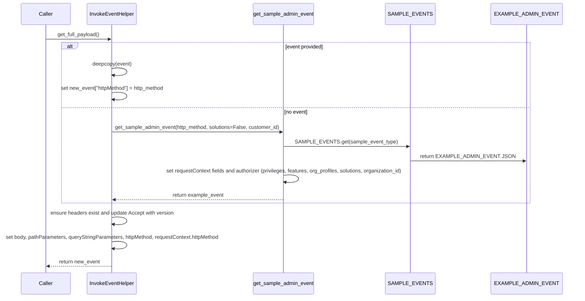

# Diagram: fv_core/fv_framework/python/fv_framework/utility/InvokeEventHelper.py


> Auto-generated by Obscura crawlers

## Diagram 1

```mermaid
classDiagram
class InvokeEventHelper {
  <<dataclass,frozen>>
  +event: dict
  +request_id: str
  +body: dict
  +version: str
  +pathParameters: dict
  +queryStringParameters: dict
  +content_type: str
  +http_method: str
  +customer_org: int
  +actor_id: str
  +solutions: list
  +org_profiles: list
  +privs: list
  +sample_event_type: str
  +new_event: dict
  +features: list
  +use_sample: bool
  +get_full_payload(): dict
  +get_sample_admin_event(http_method, solutions, customer_id): dict
  +__repr__(): str
}
class EXAMPLE_ADMIN_EVENT {
  <<constant>>
}
class SAMPLE_EVENTS {
  <<constant dict>>
}
class Auth_Auth {
  <<external>>
  +Privilege
  +Feature
}
InvokeEventHelper ..> SAMPLE_EVENTS : reads
SAMPLE_EVENTS --> EXAMPLE_ADMIN_EVENT : contains
InvokeEventHelper ..> Auth_Auth : references Privilege/Feature
InvokeEventHelper o-- "new_event" : produces
InvokeEventHelper : modifies headers, body, pathParameters, queryStringParameters, requestContext
```

> SVG rendering failed for this diagram.

## Diagram 2



> SVG rendering failed for this diagram.
