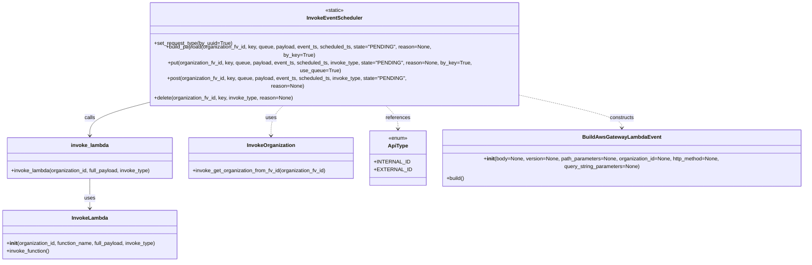
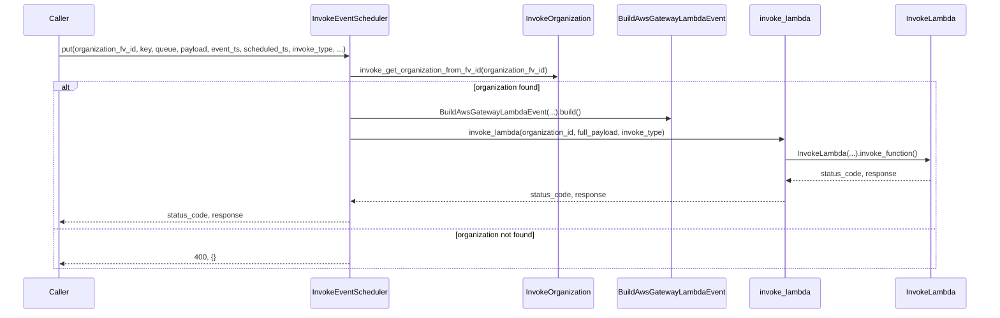

# Diagram: fv_core/fv_framework/python/fv_framework/utility/InvokeEventScheduler.py

> Auto-generated by Obscura crawlers

## Diagram 1

### SVG

<svg id="container" width="2462.5078125" xmlns="http://www.w3.org/2000/svg" class="classDiagram" height="728" viewBox="0 0 2462.5078125 728" role="graphics-document document" aria-roledescription="class"><g><defs><marker id="container_class-aggregationStart" class="marker aggregation class" refX="18" refY="7" markerWidth="190" markerHeight="240" orient="auto"><path d="M 18,7 L9,13 L1,7 L9,1 Z"></path></marker></defs><defs><marker id="container_class-aggregationEnd" class="marker aggregation class" refX="1" refY="7" markerWidth="20" markerHeight="28" orient="auto"><path d="M 18,7 L9,13 L1,7 L9,1 Z"></path></marker></defs><defs><marker id="container_class-extensionStart" class="marker extension class" refX="18" refY="7" markerWidth="190" markerHeight="240" orient="auto"><path d="M 1,7 L18,13 V 1 Z"></path></marker></defs><defs><marker id="container_class-extensionEnd" class="marker extension class" refX="1" refY="7" markerWidth="20" markerHeight="28" orient="auto"><path d="M 1,1 V 13 L18,7 Z"></path></marker></defs><defs><marker id="container_class-compositionStart" class="marker composition class" refX="18" refY="7" markerWidth="190" markerHeight="240" orient="auto"><path d="M 18,7 L9,13 L1,7 L9,1 Z"></path></marker></defs><defs><marker id="container_class-compositionEnd" class="marker composition class" refX="1" refY="7" markerWidth="20" markerHeight="28" orient="auto"><path d="M 18,7 L9,13 L1,7 L9,1 Z"></path></marker></defs><defs><marker id="container_class-dependencyStart" class="marker dependency class" refX="6" refY="7" markerWidth="190" markerHeight="240" orient="auto"><path d="M 5,7 L9,13 L1,7 L9,1 Z"></path></marker></defs><defs><marker id="container_class-dependencyEnd" class="marker dependency class" refX="13" refY="7" markerWidth="20" markerHeight="28" orient="auto"><path d="M 18,7 L9,13 L14,7 L9,1 Z"></path></marker></defs><defs><marker id="container_class-lollipopStart" class="marker lollipop class" refX="13" refY="7" markerWidth="190" markerHeight="240" orient="auto"><circle stroke="black" fill="transparent" cx="7" cy="7" r="6"></circle></marker></defs><defs><marker id="container_class-lollipopEnd" class="marker lollipop class" refX="1" refY="7" markerWidth="190" markerHeight="240" orient="auto"><circle stroke="black" fill="transparent" cx="7" cy="7" r="6"></circle></marker></defs><g class="root"><g class="clusters"></g><g class="edgePaths"><path d="M279.969,475L279.969,484.667C279.969,494.333,279.969,513.667,279.969,528.5C279.969,543.333,279.969,553.667,279.969,558.833L279.969,564" id="id_invoke_lambda_InvokeLambda_1" class="edge-thickness-normal edge-pattern-solid relation" style=";;;" data-edge="true" data-et="edge" data-id="id_invoke_lambda_InvokeLambda_1" data-points="W3sieCI6Mjc5Ljk2ODc1LCJ5Ijo0NzV9LHsieCI6Mjc5Ljk2ODc1LCJ5Ijo1MzN9LHsieCI6Mjc5Ljk2ODc1LCJ5Ijo1NzB9XQ==" marker-end="url(#container_class-dependencyEnd)"></path><path d="M885.947,254L878.57,260.167C871.194,266.333,856.441,278.667,849.064,293.5C841.688,308.333,841.688,325.667,841.688,334.333L841.688,343" id="id_InvokeEventScheduler_InvokeOrganization_2" class="edge-thickness-normal edge-pattern-dashed relation" style=";;;" data-edge="true" data-et="edge" data-id="id_InvokeEventScheduler_InvokeOrganization_2" data-points="W3sieCI6ODg1Ljk0NjU4MjAzMTI1LCJ5IjoyNTR9LHsieCI6ODQxLjY4NzUsInkiOjI5MX0seyJ4Ijo4NDEuNjg3NSwieSI6MzQ5fV0=" marker-end="url(#container_class-dependencyEnd)"></path><path d="M1612.133,237.423L1660.719,246.353C1709.305,255.282,1806.477,273.141,1855.063,288.737C1903.648,304.333,1903.648,317.667,1903.648,324.333L1903.648,331" id="id_InvokeEventScheduler_BuildAwsGatewayLambdaEvent_3" class="edge-thickness-normal edge-pattern-dashed relation" style=";;;" data-edge="true" data-et="edge" data-id="id_InvokeEventScheduler_BuildAwsGatewayLambdaEvent_3" data-points="W3sieCI6MTYxMi4xMzI4MTI1LCJ5IjoyMzcuNDIzMDUyNDE3MTQ3NTJ9LHsieCI6MTkwMy42NDg0Mzc1LCJ5IjoyOTF9LHsieCI6MTkwMy42NDg0Mzc1LCJ5IjozMzd9XQ==" marker-end="url(#container_class-dependencyEnd)"></path><path d="M1180.21,254L1187.586,260.167C1194.963,266.333,1209.716,278.667,1217.092,290C1224.469,301.333,1224.469,311.667,1224.469,316.833L1224.469,322" id="id_InvokeEventScheduler_ApiType_4" class="edge-thickness-normal edge-pattern-dashed relation" style=";;;" data-edge="true" data-et="edge" data-id="id_InvokeEventScheduler_ApiType_4" data-points="W3sieCI6MTE4MC4yMDk2Njc5Njg3NSwieSI6MjU0fSx7IngiOjEyMjQuNDY4NzUsInkiOjI5MX0seyJ4IjoxMjI0LjQ2ODc1LCJ5IjozMjh9XQ==" marker-end="url(#container_class-dependencyEnd)"></path><path d="M454.125,254L425.099,260.167C396.073,266.333,338.021,278.667,308.995,293.5C279.969,308.333,279.969,325.667,279.969,334.333L279.969,343" id="id_InvokeEventScheduler_invoke_lambda_5" class="edge-thickness-normal edge-pattern-solid relation" style=";;;" data-edge="true" data-et="edge" data-id="id_InvokeEventScheduler_invoke_lambda_5" data-points="W3sieCI6NDU0LjEyNTI5Mjk2ODc1MDA1LCJ5IjoyNTR9LHsieCI6Mjc5Ljk2ODc1LCJ5IjoyOTF9LHsieCI6Mjc5Ljk2ODc1LCJ5IjozNDl9XQ==" marker-end="url(#container_class-dependencyEnd)"></path></g><g class="edgeLabels"><g class="edgeLabel" transform="translate(279.96875, 533)"><g class="label" data-id="id_invoke_lambda_InvokeLambda_1" transform="translate(-16.4921875, -12)"><foreignObject width="32.984375" height="24">

uses

</foreignObject></g></g><g class="edgeLabel" transform="translate(841.6875, 291)"><g class="label" data-id="id_InvokeEventScheduler_InvokeOrganization_2" transform="translate(-16.4921875, -12)"><foreignObject width="32.984375" height="24">

uses

</foreignObject></g></g><g class="edgeLabel" transform="translate(1903.6484375, 291)"><g class="label" data-id="id_InvokeEventScheduler_BuildAwsGatewayLambdaEvent_3" transform="translate(-37.84375, -12)"><foreignObject width="75.6875" height="24">

constructs

</foreignObject></g></g><g class="edgeLabel" transform="translate(1224.46875, 291)"><g class="label" data-id="id_InvokeEventScheduler_ApiType_4" transform="translate(-37.828125, -12)"><foreignObject width="75.65625" height="24">

references

</foreignObject></g></g><g class="edgeLabel" transform="translate(279.96875, 291)"><g class="label" data-id="id_InvokeEventScheduler_invoke_lambda_5" transform="translate(-16.4453125, -12)"><foreignObject width="32.890625" height="24">

calls

</foreignObject></g></g></g><g class="nodes"><g class="node default" id="classId-InvokeEventScheduler-0" transform="translate(1033.078125, 131)"><g class="basic label-container"><path d="M-579.0546875 -123 L579.0546875 -123 L579.0546875 123 L-579.0546875 123" stroke="none" stroke-width="0" fill="#ECECFF" style=""></path><path d="M-579.0546875 -123 C-164.12626777871498 -123, 250.80215194257005 -123, 579.0546875 -123 M-579.0546875 -123 C-212.60690828817945 -123, 153.8408709236411 -123, 579.0546875 -123 M579.0546875 -123 C579.0546875 -60.25125590252487, 579.0546875 2.4974881949502645, 579.0546875 123 M579.0546875 -123 C579.0546875 -32.96094091677088, 579.0546875 57.07811816645824, 579.0546875 123 M579.0546875 123 C119.01873720404592 123, -341.01721309190816 123, -579.0546875 123 M579.0546875 123 C166.41301714664394 123, -246.22865320671212 123, -579.0546875 123 M-579.0546875 123 C-579.0546875 37.58038225841176, -579.0546875 -47.83923548317648, -579.0546875 -123 M-579.0546875 123 C-579.0546875 61.38343893508926, -579.0546875 -0.2331221298214814, -579.0546875 -123" stroke="#9370DB" stroke-width="1.3" fill="none" stroke-dasharray="0 0" style=""></path></g><g class="annotation-group text" transform="translate(-29.0234375, -99)"><g class="label" style="" transform="translate(0,-12)"><foreignObject width="58.046875" height="24">

«static»

</foreignObject></g></g><g class="label-group text" transform="translate(-81.34375, -75)"><g class="label" style="font-weight: bolder" transform="translate(0,-12)"><foreignObject width="162.6875" height="24">

InvokeEventScheduler

</foreignObject></g></g><g class="members-group text" transform="translate(-567.0546875, -27)"></g><g class="methods-group text" transform="translate(-567.0546875, 3)"><g class="label" style="" transform="translate(0,-12)"><foreignObject width="241.234375" height="24">

+set_request_type(by_uuid=True)

</foreignObject></g><g class="label" style="" transform="translate(0,12)"><foreignObject width="909.90625" height="24">

+build_payload(organization_fv_id, key, queue, payload, event_ts, scheduled_ts, state="PENDING", reason=None, by_key=True)

</foreignObject></g><g class="label" style="" transform="translate(0,36)"><foreignObject width="1052.765625" height="24">

+put(organization_fv_id, key, queue, payload, event_ts, scheduled_ts, invoke_type, state="PENDING", reason=None, by_key=True, use_queue=True)

</foreignObject></g><g class="label" style="" transform="translate(0,60)"><foreignObject width="835.875" height="24">

+post(organization_fv_id, key, queue, payload, event_ts, scheduled_ts, invoke_type, state="PENDING", reason=None)

</foreignObject></g><g class="label" style="" transform="translate(0,84)"><foreignObject width="428.28125" height="24">

+delete(organization_fv_id, key, invoke_type, reason=None)

</foreignObject></g></g><g class="divider" style=""><path d="M-579.0546875 -51 C-219.89484986836567 -51, 139.26498776326866 -51, 579.0546875 -51 M-579.0546875 -51 C-331.6308582239793 -51, -84.20702894795869 -51, 579.0546875 -51" stroke="#9370DB" stroke-width="1.3" fill="none" stroke-dasharray="0 0" style=""></path></g><g class="divider" style=""><path d="M-579.0546875 -27 C-335.33667697071087 -27, -91.61866644142174 -27, 579.0546875 -27 M-579.0546875 -27 C-250.16839359902207 -27, 78.71790030195586 -27, 579.0546875 -27" stroke="#9370DB" stroke-width="1.3" fill="none" stroke-dasharray="0 0" style=""></path></g></g><g class="node default" id="classId-invoke_lambda-1" transform="translate(279.96875, 412)"><g class="basic label-container"><path d="M-257.2578125 -63 L257.2578125 -63 L257.2578125 63 L-257.2578125 63" stroke="none" stroke-width="0" fill="#ECECFF" style=""></path><path d="M-257.2578125 -63 C-115.51956452510845 -63, 26.2186834497831 -63, 257.2578125 -63 M-257.2578125 -63 C-90.58239255745193 -63, 76.09302738509615 -63, 257.2578125 -63 M257.2578125 -63 C257.2578125 -28.109529887082253, 257.2578125 6.780940225835494, 257.2578125 63 M257.2578125 -63 C257.2578125 -19.7409092709903, 257.2578125 23.5181814580194, 257.2578125 63 M257.2578125 63 C86.41497613563772 63, -84.42786022872457 63, -257.2578125 63 M257.2578125 63 C105.87515607449404 63, -45.50750035101191 63, -257.2578125 63 M-257.2578125 63 C-257.2578125 37.77235694734226, -257.2578125 12.54471389468452, -257.2578125 -63 M-257.2578125 63 C-257.2578125 23.112039689832272, -257.2578125 -16.775920620335455, -257.2578125 -63" stroke="#9370DB" stroke-width="1.3" fill="none" stroke-dasharray="0 0" style=""></path></g><g class="annotation-group text" transform="translate(0, -39)"></g><g class="label-group text" transform="translate(-55.625, -39)"><g class="label" style="font-weight: bolder" transform="translate(0,-12)"><foreignObject width="111.25" height="24">

invoke_lambda

</foreignObject></g></g><g class="members-group text" transform="translate(-245.2578125, 9)"></g><g class="methods-group text" transform="translate(-245.2578125, 39)"><g class="label" style="" transform="translate(0,-12)"><foreignObject width="434.890625" height="24">

+invoke_lambda(organization_id, full_payload, invoke_type)

</foreignObject></g></g><g class="divider" style=""><path d="M-257.2578125 -15 C-53.08679598481265 -15, 151.0842205303747 -15, 257.2578125 -15 M-257.2578125 -15 C-81.94376731254985 -15, 93.3702778749003 -15, 257.2578125 -15" stroke="#9370DB" stroke-width="1.3" fill="none" stroke-dasharray="0 0" style=""></path></g><g class="divider" style=""><path d="M-257.2578125 9 C-106.43215794202055 9, 44.393496615958895 9, 257.2578125 9 M-257.2578125 9 C-61.33997663606431 9, 134.5778592278714 9, 257.2578125 9" stroke="#9370DB" stroke-width="1.3" fill="none" stroke-dasharray="0 0" style=""></path></g></g><g class="node default" id="classId-InvokeLambda-2" transform="translate(279.96875, 645)"><g class="basic label-container"><path d="M-271.96875 -75 L271.96875 -75 L271.96875 75 L-271.96875 75" stroke="none" stroke-width="0" fill="#ECECFF" style=""></path><path d="M-271.96875 -75 C-120.32728021145061 -75, 31.314189577098773 -75, 271.96875 -75 M-271.96875 -75 C-114.14732264687436 -75, 43.674104706251285 -75, 271.96875 -75 M271.96875 -75 C271.96875 -29.62414984666608, 271.96875 15.751700306667843, 271.96875 75 M271.96875 -75 C271.96875 -17.0033756850396, 271.96875 40.9932486299208, 271.96875 75 M271.96875 75 C124.57733474234792 75, -22.81408051530417 75, -271.96875 75 M271.96875 75 C81.5667270605652 75, -108.8352958788696 75, -271.96875 75 M-271.96875 75 C-271.96875 17.925692237026524, -271.96875 -39.14861552594695, -271.96875 -75 M-271.96875 75 C-271.96875 27.303393585447743, -271.96875 -20.393212829104513, -271.96875 -75" stroke="#9370DB" stroke-width="1.3" fill="none" stroke-dasharray="0 0" style=""></path></g><g class="annotation-group text" transform="translate(0, -51)"></g><g class="label-group text" transform="translate(-53.484375, -51)"><g class="label" style="font-weight: bolder" transform="translate(0,-12)"><foreignObject width="106.96875" height="24">

InvokeLambda

</foreignObject></g></g><g class="members-group text" transform="translate(-259.96875, -3)"></g><g class="methods-group text" transform="translate(-259.96875, 27)"><g class="label" style="" transform="translate(0,-12)"><foreignObject width="466.453125" height="24">

+<strong>init</strong>(organization_id, function_name, full_payload, invoke_type)

</foreignObject></g><g class="label" style="" transform="translate(0,12)"><foreignObject width="134.4375" height="24">

+invoke_function()

</foreignObject></g></g><g class="divider" style=""><path d="M-271.96875 -27 C-111.89524477702196 -27, 48.178260445956084 -27, 271.96875 -27 M-271.96875 -27 C-74.66550318218262 -27, 122.63774363563476 -27, 271.96875 -27" stroke="#9370DB" stroke-width="1.3" fill="none" stroke-dasharray="0 0" style=""></path></g><g class="divider" style=""><path d="M-271.96875 -3 C-142.0442435849947 -3, -12.119737169989378 -3, 271.96875 -3 M-271.96875 -3 C-115.08327916212104 -3, 41.80219167575791 -3, 271.96875 -3" stroke="#9370DB" stroke-width="1.3" fill="none" stroke-dasharray="0 0" style=""></path></g></g><g class="node default" id="classId-InvokeOrganization-3" transform="translate(841.6875, 412)"><g class="basic label-container"><path d="M-254.4609375 -63 L254.4609375 -63 L254.4609375 63 L-254.4609375 63" stroke="none" stroke-width="0" fill="#ECECFF" style=""></path><path d="M-254.4609375 -63 C-123.66924786733733 -63, 7.122441765325334 -63, 254.4609375 -63 M-254.4609375 -63 C-113.88886224878948 -63, 26.68321300242104 -63, 254.4609375 -63 M254.4609375 -63 C254.4609375 -29.820955886301427, 254.4609375 3.358088227397147, 254.4609375 63 M254.4609375 -63 C254.4609375 -21.783755376640116, 254.4609375 19.43248924671977, 254.4609375 63 M254.4609375 63 C122.6127540255709 63, -9.235429448858213 63, -254.4609375 63 M254.4609375 63 C146.22221062502658 63, 37.98348375005315 63, -254.4609375 63 M-254.4609375 63 C-254.4609375 32.63100229522645, -254.4609375 2.2620045904529036, -254.4609375 -63 M-254.4609375 63 C-254.4609375 34.85745437992747, -254.4609375 6.714908759854936, -254.4609375 -63" stroke="#9370DB" stroke-width="1.3" fill="none" stroke-dasharray="0 0" style=""></path></g><g class="annotation-group text" transform="translate(0, -39)"></g><g class="label-group text" transform="translate(-71.046875, -39)"><g class="label" style="font-weight: bolder" transform="translate(0,-12)"><foreignObject width="142.09375" height="24">

InvokeOrganization

</foreignObject></g></g><g class="members-group text" transform="translate(-242.4609375, 9)"></g><g class="methods-group text" transform="translate(-242.4609375, 39)"><g class="label" style="" transform="translate(0,-12)"><foreignObject width="413.875" height="24">

+invoke_get_organization_from_fv_id(organization_fv_id)

</foreignObject></g></g><g class="divider" style=""><path d="M-254.4609375 -15 C-99.60516637155726 -15, 55.25060475688548 -15, 254.4609375 -15 M-254.4609375 -15 C-110.84224302820783 -15, 32.776451443584335 -15, 254.4609375 -15" stroke="#9370DB" stroke-width="1.3" fill="none" stroke-dasharray="0 0" style=""></path></g><g class="divider" style=""><path d="M-254.4609375 9 C-115.69689747268737 9, 23.067142554625264 9, 254.4609375 9 M-254.4609375 9 C-123.15902626369609 9, 8.142884972607817 9, 254.4609375 9" stroke="#9370DB" stroke-width="1.3" fill="none" stroke-dasharray="0 0" style=""></path></g></g><g class="node default" id="classId-ApiType-4" transform="translate(1224.46875, 412)"><g class="basic label-container"><path d="M-78.3203125 -84 L78.3203125 -84 L78.3203125 84 L-78.3203125 84" stroke="none" stroke-width="0" fill="#ECECFF" style=""></path><path d="M-78.3203125 -84 C-41.347077182969635 -84, -4.373841865939269 -84, 78.3203125 -84 M-78.3203125 -84 C-19.727379629267382 -84, 38.865553241465236 -84, 78.3203125 -84 M78.3203125 -84 C78.3203125 -47.69411698022584, 78.3203125 -11.388233960451686, 78.3203125 84 M78.3203125 -84 C78.3203125 -26.304258034242636, 78.3203125 31.391483931514728, 78.3203125 84 M78.3203125 84 C37.52810698852233 84, -3.2640985229553365 84, -78.3203125 84 M78.3203125 84 C17.081493685843952 84, -44.157325128312095 84, -78.3203125 84 M-78.3203125 84 C-78.3203125 37.60887606550054, -78.3203125 -8.782247868998923, -78.3203125 -84 M-78.3203125 84 C-78.3203125 26.12303597719626, -78.3203125 -31.75392804560748, -78.3203125 -84" stroke="#9370DB" stroke-width="1.3" fill="none" stroke-dasharray="0 0" style=""></path></g><g class="annotation-group text" transform="translate(-29.53125, -60)"><g class="label" style="" transform="translate(0,-12)"><foreignObject width="59.0625" height="24">

«enum»

</foreignObject></g></g><g class="label-group text" transform="translate(-29.09375, -36)"><g class="label" style="font-weight: bolder" transform="translate(0,-12)"><foreignObject width="58.1875" height="24">

ApiType

</foreignObject></g></g><g class="members-group text" transform="translate(-66.3203125, 12)"><g class="label" style="" transform="translate(0,-12)"><foreignObject width="101.5625" height="24">

+INTERNAL_ID

</foreignObject></g><g class="label" style="" transform="translate(0,12)"><foreignObject width="103.109375" height="24">

+EXTERNAL_ID

</foreignObject></g></g><g class="methods-group text" transform="translate(-66.3203125, 84)"></g><g class="divider" style=""><path d="M-78.3203125 -12 C-19.28141140046059 -12, 39.75748969907882 -12, 78.3203125 -12 M-78.3203125 -12 C-23.656161618360088 -12, 31.007989263279825 -12, 78.3203125 -12" stroke="#9370DB" stroke-width="1.3" fill="none" stroke-dasharray="0 0" style=""></path></g><g class="divider" style=""><path d="M-78.3203125 60 C-46.893184852051874 60, -15.466057204103748 60, 78.3203125 60 M-78.3203125 60 C-39.30632294404176 60, -0.29233338808352016 60, 78.3203125 60" stroke="#9370DB" stroke-width="1.3" fill="none" stroke-dasharray="0 0" style=""></path></g></g><g class="node default" id="classId-BuildAwsGatewayLambdaEvent-5" transform="translate(1903.6484375, 412)"><g class="basic label-container"><path d="M-550.859375 -75 L550.859375 -75 L550.859375 75 L-550.859375 75" stroke="none" stroke-width="0" fill="#ECECFF" style=""></path><path d="M-550.859375 -75 C-289.19337603660097 -75, -27.527377073201933 -75, 550.859375 -75 M-550.859375 -75 C-122.75937699752382 -75, 305.34062100495237 -75, 550.859375 -75 M550.859375 -75 C550.859375 -29.638075499989633, 550.859375 15.723849000020735, 550.859375 75 M550.859375 -75 C550.859375 -16.719217302610218, 550.859375 41.561565394779564, 550.859375 75 M550.859375 75 C230.78481361138222 75, -89.28974777723556 75, -550.859375 75 M550.859375 75 C129.91031268045504 75, -291.03874963908993 75, -550.859375 75 M-550.859375 75 C-550.859375 29.857870875173987, -550.859375 -15.284258249652027, -550.859375 -75 M-550.859375 75 C-550.859375 21.285561816708416, -550.859375 -32.42887636658317, -550.859375 -75" stroke="#9370DB" stroke-width="1.3" fill="none" stroke-dasharray="0 0" style=""></path></g><g class="annotation-group text" transform="translate(0, -51)"></g><g class="label-group text" transform="translate(-114.015625, -51)"><g class="label" style="font-weight: bolder" transform="translate(0,-12)"><foreignObject width="228.03125" height="24">

BuildAwsGatewayLambdaEvent

</foreignObject></g></g><g class="members-group text" transform="translate(-538.859375, -3)"></g><g class="methods-group text" transform="translate(-538.859375, 27)"><g class="label" style="" transform="translate(0,-12)"><foreignObject width="963.703125" height="24">

+<strong>init</strong>(body=None, version=None, path_parameters=None, organization_id=None, http_method=None, query_string_parameters=None)

</foreignObject></g><g class="label" style="" transform="translate(0,12)"><foreignObject width="55.859375" height="24">

+build()

</foreignObject></g></g><g class="divider" style=""><path d="M-550.859375 -27 C-125.25994453944696 -27, 300.3394859211061 -27, 550.859375 -27 M-550.859375 -27 C-308.30190366725844 -27, -65.74443233451694 -27, 550.859375 -27" stroke="#9370DB" stroke-width="1.3" fill="none" stroke-dasharray="0 0" style=""></path></g><g class="divider" style=""><path d="M-550.859375 -3 C-265.94387605774267 -3, 18.97162288451466 -3, 550.859375 -3 M-550.859375 -3 C-315.6690883045621 -3, -80.47880160912416 -3, 550.859375 -3" stroke="#9370DB" stroke-width="1.3" fill="none" stroke-dasharray="0 0" style=""></path></g></g></g></g></g></svg>

## Diagram 2

> SVG rendering failed for this diagram.
