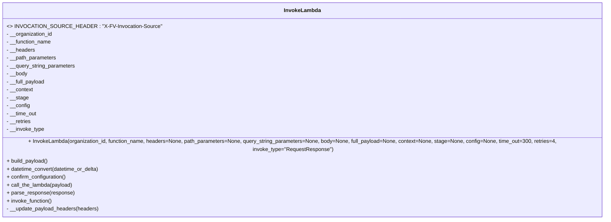
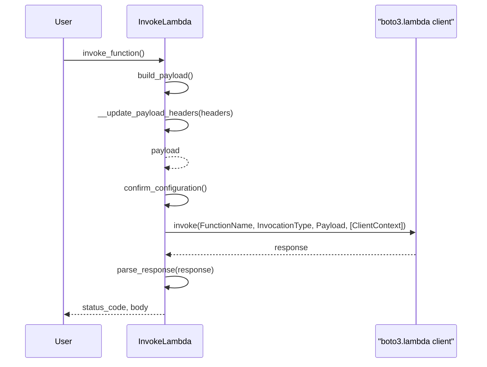

# Diagram: fv_core/fv_framework/python/fv_framework/utility/InvokeLambda.py

> Auto-generated by Obscura crawlers

## Diagram 1

### SVG

<svg id="container" width="1935.5" xmlns="http://www.w3.org/2000/svg" class="classDiagram" height="640" viewBox="0 0 1935.5 640" role="graphics-document document" aria-roledescription="class"><g><defs><marker id="container_class-aggregationStart" class="marker aggregation class" refX="18" refY="7" markerWidth="190" markerHeight="240" orient="auto"><path d="M 18,7 L9,13 L1,7 L9,1 Z"></path></marker></defs><defs><marker id="container_class-aggregationEnd" class="marker aggregation class" refX="1" refY="7" markerWidth="20" markerHeight="28" orient="auto"><path d="M 18,7 L9,13 L1,7 L9,1 Z"></path></marker></defs><defs><marker id="container_class-extensionStart" class="marker extension class" refX="18" refY="7" markerWidth="190" markerHeight="240" orient="auto"><path d="M 1,7 L18,13 V 1 Z"></path></marker></defs><defs><marker id="container_class-extensionEnd" class="marker extension class" refX="1" refY="7" markerWidth="20" markerHeight="28" orient="auto"><path d="M 1,1 V 13 L18,7 Z"></path></marker></defs><defs><marker id="container_class-compositionStart" class="marker composition class" refX="18" refY="7" markerWidth="190" markerHeight="240" orient="auto"><path d="M 18,7 L9,13 L1,7 L9,1 Z"></path></marker></defs><defs><marker id="container_class-compositionEnd" class="marker composition class" refX="1" refY="7" markerWidth="20" markerHeight="28" orient="auto"><path d="M 18,7 L9,13 L1,7 L9,1 Z"></path></marker></defs><defs><marker id="container_class-dependencyStart" class="marker dependency class" refX="6" refY="7" markerWidth="190" markerHeight="240" orient="auto"><path d="M 5,7 L9,13 L1,7 L9,1 Z"></path></marker></defs><defs><marker id="container_class-dependencyEnd" class="marker dependency class" refX="13" refY="7" markerWidth="20" markerHeight="28" orient="auto"><path d="M 18,7 L9,13 L14,7 L9,1 Z"></path></marker></defs><defs><marker id="container_class-lollipopStart" class="marker lollipop class" refX="13" refY="7" markerWidth="190" markerHeight="240" orient="auto"><circle stroke="black" fill="transparent" cx="7" cy="7" r="6"></circle></marker></defs><defs><marker id="container_class-lollipopEnd" class="marker lollipop class" refX="1" refY="7" markerWidth="190" markerHeight="240" orient="auto"><circle stroke="black" fill="transparent" cx="7" cy="7" r="6"></circle></marker></defs><g class="root"><g class="clusters"></g><g class="edgePaths"></g><g class="edgeLabels"></g><g class="nodes"><g class="node default" id="classId-InvokeLambda-0" transform="translate(967.75, 320)"><g class="basic label-container"><path d="M-959.75 -312 L959.75 -312 L959.75 312 L-959.75 312" stroke="none" stroke-width="0" fill="#ECECFF" style=""></path><path d="M-959.75 -312 C-521.2582233625874 -312, -82.76644672517466 -312, 959.75 -312 M-959.75 -312 C-520.6445731772325 -312, -81.53914635446495 -312, 959.75 -312 M959.75 -312 C959.75 -185.3864515043174, 959.75 -58.772903008634756, 959.75 312 M959.75 -312 C959.75 -150.4893913448946, 959.75 11.021217310210773, 959.75 312 M959.75 312 C557.4149636195929 312, 155.07992723918574 312, -959.75 312 M959.75 312 C198.77970256204026 312, -562.1905948759195 312, -959.75 312 M-959.75 312 C-959.75 143.47678360855977, -959.75 -25.04643278288046, -959.75 -312 M-959.75 312 C-959.75 145.52736929466147, -959.75 -20.945261410677062, -959.75 -312" stroke="#9370DB" stroke-width="1.3" fill="none" stroke-dasharray="0 0" style=""></path></g><g class="annotation-group text" transform="translate(0, -288)"></g><g class="label-group text" transform="translate(-53.484375, -288)"><g class="label" style="font-weight: bolder" transform="translate(0,-12)"><foreignObject width="106.96875" height="24">

InvokeLambda

</foreignObject></g></g><g class="members-group text" transform="translate(-947.75, -240)"><g class="label" style="" transform="translate(0,-12)"><foreignObject width="432.546875" height="24">

&lt;&gt; INVOCATION_SOURCE_HEADER : "X-FV-Invocation-Source"

</foreignObject></g><g class="label" style="" transform="translate(0,12)"><foreignObject width="139.609375" height="24">

- __organization_id

</foreignObject></g><g class="label" style="" transform="translate(0,36)"><foreignObject width="136.390625" height="24">

- __function_name

</foreignObject></g><g class="label" style="" transform="translate(0,60)"><foreignObject width="85.515625" height="24">

- __headers

</foreignObject></g><g class="label" style="" transform="translate(0,84)"><foreignObject width="151.15625" height="24">

- __path_parameters

</foreignObject></g><g class="label" style="" transform="translate(0,108)"><foreignObject width="208.828125" height="24">

- __query_string_parameters

</foreignObject></g><g class="label" style="" transform="translate(0,132)"><foreignObject width="63.46875" height="24">

- __body

</foreignObject></g><g class="label" style="" transform="translate(0,156)"><foreignObject width="116.96875" height="24">

- __full_payload

</foreignObject></g><g class="label" style="" transform="translate(0,180)"><foreignObject width="80.546875" height="24">

- __context

</foreignObject></g><g class="label" style="" transform="translate(0,204)"><foreignObject width="65.640625" height="24">

- __stage

</foreignObject></g><g class="label" style="" transform="translate(0,228)"><foreignObject width="70.421875" height="24">

- __config

</foreignObject></g><g class="label" style="" transform="translate(0,252)"><foreignObject width="91.6875" height="24">

- __time_out

</foreignObject></g><g class="label" style="" transform="translate(0,276)"><foreignObject width="74.25" height="24">

- __retries

</foreignObject></g><g class="label" style="" transform="translate(0,300)"><foreignObject width="114.34375" height="24">

- __invoke_type

</foreignObject></g></g><g class="methods-group text" transform="translate(-947.75, 120)"><g class="label" style="" transform="translate(0,-12)"><foreignObject width="1842.015625" height="24">

+ InvokeLambda(organization_id, function_name, headers=None, path_parameters=None, query_string_parameters=None, body=None, full_payload=None, context=None, stage=None, config=None, time_out=300, retries=4, invoke_type="RequestResponse")

</foreignObject></g><g class="label" style="" transform="translate(0,12)"><foreignObject width="126.171875" height="24">

+ build_payload()

</foreignObject></g><g class="label" style="" transform="translate(0,36)"><foreignObject width="282.453125" height="24">

+ datetime_convert(datetime_or_delta)

</foreignObject></g><g class="label" style="" transform="translate(0,60)"><foreignObject width="181.78125" height="24">

+ confirm_configuration()

</foreignObject></g><g class="label" style="" transform="translate(0,84)"><foreignObject width="200.265625" height="24">

+ call_the_lambda(payload)

</foreignObject></g><g class="label" style="" transform="translate(0,108)"><foreignObject width="203.390625" height="24">

+ parse_response(response)

</foreignObject></g><g class="label" style="" transform="translate(0,132)"><foreignObject width="138.6875" height="24">

+ invoke_function()

</foreignObject></g><g class="label" style="" transform="translate(0,156)"><foreignObject width="279.296875" height="24">

- __update_payload_headers(headers)

</foreignObject></g></g><g class="divider" style=""><path d="M-959.75 -264 C-236.91662552413993 -264, 485.91674895172014 -264, 959.75 -264 M-959.75 -264 C-374.38505296260735 -264, 210.9798940747853 -264, 959.75 -264" stroke="#9370DB" stroke-width="1.3" fill="none" stroke-dasharray="0 0" style=""></path></g><g class="divider" style=""><path d="M-959.75 96 C-342.66211010505833 96, 274.42577978988334 96, 959.75 96 M-959.75 96 C-315.68996119628025 96, 328.3700776074395 96, 959.75 96" stroke="#9370DB" stroke-width="1.3" fill="none" stroke-dasharray="0 0" style=""></path></g></g></g></g></g></svg>

## Diagram 2

> SVG rendering failed for this diagram.
