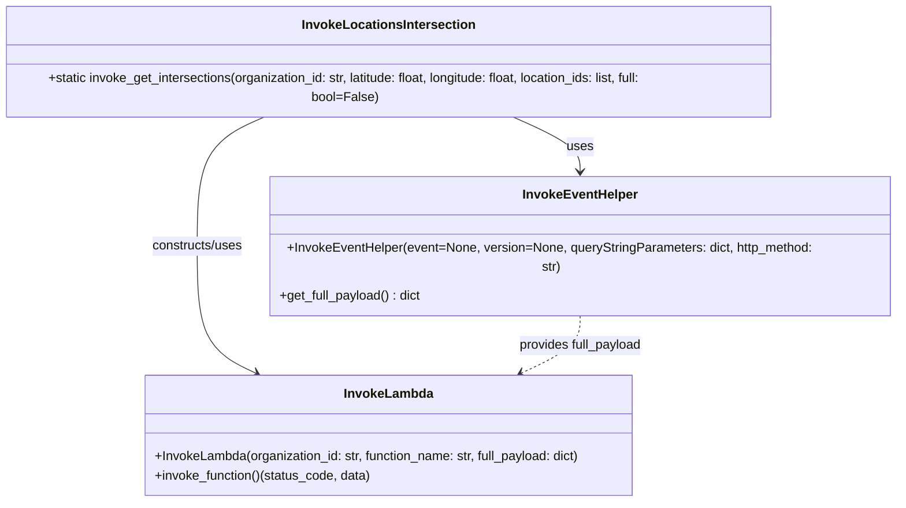
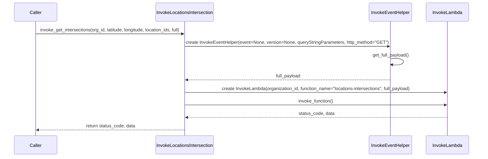

# Diagram: fv_core/fv_framework/python/fv_framework/utility/InvokeLocationsIntersection.py

> Auto-generated by Obscura crawlers

## Diagram 1

> SVG rendering failed for this diagram.

## Diagram 2

> SVG rendering failed for this diagram.
