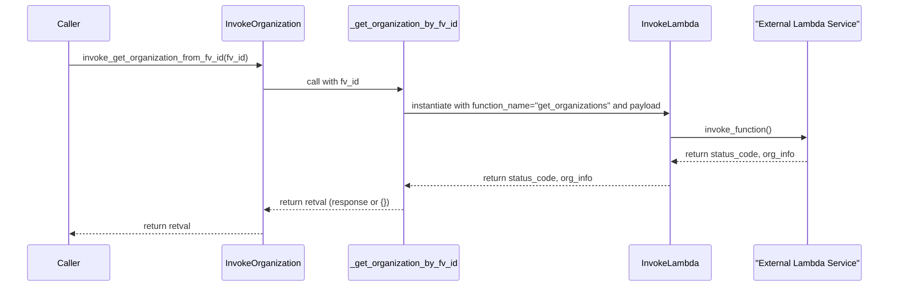

# Diagram: fv_core/fv_framework/python/fv_framework/utility/InvokeOrganization.py


> Auto-generated by Obscura crawlers

## Diagram 1

```mermaid
classDiagram
    class OrganizationDataModel {
        +fv_id: str | None
        +organization_id: str | None
        +organization_name: str | None
        +profile_type_name: str | None
        +profile_type_code: str | None
        +static populate_from_standard_org_data_dict(org_data: dict): OrganizationDataModel
    }
    class InvokeOrganization {
        +static invoke_get_organization_from_fv_id(organization_fv_id)
        +static invoke_get_organization_by_id(org_id)
    }
    class "_get_organization_by_fv_id" {
        +cached(CACHE_FV, key=HASHKEY_FV)
        +assert fv_id is not None
    }
    class "_get_organization_by_id" {
        +cached(CACHE_ID, key=HASHKEY_ID)
    }
    class CACHE_FV
    class CACHE_ID
    class HASHKEY_FV
    class HASHKEY_ID
    class InvokeLambda
    class BuildAwsGatewayLambdaEvent
    class logger

    InvokeOrganization --> "_get_organization_by_fv_id" : calls
    InvokeOrganization --> "_get_organization_by_id" : calls
    "_get_organization_by_fv_id" --> InvokeLambda : uses
    "_get_organization_by_fv_id" --> BuildAwsGatewayLambdaEvent : builds payload
    "_get_organization_by_fv_id" --> CACHE_FV : cached by
    "_get_organization_by_fv_id" --> HASHKEY_FV : key
    "_get_organization_by_fv_id" --> logger : logs warnings
    "_get_organization_by_id" --> InvokeLambda : uses
    "_get_organization_by_id" --> BuildAwsGatewayLambdaEvent : builds payload
    "_get_organization_by_id" --> CACHE_ID : cached by
    "_get_organization_by_id" --> HASHKEY_ID : key
    InvokeLambda <-- BuildAwsGatewayLambdaEvent : payload
    InvokeLambda --> "External Service (get_organizations)" : invokes
```

> SVG rendering failed for this diagram.

## Diagram 2

```mermaid
flowchart TD
    start["Start: _get_organization_by_fv_id(fv_id)"] --> check_fv{fv_id is not None?}
    check_fv -- no --> assert_fail[AssertionError: "FV ID is required"] --> return_empty1[Return {}]
    check_fv -- yes --> build_event[BuildAwsGatewayLambdaEvent(query_string_parameters={organization_fv_id: fv_id}).build()]
    build_event --> create_invoke[Create InvokeLambda(organization_id=None, function_name="get_organizations", full_payload=event)]
    create_invoke --> invoke_call[status_code, org_info = invoke.invoke_function()]
    invoke_call --> status_check{status_code == 200 or 201 and org_info?}
    status_check -- yes --> extract_resp[retval = org_info["response"]]
    extract_resp --> is_list{isinstance(retval, list) and retval?}
    is_list -- yes --> take_first[retval = retval[0]]
    is_list -- no --> keep_resp[retval stays as response]
    take_first --> return_resp[Return retval]
    keep_resp --> return_resp
    status_check -- no --> warn_log[logger.warning("Failed to get organization details for <fv_id>")] --> return_empty2[Return {}]
```

> SVG rendering failed for this diagram.

## Diagram 3



> SVG rendering failed for this diagram.
