# Diagram: fv_core/fv_framework/python/fv_framework/utility/LambdaHandlerMiddleware.py


> Auto-generated by Obscura crawlers

## Diagram 1

```mermaid
classDiagram
    class LambdaHandlerMiddleware {
        +build_audit(handler, response, exception=None)
        +fatal_request_audit(event, context, response, exception=None)
        +get_client_error(response)
        +sanitize_event(event)
        +handler_wrapper(handler_function)
        +mandatory_lambda_wrapper(handler_function)
        +authorization_wrapper(handler_function)
        +ensure_status_code(func)
    }
    class RequestAudit
    class RequestResponseAwsGateway
    class Auth
    class RollBarConfig
    class datadog_lambda_wrapper
    LambdaHandlerMiddleware --> RequestAudit : builds RequestAudit
    LambdaHandlerMiddleware --> RequestResponseAwsGateway : uses to make responses
    LambdaHandlerMiddleware --> Auth : invokes Auth.check_auth_wrapper
    RollBarConfig ..> LambdaHandlerMiddleware : configure()
    LambdaHandlerMiddleware ..> datadog_lambda_wrapper : wraps handler with decorator
```



### SVG

<svg id="container" width="859.171875" xmlns="http://www.w3.org/2000/svg" class="classDiagram" height="650" viewBox="0 0 859.171875 650" role="graphics-document document" aria-roledescription="class"><style>#container{font-family:"trebuchet ms",verdana,arial,sans-serif;font-size:16px;fill:#333;}@keyframes edge-animation-frame{from{stroke-dashoffset:0;}}@keyframes dash{to{stroke-dashoffset:0;}}#container .edge-animation-slow{stroke-dasharray:9,5!important;stroke-dashoffset:900;animation:dash 50s linear infinite;stroke-linecap:round;}#container .edge-animation-fast{stroke-dasharray:9,5!important;stroke-dashoffset:900;animation:dash 20s linear infinite;stroke-linecap:round;}#container .error-icon{fill:#552222;}#container .error-text{fill:#552222;stroke:#552222;}#container .edge-thickness-normal{stroke-width:1px;}#container .edge-thickness-thick{stroke-width:3.5px;}#container .edge-pattern-solid{stroke-dasharray:0;}#container .edge-thickness-invisible{stroke-width:0;fill:none;}#container .edge-pattern-dashed{stroke-dasharray:3;}#container .edge-pattern-dotted{stroke-dasharray:2;}#container .marker{fill:#333333;stroke:#333333;}#container .marker.cross{stroke:#333333;}#container svg{font-family:"trebuchet ms",verdana,arial,sans-serif;font-size:16px;}#container p{margin:0;}#container g.classGroup text{fill:#9370DB;stroke:none;font-family:"trebuchet ms",verdana,arial,sans-serif;font-size:10px;}#container g.classGroup text .title{font-weight:bolder;}#container .nodeLabel,#container .edgeLabel{color:#131300;}#container .edgeLabel .label rect{fill:#ECECFF;}#container .label text{fill:#131300;}#container .labelBkg{background:#ECECFF;}#container .edgeLabel .label span{background:#ECECFF;}#container .classTitle{font-weight:bolder;}#container .node rect,#container .node circle,#container .node ellipse,#container .node polygon,#container .node path{fill:#ECECFF;stroke:#9370DB;stroke-width:1px;}#container .divider{stroke:#9370DB;stroke-width:1;}#container g.clickable{cursor:pointer;}#container g.classGroup rect{fill:#ECECFF;stroke:#9370DB;}#container g.classGroup line{stroke:#9370DB;stroke-width:1;}#container .classLabel .box{stroke:none;stroke-width:0;fill:#ECECFF;opacity:0.5;}#container .classLabel .label{fill:#9370DB;font-size:10px;}#container .relation{stroke:#333333;stroke-width:1;fill:none;}#container .dashed-line{stroke-dasharray:3;}#container .dotted-line{stroke-dasharray:1 2;}#container #compositionStart,#container .composition{fill:#333333!important;stroke:#333333!important;stroke-width:1;}#container #compositionEnd,#container .composition{fill:#333333!important;stroke:#333333!important;stroke-width:1;}#container #dependencyStart,#container .dependency{fill:#333333!important;stroke:#333333!important;stroke-width:1;}#container #dependencyStart,#container .dependency{fill:#333333!important;stroke:#333333!important;stroke-width:1;}#container #extensionStart,#container .extension{fill:transparent!important;stroke:#333333!important;stroke-width:1;}#container #extensionEnd,#container .extension{fill:transparent!important;stroke:#333333!important;stroke-width:1;}#container #aggregationStart,#container .aggregation{fill:transparent!important;stroke:#333333!important;stroke-width:1;}#container #aggregationEnd,#container .aggregation{fill:transparent!important;stroke:#333333!important;stroke-width:1;}#container #lollipopStart,#container .lollipop{fill:#ECECFF!important;stroke:#333333!important;stroke-width:1;}#container #lollipopEnd,#container .lollipop{fill:#ECECFF!important;stroke:#333333!important;stroke-width:1;}#container .edgeTerminals{font-size:11px;line-height:initial;}#container .classTitleText{text-anchor:middle;font-size:18px;fill:#333;}#container .label-icon{display:inline-block;height:1em;overflow:visible;vertical-align:-0.125em;}#container .node .label-icon path{fill:currentColor;stroke:revert;stroke-width:revert;}#container :root{--mermaid-font-family:"trebuchet ms",verdana,arial,sans-serif;}</style><g><defs><marker id="container_class-aggregationStart" class="marker aggregation class" refX="18" refY="7" markerWidth="190" markerHeight="240" orient="auto"><path d="M 18,7 L9,13 L1,7 L9,1 Z"></path></marker></defs><defs><marker id="container_class-aggregationEnd" class="marker aggregation class" refX="1" refY="7" markerWidth="20" markerHeight="28" orient="auto"><path d="M 18,7 L9,13 L1,7 L9,1 Z"></path></marker></defs><defs><marker id="container_class-extensionStart" class="marker extension class" refX="18" refY="7" markerWidth="190" markerHeight="240" orient="auto"><path d="M 1,7 L18,13 V 1 Z"></path></marker></defs><defs><marker id="container_class-extensionEnd" class="marker extension class" refX="1" refY="7" markerWidth="20" markerHeight="28" orient="auto"><path d="M 1,1 V 13 L18,7 Z"></path></marker></defs><defs><marker id="container_class-compositionStart" class="marker composition class" refX="18" refY="7" markerWidth="190" markerHeight="240" orient="auto"><path d="M 18,7 L9,13 L1,7 L9,1 Z"></path></marker></defs><defs><marker id="container_class-compositionEnd" class="marker composition class" refX="1" refY="7" markerWidth="20" markerHeight="28" orient="auto"><path d="M 18,7 L9,13 L1,7 L9,1 Z"></path></marker></defs><defs><marker id="container_class-dependencyStart" class="marker dependency class" refX="6" refY="7" markerWidth="190" markerHeight="240" orient="auto"><path d="M 5,7 L9,13 L1,7 L9,1 Z"></path></marker></defs><defs><marker id="container_class-dependencyEnd" class="marker dependency class" refX="13" refY="7" markerWidth="20" markerHeight="28" orient="auto"><path d="M 18,7 L9,13 L14,7 L9,1 Z"></path></marker></defs><defs><marker id="container_class-lollipopStart" class="marker lollipop class" refX="13" refY="7" markerWidth="190" markerHeight="240" orient="auto"><circle stroke="black" fill="transparent" cx="7" cy="7" r="6"></circle></marker></defs><defs><marker id="container_class-lollipopEnd" class="marker lollipop class" refX="1" refY="7" markerWidth="190" markerHeight="240" orient="auto"><circle stroke="black" fill="transparent" cx="7" cy="7" r="6"></circle></marker></defs><g class="root"><g class="clusters"></g><g class="edgePaths"><path d="M165.78,460L151.697,468.167C137.614,476.333,109.448,492.667,95.364,508C81.281,523.333,81.281,537.667,81.281,544.833L81.281,552" id="id_LambdaHandlerMiddleware_RequestAudit_1" class="edge-thickness-normal edge-pattern-solid relation" style=";;;" data-edge="true" data-et="edge" data-id="id_LambdaHandlerMiddleware_RequestAudit_1" data-points="W3sieCI6MTY1Ljc4MDI3MzQzNzUsInkiOjQ2MH0seyJ4Ijo4MS4yODEyNSwieSI6NTA5fSx7IngiOjgxLjI4MTI1LCJ5Ijo1NTh9XQ==" marker-end="url(#container_class-dependencyEnd)"></path><path d="M341.737,460L337.43,468.167C333.122,476.333,324.506,492.667,320.198,508C315.891,523.333,315.891,537.667,315.891,544.833L315.891,552" id="id_LambdaHandlerMiddleware_RequestResponseAwsGateway_2" class="edge-thickness-normal edge-pattern-solid relation" style=";;;" data-edge="true" data-et="edge" data-id="id_LambdaHandlerMiddleware_RequestResponseAwsGateway_2" data-points="W3sieCI6MzQxLjczNzMwNDY4NzUsInkiOjQ2MH0seyJ4IjozMTUuODkwNjI1LCJ5Ijo1MDl9LHsieCI6MzE1Ljg5MDYyNSwieSI6NTU4fV0=" marker-end="url(#container_class-dependencyEnd)"></path><path d="M496.817,460L501.125,468.167C505.433,476.333,514.049,492.667,518.356,508C522.664,523.333,522.664,537.667,522.664,544.833L522.664,552" id="id_LambdaHandlerMiddleware_Auth_3" class="edge-thickness-normal edge-pattern-solid relation" style=";;;" data-edge="true" data-et="edge" data-id="id_LambdaHandlerMiddleware_Auth_3" data-points="W3sieCI6NDk2LjgxNzM4MjgxMjUsInkiOjQ2MH0seyJ4Ijo1MjIuNjY0MDYyNSwieSI6NTA5fSx7IngiOjUyMi42NjQwNjI1LCJ5Ijo1NTh9XQ==" marker-end="url(#container_class-dependencyEnd)"></path><path d="M419.277,92L419.277,98.167C419.277,104.333,419.277,116.667,419.277,128C419.277,139.333,419.277,149.667,419.277,154.833L419.277,160" id="id_RollBarConfig_LambdaHandlerMiddleware_4" class="edge-thickness-normal edge-pattern-dashed relation" style=";;;" data-edge="true" data-et="edge" data-id="id_RollBarConfig_LambdaHandlerMiddleware_4" data-points="W3sieCI6NDE5LjI3NzM0Mzc1LCJ5Ijo5Mn0seyJ4Ijo0MTkuMjc3MzQzNzUsInkiOjEyOX0seyJ4Ijo0MTkuMjc3MzQzNzUsInkiOjE2Nn1d" marker-end="url(#container_class-dependencyEnd)"></path><path d="M661.817,460L675.292,468.167C688.766,476.333,715.715,492.667,729.19,508C742.664,523.333,742.664,537.667,742.664,544.833L742.664,552" id="id_LambdaHandlerMiddleware_datadog_lambda_wrapper_5" class="edge-thickness-normal edge-pattern-dashed relation" style=";;;" data-edge="true" data-et="edge" data-id="id_LambdaHandlerMiddleware_datadog_lambda_wrapper_5" data-points="W3sieCI6NjYxLjgxNzM4MjgxMjUsInkiOjQ2MH0seyJ4Ijo3NDIuNjY0MDYyNSwieSI6NTA5fSx7IngiOjc0Mi42NjQwNjI1LCJ5Ijo1NTh9XQ==" marker-end="url(#container_class-dependencyEnd)"></path></g><g class="edgeLabels"><g class="edgeLabel" transform="translate(81.28125, 509)"><g class="label" data-id="id_LambdaHandlerMiddleware_RequestAudit_1" transform="translate(-73.28125, -12)"><foreignObject width="146.5625" height="24"><div xmlns="http://www.w3.org/1999/xhtml" class="labelBkg" style="display: table-cell; white-space: nowrap; line-height: 1.5; max-width: 200px; text-align: center;"><span class="edgeLabel"><p>builds RequestAudit</p></span></div></foreignObject></g></g><g class="edgeLabel" transform="translate(315.890625, 509)"><g class="label" data-id="id_LambdaHandlerMiddleware_RequestResponseAwsGateway_2" transform="translate(-86.7734375, -12)"><foreignObject width="173.546875" height="24"><div xmlns="http://www.w3.org/1999/xhtml" class="labelBkg" style="display: table-cell; white-space: nowrap; line-height: 1.5; max-width: 200px; text-align: center;"><span class="edgeLabel"><p>uses to make responses</p></span></div></foreignObject></g></g><g class="edgeLabel" transform="translate(522.6640625, 509)"><g class="label" data-id="id_LambdaHandlerMiddleware_Auth_3" transform="translate(-100, -24)"><foreignObject width="200" height="48"><div xmlns="http://www.w3.org/1999/xhtml" class="labelBkg" style="display: table; white-space: break-spaces; line-height: 1.5; max-width: 200px; text-align: center; width: 200px;"><span class="edgeLabel"><p>invokes Auth.check_auth_wrapper</p></span></div></foreignObject></g></g><g class="edgeLabel" transform="translate(419.27734375, 129)"><g class="label" data-id="id_RollBarConfig_LambdaHandlerMiddleware_4" transform="translate(-38.7578125, -12)"><foreignObject width="77.515625" height="24"><div xmlns="http://www.w3.org/1999/xhtml" class="labelBkg" style="display: table-cell; white-space: nowrap; line-height: 1.5; max-width: 200px; text-align: center;"><span class="edgeLabel"><p>configure()</p></span></div></foreignObject></g></g><g class="edgeLabel" transform="translate(742.6640625, 509)"><g class="label" data-id="id_LambdaHandlerMiddleware_datadog_lambda_wrapper_5" transform="translate(-100, -24)"><foreignObject width="200" height="48"><div xmlns="http://www.w3.org/1999/xhtml" class="labelBkg" style="display: table; white-space: break-spaces; line-height: 1.5; max-width: 200px; text-align: center; width: 200px;"><span class="edgeLabel"><p>wraps handler with decorator</p></span></div></foreignObject></g></g></g><g class="nodes"><g class="node default" id="classId-LambdaHandlerMiddleware-0" transform="translate(419.27734375, 313)"><g class="basic label-container"><path d="M-293.3046875 -147 L293.3046875 -147 L293.3046875 147 L-293.3046875 147" stroke="none" stroke-width="0" fill="#ECECFF" style=""></path><path d="M-293.3046875 -147 C-166.00402170528596 -147, -38.70335591057193 -147, 293.3046875 -147 M-293.3046875 -147 C-162.465116226164 -147, -31.625544952328028 -147, 293.3046875 -147 M293.3046875 -147 C293.3046875 -74.54128103852337, 293.3046875 -2.082562077046731, 293.3046875 147 M293.3046875 -147 C293.3046875 -71.62829142746824, 293.3046875 3.7434171450635176, 293.3046875 147 M293.3046875 147 C147.0779844758299 147, 0.8512814516598155 147, -293.3046875 147 M293.3046875 147 C66.56205334392533 147, -160.18058081214934 147, -293.3046875 147 M-293.3046875 147 C-293.3046875 61.14083904838171, -293.3046875 -24.718321903236586, -293.3046875 -147 M-293.3046875 147 C-293.3046875 54.29491428110694, -293.3046875 -38.41017143778612, -293.3046875 -147" stroke="#9370DB" stroke-width="1.3" fill="none" stroke-dasharray="0 0" style=""></path></g><g class="annotation-group text" transform="translate(0, -123)"></g><g class="label-group text" transform="translate(-100.765625, -123)"><g class="label" style="font-weight: bolder" transform="translate(0,-12)"><foreignObject width="201.53125" height="24"><div xmlns="http://www.w3.org/1999/xhtml" style="display: table-cell; white-space: nowrap; line-height: 1.5; max-width: 250px; text-align: center;"><span class="nodeLabel markdown-node-label" style=""><p>LambdaHandlerMiddleware</p></span></div></foreignObject></g></g><g class="members-group text" transform="translate(-281.3046875, -75)"></g><g class="methods-group text" transform="translate(-281.3046875, -45)"><g class="label" style="" transform="translate(0,-12)"><foreignObject width="356.40625" height="24"><div xmlns="http://www.w3.org/1999/xhtml" style="display: table-cell; white-space: nowrap; line-height: 1.5; max-width: 414px; text-align: center;"><span class="nodeLabel markdown-node-label" style=""><p>+build_audit(handler, response, exception=None)</p></span></div></foreignObject></g><g class="label" style="" transform="translate(0,12)"><foreignObject width="461.84375" height="24"><div xmlns="http://www.w3.org/1999/xhtml" style="display: table-cell; white-space: nowrap; line-height: 1.5; max-width: 519px; text-align: center;"><span class="nodeLabel markdown-node-label" style=""><p>+fatal_request_audit(event, context, response, exception=None)</p></span></div></foreignObject></g><g class="label" style="" transform="translate(0,36)"><foreignObject width="200.0625" height="24"><div xmlns="http://www.w3.org/1999/xhtml" style="display: table-cell; white-space: nowrap; line-height: 1.5; max-width: 257px; text-align: center;"><span class="nodeLabel markdown-node-label" style=""><p>+get_client_error(response)</p></span></div></foreignObject></g><g class="label" style="" transform="translate(0,60)"><foreignObject width="162.5" height="24"><div xmlns="http://www.w3.org/1999/xhtml" style="display: table-cell; white-space: nowrap; line-height: 1.5; max-width: 220px; text-align: center;"><span class="nodeLabel markdown-node-label" style=""><p>+sanitize_event(event)</p></span></div></foreignObject></g><g class="label" style="" transform="translate(0,84)"><foreignObject width="265.25" height="24"><div xmlns="http://www.w3.org/1999/xhtml" style="display: table-cell; white-space: nowrap; line-height: 1.5; max-width: 323px; text-align: center;"><span class="nodeLabel markdown-node-label" style=""><p>+handler_wrapper(handler_function)</p></span></div></foreignObject></g><g class="label" style="" transform="translate(0,108)"><foreignObject width="351.484375" height="24"><div xmlns="http://www.w3.org/1999/xhtml" style="display: table-cell; white-space: nowrap; line-height: 1.5; max-width: 409px; text-align: center;"><span class="nodeLabel markdown-node-label" style=""><p>+mandatory_lambda_wrapper(handler_function)</p></span></div></foreignObject></g><g class="label" style="" transform="translate(0,132)"><foreignObject width="307.4375" height="24"><div xmlns="http://www.w3.org/1999/xhtml" style="display: table-cell; white-space: nowrap; line-height: 1.5; max-width: 365px; text-align: center;"><span class="nodeLabel markdown-node-label" style=""><p>+authorization_wrapper(handler_function)</p></span></div></foreignObject></g><g class="label" style="" transform="translate(0,156)"><foreignObject width="194.390625" height="24"><div xmlns="http://www.w3.org/1999/xhtml" style="display: table-cell; white-space: nowrap; line-height: 1.5; max-width: 252px; text-align: center;"><span class="nodeLabel markdown-node-label" style=""><p>+ensure_status_code(func)</p></span></div></foreignObject></g></g><g class="divider" style=""><path d="M-293.3046875 -99 C-125.56050214807337 -99, 42.18368320385326 -99, 293.3046875 -99 M-293.3046875 -99 C-98.00737564015552 -99, 97.28993621968897 -99, 293.3046875 -99" stroke="#9370DB" stroke-width="1.3" fill="none" stroke-dasharray="0 0" style=""></path></g><g class="divider" style=""><path d="M-293.3046875 -75 C-150.6376141936386 -75, -7.9705408872771955 -75, 293.3046875 -75 M-293.3046875 -75 C-97.43790301724954 -75, 98.42888146550092 -75, 293.3046875 -75" stroke="#9370DB" stroke-width="1.3" fill="none" stroke-dasharray="0 0" style=""></path></g></g><g class="node default" id="classId-RequestAudit-1" transform="translate(81.28125, 600)"><g class="basic label-container"><path d="M-61.421875 -42 L61.421875 -42 L61.421875 42 L-61.421875 42" stroke="none" stroke-width="0" fill="#ECECFF" style=""></path><path d="M-61.421875 -42 C-13.702474427704189 -42, 34.01692614459162 -42, 61.421875 -42 M-61.421875 -42 C-35.822222069526106 -42, -10.222569139052204 -42, 61.421875 -42 M61.421875 -42 C61.421875 -8.87368484574477, 61.421875 24.25263030851046, 61.421875 42 M61.421875 -42 C61.421875 -16.8809264612498, 61.421875 8.2381470775004, 61.421875 42 M61.421875 42 C36.727881504147554 42, 12.033888008295108 42, -61.421875 42 M61.421875 42 C22.468715363566474 42, -16.48444427286705 42, -61.421875 42 M-61.421875 42 C-61.421875 15.789121780687296, -61.421875 -10.421756438625408, -61.421875 -42 M-61.421875 42 C-61.421875 20.885334704450955, -61.421875 -0.2293305910980905, -61.421875 -42" stroke="#9370DB" stroke-width="1.3" fill="none" stroke-dasharray="0 0" style=""></path></g><g class="annotation-group text" transform="translate(0, -18)"></g><g class="label-group text" transform="translate(-49.421875, -18)"><g class="label" style="font-weight: bolder" transform="translate(0,-12)"><foreignObject width="98.84375" height="24"><div xmlns="http://www.w3.org/1999/xhtml" style="display: table-cell; white-space: nowrap; line-height: 1.5; max-width: 148px; text-align: center;"><span class="nodeLabel markdown-node-label" style=""><p>RequestAudit</p></span></div></foreignObject></g></g><g class="members-group text" transform="translate(-49.421875, 30)"></g><g class="methods-group text" transform="translate(-49.421875, 60)"></g><g class="divider" style=""><path d="M-61.421875 6 C-18.625809806006117 6, 24.170255387987766 6, 61.421875 6 M-61.421875 6 C-15.089689249419791 6, 31.242496501160417 6, 61.421875 6" stroke="#9370DB" stroke-width="1.3" fill="none" stroke-dasharray="0 0" style=""></path></g><g class="divider" style=""><path d="M-61.421875 24 C-35.67620092579734 24, -9.930526851594678 24, 61.421875 24 M-61.421875 24 C-31.911872338988214 24, -2.4018696779764284 24, 61.421875 24" stroke="#9370DB" stroke-width="1.3" fill="none" stroke-dasharray="0 0" style=""></path></g></g><g class="node default" id="classId-RequestResponseAwsGateway-2" transform="translate(315.890625, 600)"><g class="basic label-container"><path d="M-123.1875 -42 L123.1875 -42 L123.1875 42 L-123.1875 42" stroke="none" stroke-width="0" fill="#ECECFF" style=""></path><path d="M-123.1875 -42 C-52.48412483602323 -42, 18.219250327953546 -42, 123.1875 -42 M-123.1875 -42 C-33.42767945103573 -42, 56.33214109792854 -42, 123.1875 -42 M123.1875 -42 C123.1875 -23.384601177104695, 123.1875 -4.769202354209391, 123.1875 42 M123.1875 -42 C123.1875 -23.92149336798542, 123.1875 -5.84298673597084, 123.1875 42 M123.1875 42 C39.4932979632181 42, -44.200904073563805 42, -123.1875 42 M123.1875 42 C66.6051062196997 42, 10.022712439399399 42, -123.1875 42 M-123.1875 42 C-123.1875 15.702885046449346, -123.1875 -10.594229907101308, -123.1875 -42 M-123.1875 42 C-123.1875 16.313642268733858, -123.1875 -9.372715462532284, -123.1875 -42" stroke="#9370DB" stroke-width="1.3" fill="none" stroke-dasharray="0 0" style=""></path></g><g class="annotation-group text" transform="translate(0, -18)"></g><g class="label-group text" transform="translate(-111.1875, -18)"><g class="label" style="font-weight: bolder" transform="translate(0,-12)"><foreignObject width="222.375" height="24"><div xmlns="http://www.w3.org/1999/xhtml" style="display: table-cell; white-space: nowrap; line-height: 1.5; max-width: 268px; text-align: center;"><span class="nodeLabel markdown-node-label" style=""><p>RequestResponseAwsGateway</p></span></div></foreignObject></g></g><g class="members-group text" transform="translate(-111.1875, 30)"></g><g class="methods-group text" transform="translate(-111.1875, 60)"></g><g class="divider" style=""><path d="M-123.1875 6 C-37.3746312388993 6, 48.438237522201405 6, 123.1875 6 M-123.1875 6 C-37.96891224764384 6, 47.249675504712314 6, 123.1875 6" stroke="#9370DB" stroke-width="1.3" fill="none" stroke-dasharray="0 0" style=""></path></g><g class="divider" style=""><path d="M-123.1875 24 C-47.77441528582267 24, 27.63866942835466 24, 123.1875 24 M-123.1875 24 C-38.97583092520043 24, 45.23583814959915 24, 123.1875 24" stroke="#9370DB" stroke-width="1.3" fill="none" stroke-dasharray="0 0" style=""></path></g></g><g class="node default" id="classId-Auth-3" transform="translate(522.6640625, 600)"><g class="basic label-container"><path d="M-29.0078125 -42 L29.0078125 -42 L29.0078125 42 L-29.0078125 42" stroke="none" stroke-width="0" fill="#ECECFF" style=""></path><path d="M-29.0078125 -42 C-8.758638325891344 -42, 11.490535848217313 -42, 29.0078125 -42 M-29.0078125 -42 C-15.123181224148347 -42, -1.2385499482966935 -42, 29.0078125 -42 M29.0078125 -42 C29.0078125 -25.128171502322786, 29.0078125 -8.256343004645572, 29.0078125 42 M29.0078125 -42 C29.0078125 -16.004260251776476, 29.0078125 9.991479496447049, 29.0078125 42 M29.0078125 42 C15.810812856675478 42, 2.613813213350955 42, -29.0078125 42 M29.0078125 42 C8.878463509866858 42, -11.250885480266284 42, -29.0078125 42 M-29.0078125 42 C-29.0078125 14.045427037357666, -29.0078125 -13.909145925284669, -29.0078125 -42 M-29.0078125 42 C-29.0078125 11.635852042965062, -29.0078125 -18.728295914069875, -29.0078125 -42" stroke="#9370DB" stroke-width="1.3" fill="none" stroke-dasharray="0 0" style=""></path></g><g class="annotation-group text" transform="translate(0, -18)"></g><g class="label-group text" transform="translate(-17.0078125, -18)"><g class="label" style="font-weight: bolder" transform="translate(0,-12)"><foreignObject width="34.015625" height="24"><div xmlns="http://www.w3.org/1999/xhtml" style="display: table-cell; white-space: nowrap; line-height: 1.5; max-width: 84px; text-align: center;"><span class="nodeLabel markdown-node-label" style=""><p>Auth</p></span></div></foreignObject></g></g><g class="members-group text" transform="translate(-17.0078125, 30)"></g><g class="methods-group text" transform="translate(-17.0078125, 60)"></g><g class="divider" style=""><path d="M-29.0078125 6 C-6.3227546633708265 6, 16.362303173258347 6, 29.0078125 6 M-29.0078125 6 C-6.366646277994747 6, 16.274519944010507 6, 29.0078125 6" stroke="#9370DB" stroke-width="1.3" fill="none" stroke-dasharray="0 0" style=""></path></g><g class="divider" style=""><path d="M-29.0078125 24 C-11.257946713780225 24, 6.491919072439551 24, 29.0078125 24 M-29.0078125 24 C-14.895135834899499 24, -0.7824591697989973 24, 29.0078125 24" stroke="#9370DB" stroke-width="1.3" fill="none" stroke-dasharray="0 0" style=""></path></g></g><g class="node default" id="classId-RollBarConfig-4" transform="translate(419.27734375, 50)"><g class="basic label-container"><path d="M-61.703125 -42 L61.703125 -42 L61.703125 42 L-61.703125 42" stroke="none" stroke-width="0" fill="#ECECFF" style=""></path><path d="M-61.703125 -42 C-21.486611873372375 -42, 18.72990125325525 -42, 61.703125 -42 M-61.703125 -42 C-13.928835244266097 -42, 33.84545451146781 -42, 61.703125 -42 M61.703125 -42 C61.703125 -21.267029221900355, 61.703125 -0.5340584438007099, 61.703125 42 M61.703125 -42 C61.703125 -13.024451928245618, 61.703125 15.951096143508764, 61.703125 42 M61.703125 42 C24.308418825367504 42, -13.086287349264992 42, -61.703125 42 M61.703125 42 C13.348338841834739 42, -35.00644731633052 42, -61.703125 42 M-61.703125 42 C-61.703125 16.807235762421172, -61.703125 -8.385528475157656, -61.703125 -42 M-61.703125 42 C-61.703125 14.088342113820016, -61.703125 -13.823315772359969, -61.703125 -42" stroke="#9370DB" stroke-width="1.3" fill="none" stroke-dasharray="0 0" style=""></path></g><g class="annotation-group text" transform="translate(0, -18)"></g><g class="label-group text" transform="translate(-49.703125, -18)"><g class="label" style="font-weight: bolder" transform="translate(0,-12)"><foreignObject width="99.40625" height="24"><div xmlns="http://www.w3.org/1999/xhtml" style="display: table-cell; white-space: nowrap; line-height: 1.5; max-width: 148px; text-align: center;"><span class="nodeLabel markdown-node-label" style=""><p>RollBarConfig</p></span></div></foreignObject></g></g><g class="members-group text" transform="translate(-49.703125, 30)"></g><g class="methods-group text" transform="translate(-49.703125, 60)"></g><g class="divider" style=""><path d="M-61.703125 6 C-15.914212325608261 6, 29.874700348783477 6, 61.703125 6 M-61.703125 6 C-12.884170815181548 6, 35.934783369636904 6, 61.703125 6" stroke="#9370DB" stroke-width="1.3" fill="none" stroke-dasharray="0 0" style=""></path></g><g class="divider" style=""><path d="M-61.703125 24 C-12.386947027462718 24, 36.929230945074565 24, 61.703125 24 M-61.703125 24 C-25.9870360733331 24, 9.729052853333798 24, 61.703125 24" stroke="#9370DB" stroke-width="1.3" fill="none" stroke-dasharray="0 0" style=""></path></g></g><g class="node default" id="classId-datadog_lambda_wrapper-5" transform="translate(742.6640625, 600)"><g class="basic label-container"><path d="M-108.5078125 -42 L108.5078125 -42 L108.5078125 42 L-108.5078125 42" stroke="none" stroke-width="0" fill="#ECECFF" style=""></path><path d="M-108.5078125 -42 C-23.734577565726838 -42, 61.038657368546325 -42, 108.5078125 -42 M-108.5078125 -42 C-36.72102528578739 -42, 35.06576192842522 -42, 108.5078125 -42 M108.5078125 -42 C108.5078125 -17.270757883719664, 108.5078125 7.4584842325606715, 108.5078125 42 M108.5078125 -42 C108.5078125 -21.271400457132213, 108.5078125 -0.5428009142644257, 108.5078125 42 M108.5078125 42 C22.352955465672423 42, -63.801901568655154 42, -108.5078125 42 M108.5078125 42 C42.54568497443509 42, -23.41644255112982 42, -108.5078125 42 M-108.5078125 42 C-108.5078125 15.456219064495826, -108.5078125 -11.087561871008347, -108.5078125 -42 M-108.5078125 42 C-108.5078125 20.228323041529254, -108.5078125 -1.5433539169414914, -108.5078125 -42" stroke="#9370DB" stroke-width="1.3" fill="none" stroke-dasharray="0 0" style=""></path></g><g class="annotation-group text" transform="translate(0, -18)"></g><g class="label-group text" transform="translate(-96.5078125, -18)"><g class="label" style="font-weight: bolder" transform="translate(0,-12)"><foreignObject width="193.015625" height="24"><div xmlns="http://www.w3.org/1999/xhtml" style="display: table-cell; white-space: nowrap; line-height: 1.5; max-width: 241px; text-align: center;"><span class="nodeLabel markdown-node-label" style=""><p>datadog_lambda_wrapper</p></span></div></foreignObject></g></g><g class="members-group text" transform="translate(-96.5078125, 30)"></g><g class="methods-group text" transform="translate(-96.5078125, 60)"></g><g class="divider" style=""><path d="M-108.5078125 6 C-32.90130610255177 6, 42.70520029489646 6, 108.5078125 6 M-108.5078125 6 C-28.792475162111003 6, 50.92286217577799 6, 108.5078125 6" stroke="#9370DB" stroke-width="1.3" fill="none" stroke-dasharray="0 0" style=""></path></g><g class="divider" style=""><path d="M-108.5078125 24 C-38.54634012111261 24, 31.415132257774786 24, 108.5078125 24 M-108.5078125 24 C-25.54734306559193 24, 57.41312636881614 24, 108.5078125 24" stroke="#9370DB" stroke-width="1.3" fill="none" stroke-dasharray="0 0" style=""></path></g></g></g></g></g></svg>

## Diagram 2

```mermaid
flowchart TD
    subgraph HandlerWrapper
        H1[call handler_function(self, ...)] --> H2{handler returned or raised?}
        H2 -- returned --> H3[set_status_code(status_code)]
        H3 --> H4[RequestResponseAwsGateway.make_response(handler_response, statusCode, ...)]
        H4 --> H5[LambdaHandlerMiddleware.build_audit(self, response)]
        H5 --> H6[audit_handler(self)]
        H6 --> H7[rollbar(sys.exc_info())]
        H7 --> H8[return response]
        H2 -- exception --> E1[RequestResponseAwsGateway.make_error_response(status, request_id, message, error, error_message)]
        E1 --> E2[LambdaHandlerMiddleware.build_audit(self, response, exception=e)]
        E2 --> E3[audit_handler(self)]
        E3 --> E4[rollbar(exc_info=e)]
        E4 --> H8
    end

    subgraph MandatoryLambdaWrapper
        M1[datadog_lambda_wrapper] --> M2[call handler_function(event, context, ...)]
        M2 --> M3{exception?}
        M3 -- no --> M4[return response]
        M3 -- yes --> M5[logger.error(e) and make_error_response(...)]
        M5 --> M6[LambdaHandlerMiddleware.fatal_request_audit(event, context, response, exception=e)]
        M6 --> M7[audit()]
        M7 --> M8[rollbar(exc_info=e)]
        M8 --> M4
    end
```

> SVG rendering failed for this diagram.
