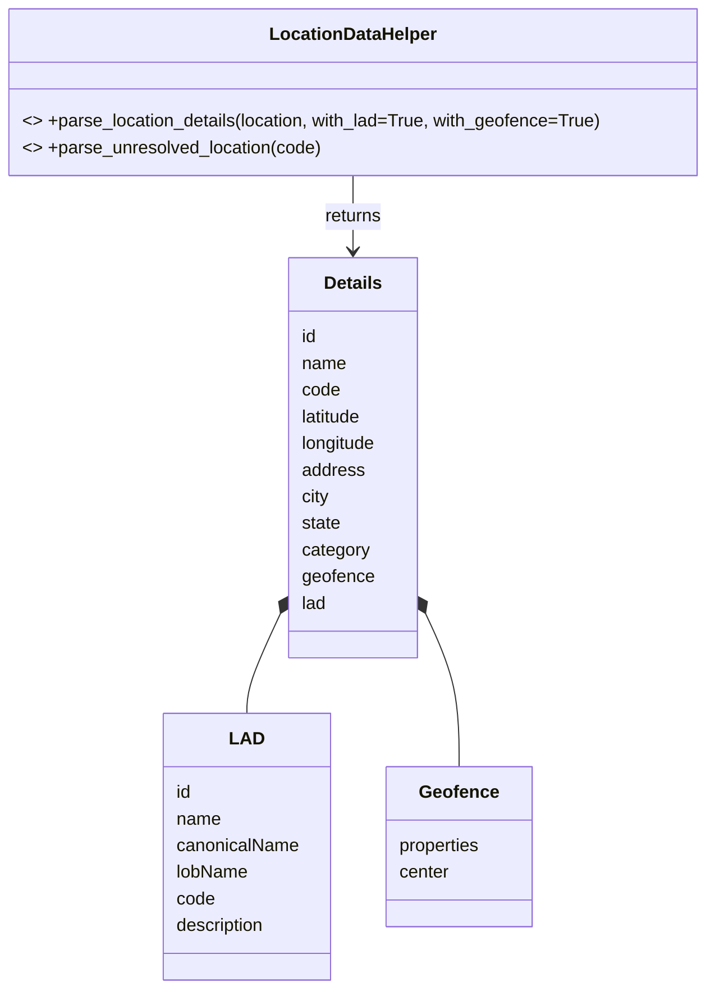

# Diagram: fv_core/fv_framework/python/fv_framework/utility/LocationDataUtils.py


> Auto-generated by Obscura crawlers

## Diagram 1



> SVG rendering failed for this diagram.

## Diagram 2

```mermaid
flowchart TD
    PLD[parse_location_details(location, with_lad=true, with_geofence=true)]
    GCHK{location.geofence present? \nand with_geofence==true}
    PLD --> GCHK
    GYES[Set details.geofence = geofence]
    GNO[Set details.geofence = {}]
    GCHK -- Yes --> GYES
    GCHK -- No --> GNO

    LADCHK{location.lad present? \nand with_lad==true}
    PLD --> LADCHK
    LADYES[Populate details.lad with:\nid, name, canonicalName, lobName, code, description]
    LADNO[Do not add lad]

    LADCHK -- Yes --> LADYES
    LADCHK -- No --> LADNO

    GYES --> MERGE[Merge fields into details]
    GNO --> MERGE
    LADYES --> MERGE
    LADNO --> MERGE
    MERGE --> RETURN1[Return details]

    PUL[parse_unresolved_location(code)]
    PUL --> UCREATE[Create details:\nname="Unresolved", code=code,\nlatitude=0, longitude=0,\nlad = {id:25287, name:"Unclassified", canonicalName:"Unclassified", lobName:"Unclassified", code:"u", description:"A facility that has not been classified."}]
    UCREATE --> RETURN2[Return details]
```

> SVG rendering failed for this diagram.
