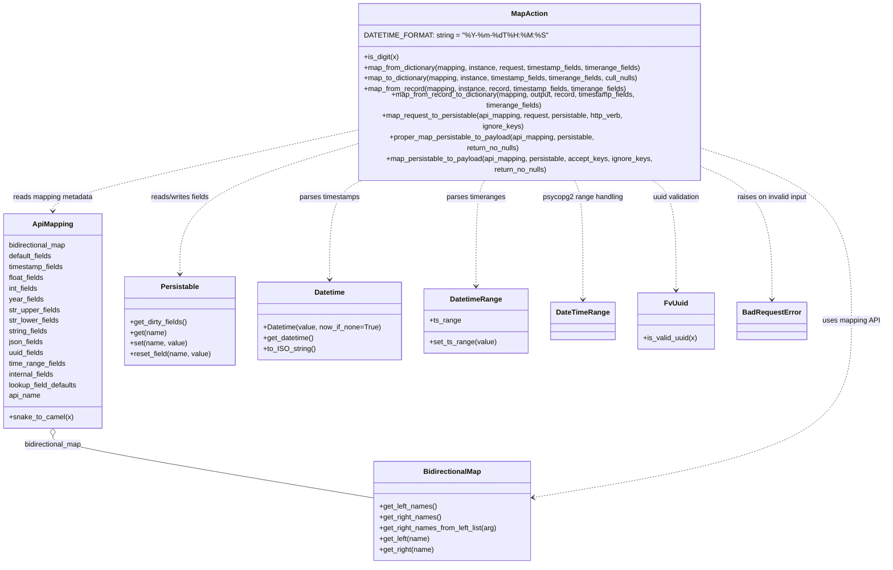

# Diagram: fv_core/fv_framework/python/fv_framework/utility/MapAction.py

> Auto-generated by Obscura crawlers

## Mermaid

### SVG

<svg id="container" width="1957.46875" xmlns="http://www.w3.org/2000/svg" class="classDiagram" height="1178" viewBox="0 0 1957.46875 1178" role="graphics-document document" aria-roledescription="class"><g><defs><marker id="container_class-aggregationStart" class="marker aggregation class" refX="18" refY="7" markerWidth="190" markerHeight="240" orient="auto"><path d="M 18,7 L9,13 L1,7 L9,1 Z"></path></marker></defs><defs><marker id="container_class-aggregationEnd" class="marker aggregation class" refX="1" refY="7" markerWidth="20" markerHeight="28" orient="auto"><path d="M 18,7 L9,13 L1,7 L9,1 Z"></path></marker></defs><defs><marker id="container_class-extensionStart" class="marker extension class" refX="18" refY="7" markerWidth="190" markerHeight="240" orient="auto"><path d="M 1,7 L18,13 V 1 Z"></path></marker></defs><defs><marker id="container_class-extensionEnd" class="marker extension class" refX="1" refY="7" markerWidth="20" markerHeight="28" orient="auto"><path d="M 1,1 V 13 L18,7 Z"></path></marker></defs><defs><marker id="container_class-compositionStart" class="marker composition class" refX="18" refY="7" markerWidth="190" markerHeight="240" orient="auto"><path d="M 18,7 L9,13 L1,7 L9,1 Z"></path></marker></defs><defs><marker id="container_class-compositionEnd" class="marker composition class" refX="1" refY="7" markerWidth="20" markerHeight="28" orient="auto"><path d="M 18,7 L9,13 L1,7 L9,1 Z"></path></marker></defs><defs><marker id="container_class-dependencyStart" class="marker dependency class" refX="6" refY="7" markerWidth="190" markerHeight="240" orient="auto"><path d="M 5,7 L9,13 L1,7 L9,1 Z"></path></marker></defs><defs><marker id="container_class-dependencyEnd" class="marker dependency class" refX="13" refY="7" markerWidth="20" markerHeight="28" orient="auto"><path d="M 18,7 L9,13 L14,7 L9,1 Z"></path></marker></defs><defs><marker id="container_class-lollipopStart" class="marker lollipop class" refX="13" refY="7" markerWidth="190" markerHeight="240" orient="auto"><circle stroke="black" fill="transparent" cx="7" cy="7" r="6"></circle></marker></defs><defs><marker id="container_class-lollipopEnd" class="marker lollipop class" refX="1" refY="7" markerWidth="190" markerHeight="240" orient="auto"><circle stroke="black" fill="transparent" cx="7" cy="7" r="6"></circle></marker></defs><g class="root"><g class="clusters"></g><g class="edgePaths"><path d="M120.238,891.25L120.238,894.542C120.238,897.833,120.238,904.417,237.836,927.429C355.434,950.442,590.63,989.883,708.228,1009.604L825.826,1029.325" id="id_ApiMapping_BidirectionalMap_1" class="edge-thickness-normal edge-pattern-solid relation" style=";;;" data-edge="true" data-et="edge" data-id="id_ApiMapping_BidirectionalMap_1" data-points="W3sieCI6MTIwLjIzODI4MTI1LCJ5Ijo4NzR9LHsieCI6MTIwLjIzODI4MTI1LCJ5Ijo5MTF9LHsieCI6ODI1LjgyNjE3MTg3NSwieSI6MTAyOS4zMjQ4NjM5NTIxMjd9XQ==" marker-start="url(#container_class-aggregationStart)"></path><path d="M1575.322,271.943L1626.99,286.119C1678.658,300.295,1781.993,328.648,1833.66,388.99C1885.328,449.333,1885.328,541.667,1885.328,634C1885.328,726.333,1885.328,818.667,1768.716,884.389C1652.105,950.111,1418.881,989.222,1302.269,1008.777L1185.658,1028.333" id="id_MapAction_BidirectionalMap_2" class="edge-thickness-normal edge-pattern-dashed relation" style=";;;" data-edge="true" data-et="edge" data-id="id_MapAction_BidirectionalMap_2" data-points="W3sieCI6MTU3NS4zMjIyNjU2MjUsInkiOjI3MS45NDI5ODUzNDIzNDA2NX0seyJ4IjoxODg1LjMyODEyNSwieSI6MzU3fSx7IngiOjE4ODUuMzI4MTI1LCJ5Ijo2MzR9LHsieCI6MTg4NS4zMjgxMjUsInkiOjkxMX0seyJ4IjoxMTc5Ljc0MDIzNDM3NSwieSI6MTAyOS4zMjQ4NjM5NTIxMjd9XQ==" marker-end="url(#container_class-dependencyEnd)"></path><path d="M788.486,235.519L677.112,255.766C565.737,276.013,342.988,316.506,231.613,341.92C120.238,367.333,120.238,377.667,120.238,382.833L120.238,388" id="id_MapAction_ApiMapping_3" class="edge-thickness-normal edge-pattern-dashed relation" style=";;;" data-edge="true" data-et="edge" data-id="id_MapAction_ApiMapping_3" data-points="W3sieCI6Nzg4LjQ4NjMyODEyNSwieSI6MjM1LjUxOTM1NDM0NjE1MDM4fSx7IngiOjEyMC4yMzgyODEyNSwieSI6MzU3fSx7IngiOjEyMC4yMzgyODEyNSwieSI6Mzk0fV0=" marker-end="url(#container_class-dependencyEnd)"></path><path d="M788.486,261.865L724.746,277.721C661.005,293.577,533.524,325.288,469.784,369.811C406.043,414.333,406.043,471.667,406.043,500.333L406.043,529" id="id_MapAction_Persistable_4" class="edge-thickness-normal edge-pattern-dashed relation" style=";;;" data-edge="true" data-et="edge" data-id="id_MapAction_Persistable_4" data-points="W3sieCI6Nzg4LjQ4NjMyODEyNSwieSI6MjYxLjg2NDk5ODgyOTQyNn0seyJ4Ijo0MDYuMDQyOTY4NzUsInkiOjM1N30seyJ4Ijo0MDYuMDQyOTY4NzUsInkiOjUzNX1d" marker-end="url(#container_class-dependencyEnd)"></path><path d="M824.847,320L810.732,326.167C796.618,332.333,768.389,344.667,754.275,381.5C740.16,418.333,740.16,479.667,740.16,510.333L740.16,541" id="id_MapAction_Datetime_5" class="edge-thickness-normal edge-pattern-dashed relation" style=";;;" data-edge="true" data-et="edge" data-id="id_MapAction_Datetime_5" data-points="W3sieCI6ODI0Ljg0Njg1Njc4NDMyNjQsInkiOjMyMH0seyJ4Ijo3NDAuMTYwMTU2MjUsInkiOjM1N30seyJ4Ijo3NDAuMTYwMTU2MjUsInkiOjU0N31d" marker-end="url(#container_class-dependencyEnd)"></path><path d="M1087.516,320L1083.785,326.167C1080.054,332.333,1072.591,344.667,1068.86,384C1065.129,423.333,1065.129,489.667,1065.129,522.833L1065.129,556" id="id_MapAction_DatetimeRange_6" class="edge-thickness-normal edge-pattern-dashed relation" style=";;;" data-edge="true" data-et="edge" data-id="id_MapAction_DatetimeRange_6" data-points="W3sieCI6MTA4Ny41MTU4OTgyMzUxMDM2LCJ5IjozMjB9LHsieCI6MTA2NS4xMjg5MDYyNSwieSI6MzU3fSx7IngiOjEwNjUuMTI4OTA2MjUsInkiOjU2Mn1d" marker-end="url(#container_class-dependencyEnd)"></path><path d="M1276.293,320L1280.024,326.167C1283.755,332.333,1291.217,344.667,1294.949,389C1298.68,433.333,1298.68,509.667,1298.68,547.833L1298.68,586" id="id_MapAction_DateTimeRange_7" class="edge-thickness-normal edge-pattern-dashed relation" style=";;;" data-edge="true" data-et="edge" data-id="id_MapAction_DateTimeRange_7" data-points="W3sieCI6MTI3Ni4yOTI2OTU1MTQ4OTY0LCJ5IjozMjB9LHsieCI6MTI5OC42Nzk2ODc1LCJ5IjozNTd9LHsieCI6MTI5OC42Nzk2ODc1LCJ5Ijo1OTJ9XQ==" marker-end="url(#container_class-dependencyEnd)"></path><path d="M1441.215,320L1451.466,326.167C1461.717,332.333,1482.218,344.667,1492.468,385.5C1502.719,426.333,1502.719,495.667,1502.719,530.333L1502.719,565" id="id_MapAction_FvUuid_8" class="edge-thickness-normal edge-pattern-dashed relation" style=";;;" data-edge="true" data-et="edge" data-id="id_MapAction_FvUuid_8" data-points="W3sieCI6MTQ0MS4yMTU0NjEwNTg5Mzc4LCJ5IjozMjB9LHsieCI6MTUwMi43MTg3NSwieSI6MzU3fSx7IngiOjE1MDIuNzE4NzUsInkiOjU3MX1d" marker-end="url(#container_class-dependencyEnd)"></path><path d="M1575.322,307.263L1598.086,315.552C1620.85,323.842,1666.378,340.421,1689.142,386.877C1711.906,433.333,1711.906,509.667,1711.906,547.833L1711.906,586" id="id_MapAction_BadRequestError_9" class="edge-thickness-normal edge-pattern-dashed relation" style=";;;" data-edge="true" data-et="edge" data-id="id_MapAction_BadRequestError_9" data-points="W3sieCI6MTU3NS4zMjIyNjU2MjUsInkiOjMwNy4yNjI5OTY1MjQ5MjQzNX0seyJ4IjoxNzExLjkwNjI1LCJ5IjozNTd9LHsieCI6MTcxMS45MDYyNSwieSI6NTkyfV0=" marker-end="url(#container_class-dependencyEnd)"></path></g><g class="edgeLabels"><g class="edgeLabel" transform="translate(120.23828125, 911)"><g class="label" data-id="id_ApiMapping_BidirectionalMap_1" transform="translate(-66.3203125, -12)"><foreignObject width="132.640625" height="24">

bidirectional_map

</foreignObject></g></g><g class="edgeLabel" transform="translate(1885.328125, 634)"><g class="label" data-id="id_MapAction_BidirectionalMap_2" transform="translate(-64.140625, -12)"><foreignObject width="128.28125" height="24">

uses mapping API

</foreignObject></g></g><g class="edgeLabel" transform="translate(120.23828125, 357)"><g class="label" data-id="id_MapAction_ApiMapping_3" transform="translate(-90.78125, -12)"><foreignObject width="181.5625" height="24">

reads mapping metadata

</foreignObject></g></g><g class="edgeLabel" transform="translate(406.04296875, 357)"><g class="label" data-id="id_MapAction_Persistable_4" transform="translate(-67.8515625, -12)"><foreignObject width="135.703125" height="24">

reads/writes fields

</foreignObject></g></g><g class="edgeLabel" transform="translate(740.16015625, 357)"><g class="label" data-id="id_MapAction_Datetime_5" transform="translate(-68.5703125, -12)"><foreignObject width="137.140625" height="24">

parses timestamps

</foreignObject></g></g><g class="edgeLabel" transform="translate(1065.12890625, 357)"><g class="label" data-id="id_MapAction_DatetimeRange_6" transform="translate(-66.28125, -12)"><foreignObject width="132.5625" height="24">

parses timeranges

</foreignObject></g></g><g class="edgeLabel" transform="translate(1298.6796875, 357)"><g class="label" data-id="id_MapAction_DateTimeRange_7" transform="translate(-89.90625, -12)"><foreignObject width="179.8125" height="24">

psycopg2 range handling

</foreignObject></g></g><g class="edgeLabel" transform="translate(1502.71875, 357)"><g class="label" data-id="id_MapAction_FvUuid_8" transform="translate(-54.796875, -12)"><foreignObject width="109.59375" height="24">

uuid validation

</foreignObject></g></g><g class="edgeLabel" transform="translate(1711.90625, 357)"><g class="label" data-id="id_MapAction_BadRequestError_9" transform="translate(-80.5625, -12)"><foreignObject width="161.125" height="24">

raises on invalid input

</foreignObject></g></g></g><g class="nodes"><g class="node default" id="classId-MapAction-0" transform="translate(1181.904296875, 164)"><g class="basic label-container"><path d="M-393.41796875 -156 L393.41796875 -156 L393.41796875 156 L-393.41796875 156" stroke="none" stroke-width="0" fill="#ECECFF" style=""></path><path d="M-393.41796875 -156 C-171.42930563170916 -156, 50.55935748658169 -156, 393.41796875 -156 M-393.41796875 -156 C-85.43684291227527 -156, 222.54428292544947 -156, 393.41796875 -156 M393.41796875 -156 C393.41796875 -73.8494950166514, 393.41796875 8.301009966697194, 393.41796875 156 M393.41796875 -156 C393.41796875 -56.59068275816924, 393.41796875 42.818634483661526, 393.41796875 156 M393.41796875 156 C110.53877618555521 156, -172.34041637888959 156, -393.41796875 156 M393.41796875 156 C150.70770835302116 156, -92.00255204395768 156, -393.41796875 156 M-393.41796875 156 C-393.41796875 77.39532705483742, -393.41796875 -1.209345890325153, -393.41796875 -156 M-393.41796875 156 C-393.41796875 50.19024436789489, -393.41796875 -55.61951126421022, -393.41796875 -156" stroke="#9370DB" stroke-width="1.3" fill="none" stroke-dasharray="0 0" style=""></path></g><g class="annotation-group text" transform="translate(0, -132)"></g><g class="label-group text" transform="translate(-38.6328125, -132)"><g class="label" style="font-weight: bolder" transform="translate(0,-12)"><foreignObject width="77.265625" height="24">

MapAction

</foreignObject></g></g><g class="members-group text" transform="translate(-381.41796875, -84)"><g class="label" style="" transform="translate(0,-12)"><foreignObject width="384.03125" height="24">

DATETIME_FORMAT: string = "%Y-%m-%dT%H:%M:%S"

</foreignObject></g></g><g class="methods-group text" transform="translate(-381.41796875, -36)"><g class="label" style="" transform="translate(0,-12)"><foreignObject width="78.46875" height="24">

+is_digit(x)

</foreignObject></g><g class="label" style="" transform="translate(0,12)"><foreignObject width="631.3125" height="24">

+map_from_dictionary(mapping, instance, request, timestamp_fields, timerange_fields)

</foreignObject></g><g class="label" style="" transform="translate(0,36)"><foreignObject width="626.453125" height="24">

+map_to_dictionary(mapping, instance, timestamp_fields, timerange_fields, cull_nulls)

</foreignObject></g><g class="label" style="" transform="translate(0,60)"><foreignObject width="595.515625" height="24">

+map_from_record(mapping, instance, record, timestamp_fields, timerange_fields)

</foreignObject></g><g class="label" style="" transform="translate(0,84)"><foreignObject width="687.65625" height="24">

+map_from_record_to_dictionary(mapping, output, record, timestamp_fields, timerange_fields)

</foreignObject></g><g class="label" style="" transform="translate(0,108)"><foreignObject width="644.125" height="24">

+map_request_to_persistable(api_mapping, request, persistable, http_verb, ignore_keys)

</foreignObject></g><g class="label" style="" transform="translate(0,132)"><foreignObject width="590.5" height="24">

+proper_map_persistable_to_payload(api_mapping, persistable, return_no_nulls)

</foreignObject></g><g class="label" style="" transform="translate(0,156)"><foreignObject width="724.203125" height="24">

+map_persistable_to_payload(api_mapping, persistable, accept_keys, ignore_keys, return_no_nulls)

</foreignObject></g></g><g class="divider" style=""><path d="M-393.41796875 -108 C-88.13370191584784 -108, 217.15056491830433 -108, 393.41796875 -108 M-393.41796875 -108 C-106.58433884924779 -108, 180.24929105150443 -108, 393.41796875 -108" stroke="#9370DB" stroke-width="1.3" fill="none" stroke-dasharray="0 0" style=""></path></g><g class="divider" style=""><path d="M-393.41796875 -60 C-96.67548926394818 -60, 200.06699022210364 -60, 393.41796875 -60 M-393.41796875 -60 C-199.76057943574216 -60, -6.103190121484317 -60, 393.41796875 -60" stroke="#9370DB" stroke-width="1.3" fill="none" stroke-dasharray="0 0" style=""></path></g></g><g class="node default" id="classId-ApiMapping-1" transform="translate(120.23828125, 634)"><g class="basic label-container"><path d="M-112.23828125 -240 L112.23828125 -240 L112.23828125 240 L-112.23828125 240" stroke="none" stroke-width="0" fill="#ECECFF" style=""></path><path d="M-112.23828125 -240 C-46.95919066249296 -240, 18.319899925014084 -240, 112.23828125 -240 M-112.23828125 -240 C-41.757751643735915 -240, 28.72277796252817 -240, 112.23828125 -240 M112.23828125 -240 C112.23828125 -51.646793040857574, 112.23828125 136.70641391828485, 112.23828125 240 M112.23828125 -240 C112.23828125 -103.79871939004892, 112.23828125 32.40256121990217, 112.23828125 240 M112.23828125 240 C62.735471000964985 240, 13.23266075192997 240, -112.23828125 240 M112.23828125 240 C56.34883321856497 240, 0.45938518712993925 240, -112.23828125 240 M-112.23828125 240 C-112.23828125 110.70989207425905, -112.23828125 -18.58021585148191, -112.23828125 -240 M-112.23828125 240 C-112.23828125 75.28771109631381, -112.23828125 -89.42457780737237, -112.23828125 -240" stroke="#9370DB" stroke-width="1.3" fill="none" stroke-dasharray="0 0" style=""></path></g><g class="annotation-group text" transform="translate(0, -216)"></g><g class="label-group text" transform="translate(-43.2578125, -216)"><g class="label" style="font-weight: bolder" transform="translate(0,-12)"><foreignObject width="86.515625" height="24">

ApiMapping

</foreignObject></g></g><g class="members-group text" transform="translate(-100.23828125, -168)"><g class="label" style="" transform="translate(0,-12)"><foreignObject width="132.640625" height="24">

bidirectional_map

</foreignObject></g><g class="label" style="" transform="translate(0,12)"><foreignObject width="99.359375" height="24">

default_fields

</foreignObject></g><g class="label" style="" transform="translate(0,36)"><foreignObject width="125.03125" height="24">

timestamp_fields

</foreignObject></g><g class="label" style="" transform="translate(0,60)"><foreignObject width="80.625" height="24">

float_fields

</foreignObject></g><g class="label" style="" transform="translate(0,84)"><foreignObject width="67.234375" height="24">

int_fields

</foreignObject></g><g class="label" style="" transform="translate(0,108)"><foreignObject width="77.546875" height="24">

year_fields

</foreignObject></g><g class="label" style="" transform="translate(0,132)"><foreignObject width="115.65625" height="24">

str_upper_fields

</foreignObject></g><g class="label" style="" transform="translate(0,156)"><foreignObject width="112.921875" height="24">

str_lower_fields

</foreignObject></g><g class="label" style="" transform="translate(0,180)"><foreignObject width="89.265625" height="24">

string_fields

</foreignObject></g><g class="label" style="" transform="translate(0,204)"><foreignObject width="78.25" height="24">

json_fields

</foreignObject></g><g class="label" style="" transform="translate(0,228)"><foreignObject width="80.28125" height="24">

uuid_fields

</foreignObject></g><g class="label" style="" transform="translate(0,252)"><foreignObject width="128.453125" height="24">

time_range_fields

</foreignObject></g><g class="label" style="" transform="translate(0,276)"><foreignObject width="104.5" height="24">

internal_fields

</foreignObject></g><g class="label" style="" transform="translate(0,300)"><foreignObject width="157.21875" height="24">

lookup_field_defaults

</foreignObject></g><g class="label" style="" transform="translate(0,324)"><foreignObject width="71.5625" height="24">

api_name

</foreignObject></g></g><g class="methods-group text" transform="translate(-100.23828125, 216)"><g class="label" style="" transform="translate(0,-12)"><foreignObject width="141.984375" height="24">

+snake_to_camel(x)

</foreignObject></g></g><g class="divider" style=""><path d="M-112.23828125 -192 C-32.153473177998876 -192, 47.93133489400225 -192, 112.23828125 -192 M-112.23828125 -192 C-34.26241124159468 -192, 43.713458766810646 -192, 112.23828125 -192" stroke="#9370DB" stroke-width="1.3" fill="none" stroke-dasharray="0 0" style=""></path></g><g class="divider" style=""><path d="M-112.23828125 192 C-62.2309474591626 192, -12.2236136683252 192, 112.23828125 192 M-112.23828125 192 C-60.2986250873075 192, -8.358968924614999 192, 112.23828125 192" stroke="#9370DB" stroke-width="1.3" fill="none" stroke-dasharray="0 0" style=""></path></g></g><g class="node default" id="classId-BidirectionalMap-2" transform="translate(1002.783203125, 1059)"><g class="basic label-container"><path d="M-176.95703125 -111 L176.95703125 -111 L176.95703125 111 L-176.95703125 111" stroke="none" stroke-width="0" fill="#ECECFF" style=""></path><path d="M-176.95703125 -111 C-92.23794800612126 -111, -7.518864762242515 -111, 176.95703125 -111 M-176.95703125 -111 C-76.63058507326217 -111, 23.695861103475664 -111, 176.95703125 -111 M176.95703125 -111 C176.95703125 -45.86083215973571, 176.95703125 19.278335680528585, 176.95703125 111 M176.95703125 -111 C176.95703125 -33.287508991486746, 176.95703125 44.42498201702651, 176.95703125 111 M176.95703125 111 C80.19918792845365 111, -16.558655393092693 111, -176.95703125 111 M176.95703125 111 C52.63787137329339 111, -71.68128850341321 111, -176.95703125 111 M-176.95703125 111 C-176.95703125 46.423047197506875, -176.95703125 -18.15390560498625, -176.95703125 -111 M-176.95703125 111 C-176.95703125 41.229631902870125, -176.95703125 -28.54073619425975, -176.95703125 -111" stroke="#9370DB" stroke-width="1.3" fill="none" stroke-dasharray="0 0" style=""></path></g><g class="annotation-group text" transform="translate(0, -87)"></g><g class="label-group text" transform="translate(-62.2265625, -87)"><g class="label" style="font-weight: bolder" transform="translate(0,-12)"><foreignObject width="124.453125" height="24">

BidirectionalMap

</foreignObject></g></g><g class="members-group text" transform="translate(-164.95703125, -39)"></g><g class="methods-group text" transform="translate(-164.95703125, -9)"><g class="label" style="" transform="translate(0,-12)"><foreignObject width="129.84375" height="24">

+get_left_names()

</foreignObject></g><g class="label" style="" transform="translate(0,12)"><foreignObject width="139.703125" height="24">

+get_right_names()

</foreignObject></g><g class="label" style="" transform="translate(0,36)"><foreignObject width="267.6875" height="24">

+get_right_names_from_left_list(arg)

</foreignObject></g><g class="label" style="" transform="translate(0,60)"><foreignObject width="114.0625" height="24">

+get_left(name)

</foreignObject></g><g class="label" style="" transform="translate(0,84)"><foreignObject width="123.90625" height="24">

+get_right(name)

</foreignObject></g></g><g class="divider" style=""><path d="M-176.95703125 -63 C-80.48835850714076 -63, 15.980314235718481 -63, 176.95703125 -63 M-176.95703125 -63 C-84.59165424136178 -63, 7.773722767276439 -63, 176.95703125 -63" stroke="#9370DB" stroke-width="1.3" fill="none" stroke-dasharray="0 0" style=""></path></g><g class="divider" style=""><path d="M-176.95703125 -39 C-92.30876850753549 -39, -7.66050576507098 -39, 176.95703125 -39 M-176.95703125 -39 C-69.73477673383685 -39, 37.487477782326295 -39, 176.95703125 -39" stroke="#9370DB" stroke-width="1.3" fill="none" stroke-dasharray="0 0" style=""></path></g></g><g class="node default" id="classId-Persistable-3" transform="translate(406.04296875, 634)"><g class="basic label-container"><path d="M-123.56640625 -99 L123.56640625 -99 L123.56640625 99 L-123.56640625 99" stroke="none" stroke-width="0" fill="#ECECFF" style=""></path><path d="M-123.56640625 -99 C-66.28185635856133 -99, -8.997306467122641 -99, 123.56640625 -99 M-123.56640625 -99 C-68.51341691749887 -99, -13.460427584997745 -99, 123.56640625 -99 M123.56640625 -99 C123.56640625 -26.262353216356843, 123.56640625 46.475293567286315, 123.56640625 99 M123.56640625 -99 C123.56640625 -33.519967570140324, 123.56640625 31.960064859719353, 123.56640625 99 M123.56640625 99 C34.200905254307585 99, -55.16459574138483 99, -123.56640625 99 M123.56640625 99 C47.369373800741556 99, -28.827658648516888 99, -123.56640625 99 M-123.56640625 99 C-123.56640625 30.096947334386627, -123.56640625 -38.806105331226746, -123.56640625 -99 M-123.56640625 99 C-123.56640625 27.70486656388151, -123.56640625 -43.59026687223698, -123.56640625 -99" stroke="#9370DB" stroke-width="1.3" fill="none" stroke-dasharray="0 0" style=""></path></g><g class="annotation-group text" transform="translate(0, -75)"></g><g class="label-group text" transform="translate(-40.9765625, -75)"><g class="label" style="font-weight: bolder" transform="translate(0,-12)"><foreignObject width="81.953125" height="24">

Persistable

</foreignObject></g></g><g class="members-group text" transform="translate(-111.56640625, -27)"></g><g class="methods-group text" transform="translate(-111.56640625, 3)"><g class="label" style="" transform="translate(0,-12)"><foreignObject width="129.828125" height="24">

+get_dirty_fields()

</foreignObject></g><g class="label" style="" transform="translate(0,12)"><foreignObject width="81.4375" height="24">

+get(name)

</foreignObject></g><g class="label" style="" transform="translate(0,36)"><foreignObject width="127.640625" height="24">

+set(name, value)

</foreignObject></g><g class="label" style="" transform="translate(0,60)"><foreignObject width="182.15625" height="24">

+reset_field(name, value)

</foreignObject></g></g><g class="divider" style=""><path d="M-123.56640625 -51 C-60.917677365651834 -51, 1.731051518696333 -51, 123.56640625 -51 M-123.56640625 -51 C-66.5435644894913 -51, -9.52072272898262 -51, 123.56640625 -51" stroke="#9370DB" stroke-width="1.3" fill="none" stroke-dasharray="0 0" style=""></path></g><g class="divider" style=""><path d="M-123.56640625 -27 C-33.43174473081055 -27, 56.7029167883789 -27, 123.56640625 -27 M-123.56640625 -27 C-38.85982361836754 -27, 45.846759013264915 -27, 123.56640625 -27" stroke="#9370DB" stroke-width="1.3" fill="none" stroke-dasharray="0 0" style=""></path></g></g><g class="node default" id="classId-Datetime-4" transform="translate(740.16015625, 634)"><g class="basic label-container"><path d="M-160.55078125 -87 L160.55078125 -87 L160.55078125 87 L-160.55078125 87" stroke="none" stroke-width="0" fill="#ECECFF" style=""></path><path d="M-160.55078125 -87 C-65.53569008066857 -87, 29.479401088662854 -87, 160.55078125 -87 M-160.55078125 -87 C-37.64217919604684 -87, 85.26642285790632 -87, 160.55078125 -87 M160.55078125 -87 C160.55078125 -43.12601122882118, 160.55078125 0.7479775423576456, 160.55078125 87 M160.55078125 -87 C160.55078125 -34.98713584882365, 160.55078125 17.025728302352704, 160.55078125 87 M160.55078125 87 C93.89571878783286 87, 27.240656325665725 87, -160.55078125 87 M160.55078125 87 C32.734244731977185 87, -95.08229178604563 87, -160.55078125 87 M-160.55078125 87 C-160.55078125 19.92784396624141, -160.55078125 -47.14431206751718, -160.55078125 -87 M-160.55078125 87 C-160.55078125 19.82059262653229, -160.55078125 -47.35881474693542, -160.55078125 -87" stroke="#9370DB" stroke-width="1.3" fill="none" stroke-dasharray="0 0" style=""></path></g><g class="annotation-group text" transform="translate(0, -63)"></g><g class="label-group text" transform="translate(-33.3984375, -63)"><g class="label" style="font-weight: bolder" transform="translate(0,-12)"><foreignObject width="66.796875" height="24">

Datetime

</foreignObject></g></g><g class="members-group text" transform="translate(-148.55078125, -15)"></g><g class="methods-group text" transform="translate(-148.55078125, 15)"><g class="label" style="" transform="translate(0,-12)"><foreignObject width="263.703125" height="24">

+Datetime(value, now_if_none=True)

</foreignObject></g><g class="label" style="" transform="translate(0,12)"><foreignObject width="114.171875" height="24">

+get_datetime()

</foreignObject></g><g class="label" style="" transform="translate(0,36)"><foreignObject width="114.984375" height="24">

+to_ISO_string()

</foreignObject></g></g><g class="divider" style=""><path d="M-160.55078125 -39 C-84.02252659724414 -39, -7.4942719444882755 -39, 160.55078125 -39 M-160.55078125 -39 C-59.15708717944314 -39, 42.23660689111372 -39, 160.55078125 -39" stroke="#9370DB" stroke-width="1.3" fill="none" stroke-dasharray="0 0" style=""></path></g><g class="divider" style=""><path d="M-160.55078125 -15 C-46.151606669944215 -15, 68.24756791011157 -15, 160.55078125 -15 M-160.55078125 -15 C-36.075590804542216 -15, 88.39959964091557 -15, 160.55078125 -15" stroke="#9370DB" stroke-width="1.3" fill="none" stroke-dasharray="0 0" style=""></path></g></g><g class="node default" id="classId-DatetimeRange-5" transform="translate(1065.12890625, 634)"><g class="basic label-container"><path d="M-114.41796875 -72 L114.41796875 -72 L114.41796875 72 L-114.41796875 72" stroke="none" stroke-width="0" fill="#ECECFF" style=""></path><path d="M-114.41796875 -72 C-24.938160812905167 -72, 64.54164712418967 -72, 114.41796875 -72 M-114.41796875 -72 C-49.836875139707914 -72, 14.744218470584173 -72, 114.41796875 -72 M114.41796875 -72 C114.41796875 -21.98610166393935, 114.41796875 28.027796672121298, 114.41796875 72 M114.41796875 -72 C114.41796875 -17.556081117839497, 114.41796875 36.887837764321006, 114.41796875 72 M114.41796875 72 C61.98213127446636 72, 9.546293798932723 72, -114.41796875 72 M114.41796875 72 C26.521480426543846 72, -61.37500789691231 72, -114.41796875 72 M-114.41796875 72 C-114.41796875 20.192061640685907, -114.41796875 -31.615876718628186, -114.41796875 -72 M-114.41796875 72 C-114.41796875 22.456610262806322, -114.41796875 -27.086779474387356, -114.41796875 -72" stroke="#9370DB" stroke-width="1.3" fill="none" stroke-dasharray="0 0" style=""></path></g><g class="annotation-group text" transform="translate(0, -48)"></g><g class="label-group text" transform="translate(-55.8984375, -48)"><g class="label" style="font-weight: bolder" transform="translate(0,-12)"><foreignObject width="111.796875" height="24">

DatetimeRange

</foreignObject></g></g><g class="members-group text" transform="translate(-102.41796875, 0)"><g class="label" style="" transform="translate(0,-12)"><foreignObject width="69.640625" height="24">

+ts_range

</foreignObject></g></g><g class="methods-group text" transform="translate(-102.41796875, 48)"><g class="label" style="" transform="translate(0,-12)"><foreignObject width="148.9375" height="24">

+set_ts_range(value)

</foreignObject></g></g><g class="divider" style=""><path d="M-114.41796875 -24 C-26.864105025054954 -24, 60.68975869989009 -24, 114.41796875 -24 M-114.41796875 -24 C-66.54326810050867 -24, -18.66856745101734 -24, 114.41796875 -24" stroke="#9370DB" stroke-width="1.3" fill="none" stroke-dasharray="0 0" style=""></path></g><g class="divider" style=""><path d="M-114.41796875 24 C-34.55431077181966 24, 45.309347206360684 24, 114.41796875 24 M-114.41796875 24 C-41.59296287925859 24, 31.232042991482814 24, 114.41796875 24" stroke="#9370DB" stroke-width="1.3" fill="none" stroke-dasharray="0 0" style=""></path></g></g><g class="node default" id="classId-DateTimeRange-6" transform="translate(1298.6796875, 634)"><g class="basic label-container"><path d="M-69.1328125 -42 L69.1328125 -42 L69.1328125 42 L-69.1328125 42" stroke="none" stroke-width="0" fill="#ECECFF" style=""></path><path d="M-69.1328125 -42 C-23.90888641374535 -42, 21.3150396725093 -42, 69.1328125 -42 M-69.1328125 -42 C-19.381708084064442 -42, 30.369396331871116 -42, 69.1328125 -42 M69.1328125 -42 C69.1328125 -16.38053069470466, 69.1328125 9.23893861059068, 69.1328125 42 M69.1328125 -42 C69.1328125 -11.977838714014077, 69.1328125 18.044322571971847, 69.1328125 42 M69.1328125 42 C40.82119997824079 42, 12.509587456481583 42, -69.1328125 42 M69.1328125 42 C29.356406024338973 42, -10.420000451322053 42, -69.1328125 42 M-69.1328125 42 C-69.1328125 24.421859074976748, -69.1328125 6.843718149953496, -69.1328125 -42 M-69.1328125 42 C-69.1328125 12.277043988037416, -69.1328125 -17.445912023925167, -69.1328125 -42" stroke="#9370DB" stroke-width="1.3" fill="none" stroke-dasharray="0 0" style=""></path></g><g class="annotation-group text" transform="translate(0, -18)"></g><g class="label-group text" transform="translate(-57.1328125, -18)"><g class="label" style="font-weight: bolder" transform="translate(0,-12)"><foreignObject width="114.265625" height="24">

DateTimeRange

</foreignObject></g></g><g class="members-group text" transform="translate(-57.1328125, 30)"></g><g class="methods-group text" transform="translate(-57.1328125, 60)"></g><g class="divider" style=""><path d="M-69.1328125 6 C-24.131361213757614 6, 20.87009007248477 6, 69.1328125 6 M-69.1328125 6 C-31.520719544830932 6, 6.091373410338136 6, 69.1328125 6" stroke="#9370DB" stroke-width="1.3" fill="none" stroke-dasharray="0 0" style=""></path></g><g class="divider" style=""><path d="M-69.1328125 24 C-34.12549954054382 24, 0.8818134189123583 24, 69.1328125 24 M-69.1328125 24 C-24.377368468630237 24, 20.378075562739525 24, 69.1328125 24" stroke="#9370DB" stroke-width="1.3" fill="none" stroke-dasharray="0 0" style=""></path></g></g><g class="node default" id="classId-FvUuid-7" transform="translate(1502.71875, 634)"><g class="basic label-container"><path d="M-84.90625 -63 L84.90625 -63 L84.90625 63 L-84.90625 63" stroke="none" stroke-width="0" fill="#ECECFF" style=""></path><path d="M-84.90625 -63 C-23.129260004793366 -63, 38.64772999041327 -63, 84.90625 -63 M-84.90625 -63 C-43.48764600061729 -63, -2.0690420012345783 -63, 84.90625 -63 M84.90625 -63 C84.90625 -37.37606557000021, 84.90625 -11.752131140000415, 84.90625 63 M84.90625 -63 C84.90625 -15.623861326918473, 84.90625 31.752277346163055, 84.90625 63 M84.90625 63 C32.93135945644867 63, -19.043531087102664 63, -84.90625 63 M84.90625 63 C50.7069947381033 63, 16.507739476206595 63, -84.90625 63 M-84.90625 63 C-84.90625 28.015069379029384, -84.90625 -6.969861241941231, -84.90625 -63 M-84.90625 63 C-84.90625 29.28218827390407, -84.90625 -4.435623452191862, -84.90625 -63" stroke="#9370DB" stroke-width="1.3" fill="none" stroke-dasharray="0 0" style=""></path></g><g class="annotation-group text" transform="translate(0, -39)"></g><g class="label-group text" transform="translate(-24.5625, -39)"><g class="label" style="font-weight: bolder" transform="translate(0,-12)"><foreignObject width="49.125" height="24">

FvUuid

</foreignObject></g></g><g class="members-group text" transform="translate(-72.90625, 9)"></g><g class="methods-group text" transform="translate(-72.90625, 39)"><g class="label" style="" transform="translate(0,-12)"><foreignObject width="121.25" height="24">

+is_valid_uuid(x)

</foreignObject></g></g><g class="divider" style=""><path d="M-84.90625 -15 C-34.763000144330796 -15, 15.380249711338408 -15, 84.90625 -15 M-84.90625 -15 C-31.630021101198906 -15, 21.646207797602187 -15, 84.90625 -15" stroke="#9370DB" stroke-width="1.3" fill="none" stroke-dasharray="0 0" style=""></path></g><g class="divider" style=""><path d="M-84.90625 9 C-34.05008870733129 9, 16.806072585337418 9, 84.90625 9 M-84.90625 9 C-37.20376559514559 9, 10.49871880970882 9, 84.90625 9" stroke="#9370DB" stroke-width="1.3" fill="none" stroke-dasharray="0 0" style=""></path></g></g><g class="node default" id="classId-BadRequestError-8" transform="translate(1711.90625, 634)"><g class="basic label-container"><path d="M-74.28125 -42 L74.28125 -42 L74.28125 42 L-74.28125 42" stroke="none" stroke-width="0" fill="#ECECFF" style=""></path><path d="M-74.28125 -42 C-19.90207637742894 -42, 34.47709724514212 -42, 74.28125 -42 M-74.28125 -42 C-33.74363765006729 -42, 6.793974699865416 -42, 74.28125 -42 M74.28125 -42 C74.28125 -18.83184285320913, 74.28125 4.3363142935817365, 74.28125 42 M74.28125 -42 C74.28125 -19.825669075098542, 74.28125 2.348661849802916, 74.28125 42 M74.28125 42 C31.90774589391757 42, -10.465758212164857 42, -74.28125 42 M74.28125 42 C29.59155895242332 42, -15.09813209515336 42, -74.28125 42 M-74.28125 42 C-74.28125 21.719391784044674, -74.28125 1.4387835680893488, -74.28125 -42 M-74.28125 42 C-74.28125 16.282834472623616, -74.28125 -9.434331054752768, -74.28125 -42" stroke="#9370DB" stroke-width="1.3" fill="none" stroke-dasharray="0 0" style=""></path></g><g class="annotation-group text" transform="translate(0, -18)"></g><g class="label-group text" transform="translate(-62.28125, -18)"><g class="label" style="font-weight: bolder" transform="translate(0,-12)"><foreignObject width="124.5625" height="24">

BadRequestError

</foreignObject></g></g><g class="members-group text" transform="translate(-62.28125, 30)"></g><g class="methods-group text" transform="translate(-62.28125, 60)"></g><g class="divider" style=""><path d="M-74.28125 6 C-40.08932514740928 6, -5.897400294818567 6, 74.28125 6 M-74.28125 6 C-18.283814921546572 6, 37.713620156906856 6, 74.28125 6" stroke="#9370DB" stroke-width="1.3" fill="none" stroke-dasharray="0 0" style=""></path></g><g class="divider" style=""><path d="M-74.28125 24 C-38.60439111673571 24, -2.9275322334714247 24, 74.28125 24 M-74.28125 24 C-41.26131734942932 24, -8.241384698858639 24, 74.28125 24" stroke="#9370DB" stroke-width="1.3" fill="none" stroke-dasharray="0 0" style=""></path></g></g></g></g></g></svg>
