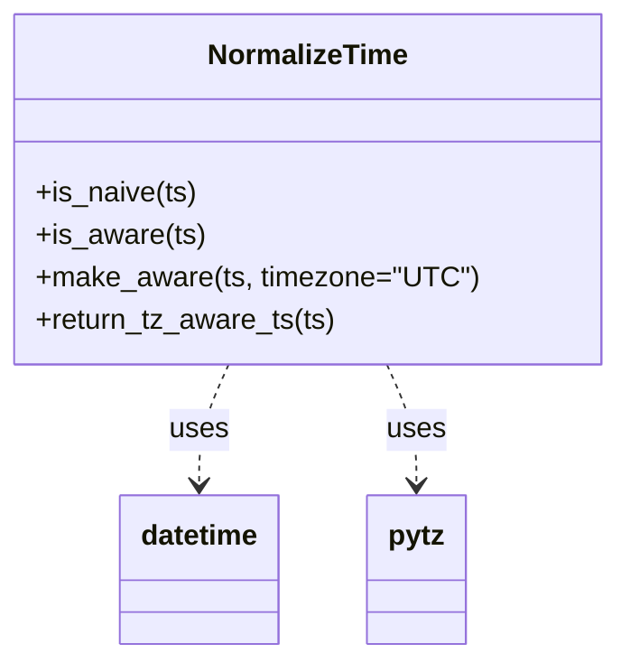

# Diagram: fv_core/fv_framework/python/fv_framework/utility/NormalizeTime.py


> Auto-generated by Obscura crawlers

## Diagram 1



### SVG

<svg id="container" width="339.1796875" xmlns="http://www.w3.org/2000/svg" class="classDiagram" height="372" viewBox="0 0 339.1796875 372" role="graphics-document document" aria-roledescription="class"><style>#container{font-family:"trebuchet ms",verdana,arial,sans-serif;font-size:16px;fill:#333;}@keyframes edge-animation-frame{from{stroke-dashoffset:0;}}@keyframes dash{to{stroke-dashoffset:0;}}#container .edge-animation-slow{stroke-dasharray:9,5!important;stroke-dashoffset:900;animation:dash 50s linear infinite;stroke-linecap:round;}#container .edge-animation-fast{stroke-dasharray:9,5!important;stroke-dashoffset:900;animation:dash 20s linear infinite;stroke-linecap:round;}#container .error-icon{fill:#552222;}#container .error-text{fill:#552222;stroke:#552222;}#container .edge-thickness-normal{stroke-width:1px;}#container .edge-thickness-thick{stroke-width:3.5px;}#container .edge-pattern-solid{stroke-dasharray:0;}#container .edge-thickness-invisible{stroke-width:0;fill:none;}#container .edge-pattern-dashed{stroke-dasharray:3;}#container .edge-pattern-dotted{stroke-dasharray:2;}#container .marker{fill:#333333;stroke:#333333;}#container .marker.cross{stroke:#333333;}#container svg{font-family:"trebuchet ms",verdana,arial,sans-serif;font-size:16px;}#container p{margin:0;}#container g.classGroup text{fill:#9370DB;stroke:none;font-family:"trebuchet ms",verdana,arial,sans-serif;font-size:10px;}#container g.classGroup text .title{font-weight:bolder;}#container .nodeLabel,#container .edgeLabel{color:#131300;}#container .edgeLabel .label rect{fill:#ECECFF;}#container .label text{fill:#131300;}#container .labelBkg{background:#ECECFF;}#container .edgeLabel .label span{background:#ECECFF;}#container .classTitle{font-weight:bolder;}#container .node rect,#container .node circle,#container .node ellipse,#container .node polygon,#container .node path{fill:#ECECFF;stroke:#9370DB;stroke-width:1px;}#container .divider{stroke:#9370DB;stroke-width:1;}#container g.clickable{cursor:pointer;}#container g.classGroup rect{fill:#ECECFF;stroke:#9370DB;}#container g.classGroup line{stroke:#9370DB;stroke-width:1;}#container .classLabel .box{stroke:none;stroke-width:0;fill:#ECECFF;opacity:0.5;}#container .classLabel .label{fill:#9370DB;font-size:10px;}#container .relation{stroke:#333333;stroke-width:1;fill:none;}#container .dashed-line{stroke-dasharray:3;}#container .dotted-line{stroke-dasharray:1 2;}#container #compositionStart,#container .composition{fill:#333333!important;stroke:#333333!important;stroke-width:1;}#container #compositionEnd,#container .composition{fill:#333333!important;stroke:#333333!important;stroke-width:1;}#container #dependencyStart,#container .dependency{fill:#333333!important;stroke:#333333!important;stroke-width:1;}#container #dependencyStart,#container .dependency{fill:#333333!important;stroke:#333333!important;stroke-width:1;}#container #extensionStart,#container .extension{fill:transparent!important;stroke:#333333!important;stroke-width:1;}#container #extensionEnd,#container .extension{fill:transparent!important;stroke:#333333!important;stroke-width:1;}#container #aggregationStart,#container .aggregation{fill:transparent!important;stroke:#333333!important;stroke-width:1;}#container #aggregationEnd,#container .aggregation{fill:transparent!important;stroke:#333333!important;stroke-width:1;}#container #lollipopStart,#container .lollipop{fill:#ECECFF!important;stroke:#333333!important;stroke-width:1;}#container #lollipopEnd,#container .lollipop{fill:#ECECFF!important;stroke:#333333!important;stroke-width:1;}#container .edgeTerminals{font-size:11px;line-height:initial;}#container .classTitleText{text-anchor:middle;font-size:18px;fill:#333;}#container .label-icon{display:inline-block;height:1em;overflow:visible;vertical-align:-0.125em;}#container .node .label-icon path{fill:currentColor;stroke:revert;stroke-width:revert;}#container :root{--mermaid-font-family:"trebuchet ms",verdana,arial,sans-serif;}</style><g><defs><marker id="container_class-aggregationStart" class="marker aggregation class" refX="18" refY="7" markerWidth="190" markerHeight="240" orient="auto"><path d="M 18,7 L9,13 L1,7 L9,1 Z"></path></marker></defs><defs><marker id="container_class-aggregationEnd" class="marker aggregation class" refX="1" refY="7" markerWidth="20" markerHeight="28" orient="auto"><path d="M 18,7 L9,13 L1,7 L9,1 Z"></path></marker></defs><defs><marker id="container_class-extensionStart" class="marker extension class" refX="18" refY="7" markerWidth="190" markerHeight="240" orient="auto"><path d="M 1,7 L18,13 V 1 Z"></path></marker></defs><defs><marker id="container_class-extensionEnd" class="marker extension class" refX="1" refY="7" markerWidth="20" markerHeight="28" orient="auto"><path d="M 1,1 V 13 L18,7 Z"></path></marker></defs><defs><marker id="container_class-compositionStart" class="marker composition class" refX="18" refY="7" markerWidth="190" markerHeight="240" orient="auto"><path d="M 18,7 L9,13 L1,7 L9,1 Z"></path></marker></defs><defs><marker id="container_class-compositionEnd" class="marker composition class" refX="1" refY="7" markerWidth="20" markerHeight="28" orient="auto"><path d="M 18,7 L9,13 L1,7 L9,1 Z"></path></marker></defs><defs><marker id="container_class-dependencyStart" class="marker dependency class" refX="6" refY="7" markerWidth="190" markerHeight="240" orient="auto"><path d="M 5,7 L9,13 L1,7 L9,1 Z"></path></marker></defs><defs><marker id="container_class-dependencyEnd" class="marker dependency class" refX="13" refY="7" markerWidth="20" markerHeight="28" orient="auto"><path d="M 18,7 L9,13 L14,7 L9,1 Z"></path></marker></defs><defs><marker id="container_class-lollipopStart" class="marker lollipop class" refX="13" refY="7" markerWidth="190" markerHeight="240" orient="auto"><circle stroke="black" fill="transparent" cx="7" cy="7" r="6"></circle></marker></defs><defs><marker id="container_class-lollipopEnd" class="marker lollipop class" refX="1" refY="7" markerWidth="190" markerHeight="240" orient="auto"><circle stroke="black" fill="transparent" cx="7" cy="7" r="6"></circle></marker></defs><g class="root"><g class="clusters"></g><g class="edgePaths"><path d="M124.935,206L122.154,212.167C119.372,218.333,113.809,230.667,111.028,242C108.246,253.333,108.246,263.667,108.246,268.833L108.246,274" id="id_NormalizeTime_datetime_1" class="edge-thickness-normal edge-pattern-dashed relation" style=";;;" data-edge="true" data-et="edge" data-id="id_NormalizeTime_datetime_1" data-points="W3sieCI6MTI0LjkzNTIwMjIwNTg4MjM1LCJ5IjoyMDZ9LHsieCI6MTA4LjI0NjA5Mzc1LCJ5IjoyNDN9LHsieCI6MTA4LjI0NjA5Mzc1LCJ5IjoyODB9XQ==" marker-end="url(#container_class-dependencyEnd)"></path><path d="M214.244,206L217.026,212.167C219.808,218.333,225.371,230.667,228.152,242C230.934,253.333,230.934,263.667,230.934,268.833L230.934,274" id="id_NormalizeTime_pytz_2" class="edge-thickness-normal edge-pattern-dashed relation" style=";;;" data-edge="true" data-et="edge" data-id="id_NormalizeTime_pytz_2" data-points="W3sieCI6MjE0LjI0NDQ4NTI5NDExNzY1LCJ5IjoyMDZ9LHsieCI6MjMwLjkzMzU5Mzc1LCJ5IjoyNDN9LHsieCI6MjMwLjkzMzU5Mzc1LCJ5IjoyODB9XQ==" marker-end="url(#container_class-dependencyEnd)"></path></g><g class="edgeLabels"><g class="edgeLabel" transform="translate(108.24609375, 243)"><g class="label" data-id="id_NormalizeTime_datetime_1" transform="translate(-16.4921875, -12)"><foreignObject width="32.984375" height="24"><div xmlns="http://www.w3.org/1999/xhtml" class="labelBkg" style="display: table-cell; white-space: nowrap; line-height: 1.5; max-width: 200px; text-align: center;"><span class="edgeLabel"><p>uses</p></span></div></foreignObject></g></g><g class="edgeLabel" transform="translate(230.93359375, 243)"><g class="label" data-id="id_NormalizeTime_pytz_2" transform="translate(-16.4921875, -12)"><foreignObject width="32.984375" height="24"><div xmlns="http://www.w3.org/1999/xhtml" class="labelBkg" style="display: table-cell; white-space: nowrap; line-height: 1.5; max-width: 200px; text-align: center;"><span class="edgeLabel"><p>uses</p></span></div></foreignObject></g></g></g><g class="nodes"><g class="node default" id="classId-NormalizeTime-0" transform="translate(169.58984375, 107)"><g class="basic label-container"><path d="M-161.58984375 -99 L161.58984375 -99 L161.58984375 99 L-161.58984375 99" stroke="none" stroke-width="0" fill="#ECECFF" style=""></path><path d="M-161.58984375 -99 C-75.01652263521191 -99, 11.556798479576173 -99, 161.58984375 -99 M-161.58984375 -99 C-79.35611781800999 -99, 2.877608113980017 -99, 161.58984375 -99 M161.58984375 -99 C161.58984375 -47.402536913388204, 161.58984375 4.1949261732235925, 161.58984375 99 M161.58984375 -99 C161.58984375 -33.269643449517304, 161.58984375 32.46071310096539, 161.58984375 99 M161.58984375 99 C62.98822188449546 99, -35.61339998100908 99, -161.58984375 99 M161.58984375 99 C46.442413440114464 99, -68.70501686977107 99, -161.58984375 99 M-161.58984375 99 C-161.58984375 33.77434987047741, -161.58984375 -31.451300259045183, -161.58984375 -99 M-161.58984375 99 C-161.58984375 57.22223755996862, -161.58984375 15.444475119937238, -161.58984375 -99" stroke="#9370DB" stroke-width="1.3" fill="none" stroke-dasharray="0 0" style=""></path></g><g class="annotation-group text" transform="translate(0, -75)"></g><g class="label-group text" transform="translate(-54.6484375, -75)"><g class="label" style="font-weight: bolder" transform="translate(0,-12)"><foreignObject width="109.296875" height="24"><div xmlns="http://www.w3.org/1999/xhtml" style="display: table-cell; white-space: nowrap; line-height: 1.5; max-width: 159px; text-align: center;"><span class="nodeLabel markdown-node-label" style=""><p>NormalizeTime</p></span></div></foreignObject></g></g><g class="members-group text" transform="translate(-149.58984375, -27)"></g><g class="methods-group text" transform="translate(-149.58984375, 3)"><g class="label" style="" transform="translate(0,-12)"><foreignObject width="90.71875" height="24"><div xmlns="http://www.w3.org/1999/xhtml" style="display: table-cell; white-space: nowrap; line-height: 1.5; max-width: 148px; text-align: center;"><span class="nodeLabel markdown-node-label" style=""><p>+is_naive(ts)</p></span></div></foreignObject></g><g class="label" style="" transform="translate(0,12)"><foreignObject width="94.296875" height="24"><div xmlns="http://www.w3.org/1999/xhtml" style="display: table-cell; white-space: nowrap; line-height: 1.5; max-width: 152px; text-align: center;"><span class="nodeLabel markdown-node-label" style=""><p>+is_aware(ts)</p></span></div></foreignObject></g><g class="label" style="" transform="translate(0,36)"><foreignObject width="244.53125" height="24"><div xmlns="http://www.w3.org/1999/xhtml" style="display: table-cell; white-space: nowrap; line-height: 1.5; max-width: 302px; text-align: center;"><span class="nodeLabel markdown-node-label" style=""><p>+make_aware(ts, timezone="UTC")</p></span></div></foreignObject></g><g class="label" style="" transform="translate(0,60)"><foreignObject width="169.390625" height="24"><div xmlns="http://www.w3.org/1999/xhtml" style="display: table-cell; white-space: nowrap; line-height: 1.5; max-width: 227px; text-align: center;"><span class="nodeLabel markdown-node-label" style=""><p>+return_tz_aware_ts(ts)</p></span></div></foreignObject></g></g><g class="divider" style=""><path d="M-161.58984375 -51 C-50.37156943932848 -51, 60.846704871343036 -51, 161.58984375 -51 M-161.58984375 -51 C-83.82843651403081 -51, -6.067029278061625 -51, 161.58984375 -51" stroke="#9370DB" stroke-width="1.3" fill="none" stroke-dasharray="0 0" style=""></path></g><g class="divider" style=""><path d="M-161.58984375 -27 C-85.36013291914193 -27, -9.130422088283865 -27, 161.58984375 -27 M-161.58984375 -27 C-81.53119443656533 -27, -1.4725451231306579 -27, 161.58984375 -27" stroke="#9370DB" stroke-width="1.3" fill="none" stroke-dasharray="0 0" style=""></path></g></g><g class="node default" id="classId-datetime-1" transform="translate(108.24609375, 322)"><g class="basic label-container"><path d="M-45.0703125 -42 L45.0703125 -42 L45.0703125 42 L-45.0703125 42" stroke="none" stroke-width="0" fill="#ECECFF" style=""></path><path d="M-45.0703125 -42 C-10.639629711463272 -42, 23.791053077073457 -42, 45.0703125 -42 M-45.0703125 -42 C-16.225462759801434 -42, 12.619386980397131 -42, 45.0703125 -42 M45.0703125 -42 C45.0703125 -11.636351979339523, 45.0703125 18.727296041320955, 45.0703125 42 M45.0703125 -42 C45.0703125 -11.610148124456572, 45.0703125 18.779703751086856, 45.0703125 42 M45.0703125 42 C11.549054647992556 42, -21.97220320401489 42, -45.0703125 42 M45.0703125 42 C22.921048045067327 42, 0.7717835901346533 42, -45.0703125 42 M-45.0703125 42 C-45.0703125 23.123878653185344, -45.0703125 4.247757306370687, -45.0703125 -42 M-45.0703125 42 C-45.0703125 17.901911401379895, -45.0703125 -6.19617719724021, -45.0703125 -42" stroke="#9370DB" stroke-width="1.3" fill="none" stroke-dasharray="0 0" style=""></path></g><g class="annotation-group text" transform="translate(0, -18)"></g><g class="label-group text" transform="translate(-33.0703125, -18)"><g class="label" style="font-weight: bolder" transform="translate(0,-12)"><foreignObject width="66.140625" height="24"><div xmlns="http://www.w3.org/1999/xhtml" style="display: table-cell; white-space: nowrap; line-height: 1.5; max-width: 115px; text-align: center;"><span class="nodeLabel markdown-node-label" style=""><p>datetime</p></span></div></foreignObject></g></g><g class="members-group text" transform="translate(-33.0703125, 30)"></g><g class="methods-group text" transform="translate(-33.0703125, 60)"></g><g class="divider" style=""><path d="M-45.0703125 6 C-20.776439762311323 6, 3.5174329753773534 6, 45.0703125 6 M-45.0703125 6 C-18.926205279879067 6, 7.217901940241866 6, 45.0703125 6" stroke="#9370DB" stroke-width="1.3" fill="none" stroke-dasharray="0 0" style=""></path></g><g class="divider" style=""><path d="M-45.0703125 24 C-14.472298323462823 24, 16.125715853074354 24, 45.0703125 24 M-45.0703125 24 C-13.965190485368147 24, 17.139931529263706 24, 45.0703125 24" stroke="#9370DB" stroke-width="1.3" fill="none" stroke-dasharray="0 0" style=""></path></g></g><g class="node default" id="classId-pytz-2" transform="translate(230.93359375, 322)"><g class="basic label-container"><path d="M-27.6171875 -42 L27.6171875 -42 L27.6171875 42 L-27.6171875 42" stroke="none" stroke-width="0" fill="#ECECFF" style=""></path><path d="M-27.6171875 -42 C-12.503100906642521 -42, 2.610985686714958 -42, 27.6171875 -42 M-27.6171875 -42 C-14.814822824213898 -42, -2.012458148427797 -42, 27.6171875 -42 M27.6171875 -42 C27.6171875 -11.801818032137692, 27.6171875 18.396363935724615, 27.6171875 42 M27.6171875 -42 C27.6171875 -12.072500751781089, 27.6171875 17.854998496437823, 27.6171875 42 M27.6171875 42 C10.066993184985616 42, -7.4832011300287675 42, -27.6171875 42 M27.6171875 42 C16.30784381869222 42, 4.998500137384436 42, -27.6171875 42 M-27.6171875 42 C-27.6171875 18.15218606321761, -27.6171875 -5.695627873564781, -27.6171875 -42 M-27.6171875 42 C-27.6171875 19.242913317814082, -27.6171875 -3.5141733643718354, -27.6171875 -42" stroke="#9370DB" stroke-width="1.3" fill="none" stroke-dasharray="0 0" style=""></path></g><g class="annotation-group text" transform="translate(0, -18)"></g><g class="label-group text" transform="translate(-15.6171875, -18)"><g class="label" style="font-weight: bolder" transform="translate(0,-12)"><foreignObject width="31.234375" height="24"><div xmlns="http://www.w3.org/1999/xhtml" style="display: table-cell; white-space: nowrap; line-height: 1.5; max-width: 80px; text-align: center;"><span class="nodeLabel markdown-node-label" style=""><p>pytz</p></span></div></foreignObject></g></g><g class="members-group text" transform="translate(-15.6171875, 30)"></g><g class="methods-group text" transform="translate(-15.6171875, 60)"></g><g class="divider" style=""><path d="M-27.6171875 6 C-10.043201666325338 6, 7.530784167349324 6, 27.6171875 6 M-27.6171875 6 C-13.799186716539591 6, 0.018814066920818107 6, 27.6171875 6" stroke="#9370DB" stroke-width="1.3" fill="none" stroke-dasharray="0 0" style=""></path></g><g class="divider" style=""><path d="M-27.6171875 24 C-5.66957064993732 24, 16.27804620012536 24, 27.6171875 24 M-27.6171875 24 C-8.633247668700413 24, 10.350692162599174 24, 27.6171875 24" stroke="#9370DB" stroke-width="1.3" fill="none" stroke-dasharray="0 0" style=""></path></g></g></g></g></g></svg>

## Diagram 2

```mermaid
flowchart TD
A([input ts]) --> B{ts falsy?}
B -- yes --> C([return None])
B -- no --> D{ts is str?}
D -- yes --> E[ts = datetime.strptime(ts, '%Y-%m-%dT%H:%M:%S')]
D -- no --> F[ts (no change)]
E --> G{NormalizeTime.is_naive(ts)?}
F --> G
G -- yes --> H[call NormalizeTime.make_aware(ts)]
G -- no --> I([return ts])
H --> J{isinstance(ts, datetime)?}
J -- no --> K([raise ValueError])
J -- yes --> L[tz = pytz.timezone(timezone)]
L --> M[tz.localize(ts)]
M --> I
```

> SVG rendering failed for this diagram.
