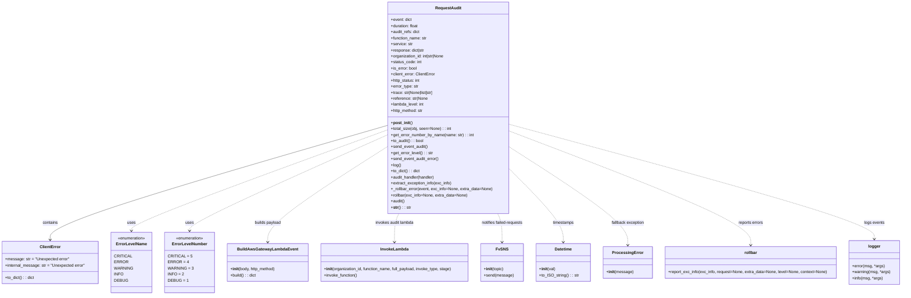

# Diagram: fv_core/fv_framework/python/fv_framework/utility/RequestAudit.py

> Auto-generated by Obscura crawlers

## Mermaid

### SVG

<svg id="container" width="3530.5078125" xmlns="http://www.w3.org/2000/svg" class="classDiagram" height="1170" viewBox="0 0 3530.5078125 1170" role="graphics-document document" aria-roledescription="class"><g><defs><marker id="container_class-aggregationStart" class="marker aggregation class" refX="18" refY="7" markerWidth="190" markerHeight="240" orient="auto"><path d="M 18,7 L9,13 L1,7 L9,1 Z"></path></marker></defs><defs><marker id="container_class-aggregationEnd" class="marker aggregation class" refX="1" refY="7" markerWidth="20" markerHeight="28" orient="auto"><path d="M 18,7 L9,13 L1,7 L9,1 Z"></path></marker></defs><defs><marker id="container_class-extensionStart" class="marker extension class" refX="18" refY="7" markerWidth="190" markerHeight="240" orient="auto"><path d="M 1,7 L18,13 V 1 Z"></path></marker></defs><defs><marker id="container_class-extensionEnd" class="marker extension class" refX="1" refY="7" markerWidth="20" markerHeight="28" orient="auto"><path d="M 1,1 V 13 L18,7 Z"></path></marker></defs><defs><marker id="container_class-compositionStart" class="marker composition class" refX="18" refY="7" markerWidth="190" markerHeight="240" orient="auto"><path d="M 18,7 L9,13 L1,7 L9,1 Z"></path></marker></defs><defs><marker id="container_class-compositionEnd" class="marker composition class" refX="1" refY="7" markerWidth="20" markerHeight="28" orient="auto"><path d="M 18,7 L9,13 L1,7 L9,1 Z"></path></marker></defs><defs><marker id="container_class-dependencyStart" class="marker dependency class" refX="6" refY="7" markerWidth="190" markerHeight="240" orient="auto"><path d="M 5,7 L9,13 L1,7 L9,1 Z"></path></marker></defs><defs><marker id="container_class-dependencyEnd" class="marker dependency class" refX="13" refY="7" markerWidth="20" markerHeight="28" orient="auto"><path d="M 18,7 L9,13 L14,7 L9,1 Z"></path></marker></defs><defs><marker id="container_class-lollipopStart" class="marker lollipop class" refX="13" refY="7" markerWidth="190" markerHeight="240" orient="auto"><circle stroke="black" fill="transparent" cx="7" cy="7" r="6"></circle></marker></defs><defs><marker id="container_class-lollipopEnd" class="marker lollipop class" refX="1" refY="7" markerWidth="190" markerHeight="240" orient="auto"><circle stroke="black" fill="transparent" cx="7" cy="7" r="6"></circle></marker></defs><g class="root"><g class="clusters"></g><g class="edgePaths"><path d="M1513.834,498.186L1294.716,562.655C1075.599,627.124,637.364,756.062,418.246,831.698C199.129,907.333,199.129,929.667,199.129,940.833L199.129,952" id="id_RequestAudit_ClientError_1" class="edge-thickness-normal edge-pattern-solid relation" style=";;;" data-edge="true" data-et="edge" data-id="id_RequestAudit_ClientError_1" data-points="W3sieCI6MTUxMy44MzM5ODQzNzUsInkiOjQ5OC4xODU2MDEwMjYwNzMxfSx7IngiOjE5OS4xMjg5MDYyNSwieSI6ODg1fSx7IngiOjE5OS4xMjg5MDYyNSwieSI6OTU4fV0=" marker-end="url(#container_class-dependencyEnd)"></path><path d="M1513.834,516.152L1347.479,577.627C1181.124,639.101,848.413,762.051,682.058,828.692C515.703,895.333,515.703,905.667,515.703,910.833L515.703,916" id="id_RequestAudit_ErrorLevelName_2" class="edge-thickness-normal edge-pattern-dashed relation" style=";;;" data-edge="true" data-et="edge" data-id="id_RequestAudit_ErrorLevelName_2" data-points="W3sieCI6MTUxMy44MzM5ODQzNzUsInkiOjUxNi4xNTIyNDc2MjY2NTg0fSx7IngiOjUxNS43MDMxMjUsInkiOjg4NX0seyJ4Ijo1MTUuNzAzMTI1LCJ5Ijo5MjJ9XQ==" marker-end="url(#container_class-dependencyEnd)"></path><path d="M1513.834,534.933L1383.679,593.278C1253.525,651.622,993.215,768.311,863.061,831.822C732.906,895.333,732.906,905.667,732.906,910.833L732.906,916" id="id_RequestAudit_ErrorLevelNumber_3" class="edge-thickness-normal edge-pattern-dashed relation" style=";;;" data-edge="true" data-et="edge" data-id="id_RequestAudit_ErrorLevelNumber_3" data-points="W3sieCI6MTUxMy44MzM5ODQzNzUsInkiOjUzNC45MzM0MzQ5OTkyNjI0fSx7IngiOjczMi45MDYyNSwieSI6ODg1fSx7IngiOjczMi45MDYyNSwieSI6OTIyfV0=" marker-end="url(#container_class-dependencyEnd)"></path><path d="M1513.834,579.836L1433.928,630.697C1354.022,681.558,1194.21,783.279,1114.304,846.806C1034.398,910.333,1034.398,935.667,1034.398,948.333L1034.398,961" id="id_RequestAudit_BuildAwsGatewayLambdaEvent_4" class="edge-thickness-normal edge-pattern-dashed relation" style=";;;" data-edge="true" data-et="edge" data-id="id_RequestAudit_BuildAwsGatewayLambdaEvent_4" data-points="W3sieCI6MTUxMy44MzM5ODQzNzUsInkiOjU3OS44MzY0Nzc1NDI1OTN9LHsieCI6MTAzNC4zOTg0Mzc1LCJ5Ijo4ODV9LHsieCI6MTAzNC4zOTg0Mzc1LCJ5Ijo5Njd9XQ==" marker-end="url(#container_class-dependencyEnd)"></path><path d="M1556.542,848L1553.666,854.167C1550.791,860.333,1545.04,872.667,1542.164,891.5C1539.289,910.333,1539.289,935.667,1539.289,948.333L1539.289,961" id="id_RequestAudit_InvokeLambda_5" class="edge-thickness-normal edge-pattern-dashed relation" style=";;;" data-edge="true" data-et="edge" data-id="id_RequestAudit_InvokeLambda_5" data-points="W3sieCI6MTU1Ni41NDE1NzEyMTg1NDUsInkiOjg0OH0seyJ4IjoxNTM5LjI4OTA2MjUsInkiOjg4NX0seyJ4IjoxNTM5LjI4OTA2MjUsInkiOjk2N31d" marker-end="url(#container_class-dependencyEnd)"></path><path d="M1948.22,848L1951.096,854.167C1953.971,860.333,1959.722,872.667,1962.597,891.5C1965.473,910.333,1965.473,935.667,1965.473,948.333L1965.473,961" id="id_RequestAudit_FvSNS_6" class="edge-thickness-normal edge-pattern-dashed relation" style=";;;" data-edge="true" data-et="edge" data-id="id_RequestAudit_FvSNS_6" data-points="W3sieCI6MTk0OC4yMjAxNDc1MzE0NTUsInkiOjg0OH0seyJ4IjoxOTY1LjQ3MjY1NjI1LCJ5Ijo4ODV9LHsieCI6MTk2NS40NzI2NTYyNSwieSI6OTY3fV0=" marker-end="url(#container_class-dependencyEnd)"></path><path d="M1990.928,670.137L2026.207,705.947C2061.487,741.758,2132.046,813.379,2167.326,861.856C2202.605,910.333,2202.605,935.667,2202.605,948.333L2202.605,961" id="id_RequestAudit_Datetime_7" class="edge-thickness-normal edge-pattern-dashed relation" style=";;;" data-edge="true" data-et="edge" data-id="id_RequestAudit_Datetime_7" data-points="W3sieCI6MTk5MC45Mjc3MzQzNzUsInkiOjY3MC4xMzY3NDU5ODE4MjMzfSx7IngiOjIyMDIuNjA1NDY4NzUsInkiOjg4NX0seyJ4IjoyMjAyLjYwNTQ2ODc1LCJ5Ijo5Njd9XQ==" marker-end="url(#container_class-dependencyEnd)"></path><path d="M1990.928,583.809L2067.783,634.007C2144.638,684.206,2298.348,784.603,2375.203,849.468C2452.059,914.333,2452.059,943.667,2452.059,958.333L2452.059,973" id="id_RequestAudit_ProcessingError_8" class="edge-thickness-normal edge-pattern-dashed relation" style=";;;" data-edge="true" data-et="edge" data-id="id_RequestAudit_ProcessingError_8" data-points="W3sieCI6MTk5MC45Mjc3MzQzNzUsInkiOjU4My44MDg3NjI0MDQ1NjY4fSx7IngiOjI0NTIuMDU4NTkzNzUsInkiOjg4NX0seyJ4IjoyNDUyLjA1ODU5Mzc1LCJ5Ijo5Nzl9XQ==" marker-end="url(#container_class-dependencyEnd)"></path><path d="M1990.928,520.185L2148.267,580.987C2305.605,641.79,2620.283,763.395,2777.622,838.864C2934.961,914.333,2934.961,943.667,2934.961,958.333L2934.961,973" id="id_RequestAudit_rollbar_9" class="edge-thickness-normal edge-pattern-dashed relation" style=";;;" data-edge="true" data-et="edge" data-id="id_RequestAudit_rollbar_9" data-points="W3sieCI6MTk5MC45Mjc3MzQzNzUsInkiOjUyMC4xODQ4MTE3NDQ3MTIxfSx7IngiOjI5MzQuOTYwOTM3NSwieSI6ODg1fSx7IngiOjI5MzQuOTYwOTM3NSwieSI6OTc5fV0=" marker-end="url(#container_class-dependencyEnd)"></path><path d="M1990.928,493.235L2229.692,558.529C2468.456,623.823,2945.984,754.412,3184.748,830.372C3423.512,906.333,3423.512,927.667,3423.512,938.333L3423.512,949" id="id_RequestAudit_logger_10" class="edge-thickness-normal edge-pattern-dashed relation" style=";;;" data-edge="true" data-et="edge" data-id="id_RequestAudit_logger_10" data-points="W3sieCI6MTk5MC45Mjc3MzQzNzUsInkiOjQ5My4yMzQ4MjA2Mzg2MjUzN30seyJ4IjozNDIzLjUxMTcxODc1LCJ5Ijo4ODV9LHsieCI6MzQyMy41MTE3MTg3NSwieSI6OTU1fV0=" marker-end="url(#container_class-dependencyEnd)"></path></g><g class="edgeLabels"><g class="edgeLabel" transform="translate(199.12890625, 885)"><g class="label" data-id="id_RequestAudit_ClientError_1" transform="translate(-30.890625, -12)"><foreignObject width="61.78125" height="24">

contains

</foreignObject></g></g><g class="edgeLabel" transform="translate(515.703125, 885)"><g class="label" data-id="id_RequestAudit_ErrorLevelName_2" transform="translate(-16.4921875, -12)"><foreignObject width="32.984375" height="24">

uses

</foreignObject></g></g><g class="edgeLabel" transform="translate(732.90625, 885)"><g class="label" data-id="id_RequestAudit_ErrorLevelNumber_3" transform="translate(-16.4921875, -12)"><foreignObject width="32.984375" height="24">

uses

</foreignObject></g></g><g class="edgeLabel" transform="translate(1034.3984375, 885)"><g class="label" data-id="id_RequestAudit_BuildAwsGatewayLambdaEvent_4" transform="translate(-53.484375, -12)"><foreignObject width="106.96875" height="24">

builds payload

</foreignObject></g></g><g class="edgeLabel" transform="translate(1539.2890625, 885)"><g class="label" data-id="id_RequestAudit_InvokeLambda_5" transform="translate(-78.1640625, -12)"><foreignObject width="156.328125" height="24">

invokes audit lambda

</foreignObject></g></g><g class="edgeLabel" transform="translate(1965.47265625, 885)"><g class="label" data-id="id_RequestAudit_FvSNS_6" transform="translate(-84.4765625, -12)"><foreignObject width="168.953125" height="24">

notifies failed-requests

</foreignObject></g></g><g class="edgeLabel" transform="translate(2202.60546875, 885)"><g class="label" data-id="id_RequestAudit_Datetime_7" transform="translate(-42.625, -12)"><foreignObject width="85.25" height="24">

timestamps

</foreignObject></g></g><g class="edgeLabel" transform="translate(2452.05859375, 885)"><g class="label" data-id="id_RequestAudit_ProcessingError_8" transform="translate(-65.90625, -12)"><foreignObject width="131.8125" height="24">

fallback exception

</foreignObject></g></g><g class="edgeLabel" transform="translate(2934.9609375, 885)"><g class="label" data-id="id_RequestAudit_rollbar_9" transform="translate(-50.140625, -12)"><foreignObject width="100.28125" height="24">

reports errors

</foreignObject></g></g><g class="edgeLabel" transform="translate(3423.51171875, 885)"><g class="label" data-id="id_RequestAudit_logger_10" transform="translate(-40.84375, -12)"><foreignObject width="81.6875" height="24">

logs events

</foreignObject></g></g></g><g class="nodes"><g class="node default" id="classId-ErrorLevelName-0" transform="translate(515.703125, 1042)"><g class="basic label-container"><path d="M-75.4453125 -120 L75.4453125 -120 L75.4453125 120 L-75.4453125 120" stroke="none" stroke-width="0" fill="#ECECFF" style=""></path><path d="M-75.4453125 -120 C-36.119584981070254 -120, 3.206142537859492 -120, 75.4453125 -120 M-75.4453125 -120 C-32.49418945298616 -120, 10.456933594027674 -120, 75.4453125 -120 M75.4453125 -120 C75.4453125 -56.29978927565369, 75.4453125 7.400421448692626, 75.4453125 120 M75.4453125 -120 C75.4453125 -30.410157113872216, 75.4453125 59.17968577225557, 75.4453125 120 M75.4453125 120 C35.13630603857187 120, -5.172700422856266 120, -75.4453125 120 M75.4453125 120 C15.387308585717093 120, -44.67069532856581 120, -75.4453125 120 M-75.4453125 120 C-75.4453125 35.49861899261792, -75.4453125 -49.00276201476416, -75.4453125 -120 M-75.4453125 120 C-75.4453125 32.26966044810625, -75.4453125 -55.4606791037875, -75.4453125 -120" stroke="#9370DB" stroke-width="1.3" fill="none" stroke-dasharray="0 0" style=""></path></g><g class="annotation-group text" transform="translate(-55.5546875, -96)"><g class="label" style="" transform="translate(0,-12)"><foreignObject width="111.109375" height="24">

«enumeration»

</foreignObject></g></g><g class="label-group text" transform="translate(-58.140625, -72)"><g class="label" style="font-weight: bolder" transform="translate(0,-12)"><foreignObject width="116.28125" height="24">

ErrorLevelName

</foreignObject></g></g><g class="members-group text" transform="translate(-63.4453125, -24)"><g class="label" style="" transform="translate(0,-12)"><foreignObject width="62.453125" height="24">

CRITICAL

</foreignObject></g><g class="label" style="" transform="translate(0,12)"><foreignObject width="48.53125" height="24">

ERROR

</foreignObject></g><g class="label" style="" transform="translate(0,36)"><foreignObject width="68.75" height="24">

WARNING

</foreignObject></g><g class="label" style="" transform="translate(0,60)"><foreignObject width="34.3125" height="24">

INFO

</foreignObject></g><g class="label" style="" transform="translate(0,84)"><foreignObject width="49.28125" height="24">

DEBUG

</foreignObject></g></g><g class="methods-group text" transform="translate(-63.4453125, 120)"></g><g class="divider" style=""><path d="M-75.4453125 -48 C-40.511034498727774 -48, -5.576756497455548 -48, 75.4453125 -48 M-75.4453125 -48 C-35.64044144355808 -48, 4.164429612883836 -48, 75.4453125 -48" stroke="#9370DB" stroke-width="1.3" fill="none" stroke-dasharray="0 0" style=""></path></g><g class="divider" style=""><path d="M-75.4453125 96 C-24.030923885345537 96, 27.383464729308926 96, 75.4453125 96 M-75.4453125 96 C-35.18312831106445 96, 5.079055877871099 96, 75.4453125 96" stroke="#9370DB" stroke-width="1.3" fill="none" stroke-dasharray="0 0" style=""></path></g></g><g class="node default" id="classId-ErrorLevelNumber-1" transform="translate(732.90625, 1042)"><g class="basic label-container"><path d="M-91.7578125 -120 L91.7578125 -120 L91.7578125 120 L-91.7578125 120" stroke="none" stroke-width="0" fill="#ECECFF" style=""></path><path d="M-91.7578125 -120 C-38.85931164494807 -120, 14.039189210103856 -120, 91.7578125 -120 M-91.7578125 -120 C-29.082362021762464 -120, 33.59308845647507 -120, 91.7578125 -120 M91.7578125 -120 C91.7578125 -45.2717128803224, 91.7578125 29.456574239355206, 91.7578125 120 M91.7578125 -120 C91.7578125 -32.74921632268041, 91.7578125 54.50156735463918, 91.7578125 120 M91.7578125 120 C44.04618364921892 120, -3.6654452015621644 120, -91.7578125 120 M91.7578125 120 C25.412142274597002 120, -40.933527950805995 120, -91.7578125 120 M-91.7578125 120 C-91.7578125 67.49122693569662, -91.7578125 14.982453871393233, -91.7578125 -120 M-91.7578125 120 C-91.7578125 66.567470161189, -91.7578125 13.134940322377972, -91.7578125 -120" stroke="#9370DB" stroke-width="1.3" fill="none" stroke-dasharray="0 0" style=""></path></g><g class="annotation-group text" transform="translate(-55.5546875, -96)"><g class="label" style="" transform="translate(0,-12)"><foreignObject width="111.109375" height="24">

«enumeration»

</foreignObject></g></g><g class="label-group text" transform="translate(-66.3125, -72)"><g class="label" style="font-weight: bolder" transform="translate(0,-12)"><foreignObject width="132.625" height="24">

ErrorLevelNumber

</foreignObject></g></g><g class="members-group text" transform="translate(-79.7578125, -24)"><g class="label" style="" transform="translate(0,-12)"><foreignObject width="86.953125" height="24">

CRITICAL = 5

</foreignObject></g><g class="label" style="" transform="translate(0,12)"><foreignObject width="73.53125" height="24">

ERROR = 4

</foreignObject></g><g class="label" style="" transform="translate(0,36)"><foreignObject width="93.203125" height="24">

WARNING = 3

</foreignObject></g><g class="label" style="" transform="translate(0,60)"><foreignObject width="58.71875" height="24">

INFO = 2

</foreignObject></g><g class="label" style="" transform="translate(0,84)"><foreignObject width="72.703125" height="24">

DEBUG = 1

</foreignObject></g></g><g class="methods-group text" transform="translate(-79.7578125, 120)"></g><g class="divider" style=""><path d="M-91.7578125 -48 C-26.096491001059874 -48, 39.56483049788025 -48, 91.7578125 -48 M-91.7578125 -48 C-38.96399839378133 -48, 13.829815712437338 -48, 91.7578125 -48" stroke="#9370DB" stroke-width="1.3" fill="none" stroke-dasharray="0 0" style=""></path></g><g class="divider" style=""><path d="M-91.7578125 96 C-28.126556014651264 96, 35.50470047069747 96, 91.7578125 96 M-91.7578125 96 C-38.13837363183474 96, 15.481065236330522 96, 91.7578125 96" stroke="#9370DB" stroke-width="1.3" fill="none" stroke-dasharray="0 0" style=""></path></g></g><g class="node default" id="classId-ClientError-2" transform="translate(199.12890625, 1042)"><g class="basic label-container"><path d="M-191.12890625 -84 L191.12890625 -84 L191.12890625 84 L-191.12890625 84" stroke="none" stroke-width="0" fill="#ECECFF" style=""></path><path d="M-191.12890625 -84 C-41.92331877132213 -84, 107.28226870735574 -84, 191.12890625 -84 M-191.12890625 -84 C-81.92954103691288 -84, 27.26982417617424 -84, 191.12890625 -84 M191.12890625 -84 C191.12890625 -21.279014230962858, 191.12890625 41.441971538074284, 191.12890625 84 M191.12890625 -84 C191.12890625 -17.834537025358543, 191.12890625 48.330925949282914, 191.12890625 84 M191.12890625 84 C51.14783601019769 84, -88.83323422960461 84, -191.12890625 84 M191.12890625 84 C50.16355079967312 84, -90.80180465065376 84, -191.12890625 84 M-191.12890625 84 C-191.12890625 29.583344503848082, -191.12890625 -24.833310992303836, -191.12890625 -84 M-191.12890625 84 C-191.12890625 33.39291003318807, -191.12890625 -17.214179933623853, -191.12890625 -84" stroke="#9370DB" stroke-width="1.3" fill="none" stroke-dasharray="0 0" style=""></path></g><g class="annotation-group text" transform="translate(0, -60)"></g><g class="label-group text" transform="translate(-39.4609375, -60)"><g class="label" style="font-weight: bolder" transform="translate(0,-12)"><foreignObject width="78.921875" height="24">

ClientError

</foreignObject></g></g><g class="members-group text" transform="translate(-179.12890625, -12)"><g class="label" style="" transform="translate(0,-12)"><foreignObject width="253.546875" height="24">

+message: str = "Unexpected error"

</foreignObject></g><g class="label" style="" transform="translate(0,12)"><foreignObject width="318.796875" height="24">

+internal_message: str = "Unexpected error"

</foreignObject></g></g><g class="methods-group text" transform="translate(-179.12890625, 60)"><g class="label" style="" transform="translate(0,-12)"><foreignObject width="116.25" height="24">

+to_dict() : : dict

</foreignObject></g></g><g class="divider" style=""><path d="M-191.12890625 -36 C-52.0289902935109 -36, 87.0709256629782 -36, 191.12890625 -36 M-191.12890625 -36 C-66.2167318947364 -36, 58.695442460527204 -36, 191.12890625 -36" stroke="#9370DB" stroke-width="1.3" fill="none" stroke-dasharray="0 0" style=""></path></g><g class="divider" style=""><path d="M-191.12890625 36 C-72.8662708689329 36, 45.3963645121342 36, 191.12890625 36 M-191.12890625 36 C-89.21475791789538 36, 12.699390414209233 36, 191.12890625 36" stroke="#9370DB" stroke-width="1.3" fill="none" stroke-dasharray="0 0" style=""></path></g></g><g class="node default" id="classId-RequestAudit-3" transform="translate(1752.380859375, 428)"><g class="basic label-container"><path d="M-238.546875 -420 L238.546875 -420 L238.546875 420 L-238.546875 420" stroke="none" stroke-width="0" fill="#ECECFF" style=""></path><path d="M-238.546875 -420 C-94.42635659686772 -420, 49.69416180626456 -420, 238.546875 -420 M-238.546875 -420 C-62.49637333725104 -420, 113.55412832549791 -420, 238.546875 -420 M238.546875 -420 C238.546875 -147.85660974273736, 238.546875 124.28678051452528, 238.546875 420 M238.546875 -420 C238.546875 -180.98226258596787, 238.546875 58.03547482806425, 238.546875 420 M238.546875 420 C70.40608824039555 420, -97.7346985192089 420, -238.546875 420 M238.546875 420 C88.48941014606598 420, -61.56805470786804 420, -238.546875 420 M-238.546875 420 C-238.546875 117.79882897698906, -238.546875 -184.4023420460219, -238.546875 -420 M-238.546875 420 C-238.546875 150.3350061214602, -238.546875 -119.3299877570796, -238.546875 -420" stroke="#9370DB" stroke-width="1.3" fill="none" stroke-dasharray="0 0" style=""></path></g><g class="annotation-group text" transform="translate(0, -396)"></g><g class="label-group text" transform="translate(-49.421875, -396)"><g class="label" style="font-weight: bolder" transform="translate(0,-12)"><foreignObject width="98.84375" height="24">

RequestAudit

</foreignObject></g></g><g class="members-group text" transform="translate(-226.546875, -348)"><g class="label" style="" transform="translate(0,-12)"><foreignObject width="83.96875" height="24">

+event: dict

</foreignObject></g><g class="label" style="" transform="translate(0,12)"><foreignObject width="111.34375" height="24">

+duration: float

</foreignObject></g><g class="label" style="" transform="translate(0,36)"><foreignObject width="116.703125" height="24">

+audit_refs: dict

</foreignObject></g><g class="label" style="" transform="translate(0,60)"><foreignObject width="144.796875" height="24">

+function_name: str

</foreignObject></g><g class="label" style="" transform="translate(0,84)"><foreignObject width="86.296875" height="24">

+service: str

</foreignObject></g><g class="label" style="" transform="translate(0,108)"><foreignObject width="135.75" height="24">

+response: dict|str

</foreignObject></g><g class="label" style="" transform="translate(0,132)"><foreignObject width="219.171875" height="24">

+organization_id: int|str|None

</foreignObject></g><g class="label" style="" transform="translate(0,156)"><foreignObject width="122.78125" height="24">

+status_code: int

</foreignObject></g><g class="label" style="" transform="translate(0,180)"><foreignObject width="104.890625" height="24">

+is_error: bool

</foreignObject></g><g class="label" style="" transform="translate(0,204)"><foreignObject width="178.734375" height="24">

+client_error: ClientError

</foreignObject></g><g class="label" style="" transform="translate(0,228)"><foreignObject width="118.5625" height="24">

+http_status: int

</foreignObject></g><g class="label" style="" transform="translate(0,252)"><foreignObject width="110.125" height="24">

+error_type: str

</foreignObject></g><g class="label" style="" transform="translate(0,276)"><foreignObject width="175" height="24">

+trace: str|None|list[str]

</foreignObject></g><g class="label" style="" transform="translate(0,300)"><foreignObject width="148.484375" height="24">

+reference: str|None

</foreignObject></g><g class="label" style="" transform="translate(0,324)"><foreignObject width="133.34375" height="24">

+lambda_level: int

</foreignObject></g><g class="label" style="" transform="translate(0,348)"><foreignObject width="130.421875" height="24">

+http_method: str

</foreignObject></g></g><g class="methods-group text" transform="translate(-226.546875, 60)"><g class="label" style="" transform="translate(0,-12)"><foreignObject width="83.921875" height="24">

+<strong>post_init</strong>()

</foreignObject></g><g class="label" style="" transform="translate(0,12)"><foreignObject width="240.09375" height="24">

+total_size(obj, seen=None) : : int

</foreignObject></g><g class="label" style="" transform="translate(0,36)"><foreignObject width="329.65625" height="24">

+get_error_number_by_name(name: str) : : int

</foreignObject></g><g class="label" style="" transform="translate(0,60)"><foreignObject width="131.984375" height="24">

+to_audit() : : bool

</foreignObject></g><g class="label" style="" transform="translate(0,84)"><foreignObject width="147.703125" height="24">

+send_event_audit()

</foreignObject></g><g class="label" style="" transform="translate(0,108)"><foreignObject width="166.21875" height="24">

+get_error_level() : : str

</foreignObject></g><g class="label" style="" transform="translate(0,132)"><foreignObject width="191.8125" height="24">

+send_event_audit_error()

</foreignObject></g><g class="label" style="" transform="translate(0,156)"><foreignObject width="40.625" height="24">

+log()

</foreignObject></g><g class="label" style="" transform="translate(0,180)"><foreignObject width="116.25" height="24">

+to_dict() : : dict

</foreignObject></g><g class="label" style="" transform="translate(0,204)"><foreignObject width="177.375" height="24">

+audit_handler(handler)

</foreignObject></g><g class="label" style="" transform="translate(0,228)"><foreignObject width="244.3125" height="24">

+extract_exception_info(exc_info)

</foreignObject></g><g class="label" style="" transform="translate(0,252)"><foreignObject width="403.671875" height="24">

+_rollbar_error(event, exc_info=None, extra_data=None)

</foreignObject></g><g class="label" style="" transform="translate(0,276)"><foreignObject width="305.328125" height="24">

+rollbar(exc_info=None, extra_data=None)

</foreignObject></g><g class="label" style="" transform="translate(0,300)"><foreignObject width="55.984375" height="24">

+audit()

</foreignObject></g><g class="label" style="" transform="translate(0,324)"><foreignObject width="78.515625" height="24">

+<strong>str</strong>() : : str

</foreignObject></g></g><g class="divider" style=""><path d="M-238.546875 -372 C-98.9989940950648 -372, 40.548886809870396 -372, 238.546875 -372 M-238.546875 -372 C-67.27658529330444 -372, 103.99370441339113 -372, 238.546875 -372" stroke="#9370DB" stroke-width="1.3" fill="none" stroke-dasharray="0 0" style=""></path></g><g class="divider" style=""><path d="M-238.546875 36 C-65.80710226143563 36, 106.93267047712874 36, 238.546875 36 M-238.546875 36 C-51.84348432932629 36, 134.85990634134743 36, 238.546875 36" stroke="#9370DB" stroke-width="1.3" fill="none" stroke-dasharray="0 0" style=""></path></g></g><g class="node default" id="classId-BuildAwsGatewayLambdaEvent-4" transform="translate(1034.3984375, 1042)"><g class="basic label-container"><path d="M-159.734375 -75 L159.734375 -75 L159.734375 75 L-159.734375 75" stroke="none" stroke-width="0" fill="#ECECFF" style=""></path><path d="M-159.734375 -75 C-79.04672586963858 -75, 1.6409232607228432 -75, 159.734375 -75 M-159.734375 -75 C-35.06736312221054 -75, 89.59964875557893 -75, 159.734375 -75 M159.734375 -75 C159.734375 -32.907252305884796, 159.734375 9.185495388230407, 159.734375 75 M159.734375 -75 C159.734375 -36.90294542617756, 159.734375 1.1941091476448804, 159.734375 75 M159.734375 75 C58.16104801692782 75, -43.412278966144356 75, -159.734375 75 M159.734375 75 C68.63097797457405 75, -22.472419050851897 75, -159.734375 75 M-159.734375 75 C-159.734375 37.401843869695526, -159.734375 -0.19631226060894846, -159.734375 -75 M-159.734375 75 C-159.734375 35.556316702805276, -159.734375 -3.887366594389448, -159.734375 -75" stroke="#9370DB" stroke-width="1.3" fill="none" stroke-dasharray="0 0" style=""></path></g><g class="annotation-group text" transform="translate(0, -51)"></g><g class="label-group text" transform="translate(-114.015625, -51)"><g class="label" style="font-weight: bolder" transform="translate(0,-12)"><foreignObject width="228.03125" height="24">

BuildAwsGatewayLambdaEvent

</foreignObject></g></g><g class="members-group text" transform="translate(-147.734375, -3)"></g><g class="methods-group text" transform="translate(-147.734375, 27)"><g class="label" style="" transform="translate(0,-12)"><foreignObject width="181.453125" height="24">

+<strong>init</strong>(body, http_method)

</foreignObject></g><g class="label" style="" transform="translate(0,12)"><foreignObject width="103.765625" height="24">

+build() : : dict

</foreignObject></g></g><g class="divider" style=""><path d="M-159.734375 -27 C-53.07880868746692 -27, 53.576757625066165 -27, 159.734375 -27 M-159.734375 -27 C-59.96369994600944 -27, 39.80697510798112 -27, 159.734375 -27" stroke="#9370DB" stroke-width="1.3" fill="none" stroke-dasharray="0 0" style=""></path></g><g class="divider" style=""><path d="M-159.734375 -3 C-71.55911909335558 -3, 16.616136813288847 -3, 159.734375 -3 M-159.734375 -3 C-64.17344051442338 -3, 31.387493971153248 -3, 159.734375 -3" stroke="#9370DB" stroke-width="1.3" fill="none" stroke-dasharray="0 0" style=""></path></g></g><g class="node default" id="classId-InvokeLambda-5" transform="translate(1539.2890625, 1042)"><g class="basic label-container"><path d="M-295.15625 -75 L295.15625 -75 L295.15625 75 L-295.15625 75" stroke="none" stroke-width="0" fill="#ECECFF" style=""></path><path d="M-295.15625 -75 C-145.0368499794086 -75, 5.082550041182799 -75, 295.15625 -75 M-295.15625 -75 C-144.70544370220986 -75, 5.745362595580275 -75, 295.15625 -75 M295.15625 -75 C295.15625 -24.11846277041635, 295.15625 26.7630744591673, 295.15625 75 M295.15625 -75 C295.15625 -22.21251556298109, 295.15625 30.574968874037822, 295.15625 75 M295.15625 75 C159.59182452499954 75, 24.027399049999076 75, -295.15625 75 M295.15625 75 C116.62566524983072 75, -61.904919500338565 75, -295.15625 75 M-295.15625 75 C-295.15625 37.178238057540504, -295.15625 -0.6435238849189915, -295.15625 -75 M-295.15625 75 C-295.15625 42.85872647327418, -295.15625 10.717452946548363, -295.15625 -75" stroke="#9370DB" stroke-width="1.3" fill="none" stroke-dasharray="0 0" style=""></path></g><g class="annotation-group text" transform="translate(0, -51)"></g><g class="label-group text" transform="translate(-53.484375, -51)"><g class="label" style="font-weight: bolder" transform="translate(0,-12)"><foreignObject width="106.96875" height="24">

InvokeLambda

</foreignObject></g></g><g class="members-group text" transform="translate(-283.15625, -3)"></g><g class="methods-group text" transform="translate(-283.15625, 27)"><g class="label" style="" transform="translate(0,-12)"><foreignObject width="512.828125" height="24">

+<strong>init</strong>(organization_id, function_name, full_payload, invoke_type, stage)

</foreignObject></g><g class="label" style="" transform="translate(0,12)"><foreignObject width="134.4375" height="24">

+invoke_function()

</foreignObject></g></g><g class="divider" style=""><path d="M-295.15625 -27 C-155.7668011550529 -27, -16.377352310105778 -27, 295.15625 -27 M-295.15625 -27 C-96.62962965698384 -27, 101.89699068603232 -27, 295.15625 -27" stroke="#9370DB" stroke-width="1.3" fill="none" stroke-dasharray="0 0" style=""></path></g><g class="divider" style=""><path d="M-295.15625 -3 C-86.51037884364553 -3, 122.13549231270895 -3, 295.15625 -3 M-295.15625 -3 C-173.55852593385168 -3, -51.96080186770337 -3, 295.15625 -3" stroke="#9370DB" stroke-width="1.3" fill="none" stroke-dasharray="0 0" style=""></path></g></g><g class="node default" id="classId-FvSNS-6" transform="translate(1965.47265625, 1042)"><g class="basic label-container"><path d="M-81.02734375 -75 L81.02734375 -75 L81.02734375 75 L-81.02734375 75" stroke="none" stroke-width="0" fill="#ECECFF" style=""></path><path d="M-81.02734375 -75 C-34.21865596907647 -75, 12.590031811847055 -75, 81.02734375 -75 M-81.02734375 -75 C-16.891291221574605 -75, 47.24476130685079 -75, 81.02734375 -75 M81.02734375 -75 C81.02734375 -28.713811003932186, 81.02734375 17.57237799213563, 81.02734375 75 M81.02734375 -75 C81.02734375 -27.918673381044584, 81.02734375 19.16265323791083, 81.02734375 75 M81.02734375 75 C27.155348521382074 75, -26.716646707235853 75, -81.02734375 75 M81.02734375 75 C23.437034600775405 75, -34.15327454844919 75, -81.02734375 75 M-81.02734375 75 C-81.02734375 42.74452530954754, -81.02734375 10.489050619095082, -81.02734375 -75 M-81.02734375 75 C-81.02734375 26.393026408168552, -81.02734375 -22.213947183662896, -81.02734375 -75" stroke="#9370DB" stroke-width="1.3" fill="none" stroke-dasharray="0 0" style=""></path></g><g class="annotation-group text" transform="translate(0, -51)"></g><g class="label-group text" transform="translate(-22.1796875, -51)"><g class="label" style="font-weight: bolder" transform="translate(0,-12)"><foreignObject width="44.359375" height="24">

FvSNS

</foreignObject></g></g><g class="members-group text" transform="translate(-69.02734375, -3)"></g><g class="methods-group text" transform="translate(-69.02734375, 27)"><g class="label" style="" transform="translate(0,-12)"><foreignObject width="79.34375" height="24">

+<strong>init</strong>(topic)

</foreignObject></g><g class="label" style="" transform="translate(0,12)"><foreignObject width="115.875" height="24">

+send(message)

</foreignObject></g></g><g class="divider" style=""><path d="M-81.02734375 -27 C-44.26197485142052 -27, -7.496605952841037 -27, 81.02734375 -27 M-81.02734375 -27 C-30.05925795245534 -27, 20.90882784508932 -27, 81.02734375 -27" stroke="#9370DB" stroke-width="1.3" fill="none" stroke-dasharray="0 0" style=""></path></g><g class="divider" style=""><path d="M-81.02734375 -3 C-27.755032871772272 -3, 25.517278006455456 -3, 81.02734375 -3 M-81.02734375 -3 C-27.2350227518197 -3, 26.557298246360602 -3, 81.02734375 -3" stroke="#9370DB" stroke-width="1.3" fill="none" stroke-dasharray="0 0" style=""></path></g></g><g class="node default" id="classId-Datetime-7" transform="translate(2202.60546875, 1042)"><g class="basic label-container"><path d="M-106.10546875 -75 L106.10546875 -75 L106.10546875 75 L-106.10546875 75" stroke="none" stroke-width="0" fill="#ECECFF" style=""></path><path d="M-106.10546875 -75 C-38.371807162004075 -75, 29.36185442599185 -75, 106.10546875 -75 M-106.10546875 -75 C-50.09802523683475 -75, 5.9094182763304985 -75, 106.10546875 -75 M106.10546875 -75 C106.10546875 -38.047772084518044, 106.10546875 -1.0955441690360885, 106.10546875 75 M106.10546875 -75 C106.10546875 -31.866399883721407, 106.10546875 11.267200232557187, 106.10546875 75 M106.10546875 75 C42.46295037442068 75, -21.179568001158643 75, -106.10546875 75 M106.10546875 75 C54.66638576898888 75, 3.227302787977763 75, -106.10546875 75 M-106.10546875 75 C-106.10546875 44.97956883582005, -106.10546875 14.9591376716401, -106.10546875 -75 M-106.10546875 75 C-106.10546875 35.03479421715789, -106.10546875 -4.930411565684224, -106.10546875 -75" stroke="#9370DB" stroke-width="1.3" fill="none" stroke-dasharray="0 0" style=""></path></g><g class="annotation-group text" transform="translate(0, -51)"></g><g class="label-group text" transform="translate(-33.3984375, -51)"><g class="label" style="font-weight: bolder" transform="translate(0,-12)"><foreignObject width="66.796875" height="24">

Datetime

</foreignObject></g></g><g class="members-group text" transform="translate(-94.10546875, -3)"></g><g class="methods-group text" transform="translate(-94.10546875, 27)"><g class="label" style="" transform="translate(0,-12)"><foreignObject width="63.640625" height="24">

+<strong>init</strong>(val)

</foreignObject></g><g class="label" style="" transform="translate(0,12)"><foreignObject width="154.8125" height="24">

+to_ISO_string() : : str

</foreignObject></g></g><g class="divider" style=""><path d="M-106.10546875 -27 C-62.02609212600912 -27, -17.946715502018236 -27, 106.10546875 -27 M-106.10546875 -27 C-52.06254429718874 -27, 1.9803801556225267 -27, 106.10546875 -27" stroke="#9370DB" stroke-width="1.3" fill="none" stroke-dasharray="0 0" style=""></path></g><g class="divider" style=""><path d="M-106.10546875 -3 C-50.62589043326977 -3, 4.853687883460466 -3, 106.10546875 -3 M-106.10546875 -3 C-43.568808318479356 -3, 18.96785211304129 -3, 106.10546875 -3" stroke="#9370DB" stroke-width="1.3" fill="none" stroke-dasharray="0 0" style=""></path></g></g><g class="node default" id="classId-ProcessingError-8" transform="translate(2452.05859375, 1042)"><g class="basic label-container"><path d="M-93.34765625 -63 L93.34765625 -63 L93.34765625 63 L-93.34765625 63" stroke="none" stroke-width="0" fill="#ECECFF" style=""></path><path d="M-93.34765625 -63 C-27.88774166913207 -63, 37.57217291173586 -63, 93.34765625 -63 M-93.34765625 -63 C-54.408127620994925 -63, -15.46859899198985 -63, 93.34765625 -63 M93.34765625 -63 C93.34765625 -18.48065980594226, 93.34765625 26.03868038811548, 93.34765625 63 M93.34765625 -63 C93.34765625 -22.28603028308217, 93.34765625 18.42793943383566, 93.34765625 63 M93.34765625 63 C43.611016859033406 63, -6.125622531933189 63, -93.34765625 63 M93.34765625 63 C43.60352646458168 63, -6.140603320836647 63, -93.34765625 63 M-93.34765625 63 C-93.34765625 23.67115569380529, -93.34765625 -15.657688612389421, -93.34765625 -63 M-93.34765625 63 C-93.34765625 33.01238588766703, -93.34765625 3.0247717753340595, -93.34765625 -63" stroke="#9370DB" stroke-width="1.3" fill="none" stroke-dasharray="0 0" style=""></path></g><g class="annotation-group text" transform="translate(0, -39)"></g><g class="label-group text" transform="translate(-57.5078125, -39)"><g class="label" style="font-weight: bolder" transform="translate(0,-12)"><foreignObject width="115.015625" height="24">

ProcessingError

</foreignObject></g></g><g class="members-group text" transform="translate(-81.34765625, 9)"></g><g class="methods-group text" transform="translate(-81.34765625, 39)"><g class="label" style="" transform="translate(0,-12)"><foreignObject width="105.1875" height="24">

+<strong>init</strong>(message)

</foreignObject></g></g><g class="divider" style=""><path d="M-93.34765625 -15 C-41.70713400795754 -15, 9.933388234084916 -15, 93.34765625 -15 M-93.34765625 -15 C-38.49684068264538 -15, 16.353974884709245 -15, 93.34765625 -15" stroke="#9370DB" stroke-width="1.3" fill="none" stroke-dasharray="0 0" style=""></path></g><g class="divider" style=""><path d="M-93.34765625 9 C-34.3901151608528 9, 24.567425928294398 9, 93.34765625 9 M-93.34765625 9 C-54.57459650504121 9, -15.801536760082413 9, 93.34765625 9" stroke="#9370DB" stroke-width="1.3" fill="none" stroke-dasharray="0 0" style=""></path></g></g><g class="node default" id="classId-rollbar-9" transform="translate(2934.9609375, 1042)"><g class="basic label-container"><path d="M-339.5546875 -63 L339.5546875 -63 L339.5546875 63 L-339.5546875 63" stroke="none" stroke-width="0" fill="#ECECFF" style=""></path><path d="M-339.5546875 -63 C-144.80053535829396 -63, 49.95361678341209 -63, 339.5546875 -63 M-339.5546875 -63 C-200.25782137561066 -63, -60.96095525122132 -63, 339.5546875 -63 M339.5546875 -63 C339.5546875 -21.917415069115705, 339.5546875 19.16516986176859, 339.5546875 63 M339.5546875 -63 C339.5546875 -15.488278344086204, 339.5546875 32.02344331182759, 339.5546875 63 M339.5546875 63 C73.60391288761878 63, -192.34686172476245 63, -339.5546875 63 M339.5546875 63 C111.61359501219798 63, -116.32749747560405 63, -339.5546875 63 M-339.5546875 63 C-339.5546875 13.10664145385023, -339.5546875 -36.78671709229954, -339.5546875 -63 M-339.5546875 63 C-339.5546875 14.309272090688964, -339.5546875 -34.38145581862207, -339.5546875 -63" stroke="#9370DB" stroke-width="1.3" fill="none" stroke-dasharray="0 0" style=""></path></g><g class="annotation-group text" transform="translate(0, -39)"></g><g class="label-group text" transform="translate(-24.6875, -39)"><g class="label" style="font-weight: bolder" transform="translate(0,-12)"><foreignObject width="49.375" height="24">

rollbar

</foreignObject></g></g><g class="members-group text" transform="translate(-327.5546875, 9)"></g><g class="methods-group text" transform="translate(-327.5546875, 39)"><g class="label" style="" transform="translate(0,-12)"><foreignObject width="630.421875" height="24">

+report_exc_info(exc_info, request=None, extra_data=None, level=None, context=None)

</foreignObject></g></g><g class="divider" style=""><path d="M-339.5546875 -15 C-189.65034691554348 -15, -39.74600633108696 -15, 339.5546875 -15 M-339.5546875 -15 C-142.54225642641512 -15, 54.470174647169756 -15, 339.5546875 -15" stroke="#9370DB" stroke-width="1.3" fill="none" stroke-dasharray="0 0" style=""></path></g><g class="divider" style=""><path d="M-339.5546875 9 C-140.90459269934212 9, 57.745502101315765 9, 339.5546875 9 M-339.5546875 9 C-175.929039914354 9, -12.303392328708014 9, 339.5546875 9" stroke="#9370DB" stroke-width="1.3" fill="none" stroke-dasharray="0 0" style=""></path></g></g><g class="node default" id="classId-logger-10" transform="translate(3423.51171875, 1042)"><g class="basic label-container"><path d="M-98.99609375 -87 L98.99609375 -87 L98.99609375 87 L-98.99609375 87" stroke="none" stroke-width="0" fill="#ECECFF" style=""></path><path d="M-98.99609375 -87 C-44.268711605418694 -87, 10.458670539162611 -87, 98.99609375 -87 M-98.99609375 -87 C-29.481594736914985 -87, 40.03290427617003 -87, 98.99609375 -87 M98.99609375 -87 C98.99609375 -49.10532679634787, 98.99609375 -11.210653592695735, 98.99609375 87 M98.99609375 -87 C98.99609375 -40.74971852571384, 98.99609375 5.500562948572323, 98.99609375 87 M98.99609375 87 C21.986698016531435 87, -55.02269771693713 87, -98.99609375 87 M98.99609375 87 C48.833788241529305 87, -1.3285172669413896 87, -98.99609375 87 M-98.99609375 87 C-98.99609375 43.228932523635, -98.99609375 -0.5421349527299952, -98.99609375 -87 M-98.99609375 87 C-98.99609375 34.43573793111561, -98.99609375 -18.12852413776878, -98.99609375 -87" stroke="#9370DB" stroke-width="1.3" fill="none" stroke-dasharray="0 0" style=""></path></g><g class="annotation-group text" transform="translate(0, -63)"></g><g class="label-group text" transform="translate(-23.2734375, -63)"><g class="label" style="font-weight: bolder" transform="translate(0,-12)"><foreignObject width="46.546875" height="24">

logger

</foreignObject></g></g><g class="members-group text" transform="translate(-86.99609375, -15)"></g><g class="methods-group text" transform="translate(-86.99609375, 15)"><g class="label" style="" transform="translate(0,-12)"><foreignObject width="129.078125" height="24">

+error(msg, *args)

</foreignObject></g><g class="label" style="" transform="translate(0,12)"><foreignObject width="150.71875" height="24">

+warning(msg, *args)

</foreignObject></g><g class="label" style="" transform="translate(0,36)"><foreignObject width="121.40625" height="24">

+info(msg, *args)

</foreignObject></g></g><g class="divider" style=""><path d="M-98.99609375 -39 C-35.55526559205215 -39, 27.885562565895697 -39, 98.99609375 -39 M-98.99609375 -39 C-53.335801526248844 -39, -7.675509302497687 -39, 98.99609375 -39" stroke="#9370DB" stroke-width="1.3" fill="none" stroke-dasharray="0 0" style=""></path></g><g class="divider" style=""><path d="M-98.99609375 -15 C-20.658602575433605 -15, 57.67888859913279 -15, 98.99609375 -15 M-98.99609375 -15 C-47.134948502798835 -15, 4.72619674440233 -15, 98.99609375 -15" stroke="#9370DB" stroke-width="1.3" fill="none" stroke-dasharray="0 0" style=""></path></g></g></g></g></g></svg>
