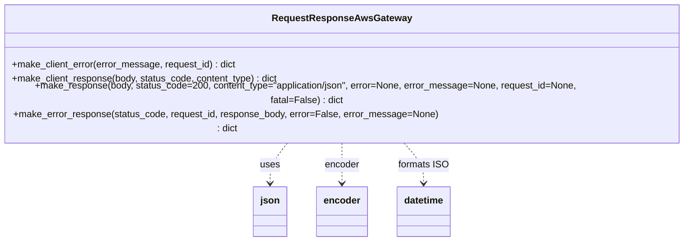

# Diagram: fv_core/fv_framework/python/fv_framework/utility/Response.py


> Auto-generated by Obscura crawlers

## Diagram 1



### SVG

<svg id="container" width="1197.59375" xmlns="http://www.w3.org/2000/svg" class="classDiagram" height="372" viewBox="0 0 1197.59375 372" role="graphics-document document" aria-roledescription="class"><style>#container{font-family:"trebuchet ms",verdana,arial,sans-serif;font-size:16px;fill:#333;}@keyframes edge-animation-frame{from{stroke-dashoffset:0;}}@keyframes dash{to{stroke-dashoffset:0;}}#container .edge-animation-slow{stroke-dasharray:9,5!important;stroke-dashoffset:900;animation:dash 50s linear infinite;stroke-linecap:round;}#container .edge-animation-fast{stroke-dasharray:9,5!important;stroke-dashoffset:900;animation:dash 20s linear infinite;stroke-linecap:round;}#container .error-icon{fill:#552222;}#container .error-text{fill:#552222;stroke:#552222;}#container .edge-thickness-normal{stroke-width:1px;}#container .edge-thickness-thick{stroke-width:3.5px;}#container .edge-pattern-solid{stroke-dasharray:0;}#container .edge-thickness-invisible{stroke-width:0;fill:none;}#container .edge-pattern-dashed{stroke-dasharray:3;}#container .edge-pattern-dotted{stroke-dasharray:2;}#container .marker{fill:#333333;stroke:#333333;}#container .marker.cross{stroke:#333333;}#container svg{font-family:"trebuchet ms",verdana,arial,sans-serif;font-size:16px;}#container p{margin:0;}#container g.classGroup text{fill:#9370DB;stroke:none;font-family:"trebuchet ms",verdana,arial,sans-serif;font-size:10px;}#container g.classGroup text .title{font-weight:bolder;}#container .nodeLabel,#container .edgeLabel{color:#131300;}#container .edgeLabel .label rect{fill:#ECECFF;}#container .label text{fill:#131300;}#container .labelBkg{background:#ECECFF;}#container .edgeLabel .label span{background:#ECECFF;}#container .classTitle{font-weight:bolder;}#container .node rect,#container .node circle,#container .node ellipse,#container .node polygon,#container .node path{fill:#ECECFF;stroke:#9370DB;stroke-width:1px;}#container .divider{stroke:#9370DB;stroke-width:1;}#container g.clickable{cursor:pointer;}#container g.classGroup rect{fill:#ECECFF;stroke:#9370DB;}#container g.classGroup line{stroke:#9370DB;stroke-width:1;}#container .classLabel .box{stroke:none;stroke-width:0;fill:#ECECFF;opacity:0.5;}#container .classLabel .label{fill:#9370DB;font-size:10px;}#container .relation{stroke:#333333;stroke-width:1;fill:none;}#container .dashed-line{stroke-dasharray:3;}#container .dotted-line{stroke-dasharray:1 2;}#container #compositionStart,#container .composition{fill:#333333!important;stroke:#333333!important;stroke-width:1;}#container #compositionEnd,#container .composition{fill:#333333!important;stroke:#333333!important;stroke-width:1;}#container #dependencyStart,#container .dependency{fill:#333333!important;stroke:#333333!important;stroke-width:1;}#container #dependencyStart,#container .dependency{fill:#333333!important;stroke:#333333!important;stroke-width:1;}#container #extensionStart,#container .extension{fill:transparent!important;stroke:#333333!important;stroke-width:1;}#container #extensionEnd,#container .extension{fill:transparent!important;stroke:#333333!important;stroke-width:1;}#container #aggregationStart,#container .aggregation{fill:transparent!important;stroke:#333333!important;stroke-width:1;}#container #aggregationEnd,#container .aggregation{fill:transparent!important;stroke:#333333!important;stroke-width:1;}#container #lollipopStart,#container .lollipop{fill:#ECECFF!important;stroke:#333333!important;stroke-width:1;}#container #lollipopEnd,#container .lollipop{fill:#ECECFF!important;stroke:#333333!important;stroke-width:1;}#container .edgeTerminals{font-size:11px;line-height:initial;}#container .classTitleText{text-anchor:middle;font-size:18px;fill:#333;}#container .label-icon{display:inline-block;height:1em;overflow:visible;vertical-align:-0.125em;}#container .node .label-icon path{fill:currentColor;stroke:revert;stroke-width:revert;}#container :root{--mermaid-font-family:"trebuchet ms",verdana,arial,sans-serif;}</style><g><defs><marker id="container_class-aggregationStart" class="marker aggregation class" refX="18" refY="7" markerWidth="190" markerHeight="240" orient="auto"><path d="M 18,7 L9,13 L1,7 L9,1 Z"></path></marker></defs><defs><marker id="container_class-aggregationEnd" class="marker aggregation class" refX="1" refY="7" markerWidth="20" markerHeight="28" orient="auto"><path d="M 18,7 L9,13 L1,7 L9,1 Z"></path></marker></defs><defs><marker id="container_class-extensionStart" class="marker extension class" refX="18" refY="7" markerWidth="190" markerHeight="240" orient="auto"><path d="M 1,7 L18,13 V 1 Z"></path></marker></defs><defs><marker id="container_class-extensionEnd" class="marker extension class" refX="1" refY="7" markerWidth="20" markerHeight="28" orient="auto"><path d="M 1,1 V 13 L18,7 Z"></path></marker></defs><defs><marker id="container_class-compositionStart" class="marker composition class" refX="18" refY="7" markerWidth="190" markerHeight="240" orient="auto"><path d="M 18,7 L9,13 L1,7 L9,1 Z"></path></marker></defs><defs><marker id="container_class-compositionEnd" class="marker composition class" refX="1" refY="7" markerWidth="20" markerHeight="28" orient="auto"><path d="M 18,7 L9,13 L1,7 L9,1 Z"></path></marker></defs><defs><marker id="container_class-dependencyStart" class="marker dependency class" refX="6" refY="7" markerWidth="190" markerHeight="240" orient="auto"><path d="M 5,7 L9,13 L1,7 L9,1 Z"></path></marker></defs><defs><marker id="container_class-dependencyEnd" class="marker dependency class" refX="13" refY="7" markerWidth="20" markerHeight="28" orient="auto"><path d="M 18,7 L9,13 L14,7 L9,1 Z"></path></marker></defs><defs><marker id="container_class-lollipopStart" class="marker lollipop class" refX="13" refY="7" markerWidth="190" markerHeight="240" orient="auto"><circle stroke="black" fill="transparent" cx="7" cy="7" r="6"></circle></marker></defs><defs><marker id="container_class-lollipopEnd" class="marker lollipop class" refX="1" refY="7" markerWidth="190" markerHeight="240" orient="auto"><circle stroke="black" fill="transparent" cx="7" cy="7" r="6"></circle></marker></defs><g class="root"><g class="clusters"></g><g class="edgePaths"><path d="M512.018,206L506.613,212.167C501.208,218.333,490.397,230.667,484.991,242C479.586,253.333,479.586,263.667,479.586,268.833L479.586,274" id="id_RequestResponseAwsGateway_json_1" class="edge-thickness-normal edge-pattern-dashed relation" style=";;;" data-edge="true" data-et="edge" data-id="id_RequestResponseAwsGateway_json_1" data-points="W3sieCI6NTEyLjAxODMyNDkwODA4ODMsInkiOjIwNn0seyJ4Ijo0NzkuNTg1OTM3NSwieSI6MjQzfSx7IngiOjQ3OS41ODU5Mzc1LCJ5IjoyODB9XQ==" marker-end="url(#container_class-dependencyEnd)"></path><path d="M598.797,206L598.797,212.167C598.797,218.333,598.797,230.667,598.797,242C598.797,253.333,598.797,263.667,598.797,268.833L598.797,274" id="id_RequestResponseAwsGateway_encoder_2" class="edge-thickness-normal edge-pattern-dashed relation" style=";;;" data-edge="true" data-et="edge" data-id="id_RequestResponseAwsGateway_encoder_2" data-points="W3sieCI6NTk4Ljc5Njg3NSwieSI6MjA2fSx7IngiOjU5OC43OTY4NzUsInkiOjI0M30seyJ4Ijo1OTguNzk2ODc1LCJ5IjoyODB9XQ==" marker-end="url(#container_class-dependencyEnd)"></path><path d="M698.434,206L704.64,212.167C710.847,218.333,723.259,230.667,729.466,242C735.672,253.333,735.672,263.667,735.672,268.833L735.672,274" id="id_RequestResponseAwsGateway_datetime_3" class="edge-thickness-normal edge-pattern-dashed relation" style=";;;" data-edge="true" data-et="edge" data-id="id_RequestResponseAwsGateway_datetime_3" data-points="W3sieCI6Njk4LjQzMzgyMzUyOTQxMTcsInkiOjIwNn0seyJ4Ijo3MzUuNjcxODc1LCJ5IjoyNDN9LHsieCI6NzM1LjY3MTg3NSwieSI6MjgwfV0=" marker-end="url(#container_class-dependencyEnd)"></path></g><g class="edgeLabels"><g class="edgeLabel" transform="translate(479.5859375, 243)"><g class="label" data-id="id_RequestResponseAwsGateway_json_1" transform="translate(-16.4921875, -12)"><foreignObject width="32.984375" height="24"><div xmlns="http://www.w3.org/1999/xhtml" class="labelBkg" style="display: table-cell; white-space: nowrap; line-height: 1.5; max-width: 200px; text-align: center;"><span class="edgeLabel"><p>uses</p></span></div></foreignObject></g></g><g class="edgeLabel" transform="translate(598.796875, 243)"><g class="label" data-id="id_RequestResponseAwsGateway_encoder_2" transform="translate(-29.6171875, -12)"><foreignObject width="59.234375" height="24"><div xmlns="http://www.w3.org/1999/xhtml" class="labelBkg" style="display: table-cell; white-space: nowrap; line-height: 1.5; max-width: 200px; text-align: center;"><span class="edgeLabel"><p>encoder</p></span></div></foreignObject></g></g><g class="edgeLabel" transform="translate(735.671875, 243)"><g class="label" data-id="id_RequestResponseAwsGateway_datetime_3" transform="translate(-42.5703125, -12)"><foreignObject width="85.140625" height="24"><div xmlns="http://www.w3.org/1999/xhtml" class="labelBkg" style="display: table-cell; white-space: nowrap; line-height: 1.5; max-width: 200px; text-align: center;"><span class="edgeLabel"><p>formats ISO</p></span></div></foreignObject></g></g></g><g class="nodes"><g class="node default" id="classId-RequestResponseAwsGateway-0" transform="translate(598.796875, 107)"><g class="basic label-container"><path d="M-590.796875 -99 L590.796875 -99 L590.796875 99 L-590.796875 99" stroke="none" stroke-width="0" fill="#ECECFF" style=""></path><path d="M-590.796875 -99 C-198.7616934108138 -99, 193.27348817837242 -99, 590.796875 -99 M-590.796875 -99 C-246.76853459304164 -99, 97.25980581391673 -99, 590.796875 -99 M590.796875 -99 C590.796875 -37.243680392991244, 590.796875 24.51263921401751, 590.796875 99 M590.796875 -99 C590.796875 -56.68788681290857, 590.796875 -14.375773625817146, 590.796875 99 M590.796875 99 C159.83085060905148 99, -271.13517378189704 99, -590.796875 99 M590.796875 99 C287.5537760945223 99, -15.689322810955446 99, -590.796875 99 M-590.796875 99 C-590.796875 44.81634242700295, -590.796875 -9.367315145994098, -590.796875 -99 M-590.796875 99 C-590.796875 43.58336663014484, -590.796875 -11.833266739710325, -590.796875 -99" stroke="#9370DB" stroke-width="1.3" fill="none" stroke-dasharray="0 0" style=""></path></g><g class="annotation-group text" transform="translate(0, -75)"></g><g class="label-group text" transform="translate(-111.1875, -75)"><g class="label" style="font-weight: bolder" transform="translate(0,-12)"><foreignObject width="222.375" height="24"><div xmlns="http://www.w3.org/1999/xhtml" style="display: table-cell; white-space: nowrap; line-height: 1.5; max-width: 268px; text-align: center;"><span class="nodeLabel markdown-node-label" style=""><p>RequestResponseAwsGateway</p></span></div></foreignObject></g></g><g class="members-group text" transform="translate(-578.796875, -27)"></g><g class="methods-group text" transform="translate(-578.796875, 3)"><g class="label" style="" transform="translate(0,-12)"><foreignObject width="381" height="24"><div xmlns="http://www.w3.org/1999/xhtml" style="display: table-cell; white-space: nowrap; line-height: 1.5; max-width: 439px; text-align: center;"><span class="nodeLabel markdown-node-label" style=""><p>+make_client_error(error_message, request_id) : dict</p></span></div></foreignObject></g><g class="label" style="" transform="translate(0,12)"><foreignObject width="454.328125" height="24"><div xmlns="http://www.w3.org/1999/xhtml" style="display: table-cell; white-space: nowrap; line-height: 1.5; max-width: 512px; text-align: center;"><span class="nodeLabel markdown-node-label" style=""><p>+make_client_response(body, status_code, content_type) : dict</p></span></div></foreignObject></g><g class="label" style="" transform="translate(0,36)"><foreignObject width="1046.40625" height="24"><div xmlns="http://www.w3.org/1999/xhtml" style="display: table-cell; white-space: nowrap; line-height: 1.5; max-width: 1104px; text-align: center;"><span class="nodeLabel markdown-node-label" style=""><p>+make_response(body, status_code=200, content_type="application/json", error=None, error_message=None, request_id=None, fatal=False) : dict</p></span></div></foreignObject></g><g class="label" style="" transform="translate(0,60)"><foreignObject width="753.5" height="24"><div xmlns="http://www.w3.org/1999/xhtml" style="display: table-cell; white-space: nowrap; line-height: 1.5; max-width: 811px; text-align: center;"><span class="nodeLabel markdown-node-label" style=""><p>+make_error_response(status_code, request_id, response_body, error=False, error_message=None) : dict</p></span></div></foreignObject></g></g><g class="divider" style=""><path d="M-590.796875 -51 C-152.92132476154205 -51, 284.9542254769159 -51, 590.796875 -51 M-590.796875 -51 C-334.61449610164607 -51, -78.43211720329214 -51, 590.796875 -51" stroke="#9370DB" stroke-width="1.3" fill="none" stroke-dasharray="0 0" style=""></path></g><g class="divider" style=""><path d="M-590.796875 -27 C-240.70557704981934 -27, 109.38572090036132 -27, 590.796875 -27 M-590.796875 -27 C-279.9346862000508 -27, 30.92750259989839 -27, 590.796875 -27" stroke="#9370DB" stroke-width="1.3" fill="none" stroke-dasharray="0 0" style=""></path></g></g><g class="node default" id="classId-json-1" transform="translate(479.5859375, 322)"><g class="basic label-container"><path d="M-27.40625 -42 L27.40625 -42 L27.40625 42 L-27.40625 42" stroke="none" stroke-width="0" fill="#ECECFF" style=""></path><path d="M-27.40625 -42 C-15.072381023313389 -42, -2.738512046626777 -42, 27.40625 -42 M-27.40625 -42 C-10.643625488102483 -42, 6.118999023795034 -42, 27.40625 -42 M27.40625 -42 C27.40625 -12.303763383927112, 27.40625 17.392473232145775, 27.40625 42 M27.40625 -42 C27.40625 -24.494002069893828, 27.40625 -6.988004139787655, 27.40625 42 M27.40625 42 C11.157529018106157 42, -5.091191963787686 42, -27.40625 42 M27.40625 42 C11.981779523695431 42, -3.442690952609137 42, -27.40625 42 M-27.40625 42 C-27.40625 11.98804345427752, -27.40625 -18.02391309144496, -27.40625 -42 M-27.40625 42 C-27.40625 15.33606773006522, -27.40625 -11.327864539869559, -27.40625 -42" stroke="#9370DB" stroke-width="1.3" fill="none" stroke-dasharray="0 0" style=""></path></g><g class="annotation-group text" transform="translate(0, -18)"></g><g class="label-group text" transform="translate(-15.40625, -18)"><g class="label" style="font-weight: bolder" transform="translate(0,-12)"><foreignObject width="30.8125" height="24"><div xmlns="http://www.w3.org/1999/xhtml" style="display: table-cell; white-space: nowrap; line-height: 1.5; max-width: 82px; text-align: center;"><span class="nodeLabel markdown-node-label" style=""><p>json</p></span></div></foreignObject></g></g><g class="members-group text" transform="translate(-15.40625, 30)"></g><g class="methods-group text" transform="translate(-15.40625, 60)"></g><g class="divider" style=""><path d="M-27.40625 6 C-13.792775565562817 6, -0.17930113112563362 6, 27.40625 6 M-27.40625 6 C-8.257867767139675 6, 10.89051446572065 6, 27.40625 6" stroke="#9370DB" stroke-width="1.3" fill="none" stroke-dasharray="0 0" style=""></path></g><g class="divider" style=""><path d="M-27.40625 24 C-15.13178243650448 24, -2.85731487300896 24, 27.40625 24 M-27.40625 24 C-12.043194321091123 24, 3.3198613578177536 24, 27.40625 24" stroke="#9370DB" stroke-width="1.3" fill="none" stroke-dasharray="0 0" style=""></path></g></g><g class="node default" id="classId-encoder-2" transform="translate(598.796875, 322)"><g class="basic label-container"><path d="M-41.8046875 -42 L41.8046875 -42 L41.8046875 42 L-41.8046875 42" stroke="none" stroke-width="0" fill="#ECECFF" style=""></path><path d="M-41.8046875 -42 C-22.375115208385925 -42, -2.945542916771849 -42, 41.8046875 -42 M-41.8046875 -42 C-10.059923184270357 -42, 21.684841131459287 -42, 41.8046875 -42 M41.8046875 -42 C41.8046875 -21.54317799988346, 41.8046875 -1.0863559997669228, 41.8046875 42 M41.8046875 -42 C41.8046875 -13.573592999405207, 41.8046875 14.852814001189586, 41.8046875 42 M41.8046875 42 C16.743867999490906 42, -8.316951501018188 42, -41.8046875 42 M41.8046875 42 C18.514609154481846 42, -4.775469191036308 42, -41.8046875 42 M-41.8046875 42 C-41.8046875 9.871145941691175, -41.8046875 -22.25770811661765, -41.8046875 -42 M-41.8046875 42 C-41.8046875 23.756734211837085, -41.8046875 5.513468423674169, -41.8046875 -42" stroke="#9370DB" stroke-width="1.3" fill="none" stroke-dasharray="0 0" style=""></path></g><g class="annotation-group text" transform="translate(0, -18)"></g><g class="label-group text" transform="translate(-29.8046875, -18)"><g class="label" style="font-weight: bolder" transform="translate(0,-12)"><foreignObject width="59.609375" height="24"><div xmlns="http://www.w3.org/1999/xhtml" style="display: table-cell; white-space: nowrap; line-height: 1.5; max-width: 110px; text-align: center;"><span class="nodeLabel markdown-node-label" style=""><p>encoder</p></span></div></foreignObject></g></g><g class="members-group text" transform="translate(-29.8046875, 30)"></g><g class="methods-group text" transform="translate(-29.8046875, 60)"></g><g class="divider" style=""><path d="M-41.8046875 6 C-24.86789593012272 6, -7.931104360245442 6, 41.8046875 6 M-41.8046875 6 C-10.079160688638833 6, 21.646366122722334 6, 41.8046875 6" stroke="#9370DB" stroke-width="1.3" fill="none" stroke-dasharray="0 0" style=""></path></g><g class="divider" style=""><path d="M-41.8046875 24 C-20.676508079992896 24, 0.45167134001420806 24, 41.8046875 24 M-41.8046875 24 C-8.955425991303741 24, 23.893835517392517 24, 41.8046875 24" stroke="#9370DB" stroke-width="1.3" fill="none" stroke-dasharray="0 0" style=""></path></g></g><g class="node default" id="classId-datetime-3" transform="translate(735.671875, 322)"><g class="basic label-container"><path d="M-45.0703125 -42 L45.0703125 -42 L45.0703125 42 L-45.0703125 42" stroke="none" stroke-width="0" fill="#ECECFF" style=""></path><path d="M-45.0703125 -42 C-20.24986993042006 -42, 4.570572639159877 -42, 45.0703125 -42 M-45.0703125 -42 C-13.81176521453418 -42, 17.44678207093164 -42, 45.0703125 -42 M45.0703125 -42 C45.0703125 -24.342117556958776, 45.0703125 -6.684235113917552, 45.0703125 42 M45.0703125 -42 C45.0703125 -20.348565277755213, 45.0703125 1.3028694444895734, 45.0703125 42 M45.0703125 42 C21.46091635796858 42, -2.148479784062843 42, -45.0703125 42 M45.0703125 42 C23.564050186572782 42, 2.057787873145564 42, -45.0703125 42 M-45.0703125 42 C-45.0703125 24.371798334133132, -45.0703125 6.743596668266264, -45.0703125 -42 M-45.0703125 42 C-45.0703125 9.181113357267783, -45.0703125 -23.637773285464434, -45.0703125 -42" stroke="#9370DB" stroke-width="1.3" fill="none" stroke-dasharray="0 0" style=""></path></g><g class="annotation-group text" transform="translate(0, -18)"></g><g class="label-group text" transform="translate(-33.0703125, -18)"><g class="label" style="font-weight: bolder" transform="translate(0,-12)"><foreignObject width="66.140625" height="24"><div xmlns="http://www.w3.org/1999/xhtml" style="display: table-cell; white-space: nowrap; line-height: 1.5; max-width: 115px; text-align: center;"><span class="nodeLabel markdown-node-label" style=""><p>datetime</p></span></div></foreignObject></g></g><g class="members-group text" transform="translate(-33.0703125, 30)"></g><g class="methods-group text" transform="translate(-33.0703125, 60)"></g><g class="divider" style=""><path d="M-45.0703125 6 C-23.734819007541887 6, -2.399325515083774 6, 45.0703125 6 M-45.0703125 6 C-23.79355769484519 6, -2.516802889690382 6, 45.0703125 6" stroke="#9370DB" stroke-width="1.3" fill="none" stroke-dasharray="0 0" style=""></path></g><g class="divider" style=""><path d="M-45.0703125 24 C-9.518774974688448 24, 26.032762550623104 24, 45.0703125 24 M-45.0703125 24 C-9.827148713500698 24, 25.416015072998604 24, 45.0703125 24" stroke="#9370DB" stroke-width="1.3" fill="none" stroke-dasharray="0 0" style=""></path></g></g></g></g></g></svg>

## Diagram 2

```mermaid
flowchart TD
    MR[make_response(body, status_code, content_type, error, error_message, request_id, fatal)] --> DEC{status_code > 299?}
    DEC -- Yes --> ERR[make_error_response(status_code, request_id, response_body, error, error_message)]
    DEC -- No --> CL[make_client_response(body, status_code, content_type)]
    ERR --> CE[make_client_error(error_message, request_id)]
    ERR --> PB[prepare body (json.dumps, default=encoder) and convert datetime to ISO]
    CE --> CR[make_client_response(body, status_code, "application/json")]
    PB --> CR
    CL --> RET(return response)
    CR --> RET
    style MR fill:#f9f,stroke:#333,stroke-width:1px
    style DEC fill:#ffeb99,stroke:#333,stroke-width:1px
    style RET fill:#b3ffb3,stroke:#333,stroke-width:1px
```

> SVG rendering failed for this diagram.
