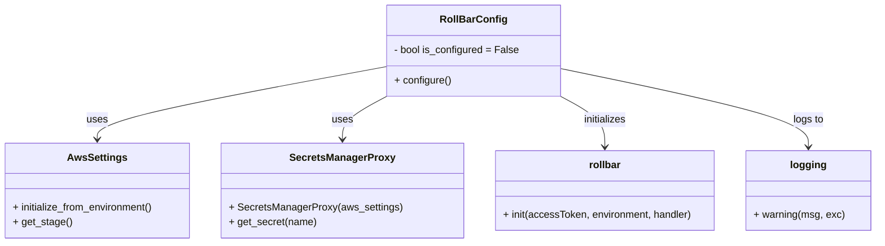

# Diagram: fv_core/fv_framework/python/fv_framework/utility/RollBarConfig.py


> Auto-generated by Obscura crawlers

## Diagram 1



### SVG

<svg id="container" width="1377.6171875" xmlns="http://www.w3.org/2000/svg" class="classDiagram" height="384" viewBox="0 0 1377.6171875 384" role="graphics-document document" aria-roledescription="class"><style>#container{font-family:"trebuchet ms",verdana,arial,sans-serif;font-size:16px;fill:#333;}@keyframes edge-animation-frame{from{stroke-dashoffset:0;}}@keyframes dash{to{stroke-dashoffset:0;}}#container .edge-animation-slow{stroke-dasharray:9,5!important;stroke-dashoffset:900;animation:dash 50s linear infinite;stroke-linecap:round;}#container .edge-animation-fast{stroke-dasharray:9,5!important;stroke-dashoffset:900;animation:dash 20s linear infinite;stroke-linecap:round;}#container .error-icon{fill:#552222;}#container .error-text{fill:#552222;stroke:#552222;}#container .edge-thickness-normal{stroke-width:1px;}#container .edge-thickness-thick{stroke-width:3.5px;}#container .edge-pattern-solid{stroke-dasharray:0;}#container .edge-thickness-invisible{stroke-width:0;fill:none;}#container .edge-pattern-dashed{stroke-dasharray:3;}#container .edge-pattern-dotted{stroke-dasharray:2;}#container .marker{fill:#333333;stroke:#333333;}#container .marker.cross{stroke:#333333;}#container svg{font-family:"trebuchet ms",verdana,arial,sans-serif;font-size:16px;}#container p{margin:0;}#container g.classGroup text{fill:#9370DB;stroke:none;font-family:"trebuchet ms",verdana,arial,sans-serif;font-size:10px;}#container g.classGroup text .title{font-weight:bolder;}#container .nodeLabel,#container .edgeLabel{color:#131300;}#container .edgeLabel .label rect{fill:#ECECFF;}#container .label text{fill:#131300;}#container .labelBkg{background:#ECECFF;}#container .edgeLabel .label span{background:#ECECFF;}#container .classTitle{font-weight:bolder;}#container .node rect,#container .node circle,#container .node ellipse,#container .node polygon,#container .node path{fill:#ECECFF;stroke:#9370DB;stroke-width:1px;}#container .divider{stroke:#9370DB;stroke-width:1;}#container g.clickable{cursor:pointer;}#container g.classGroup rect{fill:#ECECFF;stroke:#9370DB;}#container g.classGroup line{stroke:#9370DB;stroke-width:1;}#container .classLabel .box{stroke:none;stroke-width:0;fill:#ECECFF;opacity:0.5;}#container .classLabel .label{fill:#9370DB;font-size:10px;}#container .relation{stroke:#333333;stroke-width:1;fill:none;}#container .dashed-line{stroke-dasharray:3;}#container .dotted-line{stroke-dasharray:1 2;}#container #compositionStart,#container .composition{fill:#333333!important;stroke:#333333!important;stroke-width:1;}#container #compositionEnd,#container .composition{fill:#333333!important;stroke:#333333!important;stroke-width:1;}#container #dependencyStart,#container .dependency{fill:#333333!important;stroke:#333333!important;stroke-width:1;}#container #dependencyStart,#container .dependency{fill:#333333!important;stroke:#333333!important;stroke-width:1;}#container #extensionStart,#container .extension{fill:transparent!important;stroke:#333333!important;stroke-width:1;}#container #extensionEnd,#container .extension{fill:transparent!important;stroke:#333333!important;stroke-width:1;}#container #aggregationStart,#container .aggregation{fill:transparent!important;stroke:#333333!important;stroke-width:1;}#container #aggregationEnd,#container .aggregation{fill:transparent!important;stroke:#333333!important;stroke-width:1;}#container #lollipopStart,#container .lollipop{fill:#ECECFF!important;stroke:#333333!important;stroke-width:1;}#container #lollipopEnd,#container .lollipop{fill:#ECECFF!important;stroke:#333333!important;stroke-width:1;}#container .edgeTerminals{font-size:11px;line-height:initial;}#container .classTitleText{text-anchor:middle;font-size:18px;fill:#333;}#container .label-icon{display:inline-block;height:1em;overflow:visible;vertical-align:-0.125em;}#container .node .label-icon path{fill:currentColor;stroke:revert;stroke-width:revert;}#container :root{--mermaid-font-family:"trebuchet ms",verdana,arial,sans-serif;}</style><g><defs><marker id="container_class-aggregationStart" class="marker aggregation class" refX="18" refY="7" markerWidth="190" markerHeight="240" orient="auto"><path d="M 18,7 L9,13 L1,7 L9,1 Z"></path></marker></defs><defs><marker id="container_class-aggregationEnd" class="marker aggregation class" refX="1" refY="7" markerWidth="20" markerHeight="28" orient="auto"><path d="M 18,7 L9,13 L1,7 L9,1 Z"></path></marker></defs><defs><marker id="container_class-extensionStart" class="marker extension class" refX="18" refY="7" markerWidth="190" markerHeight="240" orient="auto"><path d="M 1,7 L18,13 V 1 Z"></path></marker></defs><defs><marker id="container_class-extensionEnd" class="marker extension class" refX="1" refY="7" markerWidth="20" markerHeight="28" orient="auto"><path d="M 1,1 V 13 L18,7 Z"></path></marker></defs><defs><marker id="container_class-compositionStart" class="marker composition class" refX="18" refY="7" markerWidth="190" markerHeight="240" orient="auto"><path d="M 18,7 L9,13 L1,7 L9,1 Z"></path></marker></defs><defs><marker id="container_class-compositionEnd" class="marker composition class" refX="1" refY="7" markerWidth="20" markerHeight="28" orient="auto"><path d="M 18,7 L9,13 L1,7 L9,1 Z"></path></marker></defs><defs><marker id="container_class-dependencyStart" class="marker dependency class" refX="6" refY="7" markerWidth="190" markerHeight="240" orient="auto"><path d="M 5,7 L9,13 L1,7 L9,1 Z"></path></marker></defs><defs><marker id="container_class-dependencyEnd" class="marker dependency class" refX="13" refY="7" markerWidth="20" markerHeight="28" orient="auto"><path d="M 18,7 L9,13 L14,7 L9,1 Z"></path></marker></defs><defs><marker id="container_class-lollipopStart" class="marker lollipop class" refX="13" refY="7" markerWidth="190" markerHeight="240" orient="auto"><circle stroke="black" fill="transparent" cx="7" cy="7" r="6"></circle></marker></defs><defs><marker id="container_class-lollipopEnd" class="marker lollipop class" refX="1" refY="7" markerWidth="190" markerHeight="240" orient="auto"><circle stroke="black" fill="transparent" cx="7" cy="7" r="6"></circle></marker></defs><g class="root"><g class="clusters"></g><g class="edgePaths"><path d="M610.453,105.005L534.679,119.004C458.905,133.003,307.357,161.002,231.583,180.167C155.809,199.333,155.809,209.667,155.809,214.833L155.809,220" id="id_RollBarConfig_AwsSettings_1" class="edge-thickness-normal edge-pattern-solid relation" style=";;;" data-edge="true" data-et="edge" data-id="id_RollBarConfig_AwsSettings_1" data-points="W3sieCI6NjEwLjQ1MzEyNSwieSI6MTA1LjAwNDY4MDk3MjIxMjF9LHsieCI6MTU1LjgwODU5Mzc1LCJ5IjoxODl9LHsieCI6MTU1LjgwODU5Mzc1LCJ5IjoyMjZ9XQ==" marker-end="url(#container_class-dependencyEnd)"></path><path d="M610.453,151.69L598.714,157.908C586.974,164.127,563.495,176.563,551.755,187.948C540.016,199.333,540.016,209.667,540.016,214.833L540.016,220" id="id_RollBarConfig_SecretsManagerProxy_2" class="edge-thickness-normal edge-pattern-solid relation" style=";;;" data-edge="true" data-et="edge" data-id="id_RollBarConfig_SecretsManagerProxy_2" data-points="W3sieCI6NjEwLjQ1MzEyNSwieSI6MTUxLjY5MDA1MzE1MTEwMDk4fSx7IngiOjU0MC4wMTU2MjUsInkiOjE4OX0seyJ4Ijo1NDAuMDE1NjI1LCJ5IjoyMjZ9XQ==" marker-end="url(#container_class-dependencyEnd)"></path><path d="M881.141,151.69L892.88,157.908C904.62,164.127,928.099,176.563,939.839,189.948C951.578,203.333,951.578,217.667,951.578,224.833L951.578,232" id="id_RollBarConfig_rollbar_3" class="edge-thickness-normal edge-pattern-solid relation" style=";;;" data-edge="true" data-et="edge" data-id="id_RollBarConfig_rollbar_3" data-points="W3sieCI6ODgxLjE0MDYyNSwieSI6MTUxLjY5MDA1MzE1MTEwMDk4fSx7IngiOjk1MS41NzgxMjUsInkiOjE4OX0seyJ4Ijo5NTEuNTc4MTI1LCJ5IjoyMzh9XQ==" marker-end="url(#container_class-dependencyEnd)"></path><path d="M881.141,107.973L946.48,121.477C1011.82,134.982,1142.5,161.991,1207.84,182.662C1273.18,203.333,1273.18,217.667,1273.18,224.833L1273.18,232" id="id_RollBarConfig_logging_4" class="edge-thickness-normal edge-pattern-solid relation" style=";;;" data-edge="true" data-et="edge" data-id="id_RollBarConfig_logging_4" data-points="W3sieCI6ODgxLjE0MDYyNSwieSI6MTA3Ljk3Mjk3OTc3OTI3NTZ9LHsieCI6MTI3My4xNzk2ODc1LCJ5IjoxODl9LHsieCI6MTI3My4xNzk2ODc1LCJ5IjoyMzh9XQ==" marker-end="url(#container_class-dependencyEnd)"></path></g><g class="edgeLabels"><g class="edgeLabel" transform="translate(155.80859375, 189)"><g class="label" data-id="id_RollBarConfig_AwsSettings_1" transform="translate(-16.4921875, -12)"><foreignObject width="32.984375" height="24"><div xmlns="http://www.w3.org/1999/xhtml" class="labelBkg" style="display: table-cell; white-space: nowrap; line-height: 1.5; max-width: 200px; text-align: center;"><span class="edgeLabel"><p>uses</p></span></div></foreignObject></g></g><g class="edgeLabel" transform="translate(540.015625, 189)"><g class="label" data-id="id_RollBarConfig_SecretsManagerProxy_2" transform="translate(-16.4921875, -12)"><foreignObject width="32.984375" height="24"><div xmlns="http://www.w3.org/1999/xhtml" class="labelBkg" style="display: table-cell; white-space: nowrap; line-height: 1.5; max-width: 200px; text-align: center;"><span class="edgeLabel"><p>uses</p></span></div></foreignObject></g></g><g class="edgeLabel" transform="translate(951.578125, 189)"><g class="label" data-id="id_RollBarConfig_rollbar_3" transform="translate(-34.7578125, -12)"><foreignObject width="69.515625" height="24"><div xmlns="http://www.w3.org/1999/xhtml" class="labelBkg" style="display: table-cell; white-space: nowrap; line-height: 1.5; max-width: 200px; text-align: center;"><span class="edgeLabel"><p>initializes</p></span></div></foreignObject></g></g><g class="edgeLabel" transform="translate(1273.1796875, 189)"><g class="label" data-id="id_RollBarConfig_logging_4" transform="translate(-24.3828125, -12)"><foreignObject width="48.765625" height="24"><div xmlns="http://www.w3.org/1999/xhtml" class="labelBkg" style="display: table-cell; white-space: nowrap; line-height: 1.5; max-width: 200px; text-align: center;"><span class="edgeLabel"><p>logs to</p></span></div></foreignObject></g></g></g><g class="nodes"><g class="node default" id="classId-RollBarConfig-0" transform="translate(745.796875, 80)"><g class="basic label-container"><path d="M-135.34375 -72 L135.34375 -72 L135.34375 72 L-135.34375 72" stroke="none" stroke-width="0" fill="#ECECFF" style=""></path><path d="M-135.34375 -72 C-80.76480846395403 -72, -26.18586692790805 -72, 135.34375 -72 M-135.34375 -72 C-77.67232174038635 -72, -20.000893480772703 -72, 135.34375 -72 M135.34375 -72 C135.34375 -28.741613277533432, 135.34375 14.516773444933136, 135.34375 72 M135.34375 -72 C135.34375 -41.11441172500841, 135.34375 -10.228823450016826, 135.34375 72 M135.34375 72 C58.051452066399605 72, -19.24084586720079 72, -135.34375 72 M135.34375 72 C63.8980273215639 72, -7.547695356872197 72, -135.34375 72 M-135.34375 72 C-135.34375 16.176728141627514, -135.34375 -39.64654371674497, -135.34375 -72 M-135.34375 72 C-135.34375 28.092389806893465, -135.34375 -15.81522038621307, -135.34375 -72" stroke="#9370DB" stroke-width="1.3" fill="none" stroke-dasharray="0 0" style=""></path></g><g class="annotation-group text" transform="translate(0, -48)"></g><g class="label-group text" transform="translate(-49.703125, -48)"><g class="label" style="font-weight: bolder" transform="translate(0,-12)"><foreignObject width="99.40625" height="24"><div xmlns="http://www.w3.org/1999/xhtml" style="display: table-cell; white-space: nowrap; line-height: 1.5; max-width: 148px; text-align: center;"><span class="nodeLabel markdown-node-label" style=""><p>RollBarConfig</p></span></div></foreignObject></g></g><g class="members-group text" transform="translate(-123.34375, 0)"><g class="label" style="" transform="translate(0,-12)"><foreignObject width="196.984375" height="24"><div xmlns="http://www.w3.org/1999/xhtml" style="display: table-cell; white-space: nowrap; line-height: 1.5; max-width: 254px; text-align: center;"><span class="nodeLabel markdown-node-label" style=""><p>- bool is_configured = False</p></span></div></foreignObject></g></g><g class="methods-group text" transform="translate(-123.34375, 48)"><g class="label" style="" transform="translate(0,-12)"><foreignObject width="89.734375" height="24"><div xmlns="http://www.w3.org/1999/xhtml" style="display: table-cell; white-space: nowrap; line-height: 1.5; max-width: 147px; text-align: center;"><span class="nodeLabel markdown-node-label" style=""><p>+ configure()</p></span></div></foreignObject></g></g><g class="divider" style=""><path d="M-135.34375 -24 C-76.54403283239276 -24, -17.744315664785532 -24, 135.34375 -24 M-135.34375 -24 C-40.6707743545342 -24, 54.002201290931595 -24, 135.34375 -24" stroke="#9370DB" stroke-width="1.3" fill="none" stroke-dasharray="0 0" style=""></path></g><g class="divider" style=""><path d="M-135.34375 24 C-78.40967259276356 24, -21.475595185527112 24, 135.34375 24 M-135.34375 24 C-27.08692062508682 24, 81.16990874982636 24, 135.34375 24" stroke="#9370DB" stroke-width="1.3" fill="none" stroke-dasharray="0 0" style=""></path></g></g><g class="node default" id="classId-AwsSettings-1" transform="translate(155.80859375, 301)"><g class="basic label-container"><path d="M-147.80859375 -75 L147.80859375 -75 L147.80859375 75 L-147.80859375 75" stroke="none" stroke-width="0" fill="#ECECFF" style=""></path><path d="M-147.80859375 -75 C-51.9002930631859 -75, 44.0080076236282 -75, 147.80859375 -75 M-147.80859375 -75 C-31.4784028797814 -75, 84.8517879904372 -75, 147.80859375 -75 M147.80859375 -75 C147.80859375 -32.78935390608494, 147.80859375 9.421292187830119, 147.80859375 75 M147.80859375 -75 C147.80859375 -15.696835270764588, 147.80859375 43.606329458470825, 147.80859375 75 M147.80859375 75 C61.66781808248692 75, -24.472957585026165 75, -147.80859375 75 M147.80859375 75 C54.29733705750141 75, -39.21391963499718 75, -147.80859375 75 M-147.80859375 75 C-147.80859375 44.113845185290295, -147.80859375 13.22769037058059, -147.80859375 -75 M-147.80859375 75 C-147.80859375 42.959581163247016, -147.80859375 10.919162326494032, -147.80859375 -75" stroke="#9370DB" stroke-width="1.3" fill="none" stroke-dasharray="0 0" style=""></path></g><g class="annotation-group text" transform="translate(0, -51)"></g><g class="label-group text" transform="translate(-44.8203125, -51)"><g class="label" style="font-weight: bolder" transform="translate(0,-12)"><foreignObject width="89.640625" height="24"><div xmlns="http://www.w3.org/1999/xhtml" style="display: table-cell; white-space: nowrap; line-height: 1.5; max-width: 137px; text-align: center;"><span class="nodeLabel markdown-node-label" style=""><p>AwsSettings</p></span></div></foreignObject></g></g><g class="members-group text" transform="translate(-135.80859375, -3)"></g><g class="methods-group text" transform="translate(-135.80859375, 27)"><g class="label" style="" transform="translate(0,-12)"><foreignObject width="226.796875" height="24"><div xmlns="http://www.w3.org/1999/xhtml" style="display: table-cell; white-space: nowrap; line-height: 1.5; max-width: 284px; text-align: center;"><span class="nodeLabel markdown-node-label" style=""><p>+ initialize_from_environment()</p></span></div></foreignObject></g><g class="label" style="" transform="translate(0,12)"><foreignObject width="91.9375" height="24"><div xmlns="http://www.w3.org/1999/xhtml" style="display: table-cell; white-space: nowrap; line-height: 1.5; max-width: 149px; text-align: center;"><span class="nodeLabel markdown-node-label" style=""><p>+ get_stage()</p></span></div></foreignObject></g></g><g class="divider" style=""><path d="M-147.80859375 -27 C-77.14500658384162 -27, -6.481419417683242 -27, 147.80859375 -27 M-147.80859375 -27 C-79.13982094851573 -27, -10.471048147031468 -27, 147.80859375 -27" stroke="#9370DB" stroke-width="1.3" fill="none" stroke-dasharray="0 0" style=""></path></g><g class="divider" style=""><path d="M-147.80859375 -3 C-77.03571894203168 -3, -6.262844134063357 -3, 147.80859375 -3 M-147.80859375 -3 C-34.595281662949205 -3, 78.61803042410159 -3, 147.80859375 -3" stroke="#9370DB" stroke-width="1.3" fill="none" stroke-dasharray="0 0" style=""></path></g></g><g class="node default" id="classId-SecretsManagerProxy-2" transform="translate(540.015625, 301)"><g class="basic label-container"><path d="M-186.3984375 -75 L186.3984375 -75 L186.3984375 75 L-186.3984375 75" stroke="none" stroke-width="0" fill="#ECECFF" style=""></path><path d="M-186.3984375 -75 C-93.96254142176127 -75, -1.5266453435225458 -75, 186.3984375 -75 M-186.3984375 -75 C-107.65125586490784 -75, -28.904074229815677 -75, 186.3984375 -75 M186.3984375 -75 C186.3984375 -22.28783918354739, 186.3984375 30.42432163290522, 186.3984375 75 M186.3984375 -75 C186.3984375 -37.85433737281112, 186.3984375 -0.7086747456222469, 186.3984375 75 M186.3984375 75 C80.35240532473243 75, -25.69362685053514 75, -186.3984375 75 M186.3984375 75 C84.61873606553169 75, -17.160965368936616 75, -186.3984375 75 M-186.3984375 75 C-186.3984375 30.819042565550667, -186.3984375 -13.361914868898666, -186.3984375 -75 M-186.3984375 75 C-186.3984375 15.061016818554293, -186.3984375 -44.877966362891414, -186.3984375 -75" stroke="#9370DB" stroke-width="1.3" fill="none" stroke-dasharray="0 0" style=""></path></g><g class="annotation-group text" transform="translate(0, -51)"></g><g class="label-group text" transform="translate(-79.03125, -51)"><g class="label" style="font-weight: bolder" transform="translate(0,-12)"><foreignObject width="158.0625" height="24"><div xmlns="http://www.w3.org/1999/xhtml" style="display: table-cell; white-space: nowrap; line-height: 1.5; max-width: 204px; text-align: center;"><span class="nodeLabel markdown-node-label" style=""><p>SecretsManagerProxy</p></span></div></foreignObject></g></g><g class="members-group text" transform="translate(-174.3984375, -3)"></g><g class="methods-group text" transform="translate(-174.3984375, 27)"><g class="label" style="" transform="translate(0,-12)"><foreignObject width="269.765625" height="24"><div xmlns="http://www.w3.org/1999/xhtml" style="display: table-cell; white-space: nowrap; line-height: 1.5; max-width: 327px; text-align: center;"><span class="nodeLabel markdown-node-label" style=""><p>+ SecretsManagerProxy(aws_settings)</p></span></div></foreignObject></g><g class="label" style="" transform="translate(0,12)"><foreignObject width="138.03125" height="24"><div xmlns="http://www.w3.org/1999/xhtml" style="display: table-cell; white-space: nowrap; line-height: 1.5; max-width: 195px; text-align: center;"><span class="nodeLabel markdown-node-label" style=""><p>+ get_secret(name)</p></span></div></foreignObject></g></g><g class="divider" style=""><path d="M-186.3984375 -27 C-76.36948142098478 -27, 33.65947465803043 -27, 186.3984375 -27 M-186.3984375 -27 C-82.41316990678334 -27, 21.572097686433324 -27, 186.3984375 -27" stroke="#9370DB" stroke-width="1.3" fill="none" stroke-dasharray="0 0" style=""></path></g><g class="divider" style=""><path d="M-186.3984375 -3 C-52.30565694545541 -3, 81.78712360908918 -3, 186.3984375 -3 M-186.3984375 -3 C-74.90927797344885 -3, 36.5798815531023 -3, 186.3984375 -3" stroke="#9370DB" stroke-width="1.3" fill="none" stroke-dasharray="0 0" style=""></path></g></g><g class="node default" id="classId-rollbar-3" transform="translate(951.578125, 301)"><g class="basic label-container"><path d="M-175.1640625 -63 L175.1640625 -63 L175.1640625 63 L-175.1640625 63" stroke="none" stroke-width="0" fill="#ECECFF" style=""></path><path d="M-175.1640625 -63 C-102.28016940828722 -63, -29.396276316574443 -63, 175.1640625 -63 M-175.1640625 -63 C-89.0693040902937 -63, -2.974545680587397 -63, 175.1640625 -63 M175.1640625 -63 C175.1640625 -17.669317435331337, 175.1640625 27.661365129337327, 175.1640625 63 M175.1640625 -63 C175.1640625 -26.80647863872177, 175.1640625 9.387042722556458, 175.1640625 63 M175.1640625 63 C102.39935045895292 63, 29.634638417905848 63, -175.1640625 63 M175.1640625 63 C81.53867555160843 63, -12.08671139678313 63, -175.1640625 63 M-175.1640625 63 C-175.1640625 19.56513905680586, -175.1640625 -23.869721886388277, -175.1640625 -63 M-175.1640625 63 C-175.1640625 26.94658155192326, -175.1640625 -9.106836896153482, -175.1640625 -63" stroke="#9370DB" stroke-width="1.3" fill="none" stroke-dasharray="0 0" style=""></path></g><g class="annotation-group text" transform="translate(0, -39)"></g><g class="label-group text" transform="translate(-24.6875, -39)"><g class="label" style="font-weight: bolder" transform="translate(0,-12)"><foreignObject width="49.375" height="24"><div xmlns="http://www.w3.org/1999/xhtml" style="display: table-cell; white-space: nowrap; line-height: 1.5; max-width: 99px; text-align: center;"><span class="nodeLabel markdown-node-label" style=""><p>rollbar</p></span></div></foreignObject></g></g><g class="members-group text" transform="translate(-163.1640625, 9)"></g><g class="methods-group text" transform="translate(-163.1640625, 39)"><g class="label" style="" transform="translate(0,-12)"><foreignObject width="301.640625" height="24"><div xmlns="http://www.w3.org/1999/xhtml" style="display: table-cell; white-space: nowrap; line-height: 1.5; max-width: 359px; text-align: center;"><span class="nodeLabel markdown-node-label" style=""><p>+ init(accessToken, environment, handler)</p></span></div></foreignObject></g></g><g class="divider" style=""><path d="M-175.1640625 -15 C-46.53257697646998 -15, 82.09890854706003 -15, 175.1640625 -15 M-175.1640625 -15 C-62.28994126554744 -15, 50.58417996890512 -15, 175.1640625 -15" stroke="#9370DB" stroke-width="1.3" fill="none" stroke-dasharray="0 0" style=""></path></g><g class="divider" style=""><path d="M-175.1640625 9 C-68.57731791891945 9, 38.009426662161104 9, 175.1640625 9 M-175.1640625 9 C-93.67596771620134 9, -12.187872932402684 9, 175.1640625 9" stroke="#9370DB" stroke-width="1.3" fill="none" stroke-dasharray="0 0" style=""></path></g></g><g class="node default" id="classId-logging-4" transform="translate(1273.1796875, 301)"><g class="basic label-container"><path d="M-96.4375 -63 L96.4375 -63 L96.4375 63 L-96.4375 63" stroke="none" stroke-width="0" fill="#ECECFF" style=""></path><path d="M-96.4375 -63 C-19.31032390010637 -63, 57.81685219978726 -63, 96.4375 -63 M-96.4375 -63 C-44.84973114634074 -63, 6.738037707318526 -63, 96.4375 -63 M96.4375 -63 C96.4375 -30.514165041915575, 96.4375 1.9716699161688496, 96.4375 63 M96.4375 -63 C96.4375 -23.204064243745876, 96.4375 16.59187151250825, 96.4375 63 M96.4375 63 C23.423622908122695 63, -49.59025418375461 63, -96.4375 63 M96.4375 63 C37.44371805396072 63, -21.550063892078555 63, -96.4375 63 M-96.4375 63 C-96.4375 20.753696199177426, -96.4375 -21.492607601645147, -96.4375 -63 M-96.4375 63 C-96.4375 23.184066864112665, -96.4375 -16.63186627177467, -96.4375 -63" stroke="#9370DB" stroke-width="1.3" fill="none" stroke-dasharray="0 0" style=""></path></g><g class="annotation-group text" transform="translate(0, -39)"></g><g class="label-group text" transform="translate(-27.109375, -39)"><g class="label" style="font-weight: bolder" transform="translate(0,-12)"><foreignObject width="54.21875" height="24"><div xmlns="http://www.w3.org/1999/xhtml" style="display: table-cell; white-space: nowrap; line-height: 1.5; max-width: 103px; text-align: center;"><span class="nodeLabel markdown-node-label" style=""><p>logging</p></span></div></foreignObject></g></g><g class="members-group text" transform="translate(-84.4375, 9)"></g><g class="methods-group text" transform="translate(-84.4375, 39)"><g class="label" style="" transform="translate(0,-12)"><foreignObject width="141.765625" height="24"><div xmlns="http://www.w3.org/1999/xhtml" style="display: table-cell; white-space: nowrap; line-height: 1.5; max-width: 199px; text-align: center;"><span class="nodeLabel markdown-node-label" style=""><p>+ warning(msg, exc)</p></span></div></foreignObject></g></g><g class="divider" style=""><path d="M-96.4375 -15 C-44.43306006300429 -15, 7.571379873991418 -15, 96.4375 -15 M-96.4375 -15 C-24.360086123087257 -15, 47.71732775382549 -15, 96.4375 -15" stroke="#9370DB" stroke-width="1.3" fill="none" stroke-dasharray="0 0" style=""></path></g><g class="divider" style=""><path d="M-96.4375 9 C-33.23431145237298 9, 29.968877095254044 9, 96.4375 9 M-96.4375 9 C-22.118119709060053 9, 52.20126058187989 9, 96.4375 9" stroke="#9370DB" stroke-width="1.3" fill="none" stroke-dasharray="0 0" style=""></path></g></g></g></g></g></svg>

## Diagram 2

```mermaid
flowchart TD
    Start([Start]) --> Check{RollBarConfig.is_configured?}
    Check -- yes --> End([Return])
    Check -- no --> InitAws[AwsSettings.initialize_from_environment()]
    InitAws --> CreateProxy[SecretsManagerProxy(aws_settings)]
    CreateProxy --> GetSecret[secrets_manager_proxy.get_secret rollbar/credentials]
    InitAws --> GetStage[AwsSettings.get_stage or local]
    GetSecret --> InitRollbar[rollbar.init accessToken, environment=stage, handler=blocking]
    InitRollbar --> SetFlag[RollBarConfig.is_configured = true]
    SetFlag --> End
    InitAws --> Exception{{Exception?}}
    CreateProxy --> Exception
    GetSecret --> Exception
    Exception --> Log[logging.warning Rollbar is not configured properly, skipping initialization]
    Log --> End
```

> SVG rendering failed for this diagram.
