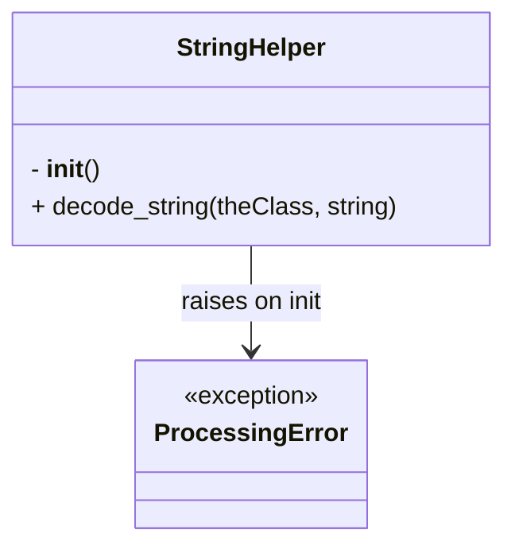

# Diagram: fv_core/fv_framework/python/fv_framework/utility/StringHelper.py


> Auto-generated by Obscura crawlers

## Diagram 1



> SVG rendering failed for this diagram.

## Diagram 2

```mermaid
flowchart TD
    A[Instantiate StringHelper] --> B{__init__ called}
    B --> C[Raise ProcessingError]
    D[call decode_string(theClass, string)] --> E{isinstance(string, str)?}
    E -- no --> G[return string as-is]
    E -- yes --> F{contains %7C or %7c?}
    F -- no --> G
    F -- yes --> H[replace %7C/%7c with |]
    H --> I[return modified string]
    G --> I
```

> SVG rendering failed for this diagram.
