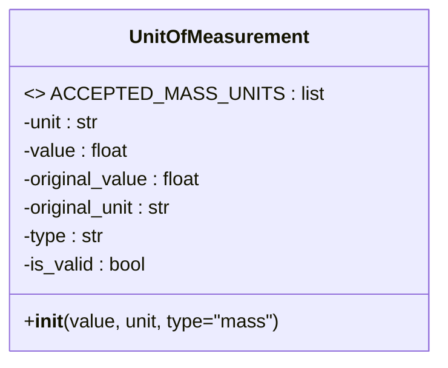
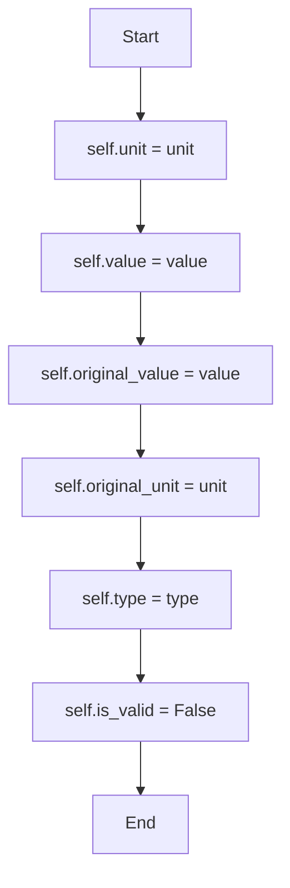

# Diagram: fv_core/fv_framework/python/fv_framework/utility/UnitOfMeasurement.py

> Auto-generated by Obscura crawlers

## Diagram 1

### SVG

<svg id="container" width="336.2109375" xmlns="http://www.w3.org/2000/svg" class="classDiagram" height="304" viewBox="0 0 336.2109375 304" role="graphics-document document" aria-roledescription="class"><g><defs><marker id="container_class-aggregationStart" class="marker aggregation class" refX="18" refY="7" markerWidth="190" markerHeight="240" orient="auto"><path d="M 18,7 L9,13 L1,7 L9,1 Z"></path></marker></defs><defs><marker id="container_class-aggregationEnd" class="marker aggregation class" refX="1" refY="7" markerWidth="20" markerHeight="28" orient="auto"><path d="M 18,7 L9,13 L1,7 L9,1 Z"></path></marker></defs><defs><marker id="container_class-extensionStart" class="marker extension class" refX="18" refY="7" markerWidth="190" markerHeight="240" orient="auto"><path d="M 1,7 L18,13 V 1 Z"></path></marker></defs><defs><marker id="container_class-extensionEnd" class="marker extension class" refX="1" refY="7" markerWidth="20" markerHeight="28" orient="auto"><path d="M 1,1 V 13 L18,7 Z"></path></marker></defs><defs><marker id="container_class-compositionStart" class="marker composition class" refX="18" refY="7" markerWidth="190" markerHeight="240" orient="auto"><path d="M 18,7 L9,13 L1,7 L9,1 Z"></path></marker></defs><defs><marker id="container_class-compositionEnd" class="marker composition class" refX="1" refY="7" markerWidth="20" markerHeight="28" orient="auto"><path d="M 18,7 L9,13 L1,7 L9,1 Z"></path></marker></defs><defs><marker id="container_class-dependencyStart" class="marker dependency class" refX="6" refY="7" markerWidth="190" markerHeight="240" orient="auto"><path d="M 5,7 L9,13 L1,7 L9,1 Z"></path></marker></defs><defs><marker id="container_class-dependencyEnd" class="marker dependency class" refX="13" refY="7" markerWidth="20" markerHeight="28" orient="auto"><path d="M 18,7 L9,13 L14,7 L9,1 Z"></path></marker></defs><defs><marker id="container_class-lollipopStart" class="marker lollipop class" refX="13" refY="7" markerWidth="190" markerHeight="240" orient="auto"><circle stroke="black" fill="transparent" cx="7" cy="7" r="6"></circle></marker></defs><defs><marker id="container_class-lollipopEnd" class="marker lollipop class" refX="1" refY="7" markerWidth="190" markerHeight="240" orient="auto"><circle stroke="black" fill="transparent" cx="7" cy="7" r="6"></circle></marker></defs><g class="root"><g class="clusters"></g><g class="edgePaths"></g><g class="edgeLabels"></g><g class="nodes"><g class="node default" id="classId-UnitOfMeasurement-0" transform="translate(168.10546875, 152)"><g class="basic label-container"><path d="M-160.10546875 -144 L160.10546875 -144 L160.10546875 144 L-160.10546875 144" stroke="none" stroke-width="0" fill="#ECECFF" style=""></path><path d="M-160.10546875 -144 C-49.54319034831684 -144, 61.01908805336632 -144, 160.10546875 -144 M-160.10546875 -144 C-62.25607737740896 -144, 35.593313995182086 -144, 160.10546875 -144 M160.10546875 -144 C160.10546875 -84.86020924120822, 160.10546875 -25.72041848241645, 160.10546875 144 M160.10546875 -144 C160.10546875 -79.42031778278157, 160.10546875 -14.840635565563133, 160.10546875 144 M160.10546875 144 C90.10521487391927 144, 20.104960997838532 144, -160.10546875 144 M160.10546875 144 C75.35372160684955 144, -9.398025536300906 144, -160.10546875 144 M-160.10546875 144 C-160.10546875 48.268031324649385, -160.10546875 -47.46393735070123, -160.10546875 -144 M-160.10546875 144 C-160.10546875 30.356983508889613, -160.10546875 -83.28603298222077, -160.10546875 -144" stroke="#9370DB" stroke-width="1.3" fill="none" stroke-dasharray="0 0" style=""></path></g><g class="annotation-group text" transform="translate(0, -120)"></g><g class="label-group text" transform="translate(-73.1796875, -120)"><g class="label" style="font-weight: bolder" transform="translate(0,-12)"><foreignObject width="146.359375" height="24">

UnitOfMeasurement

</foreignObject></g></g><g class="members-group text" transform="translate(-148.10546875, -72)"><g class="label" style="" transform="translate(0,-12)"><foreignObject width="223.03125" height="24">

&lt;&gt; ACCEPTED_MASS_UNITS : list

</foreignObject></g><g class="label" style="" transform="translate(0,12)"><foreignObject width="67.171875" height="24">

-unit : str

</foreignObject></g><g class="label" style="" transform="translate(0,36)"><foreignObject width="90.546875" height="24">

-value : float

</foreignObject></g><g class="label" style="" transform="translate(0,60)"><foreignObject width="154.03125" height="24">

-original_value : float

</foreignObject></g><g class="label" style="" transform="translate(0,84)"><foreignObject width="130.640625" height="24">

-original_unit : str

</foreignObject></g><g class="label" style="" transform="translate(0,108)"><foreignObject width="69.90625" height="24">

-type : str

</foreignObject></g><g class="label" style="" transform="translate(0,132)"><foreignObject width="106.09375" height="24">

-is_valid : bool

</foreignObject></g></g><g class="methods-group text" transform="translate(-148.10546875, 120)"><g class="label" style="" transform="translate(0,-12)"><foreignObject width="216.078125" height="24">

+<strong>init</strong>(value, unit, type="mass")

</foreignObject></g></g><g class="divider" style=""><path d="M-160.10546875 -96 C-53.721772301063595 -96, 52.66192414787281 -96, 160.10546875 -96 M-160.10546875 -96 C-38.063834411573396 -96, 83.97779992685321 -96, 160.10546875 -96" stroke="#9370DB" stroke-width="1.3" fill="none" stroke-dasharray="0 0" style=""></path></g><g class="divider" style=""><path d="M-160.10546875 96 C-36.839524692036704 96, 86.42641936592659 96, 160.10546875 96 M-160.10546875 96 C-35.3480069065576 96, 89.4094549368848 96, 160.10546875 96" stroke="#9370DB" stroke-width="1.3" fill="none" stroke-dasharray="0 0" style=""></path></g></g></g></g></g></svg>

## Diagram 2

> SVG rendering failed for this diagram.
