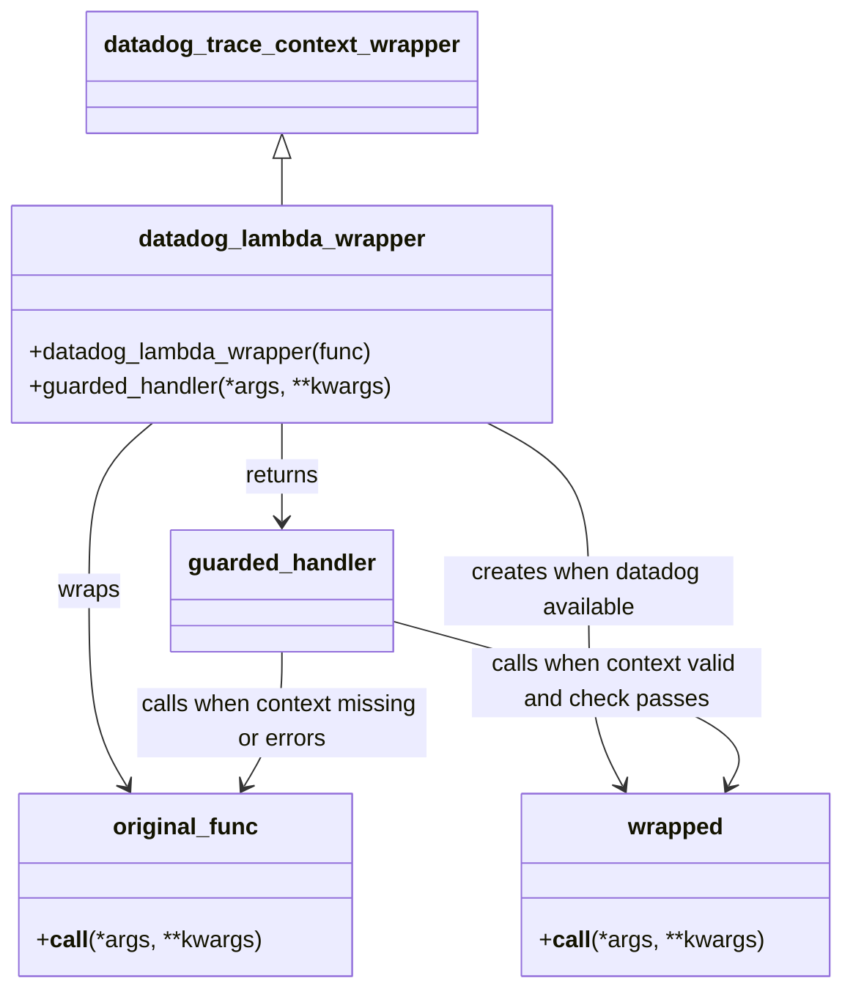

# Diagram: fv_core/fv_framework/python/fv_framework/utility/datadog/__init__.py


> Auto-generated by Obscura crawlers

## Diagram 1



### SVG

<svg id="container" width="576.57421875" xmlns="http://www.w3.org/2000/svg" class="classDiagram" height="682" viewBox="0 0 576.57421875 682" role="graphics-document document" aria-roledescription="class"><style>#container{font-family:"trebuchet ms",verdana,arial,sans-serif;font-size:16px;fill:#333;}@keyframes edge-animation-frame{from{stroke-dashoffset:0;}}@keyframes dash{to{stroke-dashoffset:0;}}#container .edge-animation-slow{stroke-dasharray:9,5!important;stroke-dashoffset:900;animation:dash 50s linear infinite;stroke-linecap:round;}#container .edge-animation-fast{stroke-dasharray:9,5!important;stroke-dashoffset:900;animation:dash 20s linear infinite;stroke-linecap:round;}#container .error-icon{fill:#552222;}#container .error-text{fill:#552222;stroke:#552222;}#container .edge-thickness-normal{stroke-width:1px;}#container .edge-thickness-thick{stroke-width:3.5px;}#container .edge-pattern-solid{stroke-dasharray:0;}#container .edge-thickness-invisible{stroke-width:0;fill:none;}#container .edge-pattern-dashed{stroke-dasharray:3;}#container .edge-pattern-dotted{stroke-dasharray:2;}#container .marker{fill:#333333;stroke:#333333;}#container .marker.cross{stroke:#333333;}#container svg{font-family:"trebuchet ms",verdana,arial,sans-serif;font-size:16px;}#container p{margin:0;}#container g.classGroup text{fill:#9370DB;stroke:none;font-family:"trebuchet ms",verdana,arial,sans-serif;font-size:10px;}#container g.classGroup text .title{font-weight:bolder;}#container .nodeLabel,#container .edgeLabel{color:#131300;}#container .edgeLabel .label rect{fill:#ECECFF;}#container .label text{fill:#131300;}#container .labelBkg{background:#ECECFF;}#container .edgeLabel .label span{background:#ECECFF;}#container .classTitle{font-weight:bolder;}#container .node rect,#container .node circle,#container .node ellipse,#container .node polygon,#container .node path{fill:#ECECFF;stroke:#9370DB;stroke-width:1px;}#container .divider{stroke:#9370DB;stroke-width:1;}#container g.clickable{cursor:pointer;}#container g.classGroup rect{fill:#ECECFF;stroke:#9370DB;}#container g.classGroup line{stroke:#9370DB;stroke-width:1;}#container .classLabel .box{stroke:none;stroke-width:0;fill:#ECECFF;opacity:0.5;}#container .classLabel .label{fill:#9370DB;font-size:10px;}#container .relation{stroke:#333333;stroke-width:1;fill:none;}#container .dashed-line{stroke-dasharray:3;}#container .dotted-line{stroke-dasharray:1 2;}#container #compositionStart,#container .composition{fill:#333333!important;stroke:#333333!important;stroke-width:1;}#container #compositionEnd,#container .composition{fill:#333333!important;stroke:#333333!important;stroke-width:1;}#container #dependencyStart,#container .dependency{fill:#333333!important;stroke:#333333!important;stroke-width:1;}#container #dependencyStart,#container .dependency{fill:#333333!important;stroke:#333333!important;stroke-width:1;}#container #extensionStart,#container .extension{fill:transparent!important;stroke:#333333!important;stroke-width:1;}#container #extensionEnd,#container .extension{fill:transparent!important;stroke:#333333!important;stroke-width:1;}#container #aggregationStart,#container .aggregation{fill:transparent!important;stroke:#333333!important;stroke-width:1;}#container #aggregationEnd,#container .aggregation{fill:transparent!important;stroke:#333333!important;stroke-width:1;}#container #lollipopStart,#container .lollipop{fill:#ECECFF!important;stroke:#333333!important;stroke-width:1;}#container #lollipopEnd,#container .lollipop{fill:#ECECFF!important;stroke:#333333!important;stroke-width:1;}#container .edgeTerminals{font-size:11px;line-height:initial;}#container .classTitleText{text-anchor:middle;font-size:18px;fill:#333;}#container .label-icon{display:inline-block;height:1em;overflow:visible;vertical-align:-0.125em;}#container .node .label-icon path{fill:currentColor;stroke:revert;stroke-width:revert;}#container :root{--mermaid-font-family:"trebuchet ms",verdana,arial,sans-serif;}</style><g><defs><marker id="container_class-aggregationStart" class="marker aggregation class" refX="18" refY="7" markerWidth="190" markerHeight="240" orient="auto"><path d="M 18,7 L9,13 L1,7 L9,1 Z"></path></marker></defs><defs><marker id="container_class-aggregationEnd" class="marker aggregation class" refX="1" refY="7" markerWidth="20" markerHeight="28" orient="auto"><path d="M 18,7 L9,13 L1,7 L9,1 Z"></path></marker></defs><defs><marker id="container_class-extensionStart" class="marker extension class" refX="18" refY="7" markerWidth="190" markerHeight="240" orient="auto"><path d="M 1,7 L18,13 V 1 Z"></path></marker></defs><defs><marker id="container_class-extensionEnd" class="marker extension class" refX="1" refY="7" markerWidth="20" markerHeight="28" orient="auto"><path d="M 1,1 V 13 L18,7 Z"></path></marker></defs><defs><marker id="container_class-compositionStart" class="marker composition class" refX="18" refY="7" markerWidth="190" markerHeight="240" orient="auto"><path d="M 18,7 L9,13 L1,7 L9,1 Z"></path></marker></defs><defs><marker id="container_class-compositionEnd" class="marker composition class" refX="1" refY="7" markerWidth="20" markerHeight="28" orient="auto"><path d="M 18,7 L9,13 L1,7 L9,1 Z"></path></marker></defs><defs><marker id="container_class-dependencyStart" class="marker dependency class" refX="6" refY="7" markerWidth="190" markerHeight="240" orient="auto"><path d="M 5,7 L9,13 L1,7 L9,1 Z"></path></marker></defs><defs><marker id="container_class-dependencyEnd" class="marker dependency class" refX="13" refY="7" markerWidth="20" markerHeight="28" orient="auto"><path d="M 18,7 L9,13 L14,7 L9,1 Z"></path></marker></defs><defs><marker id="container_class-lollipopStart" class="marker lollipop class" refX="13" refY="7" markerWidth="190" markerHeight="240" orient="auto"><circle stroke="black" fill="transparent" cx="7" cy="7" r="6"></circle></marker></defs><defs><marker id="container_class-lollipopEnd" class="marker lollipop class" refX="1" refY="7" markerWidth="190" markerHeight="240" orient="auto"><circle stroke="black" fill="transparent" cx="7" cy="7" r="6"></circle></marker></defs><g class="root"><g class="clusters"></g><g class="edgePaths"><path d="M194.223,109.25L194.223,110.542C194.223,111.833,194.223,114.417,194.223,119.875C194.223,125.333,194.223,133.667,194.223,137.833L194.223,142" id="id_datadog_trace_context_wrapper_datadog_lambda_wrapper_1" class="edge-thickness-normal edge-pattern-solid relation" style=";;;" data-edge="true" data-et="edge" data-id="id_datadog_trace_context_wrapper_datadog_lambda_wrapper_1" data-points="W3sieCI6MTk0LjIyMjY1NjI1LCJ5Ijo5Mn0seyJ4IjoxOTQuMjIyNjU2MjUsInkiOjExN30seyJ4IjoxOTQuMjIyNjU2MjUsInkiOjE0Mn1d" marker-start="url(#container_class-extensionStart)"></path><path d="M106.363,292L99.139,298.167C91.915,304.333,77.467,316.667,70.244,336C63.02,355.333,63.02,381.667,63.02,410C63.02,438.333,63.02,468.667,67.298,491.137C71.576,513.608,80.132,528.215,84.41,535.519L88.688,542.823" id="id_datadog_lambda_wrapper_original_func_2" class="edge-thickness-normal edge-pattern-solid relation" style=";;;" data-edge="true" data-et="edge" data-id="id_datadog_lambda_wrapper_original_func_2" data-points="W3sieCI6MTA2LjM2MzQyMDc1ODkyODU3LCJ5IjoyOTJ9LHsieCI6NjMuMDE5NTMxMjUsInkiOjMyOX0seyJ4Ijo2My4wMTk1MzEyNSwieSI6NDA4fSx7IngiOjYzLjAxOTUzMTI1LCJ5Ijo0OTl9LHsieCI6OTEuNzIwMjE0ODQzNzUsInkiOjU0OH1d" marker-end="url(#container_class-dependencyEnd)"></path><path d="M334.722,292L346.274,298.167C357.826,304.333,380.931,316.667,392.483,336C404.035,355.333,404.035,381.667,404.035,410C404.035,438.333,404.035,468.667,407.938,491.119C411.841,513.57,419.646,528.141,423.549,535.426L427.452,542.711" id="id_datadog_lambda_wrapper_wrapped_3" class="edge-thickness-normal edge-pattern-solid relation" style=";;;" data-edge="true" data-et="edge" data-id="id_datadog_lambda_wrapper_wrapped_3" data-points="W3sieCI6MzM0LjcyMjA5ODIxNDI4NTcsInkiOjI5Mn0seyJ4Ijo0MDQuMDM1MTU2MjUsInkiOjMyOX0seyJ4Ijo0MDQuMDM1MTU2MjUsInkiOjQwOH0seyJ4Ijo0MDQuMDM1MTU2MjUsInkiOjQ5OX0seyJ4Ijo0MzAuMjg1MTU2MjUsInkiOjU0OH1d" marker-end="url(#container_class-dependencyEnd)"></path><path d="M194.223,292L194.223,298.167C194.223,304.333,194.223,316.667,194.223,328C194.223,339.333,194.223,349.667,194.223,354.833L194.223,360" id="id_datadog_lambda_wrapper_guarded_handler_4" class="edge-thickness-normal edge-pattern-solid relation" style=";;;" data-edge="true" data-et="edge" data-id="id_datadog_lambda_wrapper_guarded_handler_4" data-points="W3sieCI6MTk0LjIyMjY1NjI1LCJ5IjoyOTJ9LHsieCI6MTk0LjIyMjY1NjI1LCJ5IjozMjl9LHsieCI6MTk0LjIyMjY1NjI1LCJ5IjozNjZ9XQ==" marker-end="url(#container_class-dependencyEnd)"></path><path d="M194.223,450L194.223,458.167C194.223,466.333,194.223,482.667,189.945,498.137C185.667,513.608,177.111,528.215,172.832,535.519L168.554,542.823" id="id_guarded_handler_original_func_5" class="edge-thickness-normal edge-pattern-solid relation" style=";;;" data-edge="true" data-et="edge" data-id="id_guarded_handler_original_func_5" data-points="W3sieCI6MTk0LjIyMjY1NjI1LCJ5Ijo0NTB9LHsieCI6MTk0LjIyMjY1NjI1LCJ5Ijo0OTl9LHsieCI6MTY1LjUyMTk3MjY1NjI1LCJ5Ijo1NDh9XQ==" marker-end="url(#container_class-dependencyEnd)"></path><path d="M269.035,428.642L311.535,440.368C354.035,452.095,439.035,475.547,477.632,494.559C516.23,513.57,508.424,528.141,504.521,535.426L500.618,542.711" id="id_guarded_handler_wrapped_6" class="edge-thickness-normal edge-pattern-solid relation" style=";;;" data-edge="true" data-et="edge" data-id="id_guarded_handler_wrapped_6" data-points="W3sieCI6MjY5LjAzNTE1NjI1LCJ5Ijo0MjguNjQxODQxOTU1NjU2Nn0seyJ4Ijo1MjQuMDM1MTU2MjUsInkiOjQ5OX0seyJ4Ijo0OTcuNzg1MTU2MjUsInkiOjU0OH1d" marker-end="url(#container_class-dependencyEnd)"></path></g><g class="edgeLabels"><g class="edgeLabel"><g class="label" data-id="id_datadog_trace_context_wrapper_datadog_lambda_wrapper_1" transform="translate(0, 0)"><foreignObject width="0" height="0"><div xmlns="http://www.w3.org/1999/xhtml" class="labelBkg" style="display: table-cell; white-space: nowrap; line-height: 1.5; max-width: 200px; text-align: center;"><span class="edgeLabel"></span></div></foreignObject></g></g><g class="edgeLabel" transform="translate(63.01953125, 408)"><g class="label" data-id="id_datadog_lambda_wrapper_original_func_2" transform="translate(-21.390625, -12)"><foreignObject width="42.78125" height="24"><div xmlns="http://www.w3.org/1999/xhtml" class="labelBkg" style="display: table-cell; white-space: nowrap; line-height: 1.5; max-width: 200px; text-align: center;"><span class="edgeLabel"><p>wraps</p></span></div></foreignObject></g></g><g class="edgeLabel" transform="translate(404.03515625, 408)"><g class="label" data-id="id_datadog_lambda_wrapper_wrapped_3" transform="translate(-100, -24)"><foreignObject width="200" height="48"><div xmlns="http://www.w3.org/1999/xhtml" class="labelBkg" style="display: table; white-space: break-spaces; line-height: 1.5; max-width: 200px; text-align: center; width: 200px;"><span class="edgeLabel"><p>creates when datadog available</p></span></div></foreignObject></g></g><g class="edgeLabel" transform="translate(194.22265625, 329)"><g class="label" data-id="id_datadog_lambda_wrapper_guarded_handler_4" transform="translate(-26.265625, -12)"><foreignObject width="52.53125" height="24"><div xmlns="http://www.w3.org/1999/xhtml" class="labelBkg" style="display: table-cell; white-space: nowrap; line-height: 1.5; max-width: 200px; text-align: center;"><span class="edgeLabel"><p>returns</p></span></div></foreignObject></g></g><g class="edgeLabel" transform="translate(194.22265625, 499)"><g class="label" data-id="id_guarded_handler_original_func_5" transform="translate(-100, -24)"><foreignObject width="200" height="48"><div xmlns="http://www.w3.org/1999/xhtml" class="labelBkg" style="display: table; white-space: break-spaces; line-height: 1.5; max-width: 200px; text-align: center; width: 200px;"><span class="edgeLabel"><p>calls when context missing or errors</p></span></div></foreignObject></g></g><g class="edgeLabel" transform="translate(423.32817, 471.2135)"><g class="label" data-id="id_guarded_handler_wrapped_6" transform="translate(-100, -24)"><foreignObject width="200" height="48"><div xmlns="http://www.w3.org/1999/xhtml" class="labelBkg" style="display: table; white-space: break-spaces; line-height: 1.5; max-width: 200px; text-align: center; width: 200px;"><span class="edgeLabel"><p>calls when context valid and check passes</p></span></div></foreignObject></g></g></g><g class="nodes"><g class="node default" id="classId-datadog_trace_context_wrapper-0" transform="translate(194.22265625, 50)"><g class="basic label-container"><path d="M-130.71875 -42 L130.71875 -42 L130.71875 42 L-130.71875 42" stroke="none" stroke-width="0" fill="#ECECFF" style=""></path><path d="M-130.71875 -42 C-54.139435616060155 -42, 22.43987876787969 -42, 130.71875 -42 M-130.71875 -42 C-64.0009524670742 -42, 2.716845065851601 -42, 130.71875 -42 M130.71875 -42 C130.71875 -17.79165923172588, 130.71875 6.416681536548239, 130.71875 42 M130.71875 -42 C130.71875 -22.574077339253506, 130.71875 -3.1481546785070122, 130.71875 42 M130.71875 42 C55.45507029704598 42, -19.808609405908044 42, -130.71875 42 M130.71875 42 C37.51880469845058 42, -55.68114060309884 42, -130.71875 42 M-130.71875 42 C-130.71875 12.095563599690937, -130.71875 -17.808872800618126, -130.71875 -42 M-130.71875 42 C-130.71875 15.663718435711225, -130.71875 -10.67256312857755, -130.71875 -42" stroke="#9370DB" stroke-width="1.3" fill="none" stroke-dasharray="0 0" style=""></path></g><g class="annotation-group text" transform="translate(0, -18)"></g><g class="label-group text" transform="translate(-118.71875, -18)"><g class="label" style="font-weight: bolder" transform="translate(0,-12)"><foreignObject width="237.4375" height="24"><div xmlns="http://www.w3.org/1999/xhtml" style="display: table-cell; white-space: nowrap; line-height: 1.5; max-width: 284px; text-align: center;"><span class="nodeLabel markdown-node-label" style=""><p>datadog_trace_context_wrapper</p></span></div></foreignObject></g></g><g class="members-group text" transform="translate(-118.71875, 30)"></g><g class="methods-group text" transform="translate(-118.71875, 60)"></g><g class="divider" style=""><path d="M-130.71875 6 C-70.38915238781284 6, -10.059554775625685 6, 130.71875 6 M-130.71875 6 C-61.385597404578846 6, 7.9475551908423085 6, 130.71875 6" stroke="#9370DB" stroke-width="1.3" fill="none" stroke-dasharray="0 0" style=""></path></g><g class="divider" style=""><path d="M-130.71875 24 C-53.49722917686597 24, 23.724291646268057 24, 130.71875 24 M-130.71875 24 C-38.108782521312065 24, 54.50118495737587 24, 130.71875 24" stroke="#9370DB" stroke-width="1.3" fill="none" stroke-dasharray="0 0" style=""></path></g></g><g class="node default" id="classId-datadog_lambda_wrapper-1" transform="translate(194.22265625, 217)"><g class="basic label-container"><path d="M-186.22265625 -75 L186.22265625 -75 L186.22265625 75 L-186.22265625 75" stroke="none" stroke-width="0" fill="#ECECFF" style=""></path><path d="M-186.22265625 -75 C-106.47243619856509 -75, -26.722216147130183 -75, 186.22265625 -75 M-186.22265625 -75 C-108.54362342670971 -75, -30.86459060341943 -75, 186.22265625 -75 M186.22265625 -75 C186.22265625 -27.729832146373113, 186.22265625 19.540335707253774, 186.22265625 75 M186.22265625 -75 C186.22265625 -30.877463318157417, 186.22265625 13.245073363685165, 186.22265625 75 M186.22265625 75 C46.352814211317195 75, -93.51702782736561 75, -186.22265625 75 M186.22265625 75 C63.56561218870988 75, -59.091431872580245 75, -186.22265625 75 M-186.22265625 75 C-186.22265625 18.89709805297845, -186.22265625 -37.2058038940431, -186.22265625 -75 M-186.22265625 75 C-186.22265625 29.73535427655022, -186.22265625 -15.529291446899563, -186.22265625 -75" stroke="#9370DB" stroke-width="1.3" fill="none" stroke-dasharray="0 0" style=""></path></g><g class="annotation-group text" transform="translate(0, -51)"></g><g class="label-group text" transform="translate(-96.5078125, -51)"><g class="label" style="font-weight: bolder" transform="translate(0,-12)"><foreignObject width="193.015625" height="24"><div xmlns="http://www.w3.org/1999/xhtml" style="display: table-cell; white-space: nowrap; line-height: 1.5; max-width: 241px; text-align: center;"><span class="nodeLabel markdown-node-label" style=""><p>datadog_lambda_wrapper</p></span></div></foreignObject></g></g><g class="members-group text" transform="translate(-174.22265625, -3)"></g><g class="methods-group text" transform="translate(-174.22265625, 27)"><g class="label" style="" transform="translate(0,-12)"><foreignObject width="240.640625" height="24"><div xmlns="http://www.w3.org/1999/xhtml" style="display: table-cell; white-space: nowrap; line-height: 1.5; max-width: 298px; text-align: center;"><span class="nodeLabel markdown-node-label" style=""><p>+datadog_lambda_wrapper(func)</p></span></div></foreignObject></g><g class="label" style="" transform="translate(0,12)"><foreignObject width="251.9375" height="24"><div xmlns="http://www.w3.org/1999/xhtml" style="display: table-cell; white-space: nowrap; line-height: 1.5; max-width: 309px; text-align: center;"><span class="nodeLabel markdown-node-label" style=""><p>+guarded_handler(*args, **kwargs)</p></span></div></foreignObject></g></g><g class="divider" style=""><path d="M-186.22265625 -27 C-91.25523881850248 -27, 3.7121786129950465 -27, 186.22265625 -27 M-186.22265625 -27 C-104.13265368131522 -27, -22.042651112630438 -27, 186.22265625 -27" stroke="#9370DB" stroke-width="1.3" fill="none" stroke-dasharray="0 0" style=""></path></g><g class="divider" style=""><path d="M-186.22265625 -3 C-102.15214240492863 -3, -18.08162855985725 -3, 186.22265625 -3 M-186.22265625 -3 C-105.49307744162407 -3, -24.763498633248133 -3, 186.22265625 -3" stroke="#9370DB" stroke-width="1.3" fill="none" stroke-dasharray="0 0" style=""></path></g></g><g class="node default" id="classId-original_func-2" transform="translate(128.62109375, 611)"><g class="basic label-container"><path d="M-112.484375 -63 L112.484375 -63 L112.484375 63 L-112.484375 63" stroke="none" stroke-width="0" fill="#ECECFF" style=""></path><path d="M-112.484375 -63 C-61.38580561549918 -63, -10.28723623099836 -63, 112.484375 -63 M-112.484375 -63 C-60.13892113219287 -63, -7.79346726438574 -63, 112.484375 -63 M112.484375 -63 C112.484375 -29.336645681659043, 112.484375 4.326708636681914, 112.484375 63 M112.484375 -63 C112.484375 -34.071650335146934, 112.484375 -5.143300670293868, 112.484375 63 M112.484375 63 C25.915403489455272 63, -60.653568021089455 63, -112.484375 63 M112.484375 63 C34.099789327912035 63, -44.28479634417593 63, -112.484375 63 M-112.484375 63 C-112.484375 33.6094257818701, -112.484375 4.218851563740202, -112.484375 -63 M-112.484375 63 C-112.484375 18.324100862641338, -112.484375 -26.351798274717325, -112.484375 -63" stroke="#9370DB" stroke-width="1.3" fill="none" stroke-dasharray="0 0" style=""></path></g><g class="annotation-group text" transform="translate(0, -39)"></g><g class="label-group text" transform="translate(-47.96875, -39)"><g class="label" style="font-weight: bolder" transform="translate(0,-12)"><foreignObject width="95.9375" height="24"><div xmlns="http://www.w3.org/1999/xhtml" style="display: table-cell; white-space: nowrap; line-height: 1.5; max-width: 146px; text-align: center;"><span class="nodeLabel markdown-node-label" style=""><p>original_func</p></span></div></foreignObject></g></g><g class="members-group text" transform="translate(-100.484375, 9)"></g><g class="methods-group text" transform="translate(-100.484375, 39)"><g class="label" style="" transform="translate(0,-12)"><foreignObject width="153" height="24"><div xmlns="http://www.w3.org/1999/xhtml" style="display: table-cell; white-space: nowrap; line-height: 1.5; max-width: 242px; text-align: center;"><span class="nodeLabel markdown-node-label" style=""><p>+<strong>call</strong>(*args, **kwargs)</p></span></div></foreignObject></g></g><g class="divider" style=""><path d="M-112.484375 -15 C-27.67691464578965 -15, 57.1305457084207 -15, 112.484375 -15 M-112.484375 -15 C-64.38657097201276 -15, -16.288766944025525 -15, 112.484375 -15" stroke="#9370DB" stroke-width="1.3" fill="none" stroke-dasharray="0 0" style=""></path></g><g class="divider" style=""><path d="M-112.484375 9 C-38.99772369170354 9, 34.48892761659292 9, 112.484375 9 M-112.484375 9 C-48.54670356403876 9, 15.390967871922484 9, 112.484375 9" stroke="#9370DB" stroke-width="1.3" fill="none" stroke-dasharray="0 0" style=""></path></g></g><g class="node default" id="classId-wrapped-3" transform="translate(464.03515625, 611)"><g class="basic label-container"><path d="M-104.5390625 -63 L104.5390625 -63 L104.5390625 63 L-104.5390625 63" stroke="none" stroke-width="0" fill="#ECECFF" style=""></path><path d="M-104.5390625 -63 C-20.998511880870964 -63, 62.54203873825807 -63, 104.5390625 -63 M-104.5390625 -63 C-21.738199652681516 -63, 61.06266319463697 -63, 104.5390625 -63 M104.5390625 -63 C104.5390625 -21.29736773997739, 104.5390625 20.405264520045222, 104.5390625 63 M104.5390625 -63 C104.5390625 -21.44668690717971, 104.5390625 20.10662618564058, 104.5390625 63 M104.5390625 63 C25.702412300923868 63, -53.134237898152264 63, -104.5390625 63 M104.5390625 63 C38.40418235280352 63, -27.730697794392967 63, -104.5390625 63 M-104.5390625 63 C-104.5390625 21.12318940044048, -104.5390625 -20.75362119911904, -104.5390625 -63 M-104.5390625 63 C-104.5390625 30.657111620933506, -104.5390625 -1.685776758132988, -104.5390625 -63" stroke="#9370DB" stroke-width="1.3" fill="none" stroke-dasharray="0 0" style=""></path></g><g class="annotation-group text" transform="translate(0, -39)"></g><g class="label-group text" transform="translate(-32.078125, -39)"><g class="label" style="font-weight: bolder" transform="translate(0,-12)"><foreignObject width="64.15625" height="24"><div xmlns="http://www.w3.org/1999/xhtml" style="display: table-cell; white-space: nowrap; line-height: 1.5; max-width: 113px; text-align: center;"><span class="nodeLabel markdown-node-label" style=""><p>wrapped</p></span></div></foreignObject></g></g><g class="members-group text" transform="translate(-92.5390625, 9)"></g><g class="methods-group text" transform="translate(-92.5390625, 39)"><g class="label" style="" transform="translate(0,-12)"><foreignObject width="153" height="24"><div xmlns="http://www.w3.org/1999/xhtml" style="display: table-cell; white-space: nowrap; line-height: 1.5; max-width: 242px; text-align: center;"><span class="nodeLabel markdown-node-label" style=""><p>+<strong>call</strong>(*args, **kwargs)</p></span></div></foreignObject></g></g><g class="divider" style=""><path d="M-104.5390625 -15 C-40.0171642483495 -15, 24.504734003300996 -15, 104.5390625 -15 M-104.5390625 -15 C-55.64709073603842 -15, -6.755118972076843 -15, 104.5390625 -15" stroke="#9370DB" stroke-width="1.3" fill="none" stroke-dasharray="0 0" style=""></path></g><g class="divider" style=""><path d="M-104.5390625 9 C-24.28004188279641 9, 55.97897873440718 9, 104.5390625 9 M-104.5390625 9 C-53.25657700857582 9, -1.974091517151635 9, 104.5390625 9" stroke="#9370DB" stroke-width="1.3" fill="none" stroke-dasharray="0 0" style=""></path></g></g><g class="node default" id="classId-guarded_handler-4" transform="translate(194.22265625, 408)"><g class="basic label-container"><path d="M-74.8125 -42 L74.8125 -42 L74.8125 42 L-74.8125 42" stroke="none" stroke-width="0" fill="#ECECFF" style=""></path><path d="M-74.8125 -42 C-16.48503008939671 -42, 41.84243982120658 -42, 74.8125 -42 M-74.8125 -42 C-33.20678456947486 -42, 8.398930861050275 -42, 74.8125 -42 M74.8125 -42 C74.8125 -24.742934693770255, 74.8125 -7.485869387540511, 74.8125 42 M74.8125 -42 C74.8125 -11.73349196200762, 74.8125 18.53301607598476, 74.8125 42 M74.8125 42 C34.12620322035183 42, -6.560093559296334 42, -74.8125 42 M74.8125 42 C17.949934888557607 42, -38.912630222884786 42, -74.8125 42 M-74.8125 42 C-74.8125 24.20729175352494, -74.8125 6.414583507049883, -74.8125 -42 M-74.8125 42 C-74.8125 15.483642255402867, -74.8125 -11.032715489194267, -74.8125 -42" stroke="#9370DB" stroke-width="1.3" fill="none" stroke-dasharray="0 0" style=""></path></g><g class="annotation-group text" transform="translate(0, -18)"></g><g class="label-group text" transform="translate(-62.8125, -18)"><g class="label" style="font-weight: bolder" transform="translate(0,-12)"><foreignObject width="125.625" height="24"><div xmlns="http://www.w3.org/1999/xhtml" style="display: table-cell; white-space: nowrap; line-height: 1.5; max-width: 175px; text-align: center;"><span class="nodeLabel markdown-node-label" style=""><p>guarded_handler</p></span></div></foreignObject></g></g><g class="members-group text" transform="translate(-62.8125, 30)"></g><g class="methods-group text" transform="translate(-62.8125, 60)"></g><g class="divider" style=""><path d="M-74.8125 6 C-38.18338684900812 6, -1.554273698016246 6, 74.8125 6 M-74.8125 6 C-43.872551223105766 6, -12.932602446211533 6, 74.8125 6" stroke="#9370DB" stroke-width="1.3" fill="none" stroke-dasharray="0 0" style=""></path></g><g class="divider" style=""><path d="M-74.8125 24 C-43.86757200781774 24, -12.922644015635484 24, 74.8125 24 M-74.8125 24 C-37.22198417606121 24, 0.36853164787757464 24, 74.8125 24" stroke="#9370DB" stroke-width="1.3" fill="none" stroke-dasharray="0 0" style=""></path></g></g></g></g></g></svg>

## Diagram 2

```mermaid
flowchart TD
A[Decorator applied to func] --> B[Try import datadog_lambda_wrapper]
B --> C{Import succeeded?}
C -- No --> D[Return original func]
C -- Yes --> E[wrapped = datadog_lambda_wrapper(func)]
E --> F[Return guarded_handler]
F --> G[guarded_handler invoked]
G --> H{context provided via kwargs or args[1]?}
H -- No --> I[Call original func and return result]
H -- Yes --> J[remaining_time = getattr(context, "get_remaining_time_in_millis", None)]
J --> K{callable(remaining_time)?}
K -- No --> I
K -- Yes --> L[Attempt remaining_time() call]
L --> M{raises AttributeError?}
M -- Yes --> I
M -- No --> N[Call wrapped(*args, **kwargs) and return result]
```

> SVG rendering failed for this diagram.
