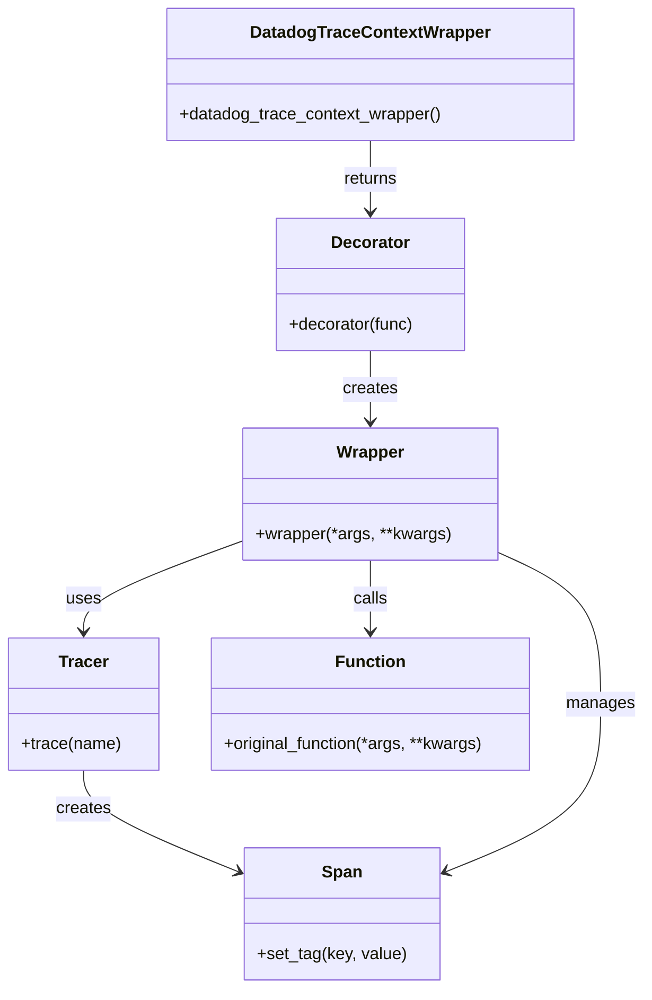

# Diagram: fv_core/fv_framework/python/fv_framework/utility/datadog/dd_tracer.py


> Auto-generated by Obscura crawlers

## Diagram 1

```mermaid
flowchart TD
    Start([Module import])
    A{DD_TRACE_ENABLED?}
    B{DD_TRACE_AUTO_INSTRUMENTATION_ENABLED?}
    Patch[patch_all()]
    NoPatch[no auto-instrumentation]
    DefineDec[datadog_trace_context_wrapper defined]
    Start --> A
    A -- "yes" --> B
    A -- "no" --> NoPatch
    B -- "yes" --> Patch
    B -- "no" --> NoPatch
    Patch --> DefineDec
    NoPatch --> DefineDec
    DefineDec --> EndModule([Module ready])

    subgraph Runtime
        Call[Call decorated function]
        Check{dd_enabled() and tracer?}
        Trace[tracer.trace(trace_name) as span]
        SetTags[span.set_tag(...) ]
        TryCall[try: call original function]
        OnException[span.set_tag("error", true) then raise]
        DirectCall[call original function directly]
        Return[return result]
        Call --> Check
        Check -- "yes" --> Trace
        Trace --> SetTags
        SetTags --> TryCall
        TryCall --> Return
        TryCall -- "exception" --> OnException
        OnException --> Return
        Check -- "no" --> DirectCall
        DirectCall --> Return
    end
```

> SVG rendering failed for this diagram.

## Diagram 2



### SVG

<svg id="container" width="614.0390625" xmlns="http://www.w3.org/2000/svg" class="classDiagram" height="942" viewBox="0 0 614.0390625 942" role="graphics-document document" aria-roledescription="class"><style>#container{font-family:"trebuchet ms",verdana,arial,sans-serif;font-size:16px;fill:#333;}@keyframes edge-animation-frame{from{stroke-dashoffset:0;}}@keyframes dash{to{stroke-dashoffset:0;}}#container .edge-animation-slow{stroke-dasharray:9,5!important;stroke-dashoffset:900;animation:dash 50s linear infinite;stroke-linecap:round;}#container .edge-animation-fast{stroke-dasharray:9,5!important;stroke-dashoffset:900;animation:dash 20s linear infinite;stroke-linecap:round;}#container .error-icon{fill:#552222;}#container .error-text{fill:#552222;stroke:#552222;}#container .edge-thickness-normal{stroke-width:1px;}#container .edge-thickness-thick{stroke-width:3.5px;}#container .edge-pattern-solid{stroke-dasharray:0;}#container .edge-thickness-invisible{stroke-width:0;fill:none;}#container .edge-pattern-dashed{stroke-dasharray:3;}#container .edge-pattern-dotted{stroke-dasharray:2;}#container .marker{fill:#333333;stroke:#333333;}#container .marker.cross{stroke:#333333;}#container svg{font-family:"trebuchet ms",verdana,arial,sans-serif;font-size:16px;}#container p{margin:0;}#container g.classGroup text{fill:#9370DB;stroke:none;font-family:"trebuchet ms",verdana,arial,sans-serif;font-size:10px;}#container g.classGroup text .title{font-weight:bolder;}#container .nodeLabel,#container .edgeLabel{color:#131300;}#container .edgeLabel .label rect{fill:#ECECFF;}#container .label text{fill:#131300;}#container .labelBkg{background:#ECECFF;}#container .edgeLabel .label span{background:#ECECFF;}#container .classTitle{font-weight:bolder;}#container .node rect,#container .node circle,#container .node ellipse,#container .node polygon,#container .node path{fill:#ECECFF;stroke:#9370DB;stroke-width:1px;}#container .divider{stroke:#9370DB;stroke-width:1;}#container g.clickable{cursor:pointer;}#container g.classGroup rect{fill:#ECECFF;stroke:#9370DB;}#container g.classGroup line{stroke:#9370DB;stroke-width:1;}#container .classLabel .box{stroke:none;stroke-width:0;fill:#ECECFF;opacity:0.5;}#container .classLabel .label{fill:#9370DB;font-size:10px;}#container .relation{stroke:#333333;stroke-width:1;fill:none;}#container .dashed-line{stroke-dasharray:3;}#container .dotted-line{stroke-dasharray:1 2;}#container #compositionStart,#container .composition{fill:#333333!important;stroke:#333333!important;stroke-width:1;}#container #compositionEnd,#container .composition{fill:#333333!important;stroke:#333333!important;stroke-width:1;}#container #dependencyStart,#container .dependency{fill:#333333!important;stroke:#333333!important;stroke-width:1;}#container #dependencyStart,#container .dependency{fill:#333333!important;stroke:#333333!important;stroke-width:1;}#container #extensionStart,#container .extension{fill:transparent!important;stroke:#333333!important;stroke-width:1;}#container #extensionEnd,#container .extension{fill:transparent!important;stroke:#333333!important;stroke-width:1;}#container #aggregationStart,#container .aggregation{fill:transparent!important;stroke:#333333!important;stroke-width:1;}#container #aggregationEnd,#container .aggregation{fill:transparent!important;stroke:#333333!important;stroke-width:1;}#container #lollipopStart,#container .lollipop{fill:#ECECFF!important;stroke:#333333!important;stroke-width:1;}#container #lollipopEnd,#container .lollipop{fill:#ECECFF!important;stroke:#333333!important;stroke-width:1;}#container .edgeTerminals{font-size:11px;line-height:initial;}#container .classTitleText{text-anchor:middle;font-size:18px;fill:#333;}#container .label-icon{display:inline-block;height:1em;overflow:visible;vertical-align:-0.125em;}#container .node .label-icon path{fill:currentColor;stroke:revert;stroke-width:revert;}#container :root{--mermaid-font-family:"trebuchet ms",verdana,arial,sans-serif;}</style><g><defs><marker id="container_class-aggregationStart" class="marker aggregation class" refX="18" refY="7" markerWidth="190" markerHeight="240" orient="auto"><path d="M 18,7 L9,13 L1,7 L9,1 Z"></path></marker></defs><defs><marker id="container_class-aggregationEnd" class="marker aggregation class" refX="1" refY="7" markerWidth="20" markerHeight="28" orient="auto"><path d="M 18,7 L9,13 L1,7 L9,1 Z"></path></marker></defs><defs><marker id="container_class-extensionStart" class="marker extension class" refX="18" refY="7" markerWidth="190" markerHeight="240" orient="auto"><path d="M 1,7 L18,13 V 1 Z"></path></marker></defs><defs><marker id="container_class-extensionEnd" class="marker extension class" refX="1" refY="7" markerWidth="20" markerHeight="28" orient="auto"><path d="M 1,1 V 13 L18,7 Z"></path></marker></defs><defs><marker id="container_class-compositionStart" class="marker composition class" refX="18" refY="7" markerWidth="190" markerHeight="240" orient="auto"><path d="M 18,7 L9,13 L1,7 L9,1 Z"></path></marker></defs><defs><marker id="container_class-compositionEnd" class="marker composition class" refX="1" refY="7" markerWidth="20" markerHeight="28" orient="auto"><path d="M 18,7 L9,13 L1,7 L9,1 Z"></path></marker></defs><defs><marker id="container_class-dependencyStart" class="marker dependency class" refX="6" refY="7" markerWidth="190" markerHeight="240" orient="auto"><path d="M 5,7 L9,13 L1,7 L9,1 Z"></path></marker></defs><defs><marker id="container_class-dependencyEnd" class="marker dependency class" refX="13" refY="7" markerWidth="20" markerHeight="28" orient="auto"><path d="M 18,7 L9,13 L14,7 L9,1 Z"></path></marker></defs><defs><marker id="container_class-lollipopStart" class="marker lollipop class" refX="13" refY="7" markerWidth="190" markerHeight="240" orient="auto"><circle stroke="black" fill="transparent" cx="7" cy="7" r="6"></circle></marker></defs><defs><marker id="container_class-lollipopEnd" class="marker lollipop class" refX="1" refY="7" markerWidth="190" markerHeight="240" orient="auto"><circle stroke="black" fill="transparent" cx="7" cy="7" r="6"></circle></marker></defs><g class="root"><g class="clusters"></g><g class="edgePaths"><path d="M353.039,134L353.039,140.167C353.039,146.333,353.039,158.667,353.039,170C353.039,181.333,353.039,191.667,353.039,196.833L353.039,202" id="id_DatadogTraceContextWrapper_Decorator_1" class="edge-thickness-normal edge-pattern-solid relation" style=";;;" data-edge="true" data-et="edge" data-id="id_DatadogTraceContextWrapper_Decorator_1" data-points="W3sieCI6MzUzLjAzOTA2MjUsInkiOjEzNH0seyJ4IjozNTMuMDM5MDYyNSwieSI6MTcxfSx7IngiOjM1My4wMzkwNjI1LCJ5IjoyMDh9XQ==" marker-end="url(#container_class-dependencyEnd)"></path><path d="M353.039,334L353.039,340.167C353.039,346.333,353.039,358.667,353.039,370C353.039,381.333,353.039,391.667,353.039,396.833L353.039,402" id="id_Decorator_Wrapper_2" class="edge-thickness-normal edge-pattern-solid relation" style=";;;" data-edge="true" data-et="edge" data-id="id_Decorator_Wrapper_2" data-points="W3sieCI6MzUzLjAzOTA2MjUsInkiOjMzNH0seyJ4IjozNTMuMDM5MDYyNSwieSI6MzcxfSx7IngiOjM1My4wMzkwNjI1LCJ5Ijo0MDh9XQ==" marker-end="url(#container_class-dependencyEnd)"></path><path d="M353.039,534L353.039,540.167C353.039,546.333,353.039,558.667,353.039,570C353.039,581.333,353.039,591.667,353.039,596.833L353.039,602" id="id_Wrapper_Function_3" class="edge-thickness-normal edge-pattern-solid relation" style=";;;" data-edge="true" data-et="edge" data-id="id_Wrapper_Function_3" data-points="W3sieCI6MzUzLjAzOTA2MjUsInkiOjUzNH0seyJ4IjozNTMuMDM5MDYyNSwieSI6NTcxfSx7IngiOjM1My4wMzkwNjI1LCJ5Ijo2MDh9XQ==" marker-end="url(#container_class-dependencyEnd)"></path><path d="M231.895,515.177L206.382,524.481C180.868,533.785,129.842,552.392,104.329,566.863C78.816,581.333,78.816,591.667,78.816,596.833L78.816,602" id="id_Wrapper_Tracer_4" class="edge-thickness-normal edge-pattern-solid relation" style=";;;" data-edge="true" data-et="edge" data-id="id_Wrapper_Tracer_4" data-points="W3sieCI6MjMxLjg5NDUzMTI1LCJ5Ijo1MTUuMTc3NDMzMzY5ODk1fSx7IngiOjc4LjgxNjQwNjI1LCJ5Ijo1NzF9LHsieCI6NzguODE2NDA2MjUsInkiOjYwOH1d" marker-end="url(#container_class-dependencyEnd)"></path><path d="M78.816,734L78.816,740.167C78.816,746.333,78.816,758.667,103.798,774.928C128.779,791.19,178.742,811.38,203.723,821.475L228.705,831.57" id="id_Tracer_Span_5" class="edge-thickness-normal edge-pattern-solid relation" style=";;;" data-edge="true" data-et="edge" data-id="id_Tracer_Span_5" data-points="W3sieCI6NzguODE2NDA2MjUsInkiOjczNH0seyJ4Ijo3OC44MTY0MDYyNSwieSI6NzcxfSx7IngiOjIzNC4yNjc1NzgxMjUsInkiOjgzMy44MTc5NzMwMjMxMDE3fV0=" marker-end="url(#container_class-dependencyEnd)"></path><path d="M474.184,525.89L490.777,533.409C507.37,540.927,540.556,555.963,557.149,580.148C573.742,604.333,573.742,637.667,573.742,671C573.742,704.333,573.742,737.667,548.761,764.428C523.779,791.19,473.817,811.38,448.835,821.475L423.854,831.57" id="id_Wrapper_Span_6" class="edge-thickness-normal edge-pattern-solid relation" style=";;;" data-edge="true" data-et="edge" data-id="id_Wrapper_Span_6" data-points="W3sieCI6NDc0LjE4MzU5Mzc1LCJ5Ijo1MjUuODkwMjY1NDg2NzI1Nn0seyJ4Ijo1NzMuNzQyMTg3NSwieSI6NTcxfSx7IngiOjU3My43NDIxODc1LCJ5Ijo2NzF9LHsieCI6NTczLjc0MjE4NzUsInkiOjc3MX0seyJ4Ijo0MTguMjkxMDE1NjI1LCJ5Ijo4MzMuODE3OTczMDIzMTAxN31d" marker-end="url(#container_class-dependencyEnd)"></path></g><g class="edgeLabels"><g class="edgeLabel" transform="translate(353.0390625, 171)"><g class="label" data-id="id_DatadogTraceContextWrapper_Decorator_1" transform="translate(-26.265625, -12)"><foreignObject width="52.53125" height="24"><div xmlns="http://www.w3.org/1999/xhtml" class="labelBkg" style="display: table-cell; white-space: nowrap; line-height: 1.5; max-width: 200px; text-align: center;"><span class="edgeLabel"><p>returns</p></span></div></foreignObject></g></g><g class="edgeLabel" transform="translate(353.0390625, 371)"><g class="label" data-id="id_Decorator_Wrapper_2" transform="translate(-26.171875, -12)"><foreignObject width="52.34375" height="24"><div xmlns="http://www.w3.org/1999/xhtml" class="labelBkg" style="display: table-cell; white-space: nowrap; line-height: 1.5; max-width: 200px; text-align: center;"><span class="edgeLabel"><p>creates</p></span></div></foreignObject></g></g><g class="edgeLabel" transform="translate(353.0390625, 571)"><g class="label" data-id="id_Wrapper_Function_3" transform="translate(-16.4453125, -12)"><foreignObject width="32.890625" height="24"><div xmlns="http://www.w3.org/1999/xhtml" class="labelBkg" style="display: table-cell; white-space: nowrap; line-height: 1.5; max-width: 200px; text-align: center;"><span class="edgeLabel"><p>calls</p></span></div></foreignObject></g></g><g class="edgeLabel" transform="translate(78.81640625, 571)"><g class="label" data-id="id_Wrapper_Tracer_4" transform="translate(-16.4921875, -12)"><foreignObject width="32.984375" height="24"><div xmlns="http://www.w3.org/1999/xhtml" class="labelBkg" style="display: table-cell; white-space: nowrap; line-height: 1.5; max-width: 200px; text-align: center;"><span class="edgeLabel"><p>uses</p></span></div></foreignObject></g></g><g class="edgeLabel" transform="translate(78.81640625, 771)"><g class="label" data-id="id_Tracer_Span_5" transform="translate(-26.171875, -12)"><foreignObject width="52.34375" height="24"><div xmlns="http://www.w3.org/1999/xhtml" class="labelBkg" style="display: table-cell; white-space: nowrap; line-height: 1.5; max-width: 200px; text-align: center;"><span class="edgeLabel"><p>creates</p></span></div></foreignObject></g></g><g class="edgeLabel" transform="translate(573.7421875, 671)"><g class="label" data-id="id_Wrapper_Span_6" transform="translate(-32.296875, -12)"><foreignObject width="64.59375" height="24"><div xmlns="http://www.w3.org/1999/xhtml" class="labelBkg" style="display: table-cell; white-space: nowrap; line-height: 1.5; max-width: 200px; text-align: center;"><span class="edgeLabel"><p>manages</p></span></div></foreignObject></g></g></g><g class="nodes"><g class="node default" id="classId-DatadogTraceContextWrapper-0" transform="translate(353.0390625, 71)"><g class="basic label-container"><path d="M-192.578125 -63 L192.578125 -63 L192.578125 63 L-192.578125 63" stroke="none" stroke-width="0" fill="#ECECFF" style=""></path><path d="M-192.578125 -63 C-112.38535901190053 -63, -32.19259302380107 -63, 192.578125 -63 M-192.578125 -63 C-93.16641002739863 -63, 6.245304945202747 -63, 192.578125 -63 M192.578125 -63 C192.578125 -34.18060372671687, 192.578125 -5.361207453433742, 192.578125 63 M192.578125 -63 C192.578125 -27.236847497362767, 192.578125 8.526305005274466, 192.578125 63 M192.578125 63 C89.54783058133057 63, -13.482463837338855 63, -192.578125 63 M192.578125 63 C114.57051163234864 63, 36.56289826469728 63, -192.578125 63 M-192.578125 63 C-192.578125 21.052819869955584, -192.578125 -20.89436026008883, -192.578125 -63 M-192.578125 63 C-192.578125 15.462474642092552, -192.578125 -32.075050715814896, -192.578125 -63" stroke="#9370DB" stroke-width="1.3" fill="none" stroke-dasharray="0 0" style=""></path></g><g class="annotation-group text" transform="translate(0, -39)"></g><g class="label-group text" transform="translate(-109.640625, -39)"><g class="label" style="font-weight: bolder" transform="translate(0,-12)"><foreignObject width="219.28125" height="24"><div xmlns="http://www.w3.org/1999/xhtml" style="display: table-cell; white-space: nowrap; line-height: 1.5; max-width: 266px; text-align: center;"><span class="nodeLabel markdown-node-label" style=""><p>DatadogTraceContextWrapper</p></span></div></foreignObject></g></g><g class="members-group text" transform="translate(-180.578125, 9)"></g><g class="methods-group text" transform="translate(-180.578125, 39)"><g class="label" style="" transform="translate(0,-12)"><foreignObject width="251.515625" height="24"><div xmlns="http://www.w3.org/1999/xhtml" style="display: table-cell; white-space: nowrap; line-height: 1.5; max-width: 309px; text-align: center;"><span class="nodeLabel markdown-node-label" style=""><p>+datadog_trace_context_wrapper()</p></span></div></foreignObject></g></g><g class="divider" style=""><path d="M-192.578125 -15 C-91.4691514996447 -15, 9.639822000710609 -15, 192.578125 -15 M-192.578125 -15 C-111.37833297064968 -15, -30.17854094129936 -15, 192.578125 -15" stroke="#9370DB" stroke-width="1.3" fill="none" stroke-dasharray="0 0" style=""></path></g><g class="divider" style=""><path d="M-192.578125 9 C-84.14378949124989 9, 24.29054601750022 9, 192.578125 9 M-192.578125 9 C-62.330663102780676 9, 67.91679879443865 9, 192.578125 9" stroke="#9370DB" stroke-width="1.3" fill="none" stroke-dasharray="0 0" style=""></path></g></g><g class="node default" id="classId-Decorator-1" transform="translate(353.0390625, 271)"><g class="basic label-container"><path d="M-90.25 -63 L90.25 -63 L90.25 63 L-90.25 63" stroke="none" stroke-width="0" fill="#ECECFF" style=""></path><path d="M-90.25 -63 C-49.27633488536108 -63, -8.302669770722162 -63, 90.25 -63 M-90.25 -63 C-25.8934617105691 -63, 38.4630765788618 -63, 90.25 -63 M90.25 -63 C90.25 -23.01571718395413, 90.25 16.96856563209174, 90.25 63 M90.25 -63 C90.25 -37.430393158943915, 90.25 -11.860786317887836, 90.25 63 M90.25 63 C19.98203926213904 63, -50.28592147572192 63, -90.25 63 M90.25 63 C43.95056747095116 63, -2.3488650580976866 63, -90.25 63 M-90.25 63 C-90.25 37.37500714805695, -90.25 11.750014296113896, -90.25 -63 M-90.25 63 C-90.25 33.482854013160406, -90.25 3.9657080263208186, -90.25 -63" stroke="#9370DB" stroke-width="1.3" fill="none" stroke-dasharray="0 0" style=""></path></g><g class="annotation-group text" transform="translate(0, -39)"></g><g class="label-group text" transform="translate(-36.109375, -39)"><g class="label" style="font-weight: bolder" transform="translate(0,-12)"><foreignObject width="72.21875" height="24"><div xmlns="http://www.w3.org/1999/xhtml" style="display: table-cell; white-space: nowrap; line-height: 1.5; max-width: 122px; text-align: center;"><span class="nodeLabel markdown-node-label" style=""><p>Decorator</p></span></div></foreignObject></g></g><g class="members-group text" transform="translate(-78.25, 9)"></g><g class="methods-group text" transform="translate(-78.25, 39)"><g class="label" style="" transform="translate(0,-12)"><foreignObject width="120.390625" height="24"><div xmlns="http://www.w3.org/1999/xhtml" style="display: table-cell; white-space: nowrap; line-height: 1.5; max-width: 178px; text-align: center;"><span class="nodeLabel markdown-node-label" style=""><p>+decorator(func)</p></span></div></foreignObject></g></g><g class="divider" style=""><path d="M-90.25 -15 C-49.22735960822745 -15, -8.204719216454905 -15, 90.25 -15 M-90.25 -15 C-29.876909117667807 -15, 30.496181764664385 -15, 90.25 -15" stroke="#9370DB" stroke-width="1.3" fill="none" stroke-dasharray="0 0" style=""></path></g><g class="divider" style=""><path d="M-90.25 9 C-23.91056523999417 9, 42.42886952001166 9, 90.25 9 M-90.25 9 C-23.677854884084354 9, 42.89429023183129 9, 90.25 9" stroke="#9370DB" stroke-width="1.3" fill="none" stroke-dasharray="0 0" style=""></path></g></g><g class="node default" id="classId-Wrapper-2" transform="translate(353.0390625, 471)"><g class="basic label-container"><path d="M-121.14453125 -63 L121.14453125 -63 L121.14453125 63 L-121.14453125 63" stroke="none" stroke-width="0" fill="#ECECFF" style=""></path><path d="M-121.14453125 -63 C-67.0745078015999 -63, -13.004484353199828 -63, 121.14453125 -63 M-121.14453125 -63 C-51.48200935154506 -63, 18.18051254690988 -63, 121.14453125 -63 M121.14453125 -63 C121.14453125 -18.81542410453391, 121.14453125 25.36915179093218, 121.14453125 63 M121.14453125 -63 C121.14453125 -18.317223814277234, 121.14453125 26.36555237144553, 121.14453125 63 M121.14453125 63 C66.3751561638774 63, 11.605781077754813 63, -121.14453125 63 M121.14453125 63 C47.088409821804774 63, -26.967711606390452 63, -121.14453125 63 M-121.14453125 63 C-121.14453125 32.346411585778895, -121.14453125 1.6928231715577908, -121.14453125 -63 M-121.14453125 63 C-121.14453125 23.880905466074992, -121.14453125 -15.238189067850016, -121.14453125 -63" stroke="#9370DB" stroke-width="1.3" fill="none" stroke-dasharray="0 0" style=""></path></g><g class="annotation-group text" transform="translate(0, -39)"></g><g class="label-group text" transform="translate(-31.2265625, -39)"><g class="label" style="font-weight: bolder" transform="translate(0,-12)"><foreignObject width="62.453125" height="24"><div xmlns="http://www.w3.org/1999/xhtml" style="display: table-cell; white-space: nowrap; line-height: 1.5; max-width: 112px; text-align: center;"><span class="nodeLabel markdown-node-label" style=""><p>Wrapper</p></span></div></foreignObject></g></g><g class="members-group text" transform="translate(-109.14453125, 9)"></g><g class="methods-group text" transform="translate(-109.14453125, 39)"><g class="label" style="" transform="translate(0,-12)"><foreignObject width="187.0625" height="24"><div xmlns="http://www.w3.org/1999/xhtml" style="display: table-cell; white-space: nowrap; line-height: 1.5; max-width: 244px; text-align: center;"><span class="nodeLabel markdown-node-label" style=""><p>+wrapper(*args, **kwargs)</p></span></div></foreignObject></g></g><g class="divider" style=""><path d="M-121.14453125 -15 C-59.13594206499038 -15, 2.872647120019238 -15, 121.14453125 -15 M-121.14453125 -15 C-24.85992902914687 -15, 71.42467319170626 -15, 121.14453125 -15" stroke="#9370DB" stroke-width="1.3" fill="none" stroke-dasharray="0 0" style=""></path></g><g class="divider" style=""><path d="M-121.14453125 9 C-29.40909865926821 9, 62.32633393146358 9, 121.14453125 9 M-121.14453125 9 C-71.25820210868028 9, -21.371872967360545 9, 121.14453125 9" stroke="#9370DB" stroke-width="1.3" fill="none" stroke-dasharray="0 0" style=""></path></g></g><g class="node default" id="classId-Tracer-3" transform="translate(78.81640625, 671)"><g class="basic label-container"><path d="M-70.81640625 -63 L70.81640625 -63 L70.81640625 63 L-70.81640625 63" stroke="none" stroke-width="0" fill="#ECECFF" style=""></path><path d="M-70.81640625 -63 C-20.629140269204882 -63, 29.558125711590236 -63, 70.81640625 -63 M-70.81640625 -63 C-22.12019419057077 -63, 26.576017868858457 -63, 70.81640625 -63 M70.81640625 -63 C70.81640625 -26.281298127862968, 70.81640625 10.437403744274064, 70.81640625 63 M70.81640625 -63 C70.81640625 -21.762626935916018, 70.81640625 19.474746128167965, 70.81640625 63 M70.81640625 63 C36.61070273525648 63, 2.4049992205129627 63, -70.81640625 63 M70.81640625 63 C26.207841769088567 63, -18.400722711822866 63, -70.81640625 63 M-70.81640625 63 C-70.81640625 29.09112574814568, -70.81640625 -4.817748503708643, -70.81640625 -63 M-70.81640625 63 C-70.81640625 16.343772361167943, -70.81640625 -30.312455277664114, -70.81640625 -63" stroke="#9370DB" stroke-width="1.3" fill="none" stroke-dasharray="0 0" style=""></path></g><g class="annotation-group text" transform="translate(0, -39)"></g><g class="label-group text" transform="translate(-22.6953125, -39)"><g class="label" style="font-weight: bolder" transform="translate(0,-12)"><foreignObject width="45.390625" height="24"><div xmlns="http://www.w3.org/1999/xhtml" style="display: table-cell; white-space: nowrap; line-height: 1.5; max-width: 95px; text-align: center;"><span class="nodeLabel markdown-node-label" style=""><p>Tracer</p></span></div></foreignObject></g></g><g class="members-group text" transform="translate(-58.81640625, 9)"></g><g class="methods-group text" transform="translate(-58.81640625, 39)"><g class="label" style="" transform="translate(0,-12)"><foreignObject width="94.9375" height="24"><div xmlns="http://www.w3.org/1999/xhtml" style="display: table-cell; white-space: nowrap; line-height: 1.5; max-width: 152px; text-align: center;"><span class="nodeLabel markdown-node-label" style=""><p>+trace(name)</p></span></div></foreignObject></g></g><g class="divider" style=""><path d="M-70.81640625 -15 C-15.671382774139083 -15, 39.473640701721834 -15, 70.81640625 -15 M-70.81640625 -15 C-35.22080050561687 -15, 0.3748052387662568 -15, 70.81640625 -15" stroke="#9370DB" stroke-width="1.3" fill="none" stroke-dasharray="0 0" style=""></path></g><g class="divider" style=""><path d="M-70.81640625 9 C-37.952851972919156 9, -5.089297695838312 9, 70.81640625 9 M-70.81640625 9 C-15.800912159799537 9, 39.214581930400925 9, 70.81640625 9" stroke="#9370DB" stroke-width="1.3" fill="none" stroke-dasharray="0 0" style=""></path></g></g><g class="node default" id="classId-Span-4" transform="translate(326.279296875, 871)"><g class="basic label-container"><path d="M-92.01171875 -63 L92.01171875 -63 L92.01171875 63 L-92.01171875 63" stroke="none" stroke-width="0" fill="#ECECFF" style=""></path><path d="M-92.01171875 -63 C-33.37720758609982 -63, 25.257303577800357 -63, 92.01171875 -63 M-92.01171875 -63 C-38.05024470708514 -63, 15.911229335829717 -63, 92.01171875 -63 M92.01171875 -63 C92.01171875 -18.508979736970154, 92.01171875 25.98204052605969, 92.01171875 63 M92.01171875 -63 C92.01171875 -18.737789636005665, 92.01171875 25.52442072798867, 92.01171875 63 M92.01171875 63 C35.502081575679526 63, -21.00755559864095 63, -92.01171875 63 M92.01171875 63 C54.70323225339359 63, 17.394745756787174 63, -92.01171875 63 M-92.01171875 63 C-92.01171875 33.31135837076934, -92.01171875 3.6227167415386887, -92.01171875 -63 M-92.01171875 63 C-92.01171875 31.48162315691322, -92.01171875 -0.03675368617356156, -92.01171875 -63" stroke="#9370DB" stroke-width="1.3" fill="none" stroke-dasharray="0 0" style=""></path></g><g class="annotation-group text" transform="translate(0, -39)"></g><g class="label-group text" transform="translate(-18.2734375, -39)"><g class="label" style="font-weight: bolder" transform="translate(0,-12)"><foreignObject width="36.546875" height="24"><div xmlns="http://www.w3.org/1999/xhtml" style="display: table-cell; white-space: nowrap; line-height: 1.5; max-width: 86px; text-align: center;"><span class="nodeLabel markdown-node-label" style=""><p>Span</p></span></div></foreignObject></g></g><g class="members-group text" transform="translate(-80.01171875, 9)"></g><g class="methods-group text" transform="translate(-80.01171875, 39)"><g class="label" style="" transform="translate(0,-12)"><foreignObject width="141.75" height="24"><div xmlns="http://www.w3.org/1999/xhtml" style="display: table-cell; white-space: nowrap; line-height: 1.5; max-width: 199px; text-align: center;"><span class="nodeLabel markdown-node-label" style=""><p>+set_tag(key, value)</p></span></div></foreignObject></g></g><g class="divider" style=""><path d="M-92.01171875 -15 C-29.634403681720364 -15, 32.74291138655927 -15, 92.01171875 -15 M-92.01171875 -15 C-54.70361941413967 -15, -17.395520078279347 -15, 92.01171875 -15" stroke="#9370DB" stroke-width="1.3" fill="none" stroke-dasharray="0 0" style=""></path></g><g class="divider" style=""><path d="M-92.01171875 9 C-35.372919936726674 9, 21.26587887654665 9, 92.01171875 9 M-92.01171875 9 C-53.94294564637666 9, -15.874172542753314 9, 92.01171875 9" stroke="#9370DB" stroke-width="1.3" fill="none" stroke-dasharray="0 0" style=""></path></g></g><g class="node default" id="classId-Function-5" transform="translate(353.0390625, 671)"><g class="basic label-container"><path d="M-153.40625 -63 L153.40625 -63 L153.40625 63 L-153.40625 63" stroke="none" stroke-width="0" fill="#ECECFF" style=""></path><path d="M-153.40625 -63 C-83.73237055920978 -63, -14.058491118419568 -63, 153.40625 -63 M-153.40625 -63 C-60.33667766114581 -63, 32.73289467770837 -63, 153.40625 -63 M153.40625 -63 C153.40625 -26.719949880837227, 153.40625 9.560100238325546, 153.40625 63 M153.40625 -63 C153.40625 -19.771652726317726, 153.40625 23.45669454736455, 153.40625 63 M153.40625 63 C33.1418808869075 63, -87.122488226185 63, -153.40625 63 M153.40625 63 C61.666415175861545 63, -30.07341964827691 63, -153.40625 63 M-153.40625 63 C-153.40625 34.977811284642335, -153.40625 6.955622569284671, -153.40625 -63 M-153.40625 63 C-153.40625 20.99692506822651, -153.40625 -21.00614986354698, -153.40625 -63" stroke="#9370DB" stroke-width="1.3" fill="none" stroke-dasharray="0 0" style=""></path></g><g class="annotation-group text" transform="translate(0, -39)"></g><g class="label-group text" transform="translate(-31.265625, -39)"><g class="label" style="font-weight: bolder" transform="translate(0,-12)"><foreignObject width="62.53125" height="24"><div xmlns="http://www.w3.org/1999/xhtml" style="display: table-cell; white-space: nowrap; line-height: 1.5; max-width: 113px; text-align: center;"><span class="nodeLabel markdown-node-label" style=""><p>Function</p></span></div></foreignObject></g></g><g class="members-group text" transform="translate(-141.40625, 9)"></g><g class="methods-group text" transform="translate(-141.40625, 39)"><g class="label" style="" transform="translate(0,-12)"><foreignObject width="251.546875" height="24"><div xmlns="http://www.w3.org/1999/xhtml" style="display: table-cell; white-space: nowrap; line-height: 1.5; max-width: 309px; text-align: center;"><span class="nodeLabel markdown-node-label" style=""><p>+original_function(*args, **kwargs)</p></span></div></foreignObject></g></g><g class="divider" style=""><path d="M-153.40625 -15 C-81.67634574654383 -15, -9.946441493087661 -15, 153.40625 -15 M-153.40625 -15 C-39.154511716970674 -15, 75.09722656605865 -15, 153.40625 -15" stroke="#9370DB" stroke-width="1.3" fill="none" stroke-dasharray="0 0" style=""></path></g><g class="divider" style=""><path d="M-153.40625 9 C-40.04055334081259 9, 73.32514331837481 9, 153.40625 9 M-153.40625 9 C-31.033903636869752 9, 91.3384427262605 9, 153.40625 9" stroke="#9370DB" stroke-width="1.3" fill="none" stroke-dasharray="0 0" style=""></path></g></g></g></g></g></svg>
