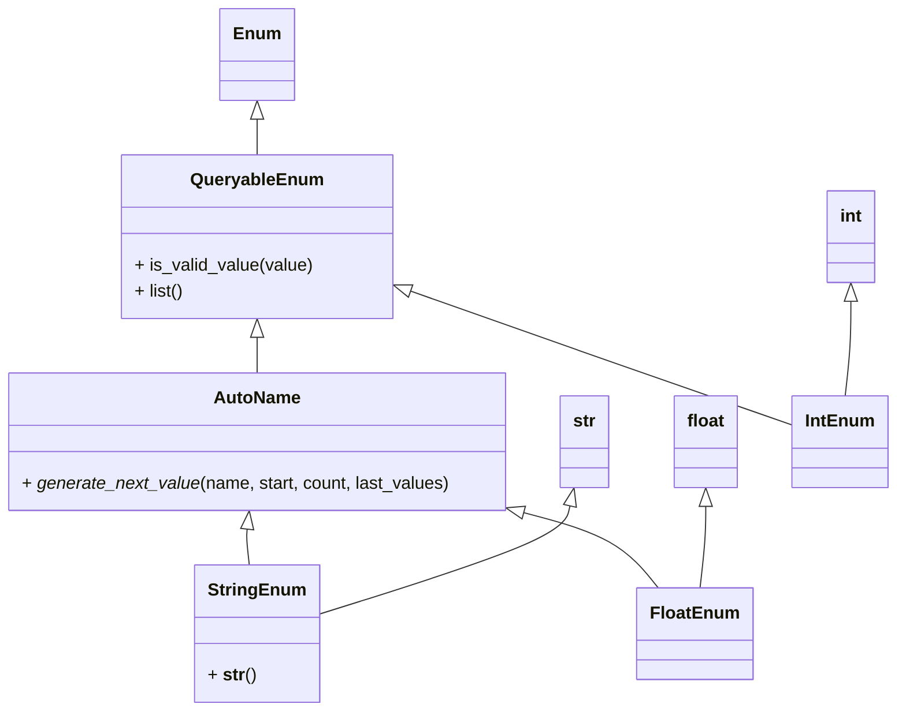

# Diagram: fv_core/fv_framework/python/fv_framework/utility/enum.py

> Auto-generated by Obscura crawlers

## Mermaid

```mermaid
classDiagram
class Enum
class QueryableEnum {
  + is_valid_value(value)
  + list()
}
class AutoName {
  + _generate_next_value_(name, start, count, last_values)
}
class int
class str
class float
class IntEnum
class StringEnum {
  + __str__()
}
class FloatEnum
Enum <|-- QueryableEnum
QueryableEnum <|-- AutoName
QueryableEnum <|-- IntEnum
AutoName <|-- StringEnum
AutoName <|-- FloatEnum
int <|-- IntEnum
str <|-- StringEnum
float <|-- FloatEnum
```

> SVG rendering failed for this diagram.
