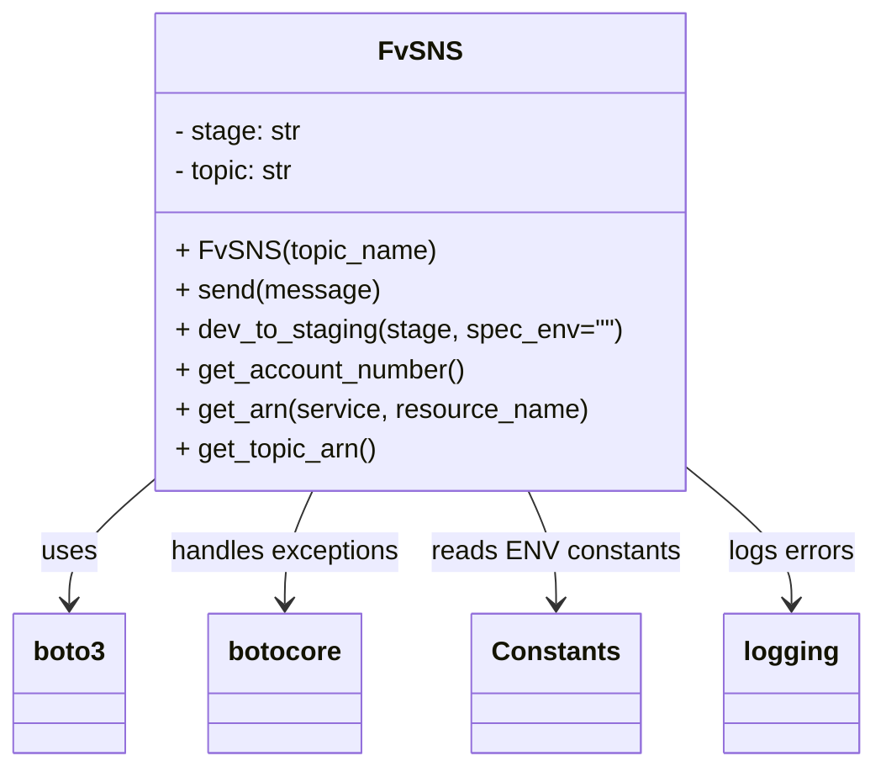
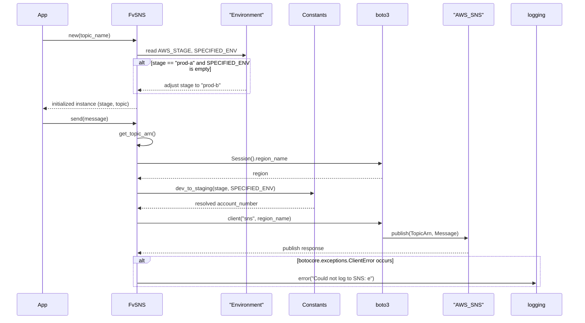

# Diagram: fv_core/fv_framework/python/fv_framework/utility/sns.py

> Auto-generated by Obscura crawlers

## Diagram 1

### SVG

<svg id="container" width="517.5390625" xmlns="http://www.w3.org/2000/svg" class="classDiagram" height="462" viewBox="0 0 517.5390625 462" role="graphics-document document" aria-roledescription="class"><g><defs><marker id="container_class-aggregationStart" class="marker aggregation class" refX="18" refY="7" markerWidth="190" markerHeight="240" orient="auto"><path d="M 18,7 L9,13 L1,7 L9,1 Z"></path></marker></defs><defs><marker id="container_class-aggregationEnd" class="marker aggregation class" refX="1" refY="7" markerWidth="20" markerHeight="28" orient="auto"><path d="M 18,7 L9,13 L1,7 L9,1 Z"></path></marker></defs><defs><marker id="container_class-extensionStart" class="marker extension class" refX="18" refY="7" markerWidth="190" markerHeight="240" orient="auto"><path d="M 1,7 L18,13 V 1 Z"></path></marker></defs><defs><marker id="container_class-extensionEnd" class="marker extension class" refX="1" refY="7" markerWidth="20" markerHeight="28" orient="auto"><path d="M 1,1 V 13 L18,7 Z"></path></marker></defs><defs><marker id="container_class-compositionStart" class="marker composition class" refX="18" refY="7" markerWidth="190" markerHeight="240" orient="auto"><path d="M 18,7 L9,13 L1,7 L9,1 Z"></path></marker></defs><defs><marker id="container_class-compositionEnd" class="marker composition class" refX="1" refY="7" markerWidth="20" markerHeight="28" orient="auto"><path d="M 18,7 L9,13 L1,7 L9,1 Z"></path></marker></defs><defs><marker id="container_class-dependencyStart" class="marker dependency class" refX="6" refY="7" markerWidth="190" markerHeight="240" orient="auto"><path d="M 5,7 L9,13 L1,7 L9,1 Z"></path></marker></defs><defs><marker id="container_class-dependencyEnd" class="marker dependency class" refX="13" refY="7" markerWidth="20" markerHeight="28" orient="auto"><path d="M 18,7 L9,13 L14,7 L9,1 Z"></path></marker></defs><defs><marker id="container_class-lollipopStart" class="marker lollipop class" refX="13" refY="7" markerWidth="190" markerHeight="240" orient="auto"><circle stroke="black" fill="transparent" cx="7" cy="7" r="6"></circle></marker></defs><defs><marker id="container_class-lollipopEnd" class="marker lollipop class" refX="1" refY="7" markerWidth="190" markerHeight="240" orient="auto"><circle stroke="black" fill="transparent" cx="7" cy="7" r="6"></circle></marker></defs><g class="root"><g class="clusters"></g><g class="edgePaths"><path d="M94.941,286.522L85.963,294.268C76.984,302.014,59.027,317.507,50.049,330.42C41.07,343.333,41.07,353.667,41.07,358.833L41.07,364" id="id_FvSNS_boto3_1" class="edge-thickness-normal edge-pattern-solid relation" style=";;;" data-edge="true" data-et="edge" data-id="id_FvSNS_boto3_1" data-points="W3sieCI6OTQuOTQxNDA2MjUsInkiOjI4Ni41MjE1NjE4MzY2NjYzfSx7IngiOjQxLjA3MDMxMjUsInkiOjMzM30seyJ4Ijo0MS4wNzAzMTI1LCJ5IjozNzB9XQ==" marker-end="url(#container_class-dependencyEnd)"></path><path d="M185.684,296L182.893,302.167C180.102,308.333,174.52,320.667,171.729,332C168.938,343.333,168.938,353.667,168.938,358.833L168.938,364" id="id_FvSNS_botocore_2" class="edge-thickness-normal edge-pattern-solid relation" style=";;;" data-edge="true" data-et="edge" data-id="id_FvSNS_botocore_2" data-points="W3sieCI6MTg1LjY4Mzk2MDYzNTM1OTEsInkiOjI5Nn0seyJ4IjoxNjguOTM3NSwieSI6MzMzfSx7IngiOjE2OC45Mzc1LCJ5IjozNzB9XQ==" marker-end="url(#container_class-dependencyEnd)"></path><path d="M316.035,296L318.826,302.167C321.617,308.333,327.199,320.667,329.99,332C332.781,343.333,332.781,353.667,332.781,358.833L332.781,364" id="id_FvSNS_Constants_3" class="edge-thickness-normal edge-pattern-solid relation" style=";;;" data-edge="true" data-et="edge" data-id="id_FvSNS_Constants_3" data-points="W3sieCI6MzE2LjAzNDc4OTM2NDY0MDksInkiOjI5Nn0seyJ4IjozMzIuNzgxMjUsInkiOjMzM30seyJ4IjozMzIuNzgxMjUsInkiOjM3MH1d" marker-end="url(#container_class-dependencyEnd)"></path><path d="M406.777,280.529L417.386,289.274C427.995,298.019,449.212,315.51,459.821,329.421C470.43,343.333,470.43,353.667,470.43,358.833L470.43,364" id="id_FvSNS_logging_4" class="edge-thickness-normal edge-pattern-solid relation" style=";;;" data-edge="true" data-et="edge" data-id="id_FvSNS_logging_4" data-points="W3sieCI6NDA2Ljc3NzM0Mzc1LCJ5IjoyODAuNTI4OTk4Mzk4ODYxNH0seyJ4Ijo0NzAuNDI5Njg3NSwieSI6MzMzfSx7IngiOjQ3MC40Mjk2ODc1LCJ5IjozNzB9XQ==" marker-end="url(#container_class-dependencyEnd)"></path></g><g class="edgeLabels"><g class="edgeLabel" transform="translate(41.0703125, 333)"><g class="label" data-id="id_FvSNS_boto3_1" transform="translate(-16.4921875, -12)"><foreignObject width="32.984375" height="24">

uses

</foreignObject></g></g><g class="edgeLabel" transform="translate(168.9375, 333)"><g class="label" data-id="id_FvSNS_botocore_2" transform="translate(-70.1484375, -12)"><foreignObject width="140.296875" height="24">

handles exceptions

</foreignObject></g></g><g class="edgeLabel" transform="translate(332.78125, 333)"><g class="label" data-id="id_FvSNS_Constants_3" transform="translate(-73.6953125, -12)"><foreignObject width="147.390625" height="24">

reads ENV constants

</foreignObject></g></g><g class="edgeLabel" transform="translate(470.4296875, 333)"><g class="label" data-id="id_FvSNS_logging_4" transform="translate(-38.609375, -12)"><foreignObject width="77.21875" height="24">

logs errors

</foreignObject></g></g></g><g class="nodes"><g class="node default" id="classId-FvSNS-0" transform="translate(250.859375, 152)"><g class="basic label-container"><path d="M-155.91796875 -144 L155.91796875 -144 L155.91796875 144 L-155.91796875 144" stroke="none" stroke-width="0" fill="#ECECFF" style=""></path><path d="M-155.91796875 -144 C-90.48414211970001 -144, -25.05031548940002 -144, 155.91796875 -144 M-155.91796875 -144 C-56.37075564546714 -144, 43.176457459065716 -144, 155.91796875 -144 M155.91796875 -144 C155.91796875 -82.13193916187774, 155.91796875 -20.263878323755492, 155.91796875 144 M155.91796875 -144 C155.91796875 -69.0905516448071, 155.91796875 5.818896710385786, 155.91796875 144 M155.91796875 144 C60.048543298865084 144, -35.82088215226983 144, -155.91796875 144 M155.91796875 144 C56.8661403793719 144, -42.1856879912562 144, -155.91796875 144 M-155.91796875 144 C-155.91796875 41.584780515134696, -155.91796875 -60.83043896973061, -155.91796875 -144 M-155.91796875 144 C-155.91796875 62.09934112319459, -155.91796875 -19.801317753610817, -155.91796875 -144" stroke="#9370DB" stroke-width="1.3" fill="none" stroke-dasharray="0 0" style=""></path></g><g class="annotation-group text" transform="translate(0, -120)"></g><g class="label-group text" transform="translate(-22.1796875, -120)"><g class="label" style="font-weight: bolder" transform="translate(0,-12)"><foreignObject width="44.359375" height="24">

FvSNS

</foreignObject></g></g><g class="members-group text" transform="translate(-143.91796875, -72)"><g class="label" style="" transform="translate(0,-12)"><foreignObject width="76.65625" height="24">

- stage: str

</foreignObject></g><g class="label" style="" transform="translate(0,12)"><foreignObject width="74.8125" height="24">

- topic: str

</foreignObject></g></g><g class="methods-group text" transform="translate(-143.91796875, 0)"><g class="label" style="" transform="translate(0,-12)"><foreignObject width="151.515625" height="24">

+ FvSNS(topic_name)

</foreignObject></g><g class="label" style="" transform="translate(0,12)"><foreignObject width="120.125" height="24">

+ send(message)

</foreignObject></g><g class="label" style="" transform="translate(0,36)"><foreignObject width="265.65625" height="24">

+ dev_to_staging(stage, spec_env="")

</foreignObject></g><g class="label" style="" transform="translate(0,60)"><foreignObject width="175.453125" height="24">

+ get_account_number()

</foreignObject></g><g class="label" style="" transform="translate(0,84)"><foreignObject width="246.9375" height="24">

+ get_arn(service, resource_name)

</foreignObject></g><g class="label" style="" transform="translate(0,108)"><foreignObject width="121.953125" height="24">

+ get_topic_arn()

</foreignObject></g></g><g class="divider" style=""><path d="M-155.91796875 -96 C-50.33197440530577 -96, 55.254019939388456 -96, 155.91796875 -96 M-155.91796875 -96 C-54.11269911350931 -96, 47.692570522981384 -96, 155.91796875 -96" stroke="#9370DB" stroke-width="1.3" fill="none" stroke-dasharray="0 0" style=""></path></g><g class="divider" style=""><path d="M-155.91796875 -24 C-34.93206449789747 -24, 86.05383975420506 -24, 155.91796875 -24 M-155.91796875 -24 C-55.90182504569246 -24, 44.114318658615076 -24, 155.91796875 -24" stroke="#9370DB" stroke-width="1.3" fill="none" stroke-dasharray="0 0" style=""></path></g></g><g class="node default" id="classId-boto3-1" transform="translate(41.0703125, 412)"><g class="basic label-container"><path d="M-33.0703125 -42 L33.0703125 -42 L33.0703125 42 L-33.0703125 42" stroke="none" stroke-width="0" fill="#ECECFF" style=""></path><path d="M-33.0703125 -42 C-12.300360263298398 -42, 8.469591973403205 -42, 33.0703125 -42 M-33.0703125 -42 C-12.16155207863439 -42, 8.74720834273122 -42, 33.0703125 -42 M33.0703125 -42 C33.0703125 -24.497760733080824, 33.0703125 -6.995521466161648, 33.0703125 42 M33.0703125 -42 C33.0703125 -12.410526711779234, 33.0703125 17.178946576441533, 33.0703125 42 M33.0703125 42 C16.245224348755634 42, -0.579863802488731 42, -33.0703125 42 M33.0703125 42 C19.32842976584412 42, 5.586547031688244 42, -33.0703125 42 M-33.0703125 42 C-33.0703125 10.38048969343637, -33.0703125 -21.23902061312726, -33.0703125 -42 M-33.0703125 42 C-33.0703125 11.071093285984713, -33.0703125 -19.857813428030575, -33.0703125 -42" stroke="#9370DB" stroke-width="1.3" fill="none" stroke-dasharray="0 0" style=""></path></g><g class="annotation-group text" transform="translate(0, -18)"></g><g class="label-group text" transform="translate(-21.0703125, -18)"><g class="label" style="font-weight: bolder" transform="translate(0,-12)"><foreignObject width="42.140625" height="24">

boto3

</foreignObject></g></g><g class="members-group text" transform="translate(-21.0703125, 30)"></g><g class="methods-group text" transform="translate(-21.0703125, 60)"></g><g class="divider" style=""><path d="M-33.0703125 6 C-17.0592259531847 6, -1.0481394063694012 6, 33.0703125 6 M-33.0703125 6 C-18.713541860262026 6, -4.3567712205240525 6, 33.0703125 6" stroke="#9370DB" stroke-width="1.3" fill="none" stroke-dasharray="0 0" style=""></path></g><g class="divider" style=""><path d="M-33.0703125 24 C-14.439220351237395 24, 4.191871797525209 24, 33.0703125 24 M-33.0703125 24 C-12.464776460333997 24, 8.140759579332006 24, 33.0703125 24" stroke="#9370DB" stroke-width="1.3" fill="none" stroke-dasharray="0 0" style=""></path></g></g><g class="node default" id="classId-botocore-2" transform="translate(168.9375, 412)"><g class="basic label-container"><path d="M-44.796875 -42 L44.796875 -42 L44.796875 42 L-44.796875 42" stroke="none" stroke-width="0" fill="#ECECFF" style=""></path><path d="M-44.796875 -42 C-15.39016999562067 -42, 14.016535008758659 -42, 44.796875 -42 M-44.796875 -42 C-9.97569119329819 -42, 24.84549261340362 -42, 44.796875 -42 M44.796875 -42 C44.796875 -17.46570449613614, 44.796875 7.0685910077277185, 44.796875 42 M44.796875 -42 C44.796875 -19.293552909659706, 44.796875 3.4128941806805884, 44.796875 42 M44.796875 42 C26.629749629201488 42, 8.462624258402975 42, -44.796875 42 M44.796875 42 C26.12988600554877 42, 7.462897011097539 42, -44.796875 42 M-44.796875 42 C-44.796875 18.23172840454065, -44.796875 -5.5365431909186995, -44.796875 -42 M-44.796875 42 C-44.796875 10.0390891896905, -44.796875 -21.921821620619, -44.796875 -42" stroke="#9370DB" stroke-width="1.3" fill="none" stroke-dasharray="0 0" style=""></path></g><g class="annotation-group text" transform="translate(0, -18)"></g><g class="label-group text" transform="translate(-32.796875, -18)"><g class="label" style="font-weight: bolder" transform="translate(0,-12)"><foreignObject width="65.59375" height="24">

botocore

</foreignObject></g></g><g class="members-group text" transform="translate(-32.796875, 30)"></g><g class="methods-group text" transform="translate(-32.796875, 60)"></g><g class="divider" style=""><path d="M-44.796875 6 C-21.404378890594966 6, 1.9881172188100678 6, 44.796875 6 M-44.796875 6 C-17.321179712783394 6, 10.154515574433212 6, 44.796875 6" stroke="#9370DB" stroke-width="1.3" fill="none" stroke-dasharray="0 0" style=""></path></g><g class="divider" style=""><path d="M-44.796875 24 C-14.801811289629818 24, 15.193252420740365 24, 44.796875 24 M-44.796875 24 C-17.82566761926308 24, 9.145539761473842 24, 44.796875 24" stroke="#9370DB" stroke-width="1.3" fill="none" stroke-dasharray="0 0" style=""></path></g></g><g class="node default" id="classId-Constants-3" transform="translate(332.78125, 412)"><g class="basic label-container"><path d="M-48.5390625 -42 L48.5390625 -42 L48.5390625 42 L-48.5390625 42" stroke="none" stroke-width="0" fill="#ECECFF" style=""></path><path d="M-48.5390625 -42 C-13.75381421520867 -42, 21.03143406958266 -42, 48.5390625 -42 M-48.5390625 -42 C-25.07134004496631 -42, -1.6036175899326182 -42, 48.5390625 -42 M48.5390625 -42 C48.5390625 -10.009702862005778, 48.5390625 21.980594275988445, 48.5390625 42 M48.5390625 -42 C48.5390625 -13.261485837298721, 48.5390625 15.477028325402557, 48.5390625 42 M48.5390625 42 C17.823518692100873 42, -12.892025115798255 42, -48.5390625 42 M48.5390625 42 C12.8199560546105 42, -22.899150390779 42, -48.5390625 42 M-48.5390625 42 C-48.5390625 17.727076705761295, -48.5390625 -6.54584658847741, -48.5390625 -42 M-48.5390625 42 C-48.5390625 12.870601475414286, -48.5390625 -16.258797049171427, -48.5390625 -42" stroke="#9370DB" stroke-width="1.3" fill="none" stroke-dasharray="0 0" style=""></path></g><g class="annotation-group text" transform="translate(0, -18)"></g><g class="label-group text" transform="translate(-36.5390625, -18)"><g class="label" style="font-weight: bolder" transform="translate(0,-12)"><foreignObject width="73.078125" height="24">

Constants

</foreignObject></g></g><g class="members-group text" transform="translate(-36.5390625, 30)"></g><g class="methods-group text" transform="translate(-36.5390625, 60)"></g><g class="divider" style=""><path d="M-48.5390625 6 C-23.107510053817478 6, 2.324042392365044 6, 48.5390625 6 M-48.5390625 6 C-15.787282269296789 6, 16.964497961406423 6, 48.5390625 6" stroke="#9370DB" stroke-width="1.3" fill="none" stroke-dasharray="0 0" style=""></path></g><g class="divider" style=""><path d="M-48.5390625 24 C-27.649117500671608 24, -6.759172501343215 24, 48.5390625 24 M-48.5390625 24 C-19.301062743974633 24, 9.936937012050734 24, 48.5390625 24" stroke="#9370DB" stroke-width="1.3" fill="none" stroke-dasharray="0 0" style=""></path></g></g><g class="node default" id="classId-logging-4" transform="translate(470.4296875, 412)"><g class="basic label-container"><path d="M-39.109375 -42 L39.109375 -42 L39.109375 42 L-39.109375 42" stroke="none" stroke-width="0" fill="#ECECFF" style=""></path><path d="M-39.109375 -42 C-22.624601772413445 -42, -6.139828544826891 -42, 39.109375 -42 M-39.109375 -42 C-21.027643276916454 -42, -2.9459115538329073 -42, 39.109375 -42 M39.109375 -42 C39.109375 -21.99853414529378, 39.109375 -1.9970682905875634, 39.109375 42 M39.109375 -42 C39.109375 -14.694707710166881, 39.109375 12.610584579666238, 39.109375 42 M39.109375 42 C19.297579135352834 42, -0.5142167292943327 42, -39.109375 42 M39.109375 42 C7.884589459010439 42, -23.340196081979123 42, -39.109375 42 M-39.109375 42 C-39.109375 21.120170106286704, -39.109375 0.24034021257340754, -39.109375 -42 M-39.109375 42 C-39.109375 9.840561395527331, -39.109375 -22.318877208945338, -39.109375 -42" stroke="#9370DB" stroke-width="1.3" fill="none" stroke-dasharray="0 0" style=""></path></g><g class="annotation-group text" transform="translate(0, -18)"></g><g class="label-group text" transform="translate(-27.109375, -18)"><g class="label" style="font-weight: bolder" transform="translate(0,-12)"><foreignObject width="54.21875" height="24">

logging

</foreignObject></g></g><g class="members-group text" transform="translate(-27.109375, 30)"></g><g class="methods-group text" transform="translate(-27.109375, 60)"></g><g class="divider" style=""><path d="M-39.109375 6 C-18.818573692067158 6, 1.472227615865684 6, 39.109375 6 M-39.109375 6 C-8.144822987110729 6, 22.819729025778543 6, 39.109375 6" stroke="#9370DB" stroke-width="1.3" fill="none" stroke-dasharray="0 0" style=""></path></g><g class="divider" style=""><path d="M-39.109375 24 C-22.463656223944493 24, -5.817937447888987 24, 39.109375 24 M-39.109375 24 C-11.483896913367492 24, 16.141581173265017 24, 39.109375 24" stroke="#9370DB" stroke-width="1.3" fill="none" stroke-dasharray="0 0" style=""></path></g></g></g></g></g></svg>

## Diagram 2

> SVG rendering failed for this diagram.
