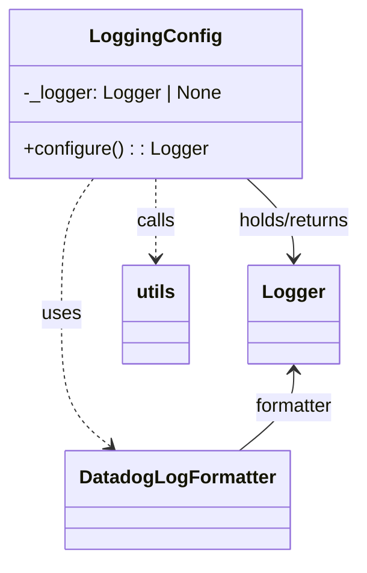

# Diagram: fv_core/fv_framework/python/fv_framework/utility/tools.py


> Auto-generated by Obscura crawlers

## Diagram 1



> SVG rendering failed for this diagram.

## Diagram 2

```mermaid
flowchart TD
    Start([Start]) --> Check{cls._logger exists?}
    Check -- Yes --> ReturnExisting[Return cls._logger]
    Check -- No --> Create[Create Logger(service=os.getenv("SERVICE","unknown_service"), logger_formatter=DatadogLogFormatter())]
    Create --> Structure[logger_instance.structure_logs(append=true)]
    Structure --> Copy[utils.copy_config_to_registered_loggers(source_logger=logger_instance)]
    Copy --> SetLevel[logger_instance.setLevel(os.getenv("LOG_LEVEL","INFO"))]
    SetLevel --> Assign[cls._logger = logger_instance]
    Assign --> ReturnNew[Return logger_instance]
    ReturnExisting --> End([End])
    ReturnNew --> End
```

> SVG rendering failed for this diagram.
