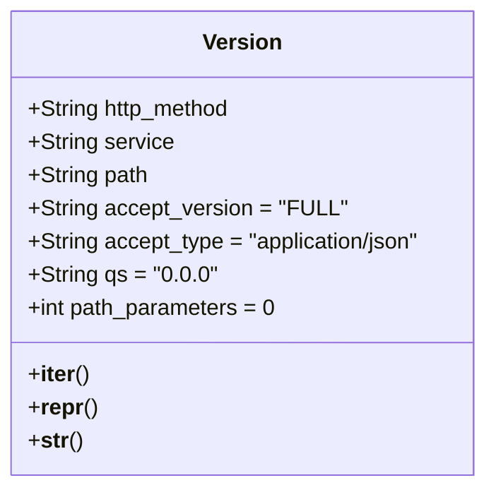

# Diagram: fv_core/fv_framework/python/fv_framework/utility/version.py


> Auto-generated by Obscura crawlers

## Diagram 1



> SVG rendering failed for this diagram.

## Diagram 2

```mermaid
flowchart TD
Req[HTTP Request] --> Extract[Extract: path / headers / query string]
Extract --> CheckPath{Path contains version?}
CheckPath -- Yes --> UsePath[Use version from path]
CheckPath -- No --> CheckAccept{Accept header contains version?}
CheckAccept -- Yes --> UseAccept[Use version from Accept header]
CheckAccept -- No --> CheckQS{Query string contains v parameter?}
CheckQS -- Yes --> UseQS[Use version from query string]
CheckQS -- No --> UseDefault[Use default version "0.0.0"]
UsePath --> Build[Create Version instance with selected values]
UseAccept --> Build
UseQS --> Build
UseDefault --> Build
Build --> Run[Run partview service with selected version]
```

> SVG rendering failed for this diagram.
